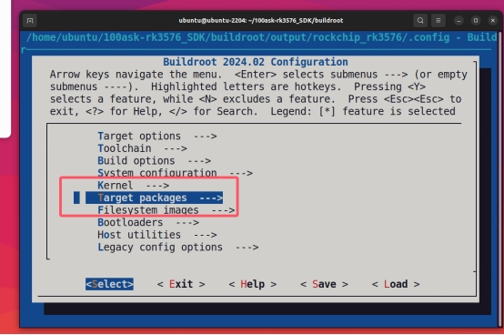
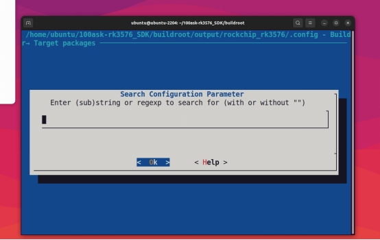
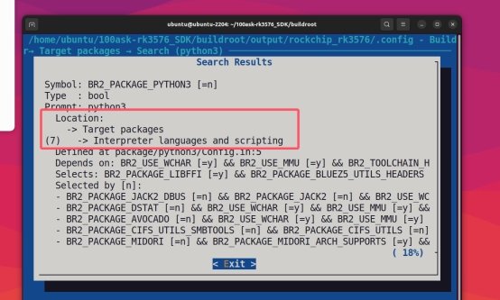
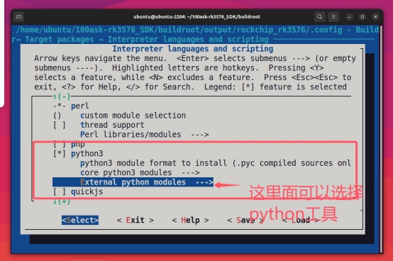
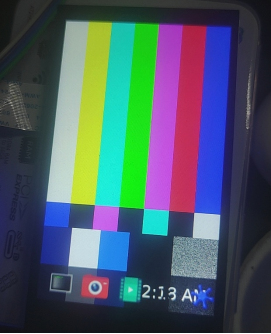
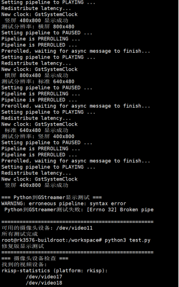
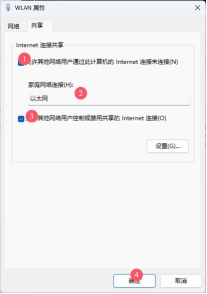
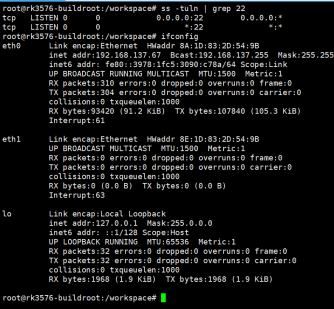

# DshanPI-A1测评第二篇:手势识别编程环境搭建与屏幕调试

本次测评我将会安装手势识别系统的必要工具和调试屏幕

## 硬件与环境准备

在开始之前，我们先明确手头的装备和环境：

- **核心板**：Dshanpi-A1，主控为瑞芯微RK3576芯片。

- **屏幕**：一块480x800分辨率的MIPI屏幕。

- **系统**：Buildroot Linux系统。

- **官方的SDK**

## 安装开发工具

下面是本次的清单：

| 软件包/配置类别         | 推荐选项与作用                                                                                               |
|-------------------------|--------------------------------------------------------------------------------------------------------------|
| Python环境              | python3: 核心解释器。 python-pip: 用于安装未包含在Buildroot中的Python包。 python-numpy: 为OpenCV等库提供高效的数值计算支持。 python-setuptools: 一些Python包的基础构建依赖。 |
| 计算机视觉与图像处理    | opencv4: 务必启用 python3 支持。提供核心的计算机视觉库，用于图像处理和手势识别算法。 opencv4 贡献模块: 包含额外的、更先进的算法。 |
| 摄像头与显示支持        | gstreamer1 及相关插件: 构建摄像头图像采集和屏幕显示的管道。 gst1-plugins-base, gst1-plugins-good, gst1-plugins-bad, gst1-plugins-ugly: 提供丰富的编解码器和功能元件。 gst1-python: 允许在Python中创建和操作GStreamer管道。 |

## SDK配置流程

### 1. 选择芯片类型

```bash
./build.sh chip
```


### 2. 进入buildroot配置

```bash
cd buildroot
make menuconfig
```


### 3. 选择Target packages



### 4. 安装Python环境

当找不到安装路径时，可按`/`键进入搜索：



输入`python3`进行搜索：



进入显示的Location路径进行配置：





### 5. 保存配置并编译

```bash
make
```

回到SDK主目录运行：

```bash
./build.sh rootfs
./build.sh updateimg
```

最后烧录运行到开发板

## 开发板调试

### 检查工具安装情况

```bash
python3 --version
pip3 --version
python3 -c "import numpy; print('NumPy version:', numpy.__version__)"
python3 -c "import cv2; print('OpenCV version:', cv2.__version__)"
```


## 屏幕调试

### 问题分析

系统已运行Weston合成器，这意味着我们有一个图形界面环境。尝试直接操作FrameBuffer(/dev/fb0)无效，因为Weston已占用显示接口。

通过系统检查发现：

- `/dev/fb0`设备存在
- 屏幕状态为`connected`
- 分辨率为480x800


### 解决方案：GStreamer + Wayland

#### GStreamer基础测试

```bash
gst-launch-1.0 videotestsrc pattern=smpte ! video/x-raw,width=480,height=800 ! waylandsink sync=false
```



#### 摄像头直连显示测试

```bash
gst-launch-1.0 v4l2src device=/dev/video11 ! video/x-raw,width=640,height=480 ! videoconvert ! waylandsink sync=false
```


> 注意：请将device参数替换为您的摄像头设备节点

### 测试脚本

```python
#!/usr/bin/env python3
# fixed_display_test.py

import subprocess
import time
import os

def check_camera_devices():
    """检查可用的摄像头设备"""
    print("=== 摄像头设备检查 ===")
    
    try:
        # 使用v4l2-ctl检查设备
        result = subprocess.run(["v4l2-ctl", "--list-devices"],
                        capture_output=True, text=True)
        if result.returncode == 0:
            print("找到的视频设备:")n            print(result.stdout)
        else:
            print("v4l2-ctl命令执行失败")
    except Exception as e:
        print(f"检查摄像头设备失败: {e}")

    # 测试常见的摄像头设备
    camera_devices = ["/dev/video11", "/dev/video0", "/dev/video1", "/dev/video2"]
    print("\n测试摄像头设备:")
    
    for device in camera_devices:
        if os.path.exists(device):
            print(f"测试设备: {device}")
            try:
                # 尝试使用GStreamer测试摄像头
                cmd = [
                  "gst-launch-1.0",
                  "-v",
                  "v4l2src", f"device={device}", "!", 
                  "video/x-raw,width=640,height=480,framerate=15/1", "!",
                  "videoconvert", "!", 
                  "waylandsink", "sync=false"
                ]
                
                process = subprocess.Popen(cmd)
                time.sleep(3) # 显示3秒
                process.terminate()
                process.wait()
                print(f" {device}: 摄像头工作正常")
                return device
            
            except Exception as e:
                print(f"{device}: 测试失败 - {e}")
        else:
            print(f"{device}: 设备不存在")
    
    return None

def test_static_patterns():
    """测试静态图案（不会变化）"""
    print("\n=== 静态图案测试 ===")

    # 设置Wayland环境
    os.environ['WAYLAND_DISPLAY'] = 'wayland-0'

    # 测试静态图案（不会变化）
    static_patterns = [
        ("smpte100", "SMPTE 100%色彩条"),
        ("ball", "时钟图案"),
        ("blink", "闪烁图案"),
        ("pinwheel", "风车图案"),
        ("spokes", "辐条图案"),
    ]

    for pattern, description in static_patterns:
        print(f"显示: {description}")
        try:
            cmd = [
                "gst-launch-1.0",
                "videotestsrc", f"pattern={pattern}", "!",
                "video/x-raw,width=480,height=800,framerate=15/1", "!",
                "waylandsink", "sync=false"
            ]
            
            process = subprocess.Popen(cmd)
            time.sleep(3)
            process.terminate()
            process.wait()
            print(f"{description} 显示成功")
        
        except Exception as e:
            print(f"{description} 显示失败: {e}")

def test_custom_resolution():
    """测试自定义分辨率显示"""
    print("\n=== 自定义分辨率测试 ===")

    resolutions = [
        (480, 800, "竖屏 480x800"),
        (800, 480, "横屏 800x480"),
        (640, 480, "标准 640x480"),
        (400, 800, "竖屏 400x800"),
    ]

    for width, height, desc in resolutions:
        print(f"测试分辨率: {desc}")
        try:
            cmd = [
                "gst-launch-1.0",
                "videotestsrc", "pattern=smpte100", "!",
                f"video/x-raw,width={width},height={height},framerate=15/1", "!",
                "videoconvert", "!",
                "waylandsink", "sync=false"
            ]
            
            process = subprocess.Popen(cmd)
            time.sleep(2)
            process.terminate()
            process.wait()
            print(f" {desc} 显示成功")
        
        except Exception as e:
            print(f" {desc} 显示失败: {e}")

if __name__ == "__main__":
    print("=" * 50)

    # 1. 检查摄像头
    camera_device = check_camera_devices()

    # 2. 测试静态图案
    test_static_patterns()

    # 3. 测试不同分辨率
    test_custom_resolution()

    print("\n" + "=" * 50)
    if camera_device:
        print(f"可用的摄像头设备: {camera_device}")
    else:
        print("未找到可用的摄像头设备")
    print("所有测试完成")
```


### 运行结果




> 演示视频我会放在附件里面

## 番外篇：FileZilla文件传输

### FileZilla连接设置

[FileZilla - The free FTP solution](https://filezilla-project.org/)

### 检查SSH服务

```bash
ss -tuln | grep 22
```


### 网络共享设置


选择能上网的网络，点击属性：





### 连接开发板

```bash
ifconfig
```


使用FileZilla连接：

- IP：开发板IP地址
- 用户名：root
- 密码：rockchip
- 端口：22

## 总结

回顾整个调试过程，以下几个关键点值得特别注意：

1. **显示路径选择**：在运行Weston这类合成器的系统上，优先使用GStreamer + waylandsink的方案来显示图像，而非直接操作FrameBuffer。

2. **摄像头设备节点**：务必使用`v4l2-ctl --list-devices`命令确认摄像头对应的设备节点，并在代码中正确指定。

3. **屏幕分辨率**：注意系统识别到的屏幕分辨率（可通过`cat /sys/class/drm/card0-DSI-1/modes`查询）可能与物理分辨率略有不同，在创建显示帧时需以此为准或进行调整。


至此，我们成功地在Dshanpi A1开发板上搭建起了手势识别的编程环境，并解决了MIPI屏幕和摄像头的显示问题。虽然过程曲折，但为后续实际编写手势识别算法奠定了坚实的基础。希望我的这些经验能对大家有所帮助！