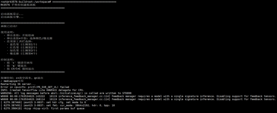
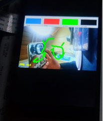

# DshanPI-A1第四篇开源手势项目改造

本次所有的项目改造主要基于兼容性、流畅性、屏幕显示方式和摄像头调用等方面。

## 显示输出适配

### 主要的适配问题

#### 1. RK3576运行纯Wayland环境

RK3576运行纯Wayland环境，没有X11和libGL支持，无法使用传统的`cv2.imshow()`显示图像。

**【解决方案】**

采用FIFO + GStreamer + Wayland的显示管线:

```python
# Python端代码
fifo = open('/tmp/gesture_fifo', 'wb')
while True:
    _, jpeg = cv2.imencode('.jpg', processed_frame,
                [cv2.IMWRITE_JPEG_QUALITY, 85])
    fifo.write(jpeg.tobytes())
    fifo.flush()
```

```bash
# Shell端代码
# GStreamer从管道读取JPEG流并显示
gst-launch-1.0 filesrc location=/tmp/gesture_fifo ! \
    jpegparse ! jpegdec ! videoconvert ! waylandsink fullscreen=true
```

#### 2. IMX415摄像头第二次启动色彩异常

IMX415摄像头第二次启动时出现色彩异常，内核报错"no first iq setting"。

**【解决方案】**

在每次打开摄像头前重启rkaiq_3A_server:

```python
def restart_3a(self):
    os.system("killall rkaiq_3A_server 2>/dev/null")
    time.sleep(2)
    os.system("rm -f /tmp/.rkaiq_3A* 2>/dev/null")
    os.system("/etc/init.d/S40rkaiq_3A start >/dev/null 2>&1")
    time.sleep(5)
```

## 项目一：贪吃蛇游戏

项目开源地址：[Project2/SnakeGame/main.py at main · WLHSDXN/Project2](https://github.com/WLHSDXN/Project2/blob/main/SnakeGame/main.py)

### 改造过程

#### 1. 多层级检测器架构

为了适配不同的依赖环境，设计了三层检测器回退机制:

```
优先级1: cvzone (MediaPipe封装,精度高)
  ↓ 不可用
优先级2: 原生MediaPipe (21个关键点)
  ↓ 不可用  
优先级3: HSV肤色检测 (轻量级备用)
```

代码实现:

```python
# 检测器选择逻辑
if USE_CVZONE:
    detector = CvzoneHandDetector(detectionCon=0.8, maxHands=1)
elif USE_MEDIAPIPE:
    detector = MediapipeHandDetector(maxHands=1,
                    detectionCon=0.5,
                    drawLandmarks=False)
else:
    detector = SimpleHandDetector()  # HSV备用方案
```

#### 2. MediaPipe集成与封装

实现了MediapipeHandDetector类，返回与cvzone兼容的数据格式:

```python
class MediapipeHandDetector:
    def findHands(self, frame, flipType=False):
        img_rgb = cv2.cvtColor(frame, cv2.COLOR_BGR2RGB)
        results = self.hands.process(img_rgb)
        
        hands = []
        if results.multi_hand_landmarks:
            for hand_landmarks in results.multi_hand_landmarks:
                # 提取21个关键点坐标
                lmList = []
                for lm in hand_landmarks.landmark:
                    x_px = int(lm.x * width)
                    y_px = int(lm.y * height)
                    lmList.append([x_px, y_px, lm.z])
            
                hands.append({'lmList': lmList})
        
        return hands, frame
```

**【关键点】**

食指指尖是lmList[8]，直接用作蛇头控制点。

#### 3. HSV肤色检测备用方案

当MediaPipe不可用时，使用简单的肤色检测:

```python
def detect_hand_simple(frame):
    hsv = cv2.cvtColor(frame, cv2.COLOR_BGR2HSV)
    mask = cv2.inRange(hsv, [0, 30, 60], [255, 255, 255])
    
    # 形态学去噪
    kernel = np.ones((7, 7), np.uint8)
    mask = cv2.morphologyEx(mask, cv2.MORPH_CLOSE, kernel, iterations=3)
    mask = cv2.morphologyEx(mask, cv2.MORPH_OPEN, kernel, iterations=2)
    
    contours, _ = cv2.findContours(mask, cv2.RETR_EXTERNAL,
                    cv2.CHAIN_APPROX_SIMPLE)
    if contours:
        c = max(contours, key=cv2.contourArea)
        hull = cv2.convexHull(c)
        # 提取最高点作为"指尖"
        topmost = hull[hull[:, :, 1].argmin()][0]
        return topmost
```

#### 4. MediaPipe性能调优

##### 优化1: 使用轻量级模型

```python
self.hands = mp.solutions.hands.Hands(
    model_complexity=0,  # 0=lite, 1=full (默认)
    max_num_hands=1,
    min_detection_confidence=0.5,  # 降低阈值换速度
    min_tracking_confidence=0.5
)
```

##### 优化2: 关闭可视化绘制

```python
# 移除耗时的关键点绘制
# mp_drawing.draw_landmarks(frame, landmarks, connections)  # 注释掉
drawLandmarks=False  # 新增开关
```

##### 优化3: 减少输入分辨率

```python
# 640x480 已经是最优平衡点
# 若进一步降低到320x240可提升FPS,但会影响检测精度
cap.set(cv2.CAP_PROP_FRAME_WIDTH, 640)
cap.set(cv2.CAP_PROP_FRAME_HEIGHT, 480)
```

##### 优化4: 优化相机缓冲

```python
cap.set(cv2.CAP_PROP_BUFFERSIZE, 1)  # 减少延迟
```

**【优化效果】**

FPS从5-10提升至15-25 FPS，满足游戏交互需求。

#### 5. 文件控制接口

由于FIFO模式下无法直接捕获键盘，采用控制文件方式:

```bash
# Shell脚本部分
# 读取按键并写控制文件
stty echo icanon
while read n1 t 0.1 key; do
    if [ "$key" = "r" ]; then
        touch /tmp/snake_restart
    elif [ "$key" = "q" ]; then
        touch /tmp/snake_quit
    fi
done
```

```python
# Python部分
# 检测控制文件
if os.path.exists('/tmp/snake_quit'):
    print('Quit command detected')
    break

if os.path.exists('/tmp/snake_restart'):
    os.remove('/tmp/snake_restart')
    # 重置游戏状态
    self.game.gameOver = False
    self.game.points = []
    self.game.previousHead = (0, 0)
```

#### 效果展示

代码和演示视频均在附件当中


## 项目二：虚拟画板

开源项目：【基于手部关键点检测，隔空控制鼠标/隔空绘画】https://www.bilibili.com/video/BV1364y1h7PS?vd_source=a16ca768198c38baa684546cf5060811

### 改造过程

#### 1. 核心逻辑提取

##### 手势识别逻辑:

```python
fingers = detector.fingersUp()  # 返回5个值,1表示手指伸直

# 模式1: 选择工具(食指+中指伸直)
if fingers[1] and fingers[2]:
    if y1 < 153:  # 在顶部工具栏区域
        if 0 < x1 < 320:    color = [50, 128, 250]  # 蓝色
        elif 320 < x1 < 640:  color = [0, 0, 255]    # 红色
        elif 640 < x1 < 960:  color = [0, 255, 0]    # 绿色
        elif 960 < x1 < 1280: color = [0, 0, 0]     # 橡皮擦

# 模式2: 绘画(仅食指伸直)
elif fingers[1] and not fingers[2]:
    cv2.line(imgCanvas, (xp, yp), (x1, y1), color, brushThickness)
```

##### 画布合成逻辑:

```python
# 1. 将画布转为灰度图并二值化
imgGray = cv2.cvtColor(imgCanvas, cv2.COLOR_BGR2GRAY)
_, imgInv = cv2.threshold(imgGray, 50, 255, cv2.THRESH_BINARY_INV)

# 2. 使用位运算合成
img = cv2.bitwise_and(img, imgInv)    # 摄像头画面保留非绘画区域
img = cv2.bitwise_or(img, imgCanvas)   # 叠加绘画内容
```

#### 2. 显示系统重构

复用贪吃蛇游戏的显示方案: FIFO + GStreamer

#### 3. 工具栏内置化

原项目依赖4张PNG图片作为工具栏，在嵌入式系统上不便管理外部资源。

**【解决方案】**

用OpenCV绘图API生成工具栏

```python
def create_header(self):
    """动态生成工具栏"""
    header = np.zeros((100, self.width, 3), np.uint8)
    header[:] = (200, 200, 200)  # 灰色背景
    
    tools = [
        ((250, 128, 50), "Blue"),  # BGR格式
        ((0, 0, 255), "Red"),
        ((0, 255, 0), "Green"),
        ((0, 0, 0), "Eraser")
    ]
    
    section_width = self.width // 4
    for i, (color, label) in enumerate(tools):
        x1 = i * section_width
        x2 = (i + 1) * section_width
        
        # 绘制颜色块
        cv2.rectangle(header, (x1 + 10, 20), (x2 - 10, 80), color, -1)
        cv2.rectangle(header, (x1 + 10, 20), (x2 - 10, 80), 
               (255, 255, 255), 2)  # 白色边框
        
        # 文字标签
        cv2.putText(header, label, (x1 + 20, 95),
              cv2.FONT_HERSHEY_SIMPLEX, 0.5, (50, 50, 50), 1)
    
    return header
```

这样就可以对外部产生零依赖，更有利于移植和项目开发！

#### 4. 摄像头与3A服务适配

复用贪吃蛇游戏的解决办法

#### 5. 分辨率与性能权衡

**【原版配置】**：

```python
width = 1280, height = 720
画布: imgCanvas = np.zeros((720, 1280, 3), np.uint8)
```

**【RK3576优化】**

```python
width = 640, height = 480  # 降低50%分辨率
画布: imgCanvas = np.zeros((480, 640, 3), np.uint8)
```

**【原因】**

1. MediaPipe在640x480下FPS提升约2倍
2. 画板应用对分辨率要求不如视觉识别高
3. JPEG编码/传输速度更快

**【工具栏适配】**

原版: 顶部153像素高,分4个320像素宽的区域
RK3576: 顶部100像素高,分4个160像素宽的区域

```python
section_width = self.width // 4  # 自适应宽度
if y1 < 100:  # 工具栏高度
    if 0 < x1 < section_width:
        self.color = (250, 128, 50)  # 蓝色
    elif section_width < x1 < section_width * 2:
        self.color = (0, 0, 255)   # 红色
# ...
```

#### 6. 交互控制改进

##### 1. 清空画布机制

**【原版】**

```python
if all(x >= 1 for x in fingers):
    imgCanvas = np.zeros((720, 1280, 3), np.uint8)
```

**【问题】**

误触发率高，不便于精细控制。

**【RK3576改进】**

使用按键控制:

```bash
# Shell端
while read -n1 -t 0.1 key; do
    if [ "$key" = "c" ]; then
        touch /tmp/painter_clear
    fi
done
```

```python
# Python端
if os.path.exists('/tmp/painter_clear'):
    os.remove('/tmp/painter_clear')
    self.imgCanvas = np.zeros((self.height, self.width, 3), np.uint8)
    print("Canvas cleared")
```

##### 2. 退出控制

**【原版】**

只能通过`cv2.waitKey(1)`捕获键盘，依赖窗口焦点。

**【RK3576】**

双重退出机制:

1. 按键控制:
   touch /tmp/painter_quit → Python检测并退出

2. Ctrl+C:
   Shell脚本trap信号 → kill所有进程 → 清理FIFO

#### 效果展示

代码和演示视频均在附件当中





## 技术总结与经验

1. **跨平台显示适配**
   PC上的GUI方案不适用嵌入式，必须根据系统特性(Wayland/Framebuffer)选择输出方式。

2. **资源内置化**
   嵌入式系统倾向于单文件部署，外部资源应转为代码生成或打包进程序。

3. **性能分级优化**
   - 算法层: 轻量级模型
   - 实现层: 关闭非必要绘制
   - 硬件层: 缓冲区/分辨率调优

4. **交互方式适配**
   GUI依赖的键盘/鼠标事件需改为文件控制或GPIO触发。