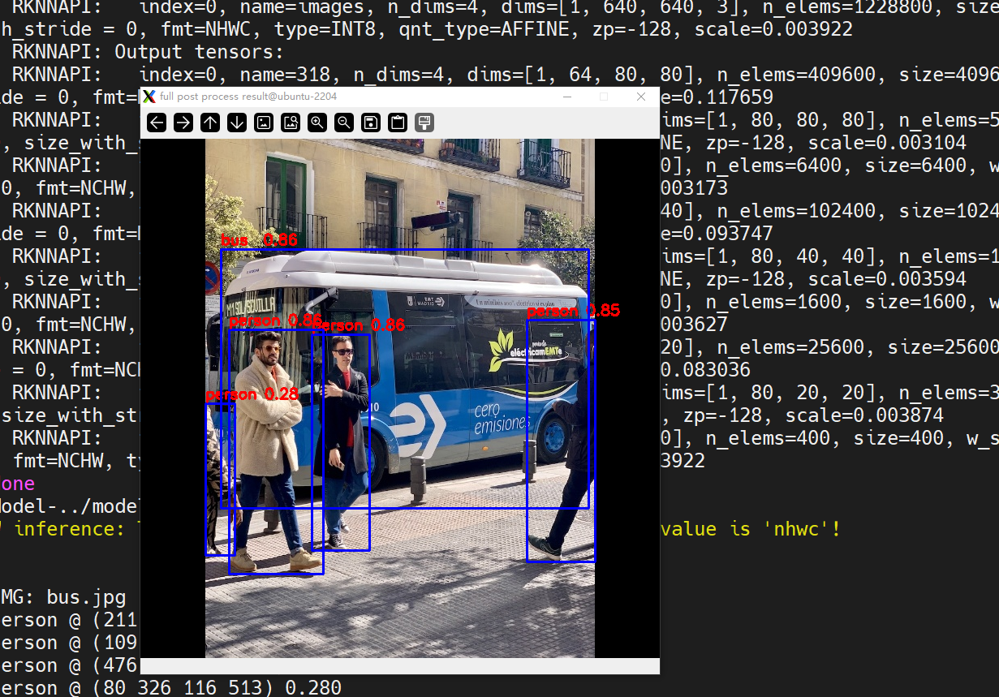
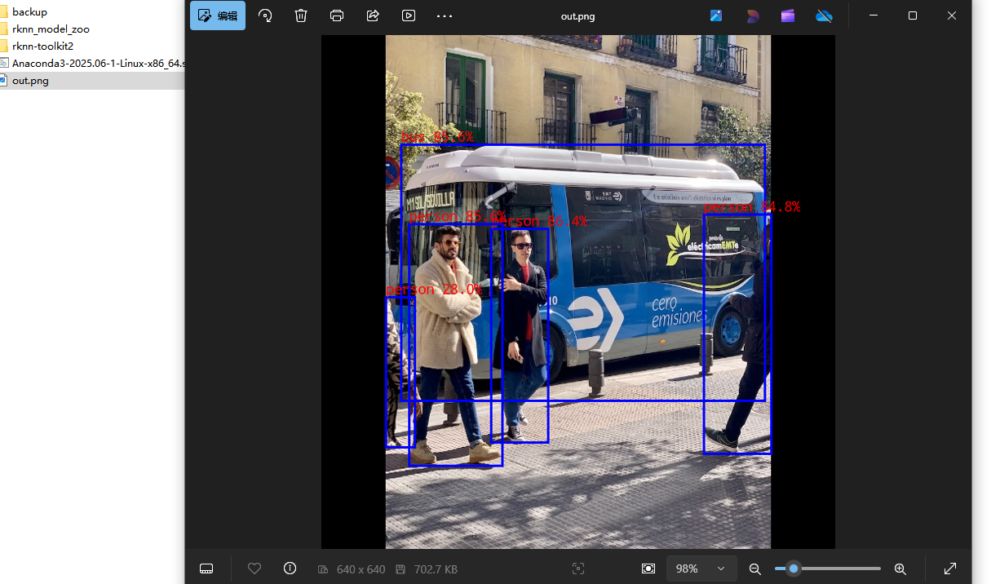

# DshanPI-A1buildroot下搭建RKNN环境
## 开发环境

>PC端： ubuntu22.04-x86-64
>
>板端：buildroot

具体理论部分不再赘述，网上一大把，现在记录整个操作过程，分为两大部分：1.PC端 2.板端

## 1.PC端

### RKNN-Toolkit2环境搭建

```bash
#代码库下载
mkdir rknn
cd rknn
wget https://dl.100ask.net/Hardware/MPU/RK3576-DshanPi-A1/utils/rknn-toolkit2.zip
unzip rknn-toolkit2.zip
wget https://dl.100ask.net/Hardware/MPU/RK3576-DshanPi-A1/utils/rknn_model_zoo.zip
unzip rknn_model_zoo.zip
#coda环境搭建
wget -c https://repo.anaconda.com/archive/Anaconda3-2025.06-1-Linux-x86_64.sh
bash Anaconda3-2025.06-1-Linux-x86_64.sh
	Please, press ENTER to continue
	>>> 
	Do you accept the license terms? [yes|no]
	>>> yes
	Anaconda3 will now be installed into this location:
    /home/ubuntu/anaconda3
      - Press ENTER to confirm the location
      - Press CTRL-C to abort the installation
      - Or specify a different location below

    [/home/ubuntu/anaconda3] >>> 
 	You can undo this by running `conda init --reverse $SHELL`? [yes|no]
	[no] >>> yes
	Thank you for installing Anaconda3!
#激活环境变量
source ~/.bashrc
#创建RKNN环境
conda create -n rknn-toolkit2 python=3.8
conda activate rknn-toolkit2
#安装RKNN-Toolkit2
cd rknn-toolkit2/rknn-toolkit2/packages/x86_64/
conda install compilers cmake
pip install -r requirements_cp38-2.3.2.txt
pip install rknn_toolkit2-2.3.2-cp38-cp38-manylinux_2_17_x86_64.manylinux2014_x86_64.whl
#验证安装情况
    (rknn-toolkit2) ubuntu@ubuntu-2204:~/rknn/rknn-toolkit2/rknn-toolkit2/packages/x86_64$ python3
    Python 3.8.20 (default, Oct  3 2024, 15:24:27)
    [GCC 11.2.0] :: Anaconda, Inc. on linux
    Type "help", "copyright", "credits" or "license" for more information.
    >>> from rknn.api import RKNN
    >>> exit()
    (rknn-toolkit2) ubuntu@ubuntu-2204:~/rknn/rknn-toolkit2/rknn-toolkit2/packages/x86_64$
```

## 2.连扳推理

首先给出我的环境,我使用的是sdk自带的buildroot，由百问网团队进行了适配，已经开启rknnruntime，并且**我没有更新runtime**

```bash
root@rk3576-buildroot:/# uname -a
	Linux rk3576-buildroot 6.1.75 #3 SMP Fri Nov 28 09:41:14 EST 2025 aarch64 GNU/Linux
root@rk3576-buildroot:/# find ./ -name *rknn*
    ./rockchip-test/npu2/model/RK356X/mobilenet_v1.rknn
    ./rockchip-test/npu2/model/RK3588/vgg16_max_pool_fp16.rknn
    ./sys/kernel/debug/clk/hclk_rknn_root
    ./sys/kernel/debug/clk/clk_rknn_dsu0
    ./sys/kernel/debug/clk/aclk_rknn0
    ./sys/kernel/debug/clk/aclk_rknn1
    ./sys/kernel/debug/clk/aclk_rknn_cbuf
    ./sys/kernel/debug/clk/hclk_rknn_cbuf
    ./usr/share/model/RK3562/mobilenet_v1.rknn
    ./usr/share/model/RK3566_RK3568/mobilenet_v1.rknn
    ./usr/share/model/RK3588/mobilenet_v1.rknn
    ./usr/share/model/RK3576/mobilenet_v1.rknn
    ./usr/lib/librknnrt.so
    ./usr/bin/start_rknn.sh
    ./usr/bin/rknn_common_test
    ./usr/bin/restart_rknn.sh
    ./usr/bin/rknn_server
```

**tip：**我的buildroot配置./build.sh bconfig

```apl
 [*] Rockchip NPU power control for linux                                                  │ │
  │ │                   [ ] Rockchip NPU power control combine for linux                                          │ │
  │ │                   [ ] Rockchip recovery for linux                                                           │ │
  │ │                   [ ] rkadk                                                                                 │ │
  │ │                   [ ] rknpu                                                                                 │ │
  │ │                   [ ] rknpu pcie                                                                            │ │
  │ │                   [ ] python-rknn                                                                           │ │
  │ │                   [*] rknpu2                                                                                │ │
  │ │                   [*] rknpu2 example                                                                        │ │
  │ │                   [ ] rknpu firmware                                                                        │ │
  │ │                   [ ] RKPARTYBOX demo                                                                       │ │
  │ │                   [*] rockchip script                 
```

可以看到，rknpu的配置我没有改动，buildroot已经默认配置好rknpu驱动和rknnruntime

### 问题1:解决pc端adb权限问题

在pc上进行连扳推理，会报如下错误：

```bash
：(rknn-toolkit2) ubuntu@ubuntu-2204:~/rknn/rknn_model_zoo/examples/yolov8/python$ sudo python3 yolov8.py --target rk3576 --model_path ../model/yolov8.rknn --img_show
Traceback (most recent call last):
  File "/home/ubuntu/rknn/rknn_model_zoo/examples/yolov8/python/yolov8.py", line 2, in <module>
    import cv2
ModuleNotFoundError: No module named 'cv2'
(rknn-toolkit2) ubuntu@ubuntu-2204:~/rknn/rknn_model_zoo/examples/yolov8/python$ python3 yolov8.py --target rk3576 --model_path ../model/yolov8.rknn --img_show
I rknn-toolkit2 version: 2.3.2
--> Init runtime environment
adb: unable to connect for root: insufficient permissions for device: user in plugdev group; are your udev rules wrong?
See [http://developer.android.com/tools/device.html] for more information
I target set by user is: rk3576
E init_runtime: Get board target failed, ret code: 1. error: insufficient permissions for device: user in plugdev group; are your udev rules wrong?
See [http://developer.android.com/tools/device.html] for more information

E init_runtime: Traceback (most recent call last):
  File "rknn/api/rknn_log.py", line 344, in rknn.api.rknn_log.error_catch_decorator.error_catch_wrapper
  File "rknn/api/rknn_base.py", line 2566, in rknn.api.rknn_base.RKNNBase.init_runtime
  File "rknn/api/rknn_runtime.py", line 223, in rknn.api.rknn_runtime.RKNNRuntime.__init__
  File "rknn/api/rknn_platform.py", line 607, in rknn.api.rknn_platform.get_board_info
RuntimeError
```

注意这一句

```bash
adb: unable to connect for root: insufficient permissions for device: user in plugdev group; are your udev rules wrong?
See [http://developer.android.com/tools/device.html] for more information
```

提示adbd权限不足，修改

```bash
# 添加udev规则
echo 'SUBSYSTEM=="usb", ATTR{idVendor}=="2207", MODE="0666", GROUP="plugdev"' | sudo tee /etc/udev/rules.d/51-android.rules
# 重新加载规则
sudo udevadm control --reload-rules
sudo udevadm trigger
# 重启ADB
adb kill-server
adb start-server
adb devices
    List of devices attached
    8074683be1050187        device
```

### 问题2:解决板端adbd5037端口未打开问题

现象：

```bash
#进行连扳推理
 python3 yolov8.py --target rk3576 --model_path ../model/yolov8.rknn --img_show
    I rknn-toolkit2 version: 2.3.2
    --> Init runtime environment
    adbd is already running as root
    I target set by user is: rk3576
    I Get hardware info: target_platform = rk3576, os = Linux, aarch = aarch64
    I Check RK3576 board npu runtime version
    W kill server failed while restarting, ret code: 1. warning: killall: rknn_server: no process killed
      Please skip it if rknn_server not running on board.
    I Starting ntp or adb, target is RK3576
    I Start adb...
    I Connect to Device success!
    I NPUTransfer(3672747): Starting NPU Transfer Client, Transfer version 2.2.2 (12abf2a@2024-09-02T03:22:41)
    E RKNNAPI: rknn_init,  server connect fail!  ret = -9(ERROR_PIPE)!
    E init_runtime: The rknn_server on the concected device is abnormal, please start the rknn_server on the device according to:
                   https://github.com/airockchip/rknn-toolkit2/blob/master/doc/rknn_server_proxy.md
    W init_runtime: ===================== WARN(1) =====================
    E rknn-toolkit2 version: 2.3.2
    E init_runtime: Traceback (most recent call last):
      File "rknn/api/rknn_log.py", line 344, in rknn.api.rknn_log.error_catch_decorator.error_catch_wrapper

```

注意

```
    I NPUTransfer(3672747): Starting NPU Transfer Client, Transfer version 2.2.2 (12abf2a@2024-09-02T03:22:41)
    E RKNNAPI: rknn_init,  server connect fail!  ret = -9(ERROR_PIPE)!
    E init_runtime: The rknn_server on the concected device is abnormal, please start the rknn_server on the device according to:
                   https://github.com/airockchip/rknn-toolkit2/blob/master/doc/rknn_server_proxy.md
```

参考提示，去  https://github.com/airockchip/rknn-toolkit2/blob/master/doc/rknn_server_proxy.md查找解决方案

在这个文档的

>   ## 6. 常见问题
>
>   
>
>   ### 问题1
>
>   
>
>   Debian系统上rknn_server服务已经后台启动, 但是连板推理时依旧有如下报错：
>
>   ```
>   D NPUTransfer: ERROR: socket read fd = 4, n = -1: Connection reset by peer
>   D NPUTransfer: Transfer client closed, fd = 4
>   E RKNNAPI: rknn_init,  server connect fail!  ret = -9(ERROR_PIPE)!
>   E build_graph: The rknn_server on the concected device is abnormal, please start the rknn_server on the device according to:
>                  https://github.com/airockchip/rknn-toolkit2/blob/master/doc/rknn_server_proxy.md
>   ```
>
>   
>
>   **解决方法：** 这通常是由于Debian固件上的adbd程序没有监听5037端口导致的，可以在板子上执行以下命令来判断:
>
>   ```
>   netstat -n -t -u -a
>   ```
>
>   
>
>   如果输出结果中没有**5037端口**,则执行下列命令下载和更新adbd程序, 并重启板子;否则,跳过下列步骤。
>
>   ```
>   wget -O adbd.zip https://ftzr.zbox.filez.com/v2/delivery/data/7f0ac30dfa474892841fcb2cd29ad924/adbd.zip
>   unzip adbd.zip
>   adb push adbd/linux-aarch64/adbd /usr/bin/adbd
>   ```
>
>   
>
>   进入设备shell命令，增加adbd的可执行权限
>
>   ```
>   adb shell "chmod +x /usr/bin/adbd"
>   adb reboot
>   ```
>
>   
>
>   重启设备后，按照启动步骤启动rknn_server服务，再次尝试连板推理。

虽然这个文档用的是Debian固件，我用的是buildroot，现象一直，按照它的解决方案，排查问题：

```bash
#这是板端
root@rk3576-buildroot:/# netstat -n -t -u -a
Active Internet connections (servers and established)
Proto Recv-Q Send-Q Local Address           Foreign Address         State
tcp        0      0 0.0.0.0:53              0.0.0.0:*               LISTEN
tcp        0      0 0.0.0.0:22              0.0.0.0:*               LISTEN
tcp        0      0 :::53                   :::*                    LISTEN
tcp        0      0 :::22                   :::*                    LISTEN
tcp        0      0 :::5555                 :::*                    LISTEN
udp        0      0 0.0.0.0:53              0.0.0.0:*
udp        0      0 0.0.0.0:67              0.0.0.0:*
udp        0      0 0.0.0.0:68              0.0.0.0:*
udp        0      0 127.0.0.1:323           0.0.0.0:*
udp        0      0 :::53                   :::*
udp        0      0 ::1:323                 :::*
udp        0      0 :::546                  :::*
```

可以看到**5037端口**确实没有打开

```bash
#这是pc端
wget -O adbd.zip https://ftzr.zbox.filez.com/v2/delivery/data/7f0ac30dfa474892841fcb2cd29ad924/adbd.zip
unzip adbd.zip
adb push adbd/linux-aarch64/adbd /usr/bin/adbd
adb shell "chmod +x /usr/bin/adbd"
adb reboot
```

重启开发板后重新测试

```bash
#这是板端
restart_rknn.sh
root@rk3576-buildroot:/# netstat -n -t -u -a
Active Internet connections (servers and established)
Proto Recv-Q Send-Q Local Address           Foreign Address         State
tcp        0      0 127.0.0.1:5037          0.0.0.0:*               LISTEN
tcp        0      0 0.0.0.0:22              0.0.0.0:*               LISTEN
tcp        0      0 0.0.0.0:53              0.0.0.0:*               LISTEN
tcp        0      0 0.0.0.0:5555            0.0.0.0:*               LISTEN
tcp        0      0 :::22                   :::*                    LISTEN
tcp        0      0 :::53                   :::*                    LISTEN
udp        0      0 0.0.0.0:53              0.0.0.0:*
udp        0      0 0.0.0.0:67              0.0.0.0:*
udp        0      0 0.0.0.0:68              0.0.0.0:*
udp        0      0 127.0.0.1:323           0.0.0.0:*
udp        0      0 :::546                  :::*
udp        0      0 :::53                   :::*
udp        0      0 ::1:323                 :::*
```

可以看到**5037端口**已经被监听，现在继续尝试连扳推理

```bash
#这是pc端
(rknn-toolkit2) ubuntu@ubuntu-2204:~/rknn/rknn_model_zoo/examples/yolov8/python$ python3 yolov8.py --target rk3576 --model_path ../model/yolov8.rknn --img_show
I rknn-toolkit2 version: 2.3.2
--> Init runtime environment
adb: unable to connect for root: closed
I target set by user is: rk3576
I Get hardware info: target_platform = rk3576, os = Linux, aarch = aarch64
I Check RK3576 board npu runtime version
I Starting ntp or adb, target is RK3576
I Start adb...
I Connect to Device success!
I NPUTransfer(3675220): Starting NPU Transfer Client, Transfer version 2.2.2 (12abf2a@2024-09-02T03:22:41)
I NPUTransfer(3675220): TransferBuffer: min aligned size: 1024
D RKNNAPI: ==============================================
D RKNNAPI: RKNN VERSION:
D RKNNAPI:   API: 2.3.2 (1842325 build@2025-03-30T09:55:23)
```

已经连扳推理成功，显示出人脸识别图像



## 3.板端推理

由于使用的是buildroot，rk平台在rk1808之后，buildroot并未支持python部署方式，自行搭建python推理软件栈颇为耗时，且会遇到很多问题，python demo参考百问网[RKNN环境搭建 | 东山Π](https://wiki.dshanpi.org/docs/DshanPi-A1/AppDev/part3-3/03-3-1_SetupRKNNEnvironment)这里不再赘述，使用cpp接口，还是使用上述的yolo8进行板端推理：

### 准备模型

```bash
cd ~/rknn/rknn_model_zoo/examples/yolov8/model
sh download_model.sh
ls -lah yolov8n.onnx
	-rw-rw-r-- 1 ubuntu ubuntu 13M Nov 29 07:36 yolov8n.onnx
```

### 模型转换

```bash
cd ../python/
(rknn-toolkit2) ubuntu@ubuntu-2204:~/rknn/rknn_model_zoo/examples/yolov8/python$ python convert.py ../model/yolov8n.onnx rk3576 i8 ../model/yolov8n.rknn

python convert.py ../model/yolov5s_relu.onnx rk3576 i8 ../model/yolov5s_relu.rknn 

    I rknn-toolkit2 version: 2.3.2
    --> Config model
    done
    --> Loading model
    I Loading : 100%|██████████████████████████████████████████████| 126/126 [00:00<00:00, 43282.74it/s]
    done
    --> Building model
    I OpFusing 0: 100%|█████████████████████████████████████████████| 100/100 [00:00<00:00, 1590.15it/s]
    I OpFusing 1 : 100%|█████████████████████████████████████████████| 100/100 [00:00<00:00, 860.03it/s]
    I OpFusing 0 : 100%|█████████████████████████████████████████████| 100/100 [00:00<00:00, 739.11it/s]
    I OpFusing 1 : 100%|█████████████████████████████████████████████| 100/100 [00:00<00:00, 652.15it/s]
    I OpFusing 2 : 100%|█████████████████████████████████████████████| 100/100 [00:00<00:00, 229.74it/s]
    W build: found outlier value, this may affect quantization accuracy
                            const name                        abs_mean    abs_std     outlier value
                            model.0.conv.weight               2.44        2.47        -17.494
                            model.22.cv3.2.1.conv.weight      0.09        0.14        -10.215
                            model.22.cv3.1.1.conv.weight      0.12        0.19        13.361, 13.317
                            model.22.cv3.0.1.conv.weight      0.18        0.20        -11.216
    I GraphPreparing : 100%|████████████████████████████████████████| 161/161 [00:00<00:00, 3291.17it/s]
    I Quantizating : 100%|████████████████████████████████████████████| 161/161 [00:04<00:00, 34.87it/s]
    W build: The default input dtype of 'images' is changed from 'float32' to 'int8' in rknn model for performance!
                           Please take care of this change when deploy rknn model with Runtime API!
    W build: The default output dtype of '318' is changed from 'float32' to 'int8' in rknn model for performance!
                          Please take care of this change when deploy rknn model with Runtime API!
    W build: The default output dtype of 'onnx::ReduceSum_326' is changed from 'float32' to 'int8' in rknn model for performance!
                          Please take care of this change when deploy rknn model with Runtime API!
    W build: The default output dtype of '331' is changed from 'float32' to 'int8' in rknn model for performance!
                          Please take care of this change when deploy rknn model with Runtime API!
    W build: The default output dtype of '338' is changed from 'float32' to 'int8' in rknn model for performance!
                          Please take care of this change when deploy rknn model with Runtime API!
    W build: The default output dtype of 'onnx::ReduceSum_346' is changed from 'float32' to 'int8' in rknn model for performance!
                          Please take care of this change when deploy rknn model with Runtime API!
    W build: The default output dtype of '350' is changed from 'float32' to 'int8' in rknn model for performance!
                          Please take care of this change when deploy rknn model with Runtime API!
    W build: The default output dtype of '357' is changed from 'float32' to 'int8' in rknn model for performance!
                          Please take care of this change when deploy rknn model with Runtime API!
    W build: The default output dtype of 'onnx::ReduceSum_365' is changed from 'float32' to 'int8' in rknn model for performance!
                          Please take care of this change when deploy rknn model with Runtime API!
    W build: The default output dtype of '369' is changed from 'float32' to 'int8' in rknn model for performance!
                          Please take care of this change when deploy rknn model with Runtime API!
    I rknn building ...
    I rknn building done.
    done
    --> Export rknn model
    done
cd ../model
ls -lah yolov8n.rknn
	-rw-rw-r-- 1 ubuntu ubuntu 6.2M Nov 29 07:39 yolov8n.rknn
```

### 运行RKNN C example

首先需要编译C example，然后将可执行文件 模型文件 资源文件部署到板端

#### 编译

编译要使用`rknn_model_zoo`目录下的`build-linux.sh`脚本，需要先配置工具链。修改**build-linux.sh**：

```bash
GCC_COMPILER=/home/ubuntu/rk3576/prebuilts/gcc/linux-x86/aarch64/gcc-arm-10.3-2021.07-x86_64-aarch64-none-linux-gnu/bin/aarch64-none-linux-gnu
chmod +x ./build-linux.sh
./build-linux.sh -t rk3576 -a aarch64 -d yolov8
	-- Set runtime path of "/home/ubuntu/rknn/rknn_model_zoo/install/rk3576_linux_aarch64/rknn_yolov8_demo/./rknn_yolov8_demo" to "$ORIGIN/../lib"
-- Installing: /home/ubuntu/rknn/rknn_model_zoo/install/rk3576_linux_aarch64/rknn_yolov8_demo/model/bus.jpg
-- Installing: /home/ubuntu/rknn/rknn_model_zoo/install/rk3576_linux_aarch64/rknn_yolov8_demo/model/coco_80_labels_list.txt
-- Installing: /home/ubuntu/rknn/rknn_model_zoo/install/rk3576_linux_aarch64/rknn_yolov8_demo/model/yolov8.rknn
-- Installing: /home/ubuntu/rknn/rknn_model_zoo/install/rk3576_linux_aarch64/rknn_yolov8_demo/model/yolov8n.rknn
-- Installing: /home/ubuntu/rknn/rknn_model_zoo/install/rk3576_linux_aarch64/rknn_yolov8_demo/lib/librknnrt.so
-- Installing: /home/ubuntu/rknn/rknn_model_zoo/install/rk3576_linux_aarch64/rknn_yolov8_demo/lib/librga.so
#查看一下
ubuntu@ubuntu-2204:~/rknn/rknn_model_zoo/install$ tree -L 4
.
└── rk3576_linux_aarch64
    └── rknn_yolov8_demo
        ├── lib
        │   ├── librga.so
        │   └── librknnrt.so
        ├── model
        │   ├── bus.jpg
        │   ├── coco_80_labels_list.txt
        │   ├── yolov8n.rknn
        │   └── yolov8.rknn
        ├── rknn_yolov8_demo
        └── rknn_yolov8_demo_zero_copy
```

这个rknn_yolov8_demo就是要部署到板端的文件集合

```bash
adb push install/rk3576_linux_aarch64/rknn_yolov8_demo /data/
install/rk3576_linux_aarch64/rknn_yolov8_demo/: 8 files pushed. 3.6 MB/s (23008641 bytes in 6.049s)
```

在板端运行

```
root@rk3576-buildroot:/data/rknn_yolov8_demo# ./rknn_yolov8_demo ./model/yolov8.rknn ./model/bus.jpg
    load lable ./model/coco_80_labels_list.txt
    model input num: 1, output num: 9
    input tensors:
      index=0, name=images, n_dims=4, dims=[1, 640, 640, 3], n_elems=1228800, size=1228800, fmt=NHWC, type=INT8, qnt_type=AFFINE, zp=-128, scale=0.003922
    output tensors:
      index=0, name=318, n_dims=4, dims=[1, 64, 80, 80], n_elems=409600, size=409600, fmt=NCHW, type=INT8, qnt_type=AFFINE, zp=-58, scale=0.117659
      index=1, name=onnx::ReduceSum_326, n_dims=4, dims=[1, 80, 80, 80], n_elems=512000, size=512000, fmt=NCHW, type=INT8, qnt_type=AFFINE, zp=-128, scale=0.003104
      index=2, name=331, n_dims=4, dims=[1, 1, 80, 80], n_elems=6400, size=6400, fmt=NCHW, type=INT8, qnt_type=AFFINE, zp=-128, scale=0.003173
      index=3, name=338, n_dims=4, dims=[1, 64, 40, 40], n_elems=102400, size=102400, fmt=NCHW, type=INT8, qnt_type=AFFINE, zp=-45, scale=0.093747
      index=4, name=onnx::ReduceSum_346, n_dims=4, dims=[1, 80, 40, 40], n_elems=128000, size=128000, fmt=NCHW, type=INT8, qnt_type=AFFINE, zp=-128, scale=0.003594
      index=5, name=350, n_dims=4, dims=[1, 1, 40, 40], n_elems=1600, size=1600, fmt=NCHW, type=INT8, qnt_type=AFFINE, zp=-128, scale=0.003627
      index=6, name=357, n_dims=4, dims=[1, 64, 20, 20], n_elems=25600, size=25600, fmt=NCHW, type=INT8, qnt_type=AFFINE, zp=-34, scale=0.083036
      index=7, name=onnx::ReduceSum_365, n_dims=4, dims=[1, 80, 20, 20], n_elems=32000, size=32000, fmt=NCHW, type=INT8, qnt_type=AFFINE, zp=-128, scale=0.003874
      index=8, name=369, n_dims=4, dims=[1, 1, 20, 20], n_elems=400, size=400, fmt=NCHW, type=INT8, qnt_type=AFFINE, zp=-128, scale=0.003922
    model is NHWC input fmt
    model input height=640, width=640, channel=3
    origin size=640x640 crop size=640x640
    input image: 640 x 640, subsampling: 4:2:0, colorspace: YCbCr, orientation: 1
    scale=1.000000 dst_box=(0 0 639 639) allow_slight_change=1 _left_offset=0 _top_offset=0 padding_w=0 padding_h=0
    rga_api version 1.10.1_[0]
    rknn_run
    person @ (211 241 282 507) 0.864
    person @ (109 235 225 536) 0.856
    bus @ (99 136 552 455) 0.856
    person @ (476 223 560 521) 0.848
    person @ (80 326 116 513) 0.280
    write_image path: out.png width=640 height=640 channel=3 data=0x3e2e9200

```

在pc端查看

```
adb pull /data/rknn_yolov8_demo/out.png ./
```



符合预期


至此，rknn环境搭建成功

