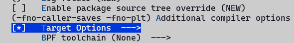
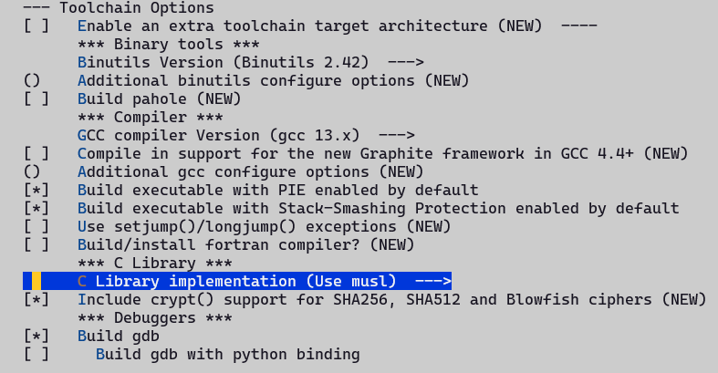
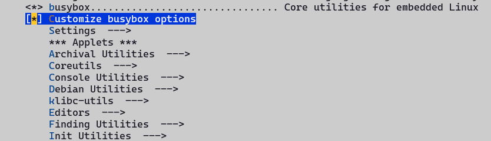
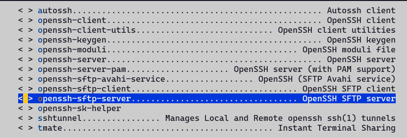

## 序言
<font style={{color: 'rgb(17, 17, 51)'}}>本文档旨在为开发者和爱好者提供一份清晰、简洁的 OpenWrt（LEDE）固件编译指南，专用于 </font>**<font style={{color: 'rgb(17, 17, 51)'}}>DshanPi A1（基于瑞芯微 RK3576 平台）</font>**<font style={{color: 'rgb(17, 17, 51)'}}> 开发板。通过本流程，您将完成从源码获取、依赖更新、配置定制（包括 OP 域与 Kernel 域）、到最终固件生成的完整编译过程。文档同时涵盖最小化配置生成方法、常见问题提示及镜像输出说明，帮助用户高效构建适配硬件的稳定固件，为后续开发、调试或部署奠定基础。无论您是初次接触 OpenWrt 编译，还是希望针对 RK3576 平台进行深度定制，本文均可作为实用参考。</font>

## 配置编译环境
如果是基于WSL编译的，请参考[《一、单板介绍与开发环境搭建 - 开发环境》](https://www.yuque.com/jason-0nd0f/ts7m5t/dq8nprtdhgq5lk2a#wQtqk)章节，配置好WSL的基础环境。

然后按照仓库readme安装编译需要的编译工具链，安装好编译相关，示例如下：

```bash
sudo apt install -y ack antlr3 asciidoc autoconf automake autopoint binutils bison build-essential \
bzip2 ccache clang cmake cpio curl device-tree-compiler flex gawk gcc-multilib g++-multilib gettext \
genisoimage git gperf haveged help2man intltool libc6-dev-i386 libelf-dev libfuse-dev libglib2.0-dev \
libgmp3-dev libltdl-dev libmpc-dev libmpfr-dev libncurses5-dev libncursesw5-dev libpython3-dev \
libreadline-dev libssl-dev libtool llvm lrzsz msmtp ninja-build p7zip p7zip-full patch pkgconf \
python3 python3-pyelftools python3-setuptools qemu-utils rsync scons squashfs-tools subversion \
swig texinfo uglifyjs upx-ucl unzip vim wget xmlto xxd zlib1g-dev
```

## 获取源码
直接git clone百问网的仓库即可，注意有些环境可能github访问受限，克隆不下来，可以参考[《一、单板介绍与开发环境搭建 - 3.3 WSL网络代理设置》](https://www.yuque.com/jason-0nd0f/ts7m5t/dq8nprtdhgq5lk2a#SD6lh)中的内容，配置http/https终端代理即可。

```bash
git clone https://github.com/dshanpi/RK3576-DshanPiA1_LEDE.git
```

在下载完源码后，更新feeds，下载对应的包：

```bash
cd RK3576-DshanPiA1_LEDE
./scripts/feeds update -a
./scripts/feeds install -a
```

## 自定义选项
在更新feeds完成后，我们可以先使用默认的minimal配置做为基础，然后在上面做自定义配置即可，示例如下：

```bash
cp minimal.config .config
make defconfig # 会自动补齐缺失的配置项，使其成为可编译的完整配置
```

后续的配置可以保存为defconfig，加入版本管理中，具体方法查看本文 《4.5 保存配置》章节。

生成了基础配置后，就可以进行自定义配置了，自定义配置的命令为：

```bash
make menuconfig
```

系统的配置，简单划分的话，可以主要分为以下几个部分：

+ busybox

这部分是基础系统的特性配置，openwrt的基础系统是使用的busybox。

+ app

这部分对应一些命令或者luci-xxx这类待页面的应用，主要靠这部分扩展路由器的功能，和暴露易用的配置界面。

+ libs

这部分主要是配置openwrt的系统里面集成的库，可以按需增加，常规情况下是选中某些命令或者luci类的app的时候，会自动选中对应的库。

+ kernel

这部分主要是配置kernel，包含一些内核功能和驱动，在有新的外设支持的时候，需要配置到。

### 配置编译选项
这部分主要配置编译目标文件时候的一些优化参数和编译工具链的一些选项，按照下面的方法打开：

1. 首先使能 Advanced configuration options (for developers)：


2. 使能 Target Options，并填入目标优化的GCC编译参数：




3. 使能Toolchain Options，配置工具链选项：



> 警告：此处C库实现要选择musl，不然刷机完进如系统后，通过Opkg下载的包全都无法使用！（因为默认的包都是musl c库）！
>

### 配置busybox选项
在有些场景，openwrt的非busybox类的配置无法覆盖要求，需要通过busybox里面的包来实现，这个时候就需要自定义busybox的选项。可以参考下面的配置方法：

1. 选中 Base System ->  Customize busybox options



其中Settings是一些额外的参数配置，如编译选项等；Applets是一些命令行工具的配置，我们按需进行相应的配置即可。

需要注意的是，当openwrt的包能提供对应的功能的时候，我们不应在busybox的配置里面再提供，不然在编译的最后环节，会提示已经提供但是Busybox里面也有的错误提示。

### 配置应用
openwrt包含丰富的应用集，可以极大地丰富路由器的功能，包含各种各样的库，命令行工具，带界面的APP（常称为插件）等，这里只对配置一些常见的APP做一些配置示例。

大部分包都按照分类，有序的按照字母顺序排列在各个大项下面，如我们想使能一下sftp-server，那么可以在：Network -> SSH 页面下找到，然后选中即可，示例如下：


还有一种比较快捷的方法，可以通过menuconfig的配置项搜索功能，快速定位到需要配置的页面去选中，下面已sftp-server为目标，搜索打开的方法示例：

1. 在menuconfig主界面，输入/，进如搜索页面，然后在搜索页面输入sftp-server


2. 根据搜索结果页面中(N)对应的数字索引，可以快速跳转到某条结果，如此处只有一个结果，那么索引是1，直接输入1，会直接跳转到对应的页面。


3. 可以看到目前搜索页面对应的包是=n，未使能的；输入索引值跳转过去后发现确实是未使能，相对应，这个时候我们只需要输入y使能即可。



4. 针对有多条搜索结果的情况，我们可以通过输入空格键实现整页翻页查看结果，也可以通过输入上下键实现按行翻页查看结果，通过查看搜索页面的详细信息，确定是否是自己要找的包。

> 说明：推荐两种方法都灵活使用，可以大大加快开发效率。
>

### 配置kernel选项
kernel的配置选项和其他不同，不是make menuconfig配置的，而是有单独的make目标，示例如下：

```bash
make kernel_menuconfig
```

在未编译过整个工程的情况下，执行上述命令会自动去先编译依赖的工具链，可能比较耗时，推荐先整个工程编译一次，然后再自定义配置kernel选项。

因为第一次整个编译工程的时候，会下载依赖的所有源码包，并编译对应的工具链，比较耗时。

### 保存配置
针对OP域的配置，使用下面命令，生成最小配置文件：

```bash
./scripts/diffconfig.sh > defconfig
```

针对kernel域的配置，在配置kernel的时候，会自动更新配置到target下面的config文件里面，不用手动保存。

## 编译
### 流程
首先执行下载操作，解决完下载过程中可能遇到的问题，然后再执行编译流程。

避免默认的编译过程中下载，可能会某个包失败了后，再编译的时候，会挨个检查之前的包是否下载和编译完成了，这样不利于调试，执行命令如下：

```bash
# 当下载失败的时候，使用-j1查看具体的失败信息
# 下载的源码包都存放在工程根目录的dl目录下
make download -j$(nproc)

#第一次编译推荐用单线程，测试多线程编译会失败！
make V=s -j1
```

二次编译的时候，可以执行:

```bash
make V=s -j$(nproc)
```

如果需要重新配置，按照下面流程执行：

```bash
rm -rf .config
make menuconfig
make V=s -j$(nproc)
```

### 常见编译错误
有些程序编译的时候会失败，这个时候我们需要重新使用make V=s -j1的方式重新跑一遍，才能较好的看到编译过程中的错误，比较场景的有未定义或者库找不到的错误，或者Werror导致的报错，下面是一个简单的解决方式示例。

如最开始使用glibc进行编译，发现mbedtls和vlmcsd一直编不过，增加如下修改可以编过：

```diff
diff --git a/package/libs/mbedtls/Makefile b/package/libs/mbedtls/Makefile
index 4e0a4a034..54a0b2d45 100644
--- a/package/libs/mbedtls/Makefile
+++ b/package/libs/mbedtls/Makefile
@@ -121,7 +121,7 @@ This package contains mbedtls helper programs for private key and
 CSR generation (gen_key, cert_req)
 endef

-TARGET_CFLAGS += -ffunction-sections -fdata-sections
+TARGET_CFLAGS += -ffunction-sections -fdata-sections -Wno-error=stringop-overflow
 TARGET_CFLAGS := $(filter-out -O%,$(TARGET_CFLAGS))

 CMAKE_OPTIONS += 
```

```diff
--- Makefile.orig       2025-11-14 01:58:43.376952312 +0800
+++ Makefile    2025-11-14 01:53:50.865983762 +0800
@@ -37,4 +37,6 @@
        $(INSTALL_BIN) ./files/vlmcsd.ini $(1)/etc/vlmcsd/vlmcsd.ini
 endef

+TARGET_LDFLAGS += -lresolv -lpthread
+
 $(eval $(call BuildPackage,vlmcsd))
```

更多编译过程中的错误，灵活使用AI工具和搜索引擎，基本都能解决编译中遇到的问题。

## 烧写
编译完成后，会在对应的bin/target/xxxx目录生成两个类型的镜像包，一个是ext4一个是squashfs的，如果有恢复默认配置需求，需要使用squashfs的镜像包。


<font style={{color: 'rgb(28, 30, 33)'}}>注意：在OpenWrt编译完成后，可以刷写的镜像会被压缩成zip格式文件，需要先执行解压操作，然后才能做为烧录工具的刷机镜像，示例如下：</font>

```bash
jason@ubuntu24:~/LEDE/bin/targets/rockchip/armv8$ gunzip -k openwrt-rockchip-armv8-100ask_dshanpia1-squashfs-sysupgrade.img.gz -f
gzip: openwrt-rockchip-armv8-100ask_dshanpia1-squashfs-sysupgrade.img.gz: decompression OK, trailing garbage ignored
```

解压得到img镜像后，参考《[单板介绍与开发环境搭建 - 4.3开始烧录](https://www.yuque.com/jason-0nd0f/ts7m5t/dq8nprtdhgq5lk2a)》内容，进行刷机。

openwrt系统自带的在线刷机功能使用的时候有问题，参考《[现有功能优化 - 1.3 sysupgrade镜像无法使用](https://www.yuque.com/jason-0nd0f/ts7m5t/hru38u3g3erf1yuv#G6G2J)》章节进行适配，适配后便可以直接通过web的方式直接刷机，示例如下：


> 注意：web页面在线升级选择的为压缩后的镜像包！
>

