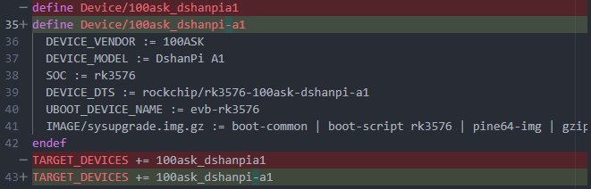
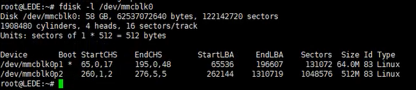
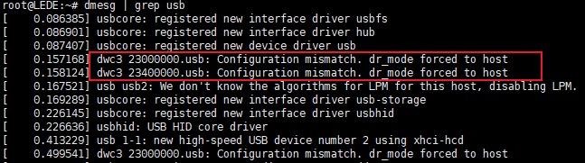
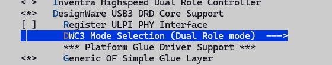
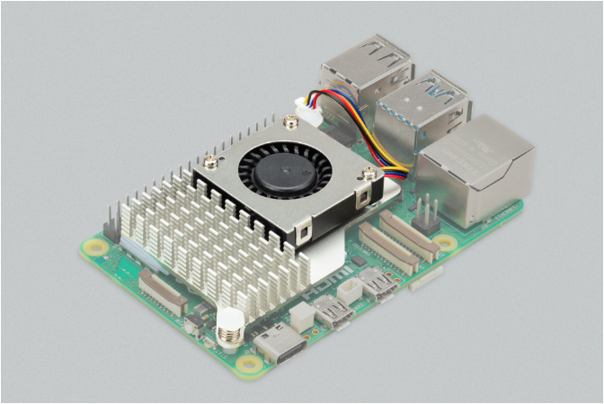
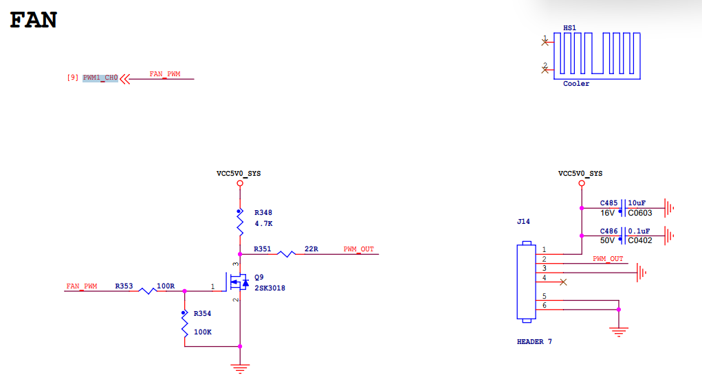
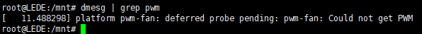
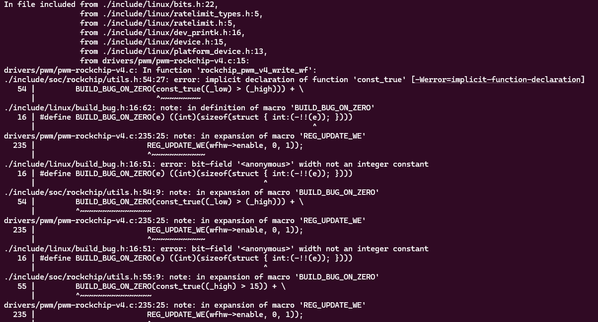
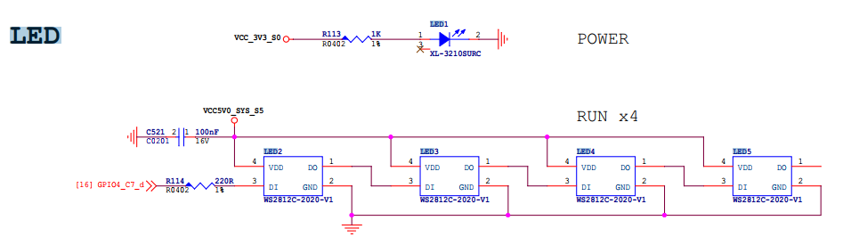
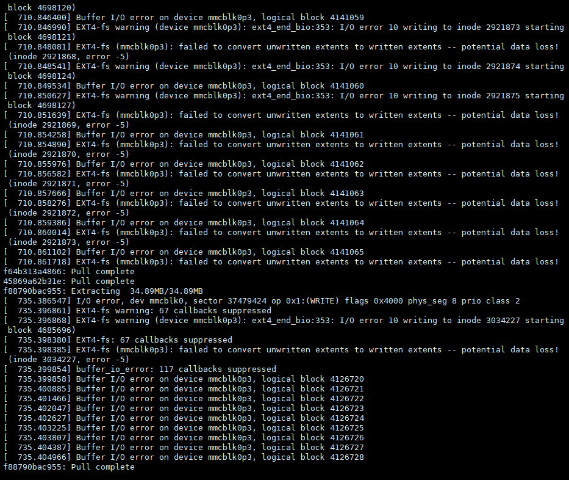

在下载百问网官方适配后的Openwrt源码后，发现使用上有很多功能没有完全适配，出现部分使用过程中体验不好的问题，下面是针对笔者使用中发现的问题的记录与解决办法分析，希望给读者遇到类似问题后，一些解决问题的思路。因为本人知识有限，有什么错误的地方，欢迎交流讨论。

## 安装第三方ipk无法使用
默认的云端mirror库的libc使用musl，使用glibc后烧进去，发现安装的程序都用不了，默认openwrt都是用的musl libc。

## 安装第三方的fdisk无法使用
默认的busybox配置，很多工具都没有，fdisk通过opkg安装后某个提示库不存在，需要手动配置Busybox的选项，我们把打开自定义busybox选项，然后配置fdisk使能。


然后重新编译镜像，然后刷入，测试便可以发现fdisk可以使用了。

## sysupgrade镜像无法使用
使用默认生成的sysupgrade镜像，在界面【系统-备份与升级-刷写新的固件】里面选择了编出来的固件的时候，发现无法使用，有如下错误打印信息：

```bash
Tue Dec  2 17:27:21 2025 user.info upgrade: Device 100ask,dshanpi-a1 not supported by this image
Tue Dec  2 17:27:21 2025 user.info upgrade: Supported devices: 100ask,dshanpia1
Tue Dec  2 17:27:21 2025 user.info upgrade: Reading partition table from bootdisk...
Tue Dec  2 17:27:22 2025 user.info upgrade: Reading partition table from image...
Tue Dec  2 17:27:22 2025 user.info upgrade: Device 100ask,dshanpi-a1 not supported by this image
Tue Dec  2 17:27:22 2025 user.info upgrade: Supported devices: 100ask,dshanpia1
Tue Dec  2 17:27:22 2025 user.info upgrade: Reading partition table from bootdisk...
Tue Dec  2 17:27:22 2025 user.info upgrade: Reading partition table from image..
```

检查发现是armv8.mk里面定义的设备名称，和dts中的compatible不一致， 致 sysupgrade 拒绝刷机。

OpenWrt sysupgrade 会读取：

1. 当前运行设备的标识：

来自：

    - `/proc/device-tree/compatible`
    - `/etc/board.json`
2. 固件中 embedded 的 supported_devices 列表

二者任意一个字符不匹配就报：`Device XXX not supported by this image`

这里知道问题所在了，修改就比较简单了，按照如下方式修改：

1. 修改 target/linux/rockchip/image/armv8.mk，保持和dts中的一致



2. 重新执行make menuconfig，选择target，会自动更新.config文件


3. 重新执行make V=s -j8，进行镜像编译即可。

## sftp无法使用
默认的使用的dropbear做为ssh server，没有sftp功能，这里我们修改配置，关掉dropbear，然后在**Network -> SSH**下面打开openssh，如下图所示。


编译无法通过，`openssh-sk-helper`编译依赖`libfido2`，我们手动使能这个库，选中为y，然后重新编译即可。

注意：openssh-server和openssh-server-pam无法同时使能，我们打开没有PAM支持的编译即可。

## rootfs空间太小
我们优先刷的squashfs格式的镜像，可以比较方便的恢复出厂配置，因为squashfs格式的rom是基于overlayfs的，更新的配置不会直接改到rom里面的内容。但是我们可以发现默认配置的rootfs的大小比较小，而板载的EMMC有58G，我们可以将rootfs空间扩大到8G，剩下的空间单独分配一个分区。

默认配置的rootfs分区为512M，如下所示：



修改配置，默认rootfs分区大小为2G，修改 Target Images下的Rootfs分区大小配置，如下所示：


## usb设备无法识别
当我们只简单的在设备树使能usb0和usb1过后，会发现能识别到U盘了，但是usb驱动probe期间会打印dr_mode强制设置为host的打印，查找代码发现是默认配置的otg，但是没有otg对应的配置，并且drd相关的代码都未编译。



需要修改设备树文件，使能usb0和usb1控制器，默认角色为host。使能DRD ROLE SWITCH功能，然后就可以动态配置控制器角色，然后还可以指定默认角色。


必须要打开了 USB Gadget才能是能双角色功能，那么我们打开，然后在Mode Selection里面选中Dual Role mode，这样会在内核生成usb_role的sysfs节点，可以动态配置成host或者peripheral，在dshan pi a1上，usb1固定为host，usb0可以配置为双角色，可以切换，那么我们做如下dts配置：




```diff
--- a/target/linux/rockchip/files/arch/arm64/boot/dts/rockchip/rk3576-100ask-dshanpi-a1.dts
+++ b/target/linux/rockchip/files/arch/arm64/boot/dts/rockchip/rk3576-100ask-dshanpi-a1.dts
@@ -770,6 +770,20 @@
        status = "okay";
 };
 
+// usb0 as type-c port, can be host or peripheral.
+&usb_drd0_dwc3 {
+       status = "okay";
+       usb-role-switch;
+       role-switch-default-mode ="host";
+};
+
+// usb1 as type-a port, fixed to host
+&usb_drd1_dwc3 {
+       status = "okay";
+       usb-role-switch;
+       role-switch-default-mode ="host";
+};
+
 &uart0 {
        pinctrl-0 = <&uart0m0_xfer>;
        status = "okay";
```

配置后，usb1可以使用，但是usb0无法使用，并且板载Hynetek HUSB311 Type-C 芯片，可以提供USB PD和USB Type-C的功能。发现默认6.12内核版本的驱动，没有该芯片的支持，查看rockip官方仓库，有这款芯片的支持，需要移植过赖，我们暂时不需要DP功能，屏蔽掉。

## PWM风扇一直最大风速
上电后，风扇一直以最大转速工作，声音比较大，需要修改下，支持按照温度自动调整转速，这样更符合常见的应用场景。排查记录如下：

### 查硬件
风扇使用的树莓派5的4针风扇，是标准的4针JST插口，实物图和原理图如下：



<span className="text-content">风扇插口为1mm间距JST SH插座，有四个引脚：</span>

| **<span className="text-content">PIN序号</span>** | **<span className="text-content">功能</span>** |
| --- | --- |
| <span className="text-content">1</span> | <span className="text-content">+5V</span> |
| <span className="text-content">2</span> | <span className="text-content">PWM</span> |
| <span className="text-content">3</span> | <span className="text-content">GND</span> |
| <span className="text-content">4</span> | <span className="text-content">转速</span> |




查看了手册，2脚连接的PWM1，4脚连接的风扇转速口，说明不支持读取转速，只能PWM控制转速。看原理图是PWM1_CH0，dts里面也有对应的配置，根据compatible字段"pwm-fan"到驱动里面搜索，发现存在linux-6.12.43/drivers/hwmon/pwm-fan.c这个文件没有编译，那么就是KCONFIG没有选中，没有编译pwm-fan的驱动。

### 使能PWM驱动


那么我们直接make kernel_menuconfig，搜索COFNIG_SENSORS_PWM_FAN，然后输入搜索结果对应的序号，然后就会直接跳转到配置对应的地方，直接输入Y使能即可。


编译刷写后，启动过程中发现pwm-fan驱动启动失败，有如下打印：



可以得出，没有找到上游的PWM设备，搜索引用的节点的compatible，发现对应的驱动未打开，在单独的目录下：drivers/soc/rockchip


打开的驱动：


打开后，会出现编译问题，我们修改如下：



修改如下：

```diff
--- a/include/soc/rockchip/utils.h	2025-11-23 03:35:07.695086227 +0800
+++ b/include/soc/rockchip/utils.h	2025-11-23 03:34:43.946599951 +0800
@@ -50,6 +50,7 @@
  *
  * Return: the value, shifted into place, with the required write-enable bits
  */
+#if 0
 #define REG_UPDATE_WE(_val, _low, _high) ( \
 	BUILD_BUG_ON_ZERO(const_true((_low) > (_high))) + \
 	BUILD_BUG_ON_ZERO(const_true((_high) > 15)) + \
@@ -57,6 +58,11 @@
 	BUILD_BUG_ON_ZERO(const_true((u64) (_val) > U16_MAX)) + \
 	((_val & GENMASK((_high) - (_low), 0)) << (_low) | \
 	(GENMASK((_high), (_low)) << 16)))
+#else
+#define REG_UPDATE_WE(_val, _low, _high) ( \
+	((_val & GENMASK((_high) - (_low), 0)) << (_low) | \
+	(GENMASK((_high), (_low)) << 16)))
+#endif
 
 /**
  * REG_UPDATE_BIT_WE - update a bit with a write-enable mask
@@ -68,9 +74,14 @@
  *
  * Return: a value with bit @__bit set to @__val and @__bit << 16 set to ``1``
  */
+#if 0
 #define REG_UPDATE_BIT_WE(__val, __bit) ( \
 	BUILD_BUG_ON_ZERO(const_true((__val) > 1)) + \
 	BUILD_BUG_ON_ZERO(const_true((__val) < 0)) + \
 	REG_UPDATE_WE((__val), (__bit), (__bit)))
+#else
+#define REG_UPDATE_BIT_WE(__val, __bit) ( \
+	REG_UPDATE_WE((__val), (__bit), (__bit)))
+#endif
 
 #endif /* __SOC_ROCKCHIP_UTILS_H__ */

```

### 配置转速方法
手动配置pwm-fan的方法，在sysfs下面查找pwm-fan的目录，进入/sys/class/hwmon/hwmon0/下，即可看到两个文件pwm1_enable和pwm1，先配置pwm1为100，观察风扇声音是否减小，试验发现确实变小了，说明PWM控制生效了。


```bash
root@LEDE:~# ls /sys/class/hwmon/hwmon0/
device       of_node      pwm1         subsystem
name         power        pwm1_enable  uevent
root@LEDE:~# echo 100 > /sys/class/hwmon/hwmon0/pwm1
```


参考文档：

+ Documentation/hwmon/pwm-fan.rst
+ Documentation/devicetree/bindings/hwmon/pwm-fan.yaml
+ Documentation/driver-api/thermal/sysfs-api.rst

也可以根据thermal框架，下面的cooling_device找到pwm-fan。在thermal cooling device框架下有注册的sysfs接口，对应绑定pwm_fan驱动提供的ops，将state数值对应dts中配置的cooling_levels数组索引，进而可以通过配置0..max_state的数值，来配置pwm驱动里面对应的相对速度，在shell里面直接。

```c
static const struct thermal_cooling_device_ops pwm_fan_cooling_ops = {
	.get_max_state = pwm_fan_get_max_state,
	.get_cur_state = pwm_fan_get_cur_state,
	.set_cur_state = pwm_fan_set_cur_state,
};

//dts
fan: pwm-fan {
    status = "okay";
    compatible = "pwm-fan";
    #cooling-cells = <2>;
    pwms = <&pwm1_6ch_0 0 50000 1>;

    // 这里对应state从0..5
    cooling-levels = <0 100 125 150 200 255>; 

    // 这里配置的trips，没有生效。我们需要将它放到thermal框架里去
    rockchip,temp-trips = <
        40000    1
        50000    2
        60000    3
        65000    4
        70000    5
    >;
};
```

```bash
root@LEDE:~# ls /sys/class/thermal/cooling_device0/
cur_state  max_state  power      subsystem  type       uevent
root@LEDE:~# cat /sys/class/thermal/cooling_device0/max_state 
5
# 这里等同于 echo 100 > /sys/class/hwmon/hwmon0/pwm1
root@LEDE:~# echo 1 > /sys/class/thermal/cooling_device0/cur_state 
```

### 增加自动调整转速功能
自动调整转速，依赖于thermal系统，主要有theraml_zone，cooling_device，trip_point三个组成。

参考文章：[Linux Thermal 框架解析-CSDN博客](https://blog.csdn.net/Linux_zhicheng/article/details/119361850)

在原本的dts里面配置的thermal_zones节点下新增对应的trip。

~~单独编译dts 失败~~

```bash
make target/linux/prepare V=s
make target/linux/compile DTBS=1 V=s
```

然后你就可以直接找到生成的：

```c
build_dir/target-*/linux-*/linux-*/arch/arm64/boot/dts/*.dtb
```

配置pwm1或者cur_state=0的时候，风扇转速最大。根据kernel文档关于pwm_fan的sysfs节点说明，可以由pwm1_enable文件进行配置当pwm1=0的时候的具体行为。默认的值为1，即disable pwm, keep regulator enabled。所以设置成0的时候，会直接拉满。

所以这里我们配置cooling-levels数组的时候，第0个元素的值设置为10，以较低速度转动。然后pwm1_enable设置为2，即pwn=0的时候，pwm和regulator都还有输出，即占空比0。

## 板载LED灯没有驱动
这是一个 **由单线串行控制的 RGB LED 灯带链路**：

+ 芯片：**WS2812C-2020**
+ 灯的数量：**4 个（RUN × 4）**
+ 每个 LED 既是 RGB LED，又集成了驱动芯片
+ 只需要 **1 根 GPIO 数字信号线** 就能控制一串灯

典型用途：

+ 状态灯
+ 跑马灯
+ 主板灯光
+ 工控指示灯
+ 路由器/电视盒子的呼吸灯

 WS2812 是 **单线 800kHz NRZ 协议，不是普通 PWM**。Linux 内核无法直接 bit-bang 得够快，必须使用能产生精确的波形才能驱动。



通过搜索源码，发现工程里面有提供的两种驱动，一个是leds-ws2812b，一个是ws2812-pio-rp1。仔细检查发现一个是基于spi，一个是基于pio扩展芯片的方式，~~我们原理图里面只能使用spi hacking的方式。~~

配置方法参考redmi的配置，适配到dshanpi即可。

原理图里面的PIN脚没有MOSI功能，无法使用SPI HACKING，咨询得到，需要使用PWM HACKING方式。

## MMC驱动经常打印报错
驱动报错信息：

```bash
[ 1344.988178] mmc0: Timeout waiting for hardware interrupt.
[ 1344.988672] mmc0: sdhci: ============ SDHCI REGISTER DUMP ===========
[ 1344.989235] mmc0: sdhci: Sys addr:  0x00000002 | Version:  0x00000005
[ 1344.989800] mmc0: sdhci: Blk size:  0x00007200 | Blk cnt:  0x00000002
[ 1344.990364] mmc0: sdhci: Argument:  0x00069e72 | Trn mode: 0x0000003f
[ 1344.990929] mmc0: sdhci: Present:   0x03f700f1 | Host ctl: 0x00000035
[ 1344.991493] mmc0: sdhci: Power:     0x0000000d | Blk gap:  0x00000000
[ 1344.992057] mmc0: sdhci: Wake-up:   0x00000000 | Clock:    0x0000030f
[ 1344.992621] mmc0: sdhci: Timeout:   0x0000000e | Int stat: 0x00000000
[ 1344.993185] mmc0: sdhci: Int enab:  0x03ff000b | Sig enab: 0x03ff000b
[ 1344.993749] mmc0: sdhci: ACmd stat: 0x00000000 | Slot int: 0x00000000
[ 1344.994313] mmc0: sdhci: Caps:      0x3a6dc881 | Caps_1:   0x08000007
[ 1344.994876] mmc0: sdhci: Cmd:       0x0000123a | Max curr: 0x00000000
[ 1344.995439] mmc0: sdhci: Resp[0]:   0x00000900 | Resp[1]:  0xfff6dbff
[ 1344.996003] mmc0: sdhci: Resp[2]:   0x320f5903 | Resp[3]:  0x00009001
[ 1344.996566] mmc0: sdhci: Host ctl2: 0x0000380f
[ 1344.996957] mmc0: sdhci: ADMA Err:  0x00000060 | ADMA Ptr: 0x00000000fc300210
[ 1344.997581] mmc0: sdhci: ============================================

```

dmesg里面probe的信息：

```plain
[ 0.438699] mmc0: SDHCI controller on 2a330000.mmc [2a330000.mmc] using ADMA 64-bit
[ 0.499319] mmc0: new HS400 Enhanced strobe MMC card at address 0001
[ 0.500422] mmcblk0: mmc0:0001 CJNB4R 58.2 GiB
[ 0.502009] mmcblk0: p1 p2 p3
[ 0.502655] mmcblk0boot0: mmc0:0001 CJNB4R 4.00 MiB
[ 0.503828] mmcblk0boot1: mmc0:0001 CJNB4R 4.00 MiB
[ 0.504873] mmcblk0rpmb: mmc0:0001 CJNB4R 4.00 MiB, chardev (247:0)
```

根据AI搜索和DTS里面的信息， 看得出来 eMMC 在上电初始化阶段是 完全正常工作的， 控制器寄存器/时钟/复位/pinctrl 基本没问题，否则根本不会成功切到 HS400 ES、识别分区  。

，可以尝试降档到HS200或者降低频率的方式，来进行测试，找一个稳定工作的版本，本地测试了两种方法：

1. 降档到HS200，不修改频率

```c
mmc-hs200-1_8v;
//mmc-hs400-1_8v;
//mmc-hs400-enhanced-strobe;
```

测试后发现，HS200工作没问题，启动打印：

```plain
[    0.439179] mmc0: SDHCI controller on 2a330000.mmc [2a330000.mmc] using ADMA 64-bit
[    0.492249] mmc0: new HS200 MMC card at address 0001
[    0.493187] mmcblk0: mmc0:0001 CJNB4R 58.2 GiB
[    0.494771]  mmcblk0: p1 p2 p3
[    0.495416] mmcblk0boot0: mmc0:0001 CJNB4R 4.00 MiB
[    0.496586] mmcblk0boot1: mmc0:0001 CJNB4R 4.00 MiB
[    0.497629] mmcblk0rpmb: mmc0:0001 CJNB4R 4.00 MiB, chardev (247:0)

```

2. 保持HS400不变，降低频率到100M

```c
//max-frequency = <200000000>;
max-frequency = <100000000>; //work perfect on 100M
```

测试后发现，也能正常工作，启动打印：

```plain
[    0.439264] mmc0: SDHCI controller on 2a330000.mmc [2a330000.mmc] using ADMA 64-bit
[    0.492185] mmc0: new HS400 Enhanced strobe MMC card at address 0001
[    0.493275] mmcblk0: mmc0:0001 CJNB4R 58.2 GiB
[    0.494696]  mmcblk0: p1 p2 p3
[    0.495331] mmcblk0boot0: mmc0:0001 CJNB4R 4.00 MiB
[    0.496498] mmcblk0boot1: mmc0:0001 CJNB4R 4.00 MiB
[    0.497546] mmcblk0rpmb: mmc0:0001 CJNB4R 4.00 MiB, chardev (247:0)
```

但是发现使用docker的时候会有各种错误打印：



就现使用最小修改的方法，设备树删除HS400模式配置，设置HS200模式，测试稳定运行，就先用这种。

