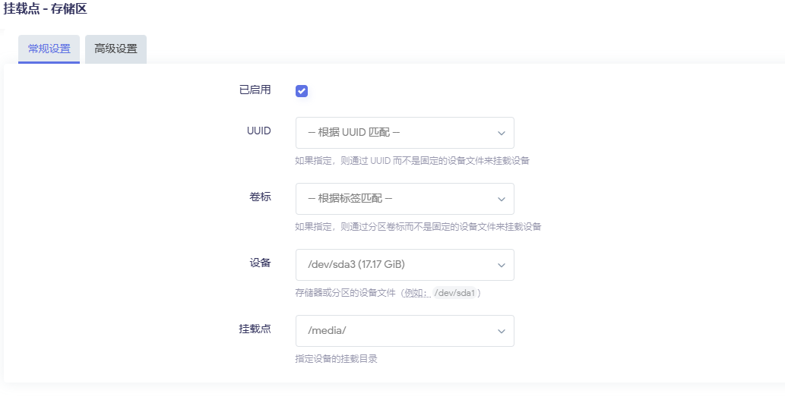
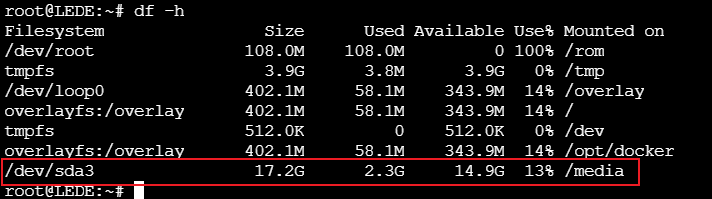
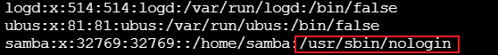
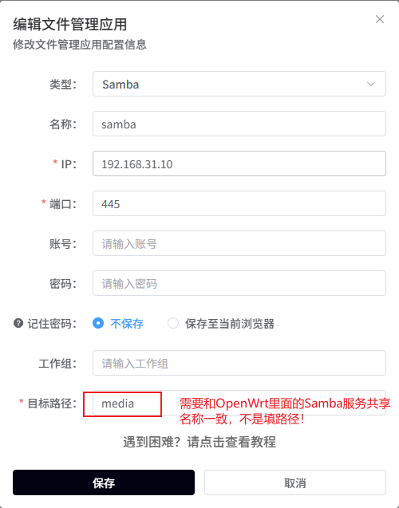
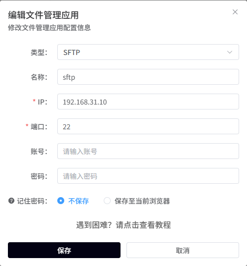
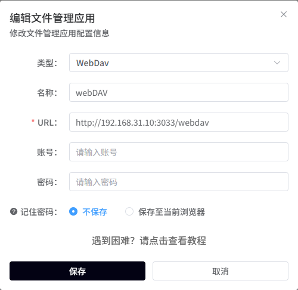
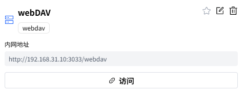
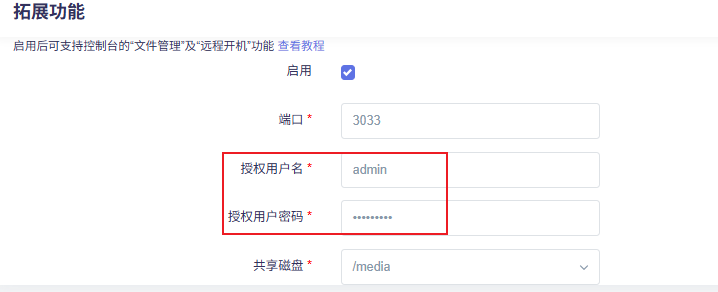

# OPENWRT系统 4.轻NAS玩法介绍
## 方案介绍与选择
让 OpenWrt 上的 轻NAS（局域网文件共享）能在外网访问，也就是说，从任何地方都能安全地访问你的家用存储。  这是最简单的视线自建私有云的方式，只需要开发板要USB接口，3.0接口更佳，就可以接入USB移动硬盘，化身具有轻NAS功能的OpenWrt设备，下面是实现的步骤分析。

## 文件共享
我们首先需要实现局域网文件共享功能，下面是常见的局域网共享场景推荐的方法，我们这里选择samba4，FileBrowser，webDAV，三种常见的共享方式都支持上，下面是具体的场景推荐的协议，可以根据自己场景灵活选择。

| 场景 | 推荐协议 |
| --- | --- |
| **Windows + Linux 通用文件共享** | Samba4 |
| **Linux 服务器挂载（如 Docker/K8s）** | NFS |
| **外网访问 NAS（配合 frp/Tailscale）** | FileBrowser（Web） |
| **最安全的传输（需要加密）** | SFTP |
| **iPhone/macOS 挂载网盘** | WebDAV |
| **媒体播放器（电视、DLNA）** | Samba4 或 NFS |


## 内网访问
在完成局域网网络共享后，要想实现轻NAS，还有个关键的功能，就是可以远程随时查看家里共享的文件，那么我们就需要实现内网穿透，下面是常见的内网穿透方法，及以对应的优缺点，我们选择使用frp（自建中转服务器）和现在比较流行的方法DDNSTO，前者需要自己有一个公网的服务器来做数据转发，后者操作简便只需要安装对应的插件，然后在易有云平台绑定自己的设备即可，由易有云服务商的服务器来做数据转发。

下面是常见的内网访问的方案对比：

| 方案 | 优点 | 缺点 | 安全性 |
| --- | --- | --- | --- |
| ✅ **公网 IP + 端口映射** | 简单直连，速度快 | 需要公网 IP（电信一般不给） | 较低（需防火墙） |
| 🌐 **DDNS + 公网 IP** | 适合动态 IP 用户 | 同样需要公网访问权限 | 中等 |
| 🔐 **ZeroTier / Tailscale VPN** | 无需公网 IP，自动穿透 NAT | 需第三方 VPN 控制平面 | 高 |
| ☁️ **frp / Cloudflare Tunnel** | 自建隧道，无需公网 IP | 依赖中间服务器 | 高 |
| **DDNSTO路由远程** | 简单操作，无需公网IP | 依赖第三方服务商 | 高 |


这里我们优先使用DDNSTO插件+插件提供商的云服务来实现轻NAS应用的内网穿透，也可在自己的VPS上自建frp云服务来实现轻NAS应用的内网穿透（适合高阶用户，需要配置很多参数和一些网络知识，当然也可以问AI来生成对应的配置），可根据自己的实际情况选择适合自己的方案。

# DDNSTO插件实现轻NAS应用
## 挂载硬盘
首先，我们需要将移动硬盘插入DshanPi A1的USB TYPE-A口上，然后配置对应的挂载目录，并且设置为每次开机自动挂载。这里使用U盘进行测试示例，移动硬盘配置方法完全一样。

首先，在 **系统 -> 挂载点 **页面，配置磁盘自动挂载的目录，并启用。



配置好后，重启设备，观察配置是否断电也有效，生效的话可以看到下面的打印：



/media的默认权限：


## 使能文件共享服务
### Samba共享
<font style={{color: 'rgb(64, 64, 64)', backgroundColor: 'rgb(252, 252, 252)'}}>Samba是在Linux系统上实现SMB协议的一个免费软件，我们可以使用支持SMB协议的终端设备， 来实现局域网内的文件共享。</font>

#### <font style={{color: 'rgb(64, 64, 64)', backgroundColor: 'rgb(252, 252, 252)'}}>安装Samba</font>
<font style={{color: 'rgb(64, 64, 64)', backgroundColor: 'rgb(252, 252, 252)'}}>首先，我们需要在编译前选中luci-app-samba4，或者刷机后通过在线安装ipk的方式安装samba4服务端程序到系统内。安装完成后，在页面： </font>**<font style={{color: 'rgb(64, 64, 64)', backgroundColor: 'rgb(252, 252, 252)'}}>服务 -> 网络共享</font>**<font style={{color: 'rgb(64, 64, 64)', backgroundColor: 'rgb(252, 252, 252)'}}> 可以看到对应的配置，如下图：</font>


#### <font style={{color: 'rgb(64, 64, 64)', backgroundColor: 'rgb(252, 252, 252)'}}>创建Samba用户</font>
<font style={{color: 'rgb(64, 64, 64)', backgroundColor: 'rgb(252, 252, 252)'}}>在进行网络共享时，我们应该避免使用root用户来登录samba服务器。 为此，我们单独创建一个用户来用于samba服务器的访问，并为它赋予文件夹的访问权限。</font>

打开 **服务 -> 终端 **，执行下面的命令，创建用户，并给用户开启共享目录的访问权限。

```bash
#添加名为samba的用户
useradd samba

#为用户samba创建smb服务的密码，这个和用户名的密码是单独的，可以设置不同
smbpasswd -a samba

#使用户samba获得共享目录的权限
#注意：只有ext4的文件系统才能修改权限，根据自己磁盘格式做对应调整
chown -R samba:samba /media/
```

修改/etc/passwd，配置samba用户无法登陆，下面是示例：



#### 修改samba4配置
<font style={{color: 'rgb(64, 64, 64)', backgroundColor: 'rgb(252, 252, 252)'}}>打开 </font>**<font style={{color: 'rgb(64, 64, 64)', backgroundColor: 'rgb(252, 252, 252)'}}>服务 -> 网络共享</font>**<font style={{color: 'rgb(64, 64, 64)', backgroundColor: 'rgb(252, 252, 252)'}}> 进行参数的配置。</font>

<font style={{color: 'rgb(64, 64, 64)', backgroundColor: 'rgb(252, 252, 252)'}}>选择接口为lan，可以使内网设备访问。勾选</font><font style={{color: 'rgb(64, 64, 64)', backgroundColor: 'rgb(252, 252, 252)'}}> </font>**<font style={{color: 'rgb(64, 64, 64)', backgroundColor: 'rgb(252, 252, 252)'}}>允许旧协议与身份验证。</font>**

<font style={{color: 'rgb(64, 64, 64)', backgroundColor: 'rgb(252, 252, 252)'}}>点击</font><font style={{color: 'rgb(64, 64, 64)', backgroundColor: 'rgb(252, 252, 252)'}}> </font>**<font style={{color: 'rgb(64, 64, 64)', backgroundColor: 'rgb(252, 252, 252)'}}>新增</font>**<font style={{color: 'rgb(64, 64, 64)', backgroundColor: 'rgb(252, 252, 252)'}}> </font><font style={{color: 'rgb(64, 64, 64)', backgroundColor: 'rgb(252, 252, 252)'}}>一个条目。</font>

+ <font style={{color: 'rgb(64, 64, 64)', backgroundColor: 'rgb(252, 252, 252)'}}>名称：共享时显示的文件夹名称，可随意设置，这里设置为media</font>
+ <font style={{color: 'rgb(64, 64, 64)', backgroundColor: 'rgb(252, 252, 252)'}}>路径：将要共享的文件夹路径，这里设置为上一章节挂载的目录</font>`<font style={{color: 'rgb(64, 64, 64)', backgroundColor: 'rgb(252, 252, 252)'}}>/media</font>`<font style={{color: 'rgb(64, 64, 64)', backgroundColor: 'rgb(252, 252, 252)'}}></font>
+ <font style={{color: 'rgb(64, 64, 64)', backgroundColor: 'rgb(252, 252, 252)'}}>允许用户：具有访问权限的用户，这里设置为刚刚创建的用户samba。</font>

<font style={{color: 'rgb(64, 64, 64)', backgroundColor: 'rgb(252, 252, 252)'}}>主要设置就是这些，保存并应用这些配置，其他的设置可自行探索其他高阶配置。</font>


### SFTP共享
#### 安装SFTP server
Dropbear 不支持 SFTP，但它支持 调用外部 sftp-server。

OpenWrt 已提供独立的 `openssh-sftp-server` 包：

```bash
opkg update
opkg install openssh-sftp-server
```

安装好后，sftp-server会放在：`/usr/lib/sftp-server`，这种方案适合需要有界面配置ssh秘钥的功能，但是也需要sftp server功能的场景，如果全部替换成openssh的全家桶，会因为OpenSSH 在 OpenWrt 中无官方 LuCI 配置界面，导致所以配置都要通过终端来完成。

#### 配置SFTP
在安装好后，不用做其他配置，都可以直接使用，例如用Xftp直接连接，就能看到系统内的文件。

### WebDAV共享
在安装完DDNSTO插件后，内部自带了一个轻量的webdav服务，不用再单独安装，直接使用即可。


## 配置内网穿透
首先登录DDNSTO控制台，注册登录后，记录用户Token，然后在板端配置DDNSTO远程控制页面，配置对应的参数，示例如下：


### 配置Samba远程访问
登录DDNSTO控制台，在文件管理栏下，点击添加文件管理，增加Samba协议的文件管理服务，填入对应参数，示例如下：

1. 添加配置



2. 点击连接
3. 输入Samba4配置中的用户和密码
4. 连接成功，可以看到对应目录下的文件，如下所示：


### 配置SFTP远程访问
登录DDNSTO控制台，在文件管理栏下，点击添加文件管理，增加Sftp协议的文件管理服务，填入对应参数，示例如下：

1. 添加配置



2. 点击访问


3. 输入ssh可以登录的用户名和密码，这里输入root对应的密码
4. 连接成功，可以看到对应目录下的文件，如下所示：


### 配置WebDAV远程访问
登录DDNSTO控制台，在文件管理栏下，点击添加文件管理，增加webdav协议的文件管理服务，填入对应参数，示例如下：

1. 添加配置



2. 点击访问



3. 输入路由器系统里面DDSNTO插件中，填写的授权用户名和密码到登录页面中



4. 连接成功，可以看到对应目录下的文件，如下所示：


### 配置远程访问路由器后台
登录DDNSTO控制台，选择外网域名栏，然后点击添加域名，按照下面示例填写配置：


配置完成后，点击外网域名栏，可以直接跳转到外网域名页面，这样就可以在任何地方远程配置局域网内的路由器了。


总结一下：DDNSTO插件把很多远程场景都整合起来了，轻度使用的话，付费用4Mbps的就可以了，延迟低，省去了各种复杂的环境搭建过程，和自建VPS的繁琐流程，推荐！

# 自建Frp云服务实现轻NAS应用
## 挂载硬盘并使能文件共享服务
自建方案中的挂载硬盘并使能文件共享服务，与使用DDNSTO插件方式完全一致，详细步骤轻查阅上一章节中的内容，此处不再累述。

## 配置内网穿透服务
这里需要配置的参数较多，并且需要考虑安全，需要涉及的配置项和证书等步骤较多，限于篇幅影响，这里不再详细描述，更多的请查阅frp的官方文档，搭建对应的内网穿透服务。

