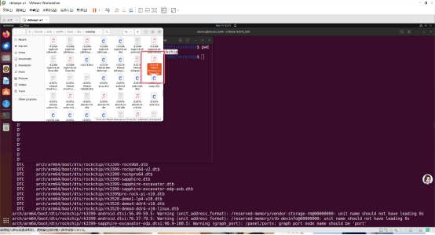
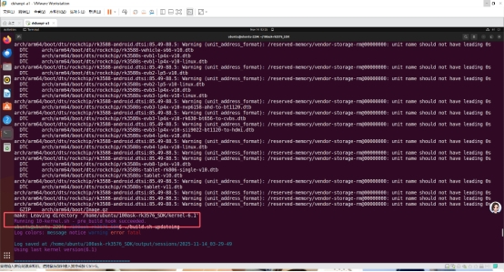
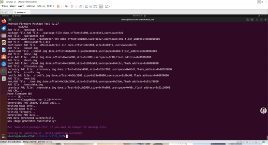
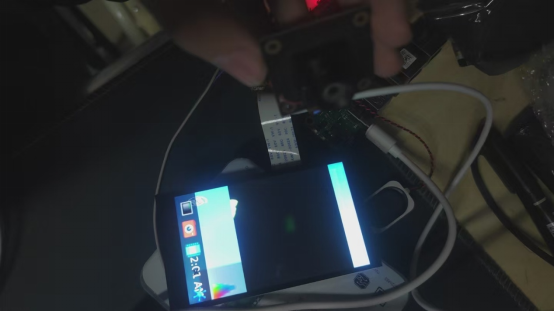
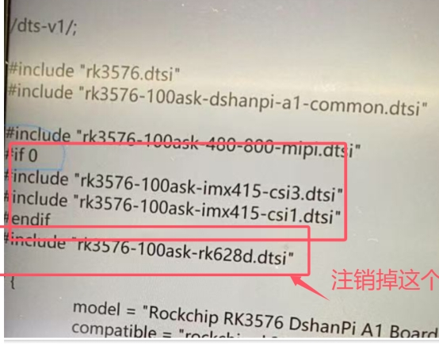

# [DshanPI-A1测评第一篇] 构建buildroot系统，调试IMX415摄像头和问题解决

## 板子介绍

DshanPi-A1是深圳百问网(韦东山团队)开发的一款高性能AI嵌入式开发板，基于瑞芯微RK3576芯片设计，专为AI教育、边缘计算和智能设备开发打造。


## 核心参数

| 参数项 | 规格 |
| --- | --- |
| 主控芯片 | 瑞芯微RK3576，8nm工艺，八核64位4×Cortex-A72(2.2GHz)+4×Cortex-A53(1.8GHz)瑞芯微电子股份有限公司 |
| AI算力 | 内置独立NPU，6TOPS计算能力，支持INT4/INT8/INT16混合运算 |
| 内存/存储 | 板载LPDDR4/4X内存支持eMMC、UFS存储扩展SD卡插槽 |
| 显示接口 | HDMIv2.1/eDPv1.3组合接口MIPIDSI(4通道)瑞芯微电子股份有限公司 |
| 视频解码 | 支持8K@30fps、4K@120fps高清视频 |
| 网络连接 | 支持WiFi6/BLE5.2(需外接模块)千兆网口(部分版本) |
| USB接口 | 多个USB3.0/2.0(Type-C和A型)瑞芯微电子股份有限公司 |
| 其他接口 | UART、I2C、SPI、GPIO、音频接口、CAN总线(部分版本) |
| 电源 | 支持30WPD快充(Type-C接口) |
| 尺寸 | 紧凑型设计(具体尺寸未公开) |

## 产品特点

### 1️⃣ 强大的AI处理能力

· 6TOPS独立NPU可流畅运行DeepSeek、Qwen等轻量级大语言模型

· 支持主流AI框架(TensorFlow、PyTorch、MXNet等)

· 适用于图像识别、语音处理、智能监控等AI应用开发

### 2️⃣ 丰富的多媒体性能

· 支持8K视频解码，可作为高清媒体中心

· HDMIIN功能可将开发板作为电脑副屏使用

· 内置音频编解码器，支持3.5mm音频输出

### 3️⃣ 完善的开发支持

· 搭载DShanOS系统(百问网自研Linux发行版)

· 配套免费教学课程和文档，降低学习门槛

· 支持Armbian系统，提供官方镜像下载

· 提供完整SDK和示例代码，便于二次开发

### 4️⃣ 灵活的扩展能力

· 引出全部GPIO接口，方便连接各类传感器和执行器

· 支持多种通信协议，适合IoT应用开发

· 可外接摄像头、显示屏、WiFi/4G模块等扩展功能

## 应用场景

**·** AI教育与学习：适合嵌入式AI课程教学和实验

**·** 边缘计算设备：可部署轻量级AI模型，实现本地智能决策

**·** 智能家居中控：构建高性能、低功耗的智能家居控制中心

**·** 工业自动化：适用于智能设备监控和数据采集

**·** 商业显示：支持8K显示，可用于广告机和信息发布系统

**·** AI视觉系统：可用于人脸识别、物体检测等场景

## 配套资源

**·** 官方文档站点：https://wiki.dshanpi.org/docs/dshanpi-a1/

**·** 开发社区：韦东山嵌入式开发者社区([100ask.org](https://100ask.org/))

**·** QQ技术交流群：798273638

**·** 免费教程：提供从基础到高级的AI开发课程

## buildroot SDK安装

### 1. 官方虚拟机获取

https://pan.baidu.com/s/15M8zuHOwl_SITl6cSk_7Vg?pwd=eaax提取码:eaax

### 2. 安装打开vmware,运行虚拟机

进去ubuntu系统，账号密码为ubuntu


### 3. 编译SDK

打开虚拟机，执行以下命令，进入SDK根目录：

```bash
cd ~/100ask-rk3576_SDK/
```


选择好配置文件：

```bash
./build.sh lunch
```


### 4. 编译

运行下列命令

```bash
./build.sh
```


等待编译结束


## 设备树修改打开摄像头节点

进入

```bash
/home/ubuntu/100ask-rk3576_SDK/kernel/arch/arm64/boot/dts/rockchip
```

修改图片中的文件




改为if1

回到sdk目录使用

```bash
./build.sh kernel
```




最后再

```bash
./build.sh updateimg
```




最后上传烧录（记得进入MASKROM）


## 成果展示



但是依然有bug但是屏幕摄像头色彩还是显示不对。

## 问题解决

最开始我是怀疑是摄像头的.xml（.json）没有加载出来，通过调试了好久仍没有结果但是没有结果

经过了多方面的调试最终我找到了解决方案:

### 第一步：从media-ctl输出发现关键线索

在`media-ctl -p -d /dev/media0`输出中，我注意到了这个关键信息：

```
entity 63: m00_b_rk628-csi9-0051 (1 pad, 1 link)
	type V4L2 subdev subtype Sensor flags 0
	device node name /dev/v4l-subdev2
	 pad 0: Source
	  [fmt:UYVY8_2X8/64x64@10000/600000 field:none]
	  -> "rockchip-csi2-dphy0":0 [ENABLED] ←注意这里的[ENABLED]
```


**分析点**：

· 系统中存在一个rk628-csi传感器实体

· 它的链路状态是[ENABLED]，意味着它正在占用CSI硬件资源

· 但分辨率只有64x64，这显然不是正常的摄像头输出

### 第二步：从dmesg日志发现IMX415驱动正常

从`dmesg | grep -i imx415`输出中：

```
[3.459474] imx415 3-0037: Detected imx415 id 0000e0
[3.515523] imx415 3-0037: Consider updating driver imx415 to match on endpoints
[3.515557] rockchip-csi2-dphy csi2-dphy3: dphy3 matches m01_f_imx415 3-0037: bustype 5
```

**分析点**：

· IMX415传感器被正确检测到（ID:0000e0）

· 驱动加载成功，甚至建立了与CSI-DPHY的匹配关系

· 但没有出现V4L2子设备创建成功的消息

### 第三步：从设备树结构推断硬件连接

从设备树片段：

```c
&csi2_dphy3 {
    port@0 {
        mipi_in_ucam3: endpoint@1 {
            remote-endpoint = <&imx415_out0>; ←IMX415连接到这里
            data-lanes = <1 2 3 4>;
        };
    };
    port@1 {
        csidphy3_out: endpoint@0 {
            remote-endpoint = <&mipi3_csi2_input>;
        };
    };
};
```

**分析点**：

· IMX415通过CSI-DPHY3连接到系统

· 但实际的media-ctl输出显示的是rockchip-csi2-dphy0被占用

· 这表明可能存在多个CSI接口的资源分配问题

### 第四步：从V4L2子设备缺失推断注册失败

运行检查命令时：

```bash
ls /sys/bus/i2c/devices/3-0037/v4l-subdev*/media_device/
# 输出：No such file or directory
```


**分析点**：

· I2C设备3-0037存在且驱动绑定正常

· 但没有创建对应的V4L2子设备

· 这通常意味着驱动探测成功，但后续的V4L2注册失败

### 第五步：连接所有线索形成完整画面

把以上线索串联起来：

**1.** **现象**：IMX415驱动加载但无V4L2设备

**2.** **证据1**：rk628-csi占用着CSI链路且状态为[ENABLED]

**3.** **证据2**：IMX415 I2C通信正常但媒体设备缺失

**4.** **证据3**：设备树显示两者可能共享CSI硬件资源

**逻辑推理**：

· 如果IMX415硬件故障→I2C探测应该失败

· 如果IMX415驱动问题→dmesg应该有错误日志

· 如果设备树配置错误→CSI匹配不会成功

**·** 唯一合理的解释：硬件资源被其他设备占用

### 第六步：开始实践



重新编译设备树烧录开发板完美运行！


## 总结

1. 嵌入式设备中硬件资源冲突是常见隐性问题，尤其多设备共享 CSI、I2C 等链路时，需重点排查设备占用状态。

2. 开发过程中应充分利用media-ctl、dmesg等工具，结合设备树配置分析，快速定位资源分配问题，避免盲目调试。

3. 对于驱动加载正常但功能异常的场景，优先排查硬件资源占用、V4L2 子设备注册等关键环节，缩小问题范围。

4. DshanPi-A1 开发板的 CSI 接口资源分配需通过设备树精准配置，修改后需严格遵循 Buildroot 编译流程重新生成镜像，确保配置生效。