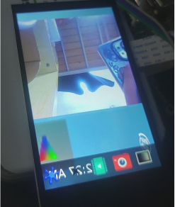

【DshanPI-A1第三篇】opencv调试与cpu直接推理识别手势

# 项目简介

前面我们已经调试好了摄像头和屏幕，终于可以开始我们的手势识别啦！

这次我会在RK3576 Buildroot系统上实现一个基于OpenCV的实时手势识别系统。系统能够识别五种手势（拳头/一指、二指、三指、四指、五指），并在屏幕上实时显示处理结果。

由于嵌入式系统的特殊性，我们将重点讲解如何在无X11、无OpenGL的Wayland环境下实现图像显示。

## 手势识别算法

### 原理

因为我们张开的手指之间会形成凹陷，通过计算凹陷点的角度和深度，可以准确识别手指数量。


### 1. 肤色检测

使用HSV色彩空间提取肤色区域：

```python
def detect_hand(self, frame):
    hsv = cv2.cvtColor(frame, cv2.COLOR_BGR2HSV)
    mask = cv2.inRange(hsv, [0, 30, 60], [25, 255, 255])  # 肤色范围

    # 形态学处理去噪
    kernel = np.ones((7, 7), np.uint8)
    mask = cv2.morphologyEx(mask, cv2.MORPH_CLOSE, kernel, iterations=3)
    mask = cv2.morphologyEx(mask, cv2.MORPH_OPEN, kernel, iterations=2)

    # 查找最大轮廓
    contours, _ = cv2.findContours(mask, cv2.RETR_EXTERNAL, cv2.CHAIN_APPROX_SIMPLE)
    if contours:
        c = max(contours, key=cv2.contourArea)
        if cv2.contourArea(c) > 3000:  # 面积阈值过滤噪声
            return c, mask
    return None, mask
```

### 2. 手指计数（凸包缺陷法）

通过检测手掌轮廓的凹陷点来识别手指：

```python
def recognize(self, contour):
    hull = cv2.convexHull(contour, returnPoints=False)
    defects = cv2.convexityDefects(contour, hull)

    finger_count = 0
    for i in range(defects.shape[0]):
        s, e, f, d = defects[i, 0]
        start = tuple(contour[s][0])  # 凸点1
        end = tuple(contour[e][0])    # 凸点2
        far = tuple(contour[f][0])    # 凹点(指间)

        # 计算角度判断是否为有效指尖
        a = np.linalg.norm(np.array(start) - np.array(end))
        b = np.linalg.norm(np.array(start) - np.array(far))
        c = np.linalg.norm(np.array(end) - np.array(far))
        angle = np.arccos((b**2 + c**2 - a**2) / (2 * b * c))
        if angle <= np.pi / 2.2 and d > 8000:  # 角度和深度阈值
            finger_count += 1

    gestures = ["Fist/One", "Two", "Three", "Four", "Five"]
    return gestures[finger_count]
```

## 如何显示OpenCV处理的图像

有了前面的理论知识还是不够的，我们还需要实践才可以啊！如何显示OpenCV处理的图像这是本教程的重点。通常我们用`cv2.imshow()`显示图像，但在无X11/OpenGL的嵌入式系统上，这个方法不可用。我们需要使用**GStreamer+Wayland**方案（这个也是我们上一篇文章的方案）。

### 方案探索过程

#### 方案A: stdin管道传输

最直观的想法是通过stdin管道传输图像数据：

```python
proc = subprocess.Popen(['gst-launch-1.0', 'fdsrc', '!', ...], stdin=subprocess.PIPE)
proc.stdin.write(frame_data)
```

**结果**：频繁出现Broken pipe错误，数据传输不稳定，这个我怀疑是管道超时自动关闭了又或者是我的格式不对。所以我直接尝试用fifo来传输原始的数据

#### 方案B: 命名管道(FIFO)传输原始数据

尝试用FIFO传输原始RGB数据：

```bash
mkfifo /tmp/video_fifo
```


很遗憾啊，这个太容易动不动就内核奔溃了。到这个时候我面临几个问题：如果我单纯的用命令行看识别结果，我就不知道我的摄像头能不能正常运行；但是如果OpenCV和GStreamer同时读取摄像头是不可以的（摄像头只能被一个进程读取）。后面又觉得GStreamer的显示不需要实时读取摄像头的画面，我只要显示OpenCV处理过的就好了。说干就干，于是我尝试直接在OpenCV里面把处理后的图像通过GStreamer传到屏幕上面，但技术不达标无果，管道不是报错就是关闭。停下来慢慢思考，最后有了方案C（搞到这步已经花费三天了）。

#### 方案C: 多文件序列

改变思路，将处理后的图像保存为JPEG文件序列：

```python
# Python端
cv2.imwrite(f'/dev/shm/gesture_frames/frame_{frame_index:03d}.jpg', processed)
```

```bash
# GStreamer端
gst-launch-1.0 multifilesrc location=frame_%03d.jpg loop=true ! jpegdec ! ...
```

**结果**：屏幕终于可以有变动了，开心坏了！但是效果很差，重影严重，而且因为是循环读出文件夹的图片导致一直在循环播放，影响美观和体验度。于是我打算利用FIFO，基于前面的思路升级为现在的方案：

**OpenCV处理完一帧 → 立即编码JPEG → 直接写入FIFO → GStreamer立即解码显示**

#### 方案D: FIFO+JPEG流（最终方案！）


```python
# Python端: 直接往FIFO写JPEG数据
fifo = open('/tmp/gesture_fifo', 'wb')
_, jpeg = cv2.imencode('.jpg', processed, [cv2.IMWRITE_JPEG_QUALITY, 85])
fifo.write(jpeg.tobytes())
fifo.flush()
```

```bash
# GStreamer端: 用jpegparse自动分割JPEG帧
gst-launch-1.0 filesrc location=/tmp/gesture_fifo ! jpegparse ! jpegdec ! ...
```

**补充：为什么JPEG流可行？**

1. JPEG格式自带开始(0xFFD8)和结束(0xFFD9)标记
2. GStreamer的`jpegparse`插件能自动识别边界，分割独立的JPEG帧
3. 避免了原始数据流的粘包问题

**结果**：总算是可以流畅地观察到画面了（流程不卡顿，甚至比直接点屏幕上的摄像头图标看摄像头画面都流畅）。演示视频和代码我会放在附件里面。


## 番外篇—摄像头第二次启动色彩偏绿偏暗

### 问题描述

我在RK3576 Buildroot系统上使用IMX415摄像头，通过GStreamer+Wayland显示画面。遇到了一个诡异的问题：**第一次启动摄像头色彩正常，但第二次启动后画面就变得偏暗偏绿**。


### 初步分析：对比启动日志

我首先对比了两次启动的kernel日志，发现了关键差异：

**第一次启动（色彩正常）**：
```
[20.528641] rkisp_hw 27c00000.isp: set isp clk = 594000000Hz
[20.529097] rkcif-mipi-lvds 3: stream[0] start streaming
[20.529317] rockchip-csi2-dphy 3: dphy3, data_rate_mbps 892
[20.529356] imx415 3-0037: s_stream: 1.3864x2192, hdr: 0, bpp: 10
```

**第二次启动（色彩异常）**：
```
[79.209321] rkisp_hw 27c00000.isp: set isp clk = 594000000Hz
[79.209967] rkisp rkisp-vir3: first params buf queue
[79.210051] rkisp rkisp-vir3: id: 0 no first iq setting cfg_upd: c000dfecc7fe473b en_upd: 0 en s: 5ffcc7fe473b
[79.210351] rkcif-mipi-lvds 3: stream[0] start streaming
```

关键发现：**第二次启动多了一条警告** `no first iq setting`。这说明ISP的图像质量参数没有正确加载，导致使用了错误的默认参数，造成色彩偏暗偏绿。

### 问题解决过程

#### 第一阶段：尝试硬件层面解决

一开始我以为是ISP驱动状态没有正确复位，尝试了几种方法：

1. **尝试unbind/bind ISP驱动**：
   ```bash
   echo "27c00000.isp" > /sys/bus/platform/drivers/rkisp_hw/unbind
   echo "27c00000.isp" > /sys/bus/platform/drivers/rkisp_hw/bind
   ```
   结果：**摄像头直接打不开了**，操作太激进导致驱动状态完全错乱。

2. **尝试使用v4l2-ctl重置、media-ctl reset**等方法，都没有解决问题。

#### 第二阶段：深入诊断系统配置

我开始系统性地诊断整个摄像头子系统：

```bash
# 查找IQ参数文件
find / -name "*imx415*.xml" -o -name "*imx415*.json" 2>/dev/null
# 结果: 找到了 /etc/iqfiles/imx415_CMK-OT2022-PX1_IR0147-50IRC-8M-F20.json

# 检查3A服务器
ps aux | grep rkaiq_3A_server
# 结果: 服务器正在运行

# 查看设备拓扑
v4l2-ctl --list-devices
# 确认 /dev/video-camera0 -> video11
```

**关键发现**：

- IQ参数文件存在
- 3A服务器(rkaiq_3A_server)正在运行
- 但为什么IQ参数没有加载?

#### 第三阶段：抓取3A服务器日志

我决定前台运行3A服务器，查看详细输出：

```bash
killall rkaiq_3A_server
/usr/bin/rkaiq_3A_server 2>&1 &
```

启动日志显示：
```
DBG: get rkisp-isp-subdev devname: /dev/v4l-subdev3
DBG: get rkisp-input-params devname: /dev/video18
DBG: get rkisp-statistics devname: /dev/video17
XCORE: K: cid[1] rk_aiq_uapi2_sysctl_init success. iq: /etc/iqfiles//imx415_CMK-OT2022-PX1_IR0147-50IRC-8M-F20.json
XCORE: K: cid[1] rk_aiq_uapi2_sysctl_prepare success. mode: 0
DBG: /dev/media1: wait stream start event..
```

**重大发现**：3A服务器实际上工作正常！IQ文件已经成功加载了！

这时我进行了第二次摄像头启动测试，观察到：
```
[625.216117] rkisp-vir3: waiting on params stream one event timeout
```

**真相大白**：第二次启动时，3A服务器超时无响应！

#### 第四阶段：找到根本原因

通过多次测试和日志分析，我终于理解了问题的本质：

**第一次启动流程（正常）**：
1. 系统启动时，3A服务器自动启动
2. 3A服务器加载IQ参数文件到内存
3. 3A服务器预先准备好IQ参数缓冲区
4. GStreamer启动摄像头
5. ISP请求IQ参数
6. 3A服务器立即响应并推送IQ参数
7. 色彩正常

**第二次启动流程（异常）**：
1. 停止第一次的GStreamer进程
2. 3A服务器还在运行，但进入了某种等待状态
3. IQ参数缓冲区已经被消费
4. 立即重启GStreamer
5. ISP请求IQ参数
6. **3A服务器来不及响应或状态异常**
7. ISP使用默认参数处理第一帧
8. 出现`no first iq setting`警告
9. 色彩偏暗偏绿

### 解决方案

问题的根源是：**3A服务器在摄像头第一次运行后进入异常状态，无法正确响应第二次启动的IQ参数请求**。

最终的解决方法很简单：**每次启动摄像头前，重启3A服务器**。

我编写了一个封装脚本：

```bash
#!/bin/sh

echo "=== Starting Camera with 3A Server Reset ==="

# 1. 停止所有摄像头进程
pkill -9 gst-launch 2>/dev/null

# 2. 重启3A服务器
killall rkaiq_3A_server 2>/dev/null
sleep 2
rm -f /tmp/.rkaiq_3A*

# 3. 启动3A服务器
/etc/init.d/S40rkaiq_3A start
echo "Waiting for 3A server to initialize..."
sleep 5

# 4. 确认3A服务器运行正常
if ! pgrep rkaiq_3A_server > /dev/null; then
    echo "ERROR: 3A server failed to start!"
    exit 1
fi

echo "3A server ready, starting camera..."

# 5. 启动摄像头
gst-launch-1.0 v4l2src device=/dev/video11 ! \
    video/x-raw,format=NV12,width=640,height=480,framerate=30/1 ! \
    waylandsink

echo "Camera stopped"
exit 0
```


### 验证结果



使用新脚本后，连续多次启动摄像头，色彩始终正常，日志中不再出现`no first iq setting`或超时错误。

### 经验总结

1. **对比日志是发现问题的关键**：通过对比正常和异常情况的日志，快速定位到`no first iq setting`这个关键线索

2. **系统性诊断**：不要盲目尝试，先检查各个组件（IQ文件、3A服务器、设备节点）的状态

3. **前台运行看详细日志**：很多后台服务的问题需要前台运行才能看到详细输出

4. **理解组件间的协作关系**：RK平台的摄像头涉及ISP驱动、3A服务器、IQ参数文件三者的协作，任何一个环节出问题都会导致异常

5. **状态管理很重要**：嵌入式系统的服务重启问题往往是状态机管理不当导致的，彻底重置是最可靠的方案。
