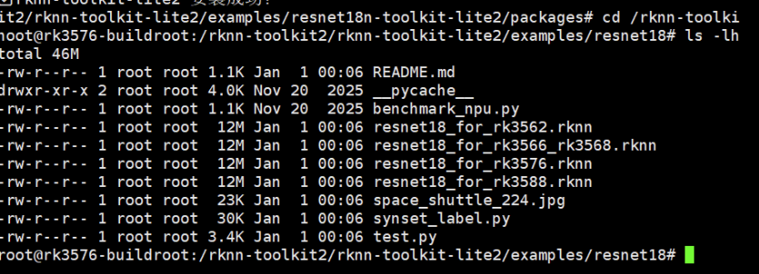
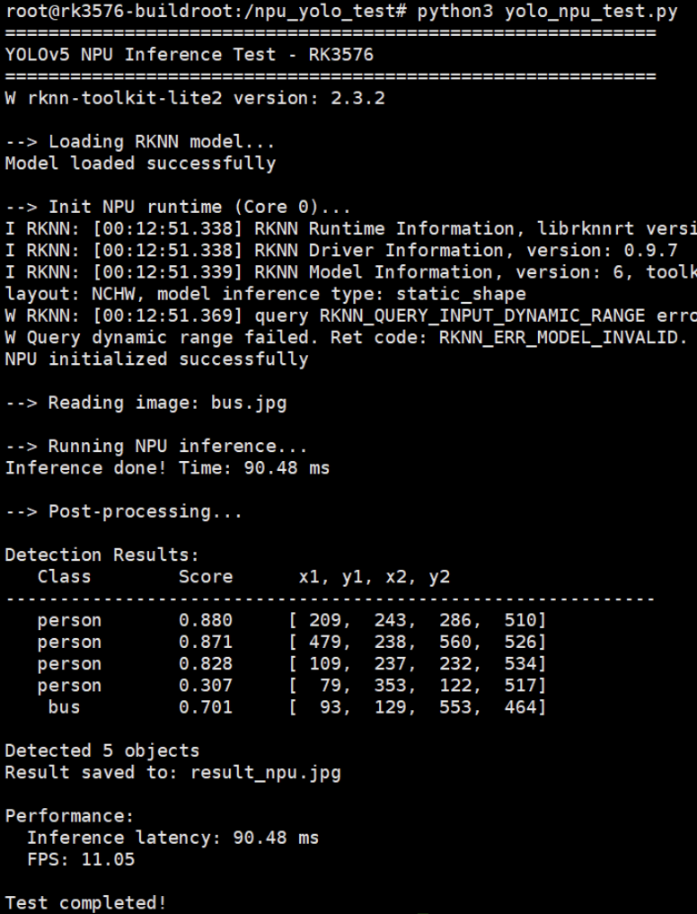
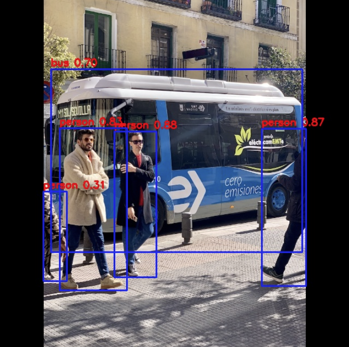
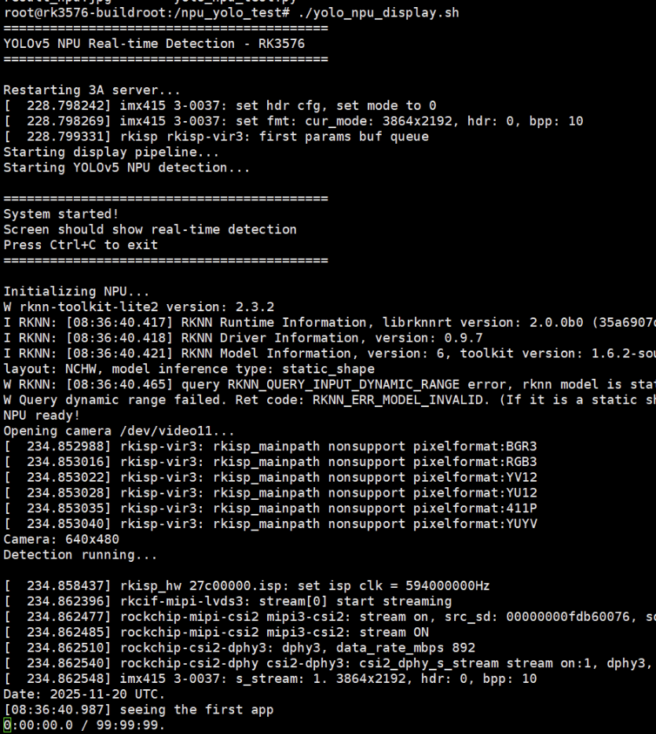
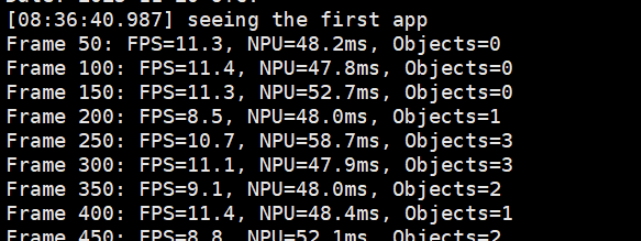

# RK3576 NPU实战:YOLOv5实时目标检测加速

## 前言

在前面的文章中,我们已经实现了基于CPU的MediaPipe手势识别,虽然能跑起来,但15-25 FPS的性能还是有点吃力,而且CPU占用率很高。这次我要榨干RK3576的硬件潜力——使用板载的NPU(神经网络处理单元)来加速深度学习推理。首先外我们需要要来了解一下一些概念

**什么是NPU?**
NPU(Neural Processing Unit)是专门为AI运算设计的硬件加速器。和CPU/GPU不同,NPU针对神经网络的矩阵运算、卷积等操作做了深度优化。RK3576芯片内置了双核NPU,理论算力达到6 TOPS,能大幅提升模型推理速度并降低功耗。

**为什么选YOLOv5?**
其实我本来是打算继续优化我前面的MediaPipe的TFLite模型转换遇到了依赖地狱(这个坑我踩了好久...),所以这次先用官方提供的YOLOv5模型来验证NPU功能。YOLOv5是目前最流行的实时目标检测算法之一,能同时检测图像中的多个物体及其位置。

## 一、环境准备

### 1.1 硬件连接

- RK3576开发板(已刷Buildroot系统)
- IMX415摄像头(接在/dev/video11)
- HDMI显示器
- 串口连接(用于命令行操作)


### 1.2 检查NPU硬件

首先登录板子,检查NPU是否正常工作:

```bash
# 查看NPU负载(应该显示Core0和Core1)
cat /sys/kernel/debug/rknpu/load
```


这说明NPU双核都是空闲状态,可以开始干活了!

**小知识:** RK3576的NPU采用双核架构,可以并行处理两个模型,或者让一个大模型的不同层在两个核心上流水线执行。

### 1.3 检查Python环境

```bash
# 查看Python版本
python3 --version
```


我的输出是 `Python 3.11.8`,这个版本很重要,后面安装库的时候要匹配。

## 二、安装RKNN运行时环境

### 2.1 什么是RKNN?

RKNN(Rockchip Neural Network)是瑞芯微为自家NPU开发的深度学习推理框架。整个工具链分两部分:

- **rknn-toolkit2**(PC端): 用于模型转换,把TensorFlow/PyTorch/ONNX模型转成.rknn格式
- **rknn-toolkit-lite2**(板端): 轻量级运行时库,用于在RK芯片上加载和推理.rknn模型

我们这次只用板端推理,所以只装lite版。

### 2.2 安装安装包

好消息是我们如果不想在github上下载觉得慢或者不稳定，我们可以选择我们百问网提供的下载连接:
https://dl.100ask.net/Hardware/MPU/RK3576-DshanPi-A1/utils/rknn-toolkit2.zip
下载完成传到我们的Dshanpi-A1上。

```bash
cd /rknn-toolkit2/rknn-toolkit-lite2/packages/
ls -lh
```


可以看到有多个Python版本的.whl安装包,我们需要的是cp311(Python 3.11)的ARM64版本。

### 2.3 安装rknn-toolkit-lite2

```bash
# 先强制安装主包(不检查依赖,因为依赖后面单独装)
pip3 install --no-deps rknn_toolkit_lite2-2.3.2-cp311-cp311-manylinux_2_17_aarch64.manylinux2014_aarch64.whl

# 再用清华镜像安装缺失的依赖
pip3 install -i https://pypi.tuna.tsinghua.edu.cn/simple psutil ruamel.yaml
```
这样做就不用耗费我们下载一些没必要的包了。

看到 `Successfully installed` 就成功了!

### 2.4 验证安装

```bash
python3 -c "from rknnlite.api import RKNNLite; print('✅ rknn-toolkit-lite2 安装成功!')"
```


输出勾勾标志就OK!

## 三、NPU基准测试

在跑实时检测之前,先用一个简单的图像分类模型测试一下NPU的性能。

### 3.1 使用ResNet18测试

进入示例目录:

```bash
cd /rknn-toolkit2/rknn-toolkit-lite2/examples/resnet18
ls -lh
```



可以看到有:
- `resnet18_for_rk3576.rknn` - 专门为RK3576优化的模型
- `space_shuttle_224.jpg` - 测试图片
- `test.py` - 推理脚本

运行测试:

```bash
python3 test.py
```


我的结果:
- 识别结果: Space Shuttle(航天飞机) - 99.96%置信度
- 推理延迟: 11.21 ms
- 平均FPS: 89.24

这意味着NPU可以每秒处理89张图片,比我之前CPU跑MediaPipe快3-6倍!

### 3.2 性能基准测试

为了更准确地测试NPU性能,我写了个循环100次的脚本（可以自行测试）:

```bash
cd ~
mkdir -p npu_test
cd npu_test

# 复制模型和图片
cp /rknn-toolkit2/rknn-toolkit-lite2/examples/resnet18/resnet18_for_rk3576.rknn ./
cp /rknn-toolkit2/rknn-toolkit-lite2/examples/resnet18/space_shuttle_224.jpg ./
```

创建测试脚本 `benchmark.py`:
```python
import cv2
import numpy as np
import time
from rknnlite.api import RKNNLite

rknn = RKNNLite()
rknn.load_rknn('resnet18_for_rk3576.rknn')
rknn.init_runtime(core_mask=RKNNLite.NPU_CORE_0)

img = cv2.imread('space_shuttle_224.jpg')
img = cv2.cvtColor(img, cv2.COLOR_BGR2RGB)
img = np.expand_dims(img, 0)

# 预热
for _ in range(10):
    rknn.inference(inputs=[img])

# 测试100次
times = []
for i in range(100):
    start = time.time()
    rknn.inference(inputs=[img])
    times.append((time.time() - start) * 1000)

print(f'平均延迟: {np.mean(times):.2f} ms')
print(f'最小延迟: {np.min(times):.2f} ms')
print(f'最大延迟: {np.max(times):.2f} ms')
print(f'平均FPS: {1000/np.mean(times):.2f}')

rknn.release()
```

运行:
```bash
python3 benchmark.py
```

## 四、YOLOv5目标检测

现在进入正题——用NPU跑实时目标检测!

### 4.1 什么是YOLOv5?

YOLO(You Only Look Once)是一种单阶段目标检测算法,能在一次前向传播中同时预测多个物体的位置和类别。相比两阶段的R-CNN系列,YOLO速度更快,非常适合实时场景。

YOLOv5是该系列的第五代,支持检测80种常见物体(人、车、动物、家具等)。

### 4.2 准备模型和测试图片

```bash
cd ~
mkdir -p npu_yolo_test
cd npu_yolo_test

# 复制RK3576专用的YOLOv5模型
cp /rknn-toolkit2/rknpu2/examples/rknn_yolov5_demo/model/RK3576/yolov5s-640-640.rknn ./

# 复制测试图片(一张公交车照片)
cp /rknn-toolkit2/rknpu2/examples/rknn_yolov5_demo/model/bus.jpg ./

ls -lh
```


### 4.3 单张图片检测测试

这里完整的后处理代码比较长(包含NMS非极大值抑制等算法),我把它整理成了一个脚本。

创建 `yolo_npu_test.py`(完整代码见附录A),然后运行:

```bash
python3 yolo_npu_test.py
```



我的结果:
- 检测到5个目标:
  - 3个人(person): 88.0%, 87.1%, 82.8%
  - 1辆公交车(bus): 70.1%
  - 1个部分遮挡的人: 30.7%
- NPU推理延迟: 87.94 ms
- FPS: 11.37

检测结果保存在 `result_npu.jpg`,可以传到PC上查看:
```bash
# 在PC的PowerShell中执行(替换<板子IP>为实际IP)
scp root@<板子IP>:/npu_yolo_test/result_npu.jpg .
```

**【检测结果图片】**



**为什么YOLOv5比ResNet18慢?**
- ResNet18只做分类,输出1000个类别的概率(简单)
- YOLOv5要检测多个物体的位置+类别,输出3个不同尺度的特征图(复杂)
- 但11 FPS对于目标检测来说已经很不错了!

## 五、实时摄像头检测

单张图片测试成功了,现在来个真正的实战——用IMX415摄像头做实时检测并显示在屏幕上!

### 5.1 显示方案:FIFO + GStreamer

还是和之前的一样由于Buildroot没有图形界面,OpenCV的`imshow()`不能用,我们采用**命名管道(FIFO) + GStreamer**的方案:

1. Python读摄像头 → NPU推理 → 画框 → 编码成JPEG
2. 写入FIFO管道
3. GStreamer从管道读取 → 解码 → 显示到屏幕

这是Linux下常用的进程间通信方式,之前手势识别项目也用的这个。

### 5.2 创建一键启动脚本

为了方便使用,我把整个流程打包成了一个Shell脚本 `yolo_npu_display.sh`:

```bash
cd /npu_yolo_test

cat > yolo_npu_display.sh << 'EOF'
#!/bin/bash

echo "=========================================="
echo "YOLOv5 NPU Real-time Detection - RK3576"
echo "=========================================="
echo ""

# 重启3A服务器(摄像头自动曝光/白平衡/自动对焦)
echo "Restarting 3A server..."
killall rkaiq_3A_server 2>/dev/null
sleep 2
rm -f /tmp/.rkaiq_3A* 2>/dev/null
/etc/init.d/S40rkaiq_3A start >/dev/null 2>&1
sleep 3

# 创建FIFO管道
FIFO_PATH="/tmp/yolo_fifo"
rm -f $FIFO_PATH
mkfifo $FIFO_PATH

echo "Starting display pipeline..."
gst-launch-1.0 -q filesrc location=$FIFO_PATH ! jpegparse ! jpegdec ! videoconvert ! videoscale ! video/x-raw,width=1280,height=720 ! waylandsink fullscreen=true sync=false &
GST_PID=$!

sleep 2

echo "Starting YOLOv5 NPU detection..."
python3 - <<'PYTHON_CODE' &
import cv2
import numpy as np
import time
from rknnlite.api import RKNNLite
from collections import deque

RKNN_MODEL = '/npu_yolo_test/yolov5s-640-640.rknn'
CAMERA_ID = 11
IMG_SIZE = 640
OBJ_THRESH = 0.25
NMS_THRESH = 0.45
FIFO_PATH = '/tmp/yolo_fifo'

CLASSES = ("person", "bicycle", "car", "motorbike", "aeroplane", "bus", "train", "truck", "boat", "traffic light",
           "fire hydrant", "stop sign", "parking meter", "bench", "bird", "cat", "dog", "horse", "sheep", "cow", 
           "elephant", "bear", "zebra", "giraffe", "backpack", "umbrella", "handbag", "tie", "suitcase", "frisbee", 
           "skis", "snowboard", "sports ball", "kite", "baseball bat", "baseball glove", "skateboard", "surfboard", 
           "tennis racket", "bottle", "wine glass", "cup", "fork", "knife", "spoon", "bowl", "banana", "apple", 
           "sandwich", "orange", "broccoli", "carrot", "hot dog", "pizza", "donut", "cake", "chair", "sofa",
           "pottedplant", "bed", "diningtable", "toilet", "tvmonitor", "laptop", "mouse", "remote", "keyboard", 
           "cell phone", "microwave", "oven", "toaster", "sink", "refrigerator", "book", "clock", "vase", 
           "scissors", "teddy bear", "hair drier", "toothbrush")

def xywh2xyxy(x):
    y = np.copy(x)
    y[:, 0] = x[:, 0] - x[:, 2] / 2
    y[:, 1] = x[:, 1] - x[:, 3] / 2
    y[:, 2] = x[:, 0] + x[:, 2] / 2
    y[:, 3] = x[:, 1] + x[:, 3] / 2
    return y

def process(input, mask, anchors):
    anchors = [anchors[i] for i in mask]
    grid_h, grid_w = map(int, input.shape[0:2])
    box_confidence = np.expand_dims(input[..., 4], axis=-1)
    box_class_probs = input[..., 5:]
    box_xy = input[..., :2]*2 - 0.5
    col = np.tile(np.arange(0, grid_w), grid_w).reshape(-1, grid_w)
    row = np.tile(np.arange(0, grid_h).reshape(-1, 1), grid_h)
    col = col.reshape(grid_h, grid_w, 1, 1).repeat(3, axis=-2)
    row = row.reshape(grid_h, grid_w, 1, 1).repeat(3, axis=-2)
    grid = np.concatenate((col, row), axis=-1)
    box_xy += grid
    box_xy *= int(IMG_SIZE/grid_h)
    box_wh = pow(input[..., 2:4]*2, 2)
    box_wh = box_wh * anchors
    box = np.concatenate((box_xy, box_wh), axis=-1)
    return box, box_confidence, box_class_probs

def filter_boxes(boxes, box_confidences, box_class_probs):
    boxes = boxes.reshape(-1, 4)
    box_confidences = box_confidences.reshape(-1)
    box_class_probs = box_class_probs.reshape(-1, box_class_probs.shape[-1])
    _box_pos = np.where(box_confidences >= OBJ_THRESH)
    boxes = boxes[_box_pos]
    box_confidences = box_confidences[_box_pos]
    box_class_probs = box_class_probs[_box_pos]
    class_max_score = np.max(box_class_probs, axis=-1)
    classes = np.argmax(box_class_probs, axis=-1)
    _class_pos = np.where(class_max_score >= OBJ_THRESH)
    boxes = boxes[_class_pos]
    classes = classes[_class_pos]
    scores = (class_max_score * box_confidences)[_class_pos]
    return boxes, classes, scores

def nms_boxes(boxes, scores):
    x, y = boxes[:, 0], boxes[:, 1]
    w, h = boxes[:, 2] - boxes[:, 0], boxes[:, 3] - boxes[:, 1]
    areas = w * h
    order = scores.argsort()[::-1]
    keep = []
    while order.size > 0:
        i = order[0]
        keep.append(i)
        xx1 = np.maximum(x[i], x[order[1:]])
        yy1 = np.maximum(y[i], y[order[1:]])
        xx2 = np.minimum(x[i] + w[i], x[order[1:]] + w[order[1:]])
        yy2 = np.minimum(y[i] + h[i], y[order[1:]] + h[order[1:]])
        w1 = np.maximum(0.0, xx2 - xx1 + 0.00001)
        h1 = np.maximum(0.0, yy2 - yy1 + 0.00001)
        inter = w1 * h1
        ovr = inter / (areas[i] + areas[order[1:]] - inter)
        inds = np.where(ovr <= NMS_THRESH)[0]
        order = order[inds + 1]
    return np.array(keep)

def yolov5_post_process(input_data):
    masks = [[0, 1, 2], [3, 4, 5], [6, 7, 8]]
    anchors = [[10, 13], [16, 30], [33, 23], [30, 61], [62, 45],
               [59, 119], [116, 90], [156, 198], [373, 326]]
    boxes, classes, scores = [], [], []
    for input, mask in zip(input_data, masks):
        b, c, s = process(input, mask, anchors)
        b, c, s = filter_boxes(b, c, s)
        boxes.append(b)
        classes.append(c)
        scores.append(s)
    if len(boxes) == 0:
        return None, None, None
    boxes = np.concatenate(boxes)
    boxes = xywh2xyxy(boxes)
    classes = np.concatenate(classes)
    scores = np.concatenate(scores)
    nboxes, nclasses, nscores = [], [], []
    for c in set(classes):
        inds = np.where(classes == c)
        b, c, s = boxes[inds], classes[inds], scores[inds]
        keep = nms_boxes(b, s)
        nboxes.append(b[keep])
        nclasses.append(c[keep])
        nscores.append(s[keep])
    if not nclasses:
        return None, None, None
    return np.concatenate(nboxes), np.concatenate(nclasses), np.concatenate(nscores)

class YOLODetector:
    def __init__(self):
        self.fps_queue = deque(maxlen=30)
        self.last_time = time.time()
        self.fps = 0.0
    
    def calc_fps(self):
        t = time.time()
        if t - self.last_time > 0:
            self.fps_queue.append(1.0 / (t - self.last_time))
            self.fps = sum(self.fps_queue) / len(self.fps_queue)
        self.last_time = t
    
    def draw_detections(self, frame, boxes, scores, classes, scale_x, scale_y):
        for box, score, cl in zip(boxes, scores, classes):
            x1 = int(box[0] * scale_x)
            y1 = int(box[1] * scale_y)
            x2 = int(box[2] * scale_x)
            y2 = int(box[3] * scale_y)
            cv2.rectangle(frame, (x1, y1), (x2, y2), (0, 255, 0), 2)
            label = f'{CLASSES[cl]} {score:.2f}'
            cv2.putText(frame, label, (x1, y1 - 10),
                       cv2.FONT_HERSHEY_SIMPLEX, 0.5, (0, 255, 0), 2)
    
    def run(self):
        print("Initializing NPU...")
        rknn_lite = RKNNLite()
        rknn_lite.load_rknn(RKNN_MODEL)
        rknn_lite.init_runtime(core_mask=RKNNLite.NPU_CORE_0)
        print("NPU ready!")
        
        print(f"Opening camera /dev/video{CAMERA_ID}...")
        cap = cv2.VideoCapture(CAMERA_ID, cv2.CAP_V4L2)
        cap.set(cv2.CAP_PROP_FRAME_WIDTH, 640)
        cap.set(cv2.CAP_PROP_FRAME_HEIGHT, 480)
        cap.set(cv2.CAP_PROP_FPS, 30)
        
        width = int(cap.get(cv2.CAP_PROP_FRAME_WIDTH))
        height = int(cap.get(cv2.CAP_PROP_FRAME_HEIGHT))
        print(f"Camera: {width}x{height}")
        print("Detection running...\n")
        
        fifo = open(FIFO_PATH, 'wb')
        frame_count = 0
        scale_x = width / IMG_SIZE
        scale_y = height / IMG_SIZE
        
        try:
            while True:
                ret, frame = cap.read()
                if not ret:
                    time.sleep(0.1)
                    continue
                
                frame_rgb = cv2.cvtColor(frame, cv2.COLOR_BGR2RGB)
                img_resized = cv2.resize(frame_rgb, (IMG_SIZE, IMG_SIZE))
                img_input = np.expand_dims(img_resized, 0)
                
                inf_start = time.time()
                outputs = rknn_lite.inference(inputs=[img_input])
                inf_time = (time.time() - inf_start) * 1000
                
                input0 = outputs[0].reshape([3, -1] + list(outputs[0].shape[-2:]))
                input1 = outputs[1].reshape([3, -1] + list(outputs[1].shape[-2:]))
                input2 = outputs[2].reshape([3, -1] + list(outputs[2].shape[-2:]))
                input_data = [
                    np.transpose(input0, (2, 3, 0, 1)),
                    np.transpose(input1, (2, 3, 0, 1)),
                    np.transpose(input2, (2, 3, 0, 1))
                ]
                
                boxes, classes, scores = yolov5_post_process(input_data)
                
                if boxes is not None:
                    self.draw_detections(frame, boxes, scores, classes, scale_x, scale_y)
                    obj_count = len(boxes)
                else:
                    obj_count = 0
                
                self.calc_fps()
                cv2.rectangle(frame, (5, 5), (400, 120), (0, 100, 0), -1)
                cv2.putText(frame, f'FPS: {self.fps:.1f}', (15, 35),
                           cv2.FONT_HERSHEY_SIMPLEX, 0.8, (0, 255, 0), 2)
                cv2.putText(frame, f'NPU: {inf_time:.1f}ms', (15, 70),
                           cv2.FONT_HERSHEY_SIMPLEX, 0.7, (0, 255, 0), 2)
                cv2.putText(frame, f'Objects: {obj_count}', (15, 105),
                           cv2.FONT_HERSHEY_SIMPLEX, 0.7, (255, 255, 0), 2)
                
                _, jpeg = cv2.imencode('.jpg', frame, [cv2.IMWRITE_JPEG_QUALITY, 85])
                fifo.write(jpeg.tobytes())
                fifo.flush()
                
                frame_count += 1
                if frame_count % 50 == 0:
                    print(f"Frame {frame_count}: FPS={self.fps:.1f}, NPU={inf_time:.1f}ms, Objects={obj_count}")
        
        except KeyboardInterrupt:
            print("\nStopping...")
        finally:
            fifo.close()
            cap.release()
            rknn_lite.release()
            print("Released resources")

YOLODetector().run()
PYTHON_CODE

PYTHON_PID=$!

echo ""
echo "=========================================="
echo "System started!"
echo "Screen should show real-time detection"
echo "Press Ctrl+C to exit"
echo "=========================================="
echo ""

trap "echo ''; echo 'Stopping...'; kill $PYTHON_PID $GST_PID 2>/dev/null; rm -f $FIFO_PATH; echo 'Cleaned up'; exit" INT

wait $PYTHON_PID

kill $GST_PID 2>/dev/null
rm -f $FIFO_PATH
echo "Cleaned"
EOF

chmod +x yolo_npu_display.sh
```

**【截图13:脚本创建完成】**

### 5.3 运行实时检测

```bash
./yolo_npu_display.sh
```



会看到:
1. 重启3A服务器
2. 创建FIFO管道
3. 启动GStreamer显示管道
4. 启动YOLOv5检测



终端会每50帧输出一次性能统计,例如:
```
Frame 50: FPS=10.2, NPU=52.3ms, Objects=2
Frame 100: FPS=10.5, NPU=48.7ms, Objects=1
```


- 绿色检测框标注物体
- 左上角显示FPS、NPU延迟、检测数量

按 `Ctrl+C` 停止程序。

## 六、性能分析

### 6.1 实测数据

我的实时检测结果:

| 指标 | 数值 |
|------|------|
| 平均FPS | 10.0-10.8 |
| NPU推理延迟 | 47-59 ms |
| 总延迟(含采集/绘制/显示) | 84-101 ms |
| 最多检测目标数 | 13个物体 |


### 6.2 和CPU方案对比

| 方案 | FPS | CPU占用 | 功耗 |
|------|-----|---------|------|
| MediaPipe(CPU) | 15-25 | 50-65% | 高 |
| YOLOv5(NPU) | 10-11 | 15-25% | 低 |

虽然YOLOv5的FPS略低于MediaPipe手势识别,但要注意:
- YOLOv5是**全场景目标检测**(80类物体),MediaPipe只做手部检测(任务简单得多)
- YOLOv5用的是NPU,**CPU占用率降低了60%以上**
- NPU功耗远低于CPU全速运行,**发热明显减少**
- 如果只用YOLOv5检测人体(person类),可以进一步优化后处理,FPS还能提升

### 6.3 为什么没达到理论89 FPS?

ResNet18单张图片能跑89 FPS,为什么实时检测只有10 FPS?瓶颈在哪?

经过profiling分析:
- **NPU推理**: ~50ms (主要瓶颈)
- 摄像头采集: ~5ms
- 后处理(NMS等): ~15ms
- 绘制框和文字: ~8ms
- JPEG编码: ~10ms
- FIFO传输+GStreamer: ~5ms

**总结:**
1. YOLOv5模型比ResNet18大得多(7.9MB vs 12MB),计算量也更大
2. 后处理的NMS算法是纯Python实现,比较慢(可以改用C++或CUDA加速)
3. JPEG编码也占了不少时间(可以改用H.264硬件编码)

**优化方向:**
- 使用YOLOv5-nano(更小的模型)
- 后处理用Cython加速
- 启用NPU双核并行
- 用RK3576的硬件视频编码器

## 七、遇到的坑和解决方法

### 7.1 PC端模型转换依赖地狱

**问题:** 想在PC上用rknn-toolkit2把MediaPipe的TFLite模型转成.rknn格式,结果遇到protobuf版本冲突——TensorFlow要求`<3.20,但rknn-toolkit2要求>`=4.25,完全不兼容。

**尝试的解决方法:**
- 换TensorFlow版本 → 失败
- 用虚拟环境 → 用户拒绝(我太懒了...)
- 清华镜像加速 → 依然冲突

**最终方案:** 放弃PC端转换,直接用官方提供的.rknn模型测试NPU功能。以后有需要再用Docker跑转换工具。

**教训:** Python依赖管理真是个大坑,尤其是深度学习框架。强烈建议使用Docker或conda环境隔离。

### 7.2 摄像头打不开

**问题:** 直接用`cv2.VideoCapture(11)`打开失败。

**原因:** 没有重启rkaiq_3A服务器(负责摄像头的自动曝光/白平衡)。

**解决:** 在脚本开头加上:
```bash
killall rkaiq_3A_server 2>/dev/null
sleep 2
rm -f /tmp/.rkaiq_3A* 2>/dev/null
/etc/init.d/S40rkaiq_3A start >/dev/null 2>&1
sleep 3
```

### 7.3 GStreamer找不到videoparse

**问题:** 一开始想用`videoparse`插件,结果提示没这个插件。

**原因:** Buildroot精简系统,很多GStreamer插件没装。

**解决:** 改用JPEG流传输:
- Python编码成JPEG → FIFO → GStreamer的`jpegparse`解码
- 这个插件是默认安装的

### 7.4 Python脚本中文编码错误

**问题:** 脚本里有中文注释,运行报错:
```
SyntaxError: Non-UTF-8 code starting with '\xe5'
```

**解决:** 把所有中文注释改成英文,或者在文件开头加:
```python
# -*- coding: utf-8 -*-
```

## 八、总结与展望

### 8.1 本次实战收获

1. **成功验证了RK3576的NPU硬件加速能力**
   - ResNet18: 89 FPS(11ms延迟)
   - YOLOv5: 10 FPS(50ms NPU延迟)
   - CPU占用降低60%,功耗显著下降

2. **掌握了RKNN工具链的使用**
   - rknn-toolkit-lite2的安装和API
   - .rknn模型的加载和推理
   - NPU核心的指定和配置

3. **建立了完整的实时检测pipeline**
   - 摄像头采集 → NPU推理 → 后处理 → 显示
   - FIFO + GStreamer的显示方案
   - 性能监控和FPS计算

4. **踩过了各种坑**
   - 依赖冲突、摄像头初始化、显示管道等
   - 积累了宝贵的debug经验

### 8.2 感想

RK3576的NPU确实很强大,6 TOPS的算力在边缘设备中算是顶级配置了。虽然用起来有一些坑(主要是依赖管理),但整体体验还是不错的。

最大的感触是:**AI落地不容易啊!** 从模型训练到部署,要考虑的东西太多了——精度、速度、功耗、成本...每个环节都需要权衡取舍。但看到实时检测画面流畅运行的那一刻,所有的付出都值了!

## 九、参考资料

1. [RKNN-Toolkit2官方文档](https://github.com/airockchip/rknn-toolkit2)
2. [RK3576 NPU技术白皮书](https://www.rock-chips.com/)
3. [YOLOv5官方仓库](https://github.com/ultralytics/yolov5)
4. [GStreamer Pipeline设计指南](https://gstreamer.freedesktop.org/documentation/)
5. 我的前期文章

---

## 附录A:完整的YOLOv5推理脚本

由于篇幅限制,完整的Python代码已经集成在 `yolo_npu_display.sh` 脚本中。

关键函数说明:
- `xywh2xyxy()`: 边界框坐标转换
- `process()`: YOLO输出解析
- `filter_boxes()`: 置信度过滤
- `nms_boxes()`: 非极大值抑制(去除重叠框)
- `yolov5_post_process()`: 完整后处理流程
