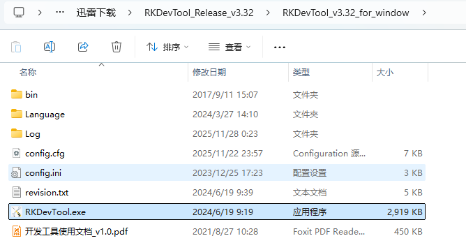

# 单板和SOC简介
<font style={{color: 'rgb(28, 30, 33)'}}>DShanPl-A1 Education专为人工智能教育及项目开发深度优化，基于瑞芯微的RK3576处理器设计，集成了4个Cortex-A72和4个Cortex-A53及支持NEON指令集,支持8K@30fps的H.265,VP9AVS2 和 AV1解码器,4k@60fps的H.264解码器和4K@60fps的AV1解码器;还支持4K@60fps的H.264和H.265编码器。内置3D GPU,能够完全兼容OpenGl ES1.1/2.0/3.2、0penCL2.0和Vulkan 1.1。内嵌的NPU算力高达6TopS,支持INT4/INT8/INT16/FP16混合运算。</font>


板子有丰富的外设接口，板载SOC性能强劲，可以提供<font style={{color: 'rgb(28, 30, 33)'}}>中高端性能 SBC（Single Board Computer-卡片电脑）体验，智能路由器等，下面是一些对应的应用场景示例：</font>

+ <font style={{color: 'rgb(64, 64, 64)', backgroundColor: 'rgb(252, 252, 252)'}}>智能单机小电脑，具备办公，教育，编程开发，嵌入式开发等功能</font>
+ <font style={{color: 'rgb(64, 64, 64)', backgroundColor: 'rgb(252, 252, 252)'}}>个人git仓库，服务器，nas，软路由，私有云</font>
+ <font style={{color: 'rgb(64, 64, 64)', backgroundColor: 'rgb(252, 252, 252)'}}>机器人，无人机等项目</font>
+ <font style={{color: 'rgb(64, 64, 64)', backgroundColor: 'rgb(252, 252, 252)'}}>电视机盒子，智能家居中枢，家庭安防监控，智能音箱等智能设备</font>

# OpenWrt介绍
<font style={{color: 'rgb(28, 30, 33)'}}>OpenWrt 是一个基于 Linux 的开源嵌入式操作系统，主要用于路由器等网络设备。与传统路由器固件相比，OpenWrt 不是固定功能的固件，而是可自由扩展的软件平台，用户可以通过 opkg 软件包系统安装各种组件，实现路由、防火墙、VPN、NAS、内网穿透等多种功能。它提供 SSH 命令行与 LuCI Web 界面，配置灵活，支持 VLAN、IPv6、QoS、多 WAN 等高级网络特性。OpenWrt 结构清晰、模块化，核心包括 UCI 配置系统、netifd 网络管理、dnsmasq、hostapd 和防火墙框架等。凭借高度可定制性和强大的社区支持，OpenWrt 适用于家庭、企业网络以及二次开发，是打造高功能路由器和网络应用平台的理想选择。  </font>

<font style={{color: 'rgb(28, 30, 33)'}}>Lean 的 OpenWrt LEDE 仓库是一个由 Lean 所维护的开源项目，旨在为 OpenWrt 系统提供稳定、高效且功能丰富的支持。作为 OpenWrt 和 LEDE 项目的结合，Lean 版本为广泛的路由器和嵌入式设备提供了优化的固件及增强功能，广泛应用于家庭、企业及实验室环境。Lean 仓库包含了来自全球开源社区的众多补丁、优化、驱动程序以及各种第三方应用，极大地提升了 OpenWrt 系统的可定制性和性能。</font>

本次项目的目标是基于 DShanPl-A1 Education 单板构建一个轻量化 NAS（轻NAS）应用。最佳实现路径是采用成熟且高度可扩展的开源路由系统 OpenWrt LEDE。借助 OpenWrt 完整的 Linux 环境与丰富的生态插件，我们能够在系统中按需安装存储服务、网络服务、内网穿透、安全访问等功能模块。通过这些插件之间的协作配置，再结合 OpenWrt 强大的网络管理能力，即可构建一个基于软路由架构的轻NAS 方案。

# 开发环境
## 环境说明
编译openwrt官方推荐使用原生<font style={{color: 'rgb(51, 51, 51)'}}> </font>[<font style={{color: 'rgb(51, 122, 183)'}}>GNU/Linux environment</font>](https://openwrt.org/docs/guide-developer/toolchain/install-buildsystem)<font style={{color: 'rgb(51, 51, 51)'}}>，但是也支持使用Windows WSL的模式进行编译。在Windows上使用WSL的开发环境，不用去配置虚拟机环境，在某些限制按照vmware的环境下也可以使用，估笔者的编译和开发环境大多数优先使用WSL进行。</font>

WSL（Windows Subsystem for Linux）在 Windows 上提供原生级 Linux 环境，适合开发者进行跨平台或 Linux 相关项目开发。其主要优点包括：

1. **轻量快速**<font style={{color: 'rgb(51, 51, 51)'}}>：无需虚拟机或双系统，启动和运行几乎与原生 Linux 一样快，资源占用低。</font>
2. **无缝集成 Windows**<font style={{color: 'rgb(51, 51, 51)'}}>：可以直接访问 Windows 文件系统、使用 Windows 工具（如 VSCode、浏览器）与 Linux 工具协同工作。</font>
3. **原生 Linux 体验**<font style={{color: 'rgb(51, 51, 51)'}}>：支持大多数 Linux 命令、包管理器、构建工具，可直接进行编译、调试、运行服务。</font>
4. **易于安装维护**<font style={{color: 'rgb(51, 51, 51)'}}>：从 Microsoft Store 一键安装，系统更新、环境切换都非常方便。</font>
5. **优秀的开发体验**<font style={{color: 'rgb(51, 51, 51)'}}>：支持 Docker（WSL2）、Git、Python、Node.js、C/C++ 等主流开发环境，适合嵌入式、服务器、网络、AI 等领域。</font>
6. **跨平台兼容性好**<font style={{color: 'rgb(51, 51, 51)'}}>：能在 Windows 上构建 Linux 可运行的软件，如编译 OpenWrt、构建驱动、生成交叉编译包等。</font>

<font style={{color: 'rgb(51, 51, 51)'}}>总体来说，WSL 让开发者在 Windows 下以最小成本获得接近原生的 Linux 能力，大大提升效率与灵活性，我们采用VSCode远程访问的方式，很方便的可以完成开发工作。</font>

<font style={{color: 'rgb(51, 51, 51)'}}>下面是一些需要在编译前需要配置的WSL环境，把这部分复制到</font>

## <font style={{color: 'rgb(51, 51, 51)'}}>环境变量配置</font>
参考官方文档：[Build system setup WSL](https://openwrt.org/docs/guide-developer/toolchain/wsl)

在WSL环境下面，编译用户的.bashrc里面，按照下面说明增加对应的配置信息，解决默认环境下，Windows的环境变量也会在WSL里面默认生效的问题，这样设置过后，基本上环境和原生的GNU/LINUX环境保持一致，不会用WSL的机制导入的问题。

```bash
# GO编译配置，如果编译不了打开这个
#export GO111MODULE=on
#export GOPROXY=https://goproxy.cn

# proxy，这里替换成自己的Windows环境的代理服务IP:PORT
export http_proxy=http://192.168.31.50:6080
export https_proxy=http://192.168.31.50:6080

export REPO_URL='https://mirrors.tuna.tsinghua.edu.cn/git/git-repo'

# Filter Windows PATH stuff
export PATH=$(echo $PATH | sed -e 's|:[^:]*WindowsApps[^:]*||g')
export PATH=$(echo $PATH | tr ':' '\n' | grep -v NVIDIA | tr '\n' ':')
export PATH=$(echo $PATH | tr ':' '\n' | grep -v 'Files' | paste -sd ':' -)
export PATH=$(echo $PATH | tr ':' '\n' | grep -v 'VS' | paste -sd ':' -)
export PATH=$(echo $PATH | tr ':' '\n' | grep -v '/mnt/' | paste -sd ':' -)
```

## WSL网络代理设置
针对有的工具包在github上，默认网络下载可能会经常失败，我们可以选择在Windows上运行对应的代理软件，然后开启允许其它设备连接，然后在WSL中配置对应的http_proxy和https_proxy环境变量，就可以很方便的对github访问进行加速了。

下面是一些配置示例：

1. 代理软件使能局域网设备连接


2. WSL Settings中设置网络模式为Mirrored

更多说明请查阅微软的官方稳文档：[使用 WSL 访问网络应用程序 - 镜像模式网络](https://learn.microsoft.com/zh-cn/windows/wsl/networking#mirrored-mode-networking)


3. 配置好后，先wsl --shutdown，然后再重新启动wsl ubuntu
4. 检查环境变量WSL_PAC_URL是否已经配置成功，成功的示例如下：


5. 配置终端http和https代理，自动PAC过滤

```bash
export http_proxy=$WSL_PAC_URL
export https_proxy=$WSL_PAC_URL
```

> Tips: 可以直接写入当前用户的.bashrc里面，这样不用每次都执行一遍代理设置。
>

# 刷机测试方法
这里介绍刷入LEDE镜像的基础方法，需要提前掌握刷入镜像的方法，下面是详细步骤介绍。

## 硬件连接
<font style={{color: 'rgb(28, 30, 33)'}}>烧录系统镜像，除了dshanpi-a1板子，还需要准备 </font>**<font style={{color: 'rgb(28, 30, 33)'}}>TypeC USB线 、30W PD电源适配器</font>**<font style={{color: 'rgb(28, 30, 33)'}}> （建议韦东山店铺购买），如下所示：</font>


## 安装驱动和刷机软件
需要下载的工具包和镜像文件如下：

+ **<font style={{color: 'rgb(28, 30, 33)'}}>OpenWrt 系统镜像：</font>**<font style={{color: 'rgb(28, 30, 33)'}}> </font>[<font style={{color: 'rgb(46, 133, 85)'}}>DshanPi-A1_OpenWrt_Image</font>](https://dl.100ask.net/Hardware/MPU/RK3576-DshanPi-A1/openwrt-rockchip-armv8-100ask_dshanpia1-squashfs-sysupgrade.7z)<font style={{color: 'rgb(46, 133, 85)'}}>（百问网提供的）</font>
+ **<font style={{color: 'rgb(28, 30, 33)'}}>烧录工具 RKDevTool：</font>**<font style={{color: 'rgb(28, 30, 33)'}}> </font>[<font style={{color: 'rgb(46, 133, 85)'}}>RKDevTool_Release_v3.32.zip</font>](https://dl.100ask.net/Hardware/MPU/RK3576-DshanPi-A1/RKDevTool_Release_v3.32.zip)
+ **<font style={{color: 'rgb(28, 30, 33)'}}>驱动安装工具包 DriverAssitant：</font>**<font style={{color: 'rgb(28, 30, 33)'}}> </font>[<font style={{color: 'rgb(46, 133, 85)'}}>DriverAssitant_v5.1.1.zip</font>](https://dl.100ask.net/Hardware/MPU/RK3576-DshanPi-A1/DriverAssitant_v5.1.1.zip)
+ **<font style={{color: 'rgb(28, 30, 33)'}}>DshanPi-A1 引导固件：</font>**<font style={{color: 'rgb(28, 30, 33)'}}> </font>[<font style={{color: 'rgb(46, 133, 85)'}}>rk3576_spl_loader_v1.09.107.bin</font>](https://dl.100ask.net/Hardware/MPU/RK3576-DshanPi-A1/rk3576_spl_loader_v1.09.107.bin)

<font style={{color: 'rgb(28, 30, 33)'}}>在前面下载的资料里找到驱动安装工具包 DriverAssitant_v5.1.1.zip，解压 ，然后打开启动下载程序 DriverInstall.exe ，点击驱动安装即，如下：</font>


解压前面下载链接下载的烧录工具RKDevTool_Release_v3.32.zip，然后直接双击RKDevTool.exe即可。



## 开始烧录
<font style={{color: 'rgb(28, 30, 33)'}}>准备工作完成后，按照下面的步骤操作，使设备进如MASKROM烧录模式：</font>

<font style={{color: 'rgb(28, 30, 33)'}}>① 接上 </font>**<font style={{color: 'rgb(28, 30, 33)'}}>usb2.0/3.0 otg</font>**<font style={{color: 'rgb(28, 30, 33)'}}> 线（也即type-c烧录数据线，数据线另一端接电脑的 USB2.0/3.0 蓝色接口）；</font>

<font style={{color: 'rgb(28, 30, 33)'}}>② 按住 </font>`**<font style={{color: 'rgb(28, 30, 33)', backgroundColor: 'rgb(246, 247, 248)'}}>MASKROM</font>**`<font style={{color: 'rgb(28, 30, 33)'}}> 按键，</font>**<font style={{color: 'rgb(28, 30, 33)'}}>先不松开</font>**<font style={{color: 'rgb(28, 30, 33)'}}> ；</font>

<font style={{color: 'rgb(28, 30, 33)'}}>③ 再接上电源，dshanpi-a1 就会进入 </font>`**<font style={{color: 'rgb(28, 30, 33)', backgroundColor: 'rgb(246, 247, 248)'}}>MASKROM</font>**`<font style={{color: 'rgb(28, 30, 33)'}}> 烧录模式；</font>

<font style={{color: 'rgb(28, 30, 33)'}}>打开烧录工具，按照下面的选择界面参数，配置烧录镜像和参数，然后点击执行，等待下载完成，在刷入完成后，会自动重启单板，然后出现LEDE的像素LOGO，即刷入完成。</font>


<font style={{color: 'rgb(28, 30, 33)'}}>注意：在OpenWrt编译完成后，可以刷写的镜像会被压缩成zip格式文件，需要先执行解压操作，然后才能做为烧录工具的刷机镜像，示例如下：</font>

```bash
jason@ubuntu24:~/LEDE/bin/targets/rockchip/armv8$ gunzip -k openwrt-rockchip-armv8-100ask_dshanpia1-squashfs-sysupgrade.img.gz -f
gzip: openwrt-rockchip-armv8-100ask_dshanpia1-squashfs-sysupgrade.img.gz: decompression OK, trailing garbage ignored

# 待输入img镜像文件
jason@ubuntu24:~/LEDE/bin/targets/rockchip/armv8$ ls -lh openwrt-rockchip-armv8-100ask_dshanpia1-squashfs-sysupgrade.img
-rw-r--r-- 1 jason jason 640M Nov 28 02:24 openwrt-rockchip-armv8-100ask_dshanpia1-squashfs-sysupgrade.img
```

# 参考文档
+ [百问网 DshanPi-A1介绍](https://wiki.dshanpi.org/docs/DshanPi-A1/intro/)
+ [百问网 OpenWrt 系统镜像烧录至 EMMC](https://wiki.dshanpi.org/docs/DshanPi-A1/OtherSystem/OpenWrt-LEDE/FlasheMMC)
+ [https://openwrt.org/docs/guide-developer/start](https://openwrt.org/docs/guide-developer/start)
+ [openwrt编译记录 - LX2020 - 博客园](https://www.cnblogs.com/lx2035/p/17961653)


