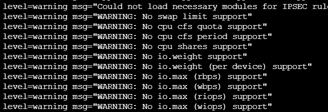
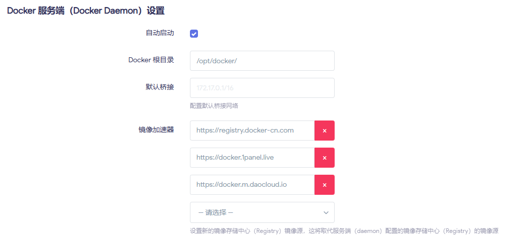
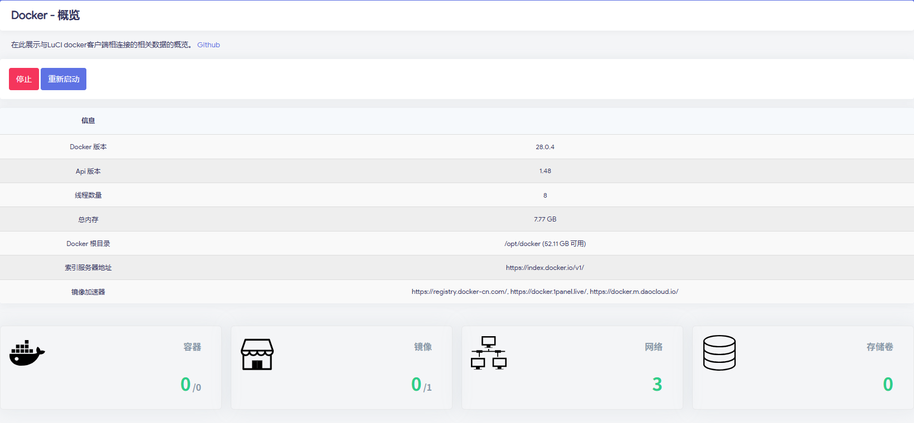
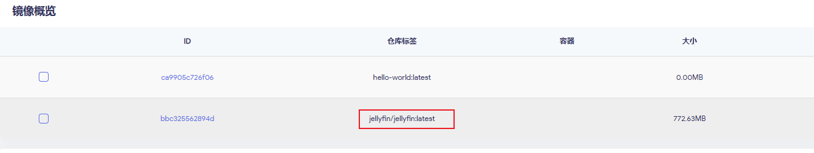
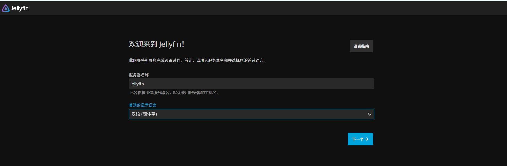
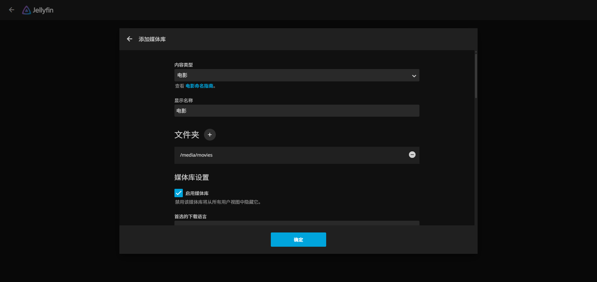
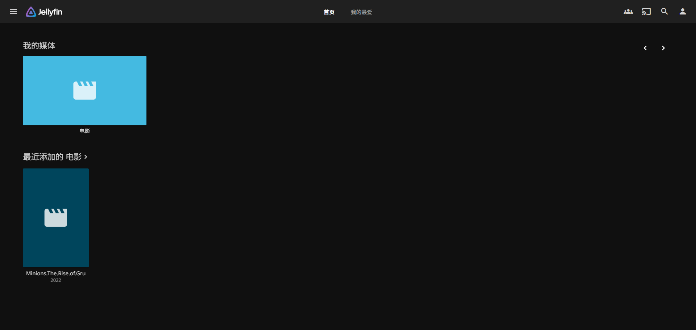
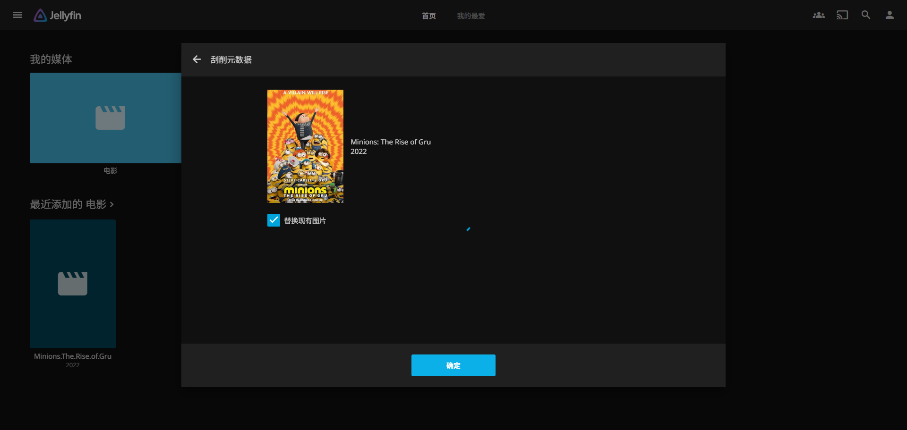

# 前言
 Docker 是一种开源的容器化平台，它通过“容器”来封装应用及其运行环境，使应用能够在不同系统之间快速、稳定地运行。容器轻量、启动快，占用资源少，适合微服务部署与持续集成/交付。Docker 还提供镜像管理、版本控制和环境一致性，让开发、测试、生产环境保持统一，大幅提升部署效率与可移植性。 Docker 可以让开发者打包他们的应用以及依赖包到一个轻量级、可移植的容器中，然后发布到任何流行的 Linux 机器上，也可以实现虚拟化。

硬件环境：OpenWrt 跑在 ARM 高性能 SBC 上（比如 本文使用的Dshanpi-A1），家里还有光猫 + 交换机/AC/AP 等常规设备。  
目标：在这块 SBC 上用 Docker 跑 **家庭影院 + 下载器 + 网盘 + 广告过滤 + 简单监控**，一机多用。

# 拓扑 & 环境说明
## 家庭网络
+ 光猫改桥接，把拨号交给 ARM SBC 上的 OpenWrt
+ ARM SBC 既当主路由，又当“轻量 NAS + 家庭影院服务器”
+ 电视盒子、手机、电脑都连在 LAN（有线/无线都行），统一访问 SBC 上的服务

## 机器配置
+ **设备**：ARM 64 位架构 SBC，8G 内存版本
+ **系统**：OpenWrt（自己编译/整合固件都可以，关键是要有 Docker）
+ **磁盘**：
    - 系统盘（eMMC/TF）装 OpenWrt
    - 外接 SSD/HDD/大 U 盘做数据盘，挂到 `/mnt/data`

# Docker 环境 & 目录规划
先把环境和目录规划确认好，后续好维护，这步比较关键。

## 安装 Docker / Docker Compose
如果你的固件已经打包了 Docker，可以直接跳过安装，推荐安装 luci-app-dockerman，这是 OpenWrt 上专门的 Docker Web 管理界面插件：

```bash
opkg install luci-lib-docker dockerd luci-lib-jsonc docker ttyd --force-depends
opkg install luci-app-dockerman
```

+ `dockerd`：Docker 守护进程
+ `docker`：命令行客户端
+ `luci-lib-docker` / `luci-lib-jsonc`：Dockerman 的依赖
+ `ttyd`：用于 Web 终端与容器控制台
+ `luci-app-dockerman`：Web 管理界面插件

启动并设为开机自启：

```bash
/etc/init.d/dockerd start
/etc/init.d/dockerd enable
```

然后访问 LuCI 后台，菜单里会多出：**服务 / Docker** 或 **服务 / Dockerman**。

也可以通过命令行的方式，确认环境能用，示例如下：

```bash
root@LEDE:~# docker version
Client:
 Version:           28.0.4
 API version:       1.48
 Go version:        go1.25.4
 Git commit:        b8034c0
 Built:             Sun Sep  7 14:53:18 2025
 OS/Arch:           linux/arm64
 Context:           default

Server:
 Engine:
  Version:          28.0.4
  API version:      1.48 (minimum version 1.24)
  Go version:       go1.25.4
  Git commit:       6430e49
  Built:            Sun Sep  7 14:53:18 2025
  OS/Arch:          linux/arm64
  Experimental:     false
 containerd:
  Version:          1.7.27
  GitCommit:        
 runc:
  Version:          1.2.6
  GitCommit:        
 docker-init:
  Version:          0.19.0
  GitCommit:        de40ad0
root@LEDE:~# docker ps
CONTAINER ID   IMAGE     COMMAND   CREATED   STATUS    PORTS     NAMES
root@LEDE:~# 
```

能看到版本信息 & 空容器列表，就说明 OK。

`docker-compose` 推荐也装一个，方便后面多服务一起管理（以 ARM64 为例）：

```bash
wget https://github.com/docker/compose/releases/download/v2.27.0/docker-compose-linux-aarch64 -O /usr/local/bin/docker-compose
chmod +x /usr/local/bin/docker-compose
docker-compose version
```

## 数据盘挂载 & 目录规划
首先把emmc剩余空间新建分区，格式化为ext4，然后界面上挂载为docker数据分区使用，当然使用其他外部存储设备保存也是可以的，比如使用TF卡来做为docker数据分区使用，增加对应的挂载目录配置即可，示例如下：


数据盘以/opt/data为根目录，可以这样规划：

```plain
/opt/docker      # Docker 根目录（镜像、容器层等）
/opt/data
   ├─ media      # 媒体文件（电影、剧集、音乐）
   │   ├─ movies
   │   └─ tv
   ├─ downloads  # BT/PT 下载目录
   └─ configs    # 各容器配置文件
       ├─ jellyfin
       ├─ qbittorrent
       └─ ...
```

再把目录建好：

```bash
mkdir -p /opt/data/{configs,downloads,media}
mkdir -p /opt/data/configs/{jellyfin,emby,transmission,qbittorrent,aria2,adguard,nextcloud}
mkdir -p /opt/data/media/{movies,tv,anime,music}
mkdir -p /opt/data/downloads/{bt,aria2,tmp}
```

后面所有容器都尽量挂到 `/opt/data` 下面，避免写爆系统盘。

这样做的好处：

+ 坏了一个容器就删了重建，数据不受影响
+ 换设备时只要把这块盘接过去，改一下路径就能继续用

## 配置内核选项支持docker运行
默认配置编译的kernel，docker运行的时候会有警告信息，提示缺少支持对应的功能支持，如下所示：



 这些 WARNING 表示你的 **内核未开启 cgroup v1/v2 的资源限制功能**，导致 Docker 无法对容器进行 CPU、IO、内存 swap 等限制。  需要在我们的系统里面，打开下面对应的配置：

```bash
# 打开kernel配置页面
make kernel_menuconfig
```

按照下面配置，打开CGroup和Namespace支持：


重新编译，然后升级，启动后发现没有对应的报错信息即可。更多配置支持，请查看代码仓库里面的配置。

注意：有的docker版本，需要打开legacy cgroup v1相关的控制支持，此处保持关闭。

## 加速源配置
1. 在安装下面的docker镜像的时候，可能会出现默认的仓库下载失败，可以配置内地的源，加速下载；



常见的加速镜像站地址：

```json
{
  "registry-mirrors": [
    "https://docker.1panel.live",
    "https://registry.docker-cn.com",
    "http://hub-mirror.c.163.com",
    "https://docker.m.daocloud.io"
  ]
}
```

2. 如果发现配置了加速源提示无法访问，可能是安装的openwrt代理插件的问题，修改配置或者禁用代理后重试即可；
3. 配置好后，执行 `docker pull hello-world`看是否可以正常拉取镜像，可以则说明网络配置完成。下面是正常工作的概览示例：



# 常见的一些玩法
## Jellyfin 家庭影院（Emby/Plex 同理）
说明：下面用命令行和图文方式进行操作实例，后续章节仅提供命令行示例。

###  拉取镜像
命令行执行：

```bash
# [--platform linux/arm64]是可选参数，可以去掉
docker pull --platform linux/arm64 jellyfin/jellyfin:latest
```

LUCI界面操作：


拉取成功后，可以在页面镜像列表看到，如下图所示：



### 启动容器
启动命令示例：

```bash
docker run -d \
  --name=jellyfin \
  --restart=unless-stopped \
  -p 8096:8096 \
  -v /opt/data/configs/jellyfin:/config \
  -v /opt/data/media:/media \
  jellyfin/jellyfin:latest
```

可以直接复制上面的命令，到界面上的解析CLI，点击命令行按钮，然后粘贴，最后点击应用。


增加后，页面可以看到状态为Created，这个时候选中jellyfin容器，然后点击启动：


如果 SBC 支持硬件解码（GPU 驱动也搞好了），可以尝试加上：

```bash
--device /dev/dri:/dev/dri
```

> ARM 平台硬解是个坑比较多的进阶话题，能成功算赚到，不能用就当纯软解顶着，1080p 问题不大。
>

启动参数说明：


### Web 配置流程
浏览器访问：`http://路由器IP:8096`

1. 创建管理员账号




2. 添加媒体库：
    - 电影 → `/media/movies`
    - 电视剧 → `/media/tv`
    - 动漫 → `/media/anime`



3. 语言选简体中文，元数据源可以切中文优先（刮削更顺）


之后你可以：

+ 安卓 TV/电视盒装 Jellyfin 客户端
+ 手机、平板、PC 直接 web/客户端访问
+ 家里的所有终端都在用 ARM SBC 这台“小服务器”作为服务器

### 使用简介
在上面的初始配置执行完成后，jellyfin就初始化好了，我们通过设置的管理员账户登录进去，可以看到如下界面：



我本地之前通过磁力链下载了Minions的的片源，现在直接点击，就可以在线观看了。

默认影片没有信息，我们可以通过刮削元数据，获取封面等信息，更多玩法请查阅jellyfin的官方文档：




## 核心玩法二：运行ubuntu
有很多服务，依赖完整的ubuntu环境，而不是openwrt的插件方式，这种时候我们可以在openwrt环境下安装docker ubuntu容器，实现拥有一台类似原生ubuntu的环境，实现各种自定义功能。下面以一个基础的Python实现的web服务器作为示例，展示运行容器版本的ubuntu强大的的自定义能力。

### 拉取镜像
命令执行：

```bash
docker pull ubuntu:24.04
```

### 启动容器
```bash
docker run -it ubuntu:24.04 bash
```

命令行启动示例：

```bash
docker run -it -d \
  --name ubt-web \
  --restart=unless-stopped \
  -p 8080:8000 \
  ubuntu:24.04 \
  bash
```

进入容器，并执行简单HTTP服务器的Python代码，示例如下：

```bash
docker exec -it ubt-web bash
apt update
apt install python3 python3-pip -y

cat > /srv/app.py << 'EOF'
from http.server import HTTPServer, SimpleHTTPRequestHandler

PORT = 8000
httpd = HTTPServer(("", PORT), SimpleHTTPRequestHandler)
print(f"Serving on port {PORT}...")
httpd.serve_forever()
EOF

# 上面实现的web server root是当前执行python3的路径
python3 /srv/app.py

```

### web访问测试
这个时候，通过`http://路由器IP:8000`，访问ubuntu容器里面python写的http服务器，会出现文件列表，如下图所示：


## 附加玩法：全网去广告
首先，拉取adgardhome镜像：

```bash
docker pull adguard/adguardhome:latest
```

然后启动容器，使用AdGuard Home：全家 DNS 去广告

```bash
docker run -d \
  --name=adguardhome \
  --restart=unless-stopped \
  -p 3000:3000 \
  -p 53:53/tcp \
  -p 53:53/udp \
  -v /opt/data/config/adguard:/opt/adguardhome/conf \
  -v /opt/data/config/adguard/work:/opt/adguardhome/work \
  adguard/adguardhome
```

+ 初始化地址：`http://路由器IP:3000`


+ 配置好之后，在 OpenWrt 的 LAN DHCP 里把 DNS 指向adguardhome容器的53端口，从而实现基于DNS的广告过滤功能。

更多配置详情，请查阅AdGuard Home官方文档。

# FAQ / 踩坑小结
**Q1：外网访问怎么弄？**

+ 推荐：ZeroTier/Tailscale/FRP 做内网穿透，尽量别直接裸露端口在公网

**Q3：备份怎么搞？**

+ 必备：`/opt/data/config` 整个目录（所有服务的配置）
+ 重要数据：`/opt/data/media` 和需要保留的下载内容
+ 换机只要把这块盘接过去，重新挂载，容器改一下路径就能接着用

**Q4：出问题怎么看？**

+ `docker logs 容器名` 看日志
+ `docker exec -it 容器名 /bin/sh` 进去容器内部排查
+ 检查挂载目录权限、磁盘空间、内存占用这些基础项

# 参考链接
+ [Docker 教程](https://www.runoob.com/docker/docker-tutorial.html)

