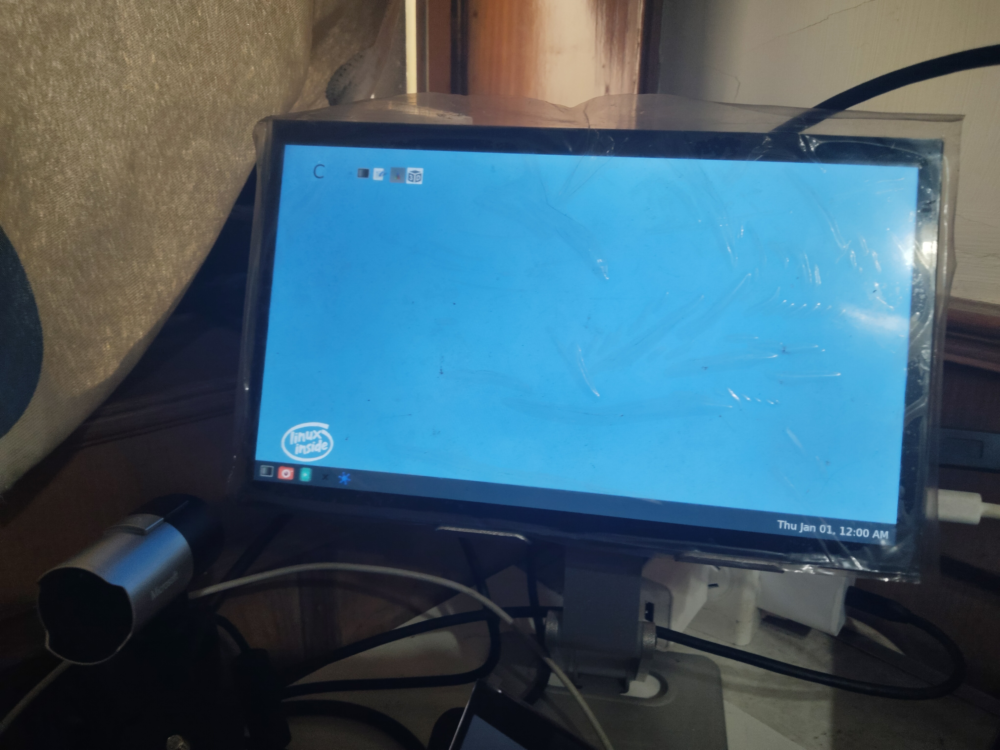
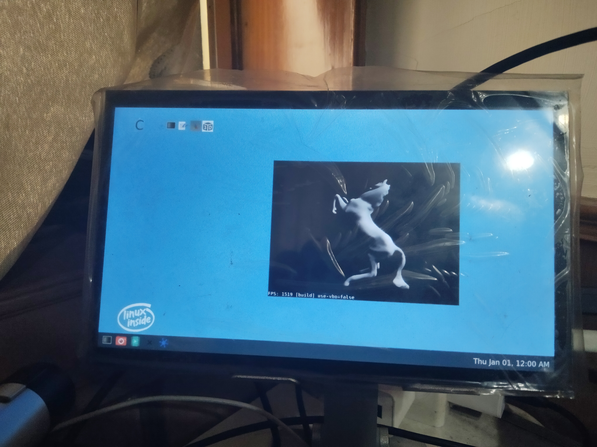
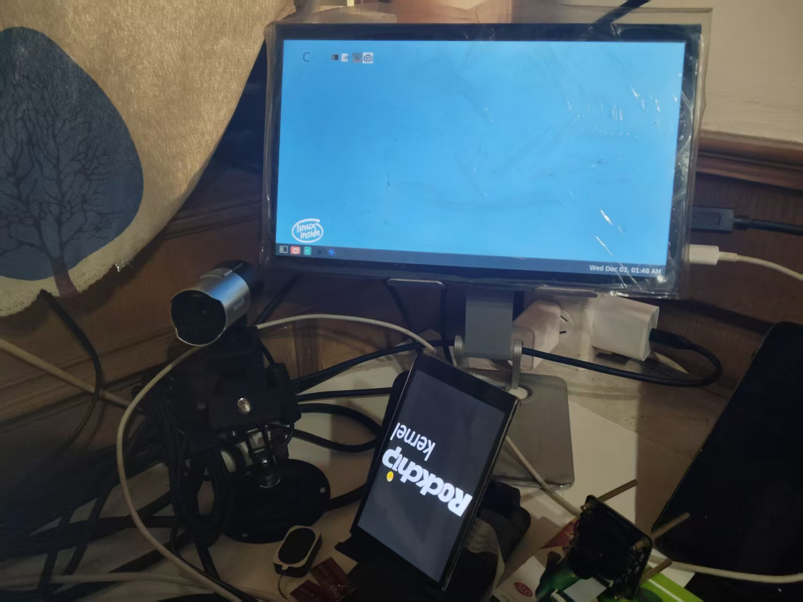
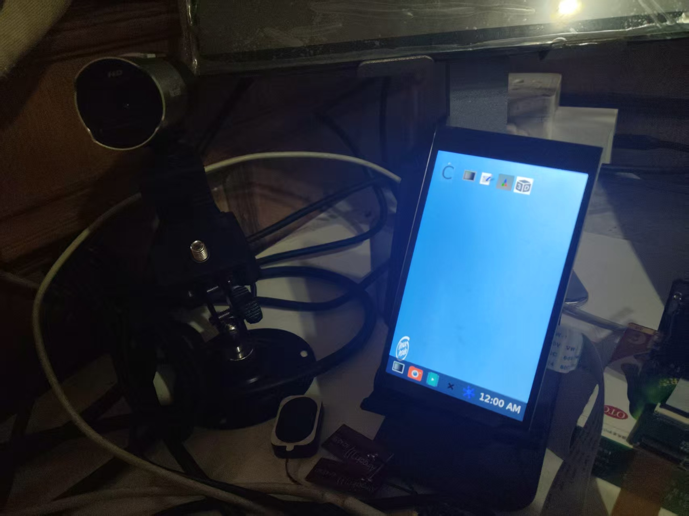
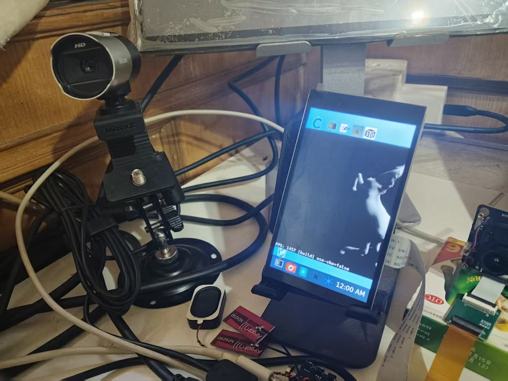
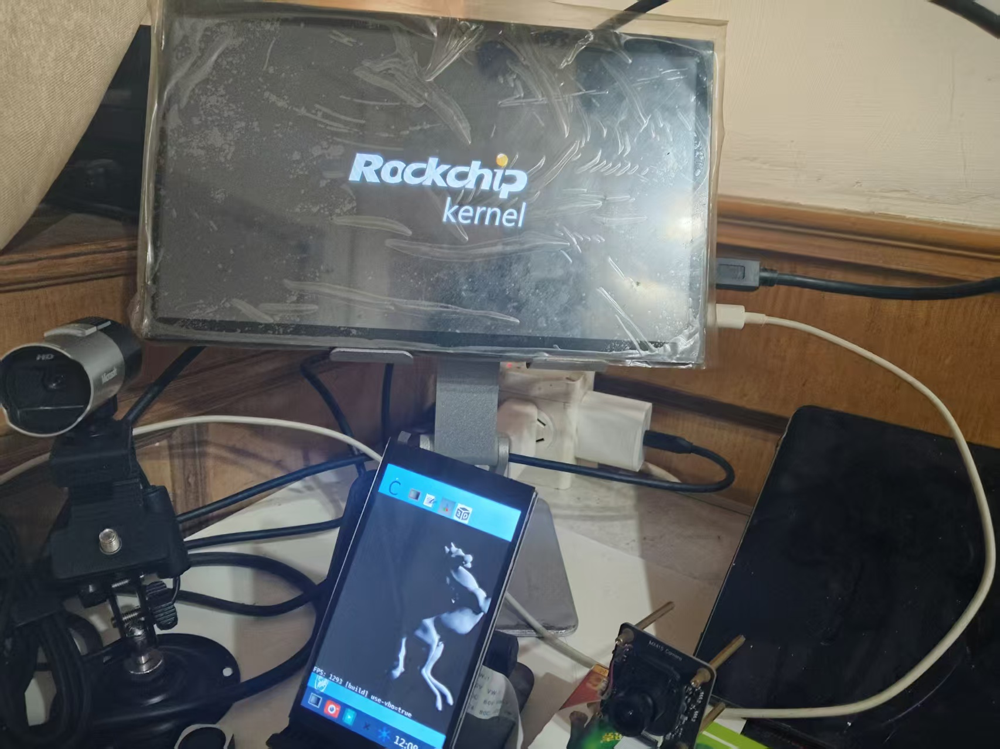
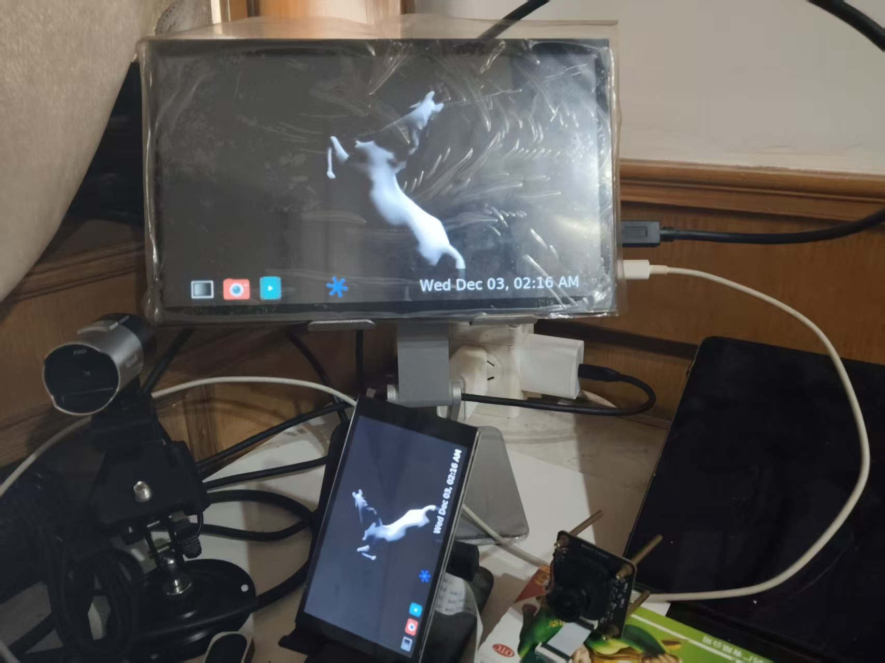
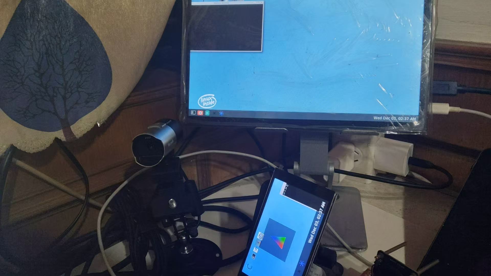

# Weston多屏配置

在嵌入式系统开发中，显示配置是用户界面实现的基础环节。Weston作为Wayland合成器的参考实现，广泛应用于嵌入式设备和桌面环境。面对不同的硬件配置和应用场景，需要精确控制显示输出。下面基于DShanPi-A1的buildroot固件版本，提供Weston在单屏独占、双屏同显和双屏异显三种典型场景下的配置方法，提供详细的操作指南。

## Weston基础架构与配置原理

在进行配置之前，有比较简单了解一下基本原理。

### Weston显示系统架构

Weston采用模块化设计，其核心组件包括：

-   **后端（Backend）**：负责与底层图形系统交互，如DRM、X11、Wayland等
-   **合成器（Compositor）**：管理窗口合成、渲染和输出
-   **Shell**：提供用户界面框架，如桌面、面板等

在嵌入式系统中，通常使用DRM后端drm-backend.so，它直接与Linux内核的Direct Rendering Manager交互，提供了高效的硬件加速支持。

###  配置文件结构解析

Weston的主要配置文件位于`/etc/xdg/weston/weston.ini`，采用INI格式组织。关键的配置段包括：

-   `[core]`：核心配置，定义后端行为和全局参数
-   `[output]`：显示输出配置，控制每个物理接口的属性
-   `[shell]`：桌面环境相关设置
-   `[libinput]`：输入设备配置
-   `[device]`：特定设备的高级配置

## HDMI独占显示配置

在某些嵌入式应用场景中，设备需要强制使用HDMI接口作为唯一显示输出，同时禁用内置屏幕（如DSI接口的LCD）。这种配置常见于：

-   工业控制台固定连接外接显示器
-   数字标牌系统使用大屏显示
-   需要高分辨率输出的专业应用

以下为详细的配置

**首先需要配置环境变量**

```bash
export WESTON_DRM_MIRROR=false
export WESTON_DRM_PREFER_EXTERNAL=0
export WESTON_DRM_SINGLE_HEAD=0
export WESTON_DRM_MASTER_OUTPUT="HDMI-A-1"
```

**再写入：/etc/xdg/weston/weston.ini**

```ini
[core]
backend=drm-backend.so
require-input=true         # 必须连接输入设备才能启动
require-outputs=true       # 必须检测到输出设备
idle-time=0                # 禁用屏幕休眠
repaint-window=16          # 重绘窗口，约60Hz刷新率

# 禁用自动检测
use-udev=false             # 关闭udev自动检测，手动控制输出

[output]
name=HDMI-A-1             # 指定HDMI-A-1接口
mode=1920x1080@60         # 分辨率1080p，60Hz刷新率
transform=normal          # 无旋转变换
scale=1.5                 # 150%缩放，适应高DPI

# 禁用DSI接口
[output]
name=DSI-1
mode=off                  # 关闭该输出

[shell]
panel-scale=2             # 面板元素200%缩放
cursor-size=32            # 鼠标指针大小
locking=false             # 禁用屏幕锁定
startup-animation=none    # 禁用启动动画

[keyboard]
vt-switching=true         # 允许虚拟终端切换

[libinput]
touchscreen_calibrator=true  # 启用触摸屏校准
enable-tap=true           	 # 启用点击手势
natural-scroll=true          # 自然滚动方向

[device]
name=wch.cn USB2IIC_CTP_CONTROL   # 特定触摸设备
rotation=normal                   # 正常方向
```

### 测试

启动



运行3D测试 



在实际应用中，应关闭DSI的驱动输出



### tips：注意了，这里有一个坑，导致我一开始hdmi屏幕无法启动

看这个weston启动输出日志

```bash
root@rk3576-buildroot:/# weston
Date: 2025-12-03 UTC
..........
[03:20:26.528] Output HDMI-A-1 (crtc 72) video modes:
               1024x600@59.8, preferred, 50.2 MHz
               1920x1080@60.0 16:9, 148.5 MHz
               1920x1080@59.9 16:9, 148.4 MHz
               1920x1080i@60.0, 74.2 MHz
               1920x1080i@60.0 16:9, 74.2 MHz
               1920x1080i@59.9 16:9, 74.2 MHz
               1920x1080@50.0, current, 148.5 MHz
               1920x1080@50.0 16:9, 148.5 MHz
               1920x1080i@50.0, 74.2 MHz
               1920x1080i@50.0 16:9, 74.2 MHz
               1280x1024@75.0, 135.0 MHz
               1280x720@60.0 16:9, 74.2 MHz
               1280x720@59.9 16:9, 74.2 MHz
               1280x720@50.0, 74.2 MHz
               1280x720@50.0 16:9, 74.2 MHz
               1024x768@75.0, 78.8 MHz
               1024x768@70.1, 75.0 MHz
               1024x768@60.0, 65.0 MHz
               832x624@74.6, 57.3 MHz
               800x600@75.0, 49.5 MHz
               800x600@72.2, 50.0 MHz
               800x600@60.3, 40.0 MHz
               800x600@56.2, 36.0 MHz
               720x576@50.0, 27.0 MHz
               720x576@50.0 4:3, 27.0 MHz
               720x576@50.0 16:9, 27.0 MHz
               720x480@60.0 4:3, 27.0 MHz
               720x480@60.0 16:9, 27.0 MHz
               720x480@59.9 4:3, 27.0 MHz
               720x480@59.9 16:9, 27.0 MHz
               640x480@75.0, 31.5 MHz
               640x480@72.8, 31.5 MHz
               640x480@60.0 4:3, 25.2 MHz
               640x480@59.9, 25.2 MHz
               720x400@70.1, 28.3 MHz
.....
```

注意这个分辨率

1024x600@59.8, preferred, 50.2 MH这是我的屏幕的实际物理分辨率，是默认配置，如果直接配置

```ini
# 强制指定输出
[output]
name=HDMI-A-1
#mode=1920x1080@50
mode=1024x600@59.8
transform=normal
scale=1.5
```

启动时：

```bash
xkbcommon: ERROR: couldn't find a Compose file for locale "en_US.UTF-8" (mapped to "en_US.UTF-8")
could not create XKB compose table for locale 'en_US.UTF-8'.  Disabiling compose
xkbcommon: ERROR: couldn't find a Compose file for locale "en_US.UTF-8" (mapped to "en_US.UTF-8")
could not create XKB compose table for locale 'en_US.UTF-8'.  Disabiling compose
[  695.260819] dwhdmi-rockchip 27da0000.hdmi: use tmds mode
[  695.279593] rockchip-vop2 27d00000.vop: [drm:vop2_crtc_atomic_enable] Update mode to 1024x600p60, type: 11(if:HDMI0, flag:0x0) for vp0 dclk: 50250000
[  695.279636] rockchip-hdptx-phy-hdmi 2b000000.hdmiphy: hdptx_ropll_cmn_config bus_width:7aae4 rate:1485000
[  695.279810] rockchip-hdptx-phy-hdmi 2b000000.hdmiphy: hdptx phy pll locked!
[  695.279872] rockchip-hdptx-phy-hdmi 2b000000.hdmiphy: hdptx_ropll_cmn_config bus_width:7aae4 rate:502500
[  695.280061] rockchip-hdptx-phy-hdmi 2b000000.hdmiphy: hdptx phy pll locked!
[  695.280069] rockchip-vop2 27d00000.vop: [drm:vop2_crtc_atomic_enable] set dclk_vp0 to 50250000, get 50250000
[  695.280120] dwhdmi-rockchip 27da0000.hdmi: final tmdsclk = 50250000
[  695.280189] dwhdmi-rockchip 27da0000.hdmi: don't use dsc mode
[  695.280198] dwhdmi-rockchip 27da0000.hdmi: dw hdmi qp use tmds mode
[  695.280206] rockchip-hdptx-phy-hdmi 2b000000.hdmiphy: bus_width:0x7aae4,bit_rate:502500
[  695.285263] rockchip-hdptx-phy-hdmi 2b000000.hdmiphy: hdptx phy lane can't ready!
[  695.285271] phy phy-2b000000.hdmiphy.4: phy poweron failed --> -22
[  695.285278] dwhdmi-rockchip 27da0000.hdmi: dw_hdmi_qp_setup hdmi set operation mode failed
[  695.285317] dwhdmi-rockchip 27da0000.hdmi: Rate 50250000 missing; compute N dynamically
[  695.286726] dwhdmi-rockchip 27da0000.hdmi: Rate 50250000 missing; compute N dynamically
[  695.315462] dwhdmi-rockchip 27da0000.hdmi: use tmds mode

```

注意：

```bash
[  695.285263] rockchip-hdptx-phy-hdmi 2b000000.hdmiphy: hdptx phy lane can't ready!
[  695.285271] phy phy-2b000000.hdmiphy.4: phy poweron failed --> -22
```

**屏幕是无法启动的，所以这里有一个经验：**

**在测试屏幕时，物理分辨率可能会不兼容，需要测试多个分辨率，找到兼容的分辨率**

### 关键配置点

**use-udev=false的重要性**：
		默认情况下，Weston通过udev自动检测所有连接的显示设备。设置为`false`后，Weston将仅使用配置文件中明确指定的输出，这为实现精确控制提供了基础。

**输出优先级控制**：
当多个`[output]`段存在时，Weston按配置文件顺序处理。将需要禁用的输出放在激活的输出之后，并设置`mode=off`，可以确保正确的显示控制。

**缩放配置策略**：
嵌入式设备通常需要调整UI元素的物理尺寸。通过`scale`参数可以独立控制每个输出的缩放比例，这对于连接不同DPI的显示器尤为重要。

## dsi独占模式

与HDMI独占相反，某些应用需要仅使用设备内置屏幕，如：

-   移动设备或便携式仪器
-   节省功耗的电池供电设备
-   不需要外接显示的应用场景

**/etc/xdg/weston/weston.ini**

```ini
[core]
backend=drm-backend.so

# Allow running without input devices
require-input=false

# Allow running without output devices
require-outputs=none

# Disable screen idle timeout by default
idle-time=0

# 关键：禁用自动检测所有连接
use-udev=false

# The repaint-window is used to calculate repaint delay(ms) after flipped.
#   value <= 0: delay = abs(value)
#   value > 0: delay = vblank_duration - value
repaint-window=-1

# Allow blending with lower drm planes
# gbm-format=argb8888

[shell]
# top(default)|bottom|left|right|none, none to disable panel
# panel-position=none

# Scale panel size
panel-scale=2

# Set cursor size
cursor-size=32

# none|minutes(default)|minutes-24h|seconds|seconds-24h
# clock-format=minutes-24h
clock-with-date=false

# Disable screen locking
locking=false

# Disable the desktop starting up animation
startup-animation=none

[libinput]
# Uncomment below to enable touch screen calibrator(weston-touch-calibrator)
# touchscreen_calibrator=true
# calibration_helper=/bin/weston-calibration-helper.sh

[keyboard]
# Comment this to enable vt switching
vt-switching=false

# Configs for auto key repeat
# repeat-rate=40
# repeat-delay=400
[output]
name=DSI-1
mode=480x800
transform=rotate-180
scale=0.2

# 明确禁用 DSI-1
[output]
name=HDMI-A-1
mode=off
```
### 测试

开机



运行3D测试





### 关键点

**旋转配置**：
		嵌入式设备的屏幕安装方向可能不同。`transform`参数支持多种旋转选项：

-   `normal`：无旋转
-   `rotate-90`：顺时针90度
-   `rotate-180`：180度
-   `rotate-270`：顺时针270度
-   `flipped`：水平翻转
-   `flipped-rotate-180`：组合变换

**DPI适配策略**：
		小尺寸高分辨率屏幕需要适当的UI缩放。通过试验不同`scale`值，找到物理尺寸合适的UI元素大小。本配置中使用0.2（20%）缩放，确保在480x800分辨率下UI元素可正常操作。

## 双屏同显

双屏同显（镜像模式）适用于：

-   演示和教学场景
-   主控台与观察屏同步显示
-   故障排除和调试

**/etc/xdg/weston/weston.ini**

```ini
[core]
backend=drm-backend.so
require-input=true
require-outputs=true
idle-time=0
repaint-window=16
mode=mirror
use-udev=true  # 双屏需要启用udev

[output]
name=HDMI-A-1
mode=1920x1080
transform=rotate-270
scale=0.25

[output]
name=DSI-1
mode=1920x1080
transform=rotate-270
scale=0.25

[shell]
panel-scale=2
cursor-size=32
locking=false
startup-animation=none

[keyboard]
vt-switching=true

[libinput]
touchscreen_calibrator=true
enable-tap=true
natural-scroll=true

# 关键修正：将触摸设备明确绑定到HDMI输出
[device]
name=wch.cn USB2IIC_CTP_CONTROL
output=HDMI-A-1  # 明确指定到HDMI屏幕
rotation=normal  # 根据实际方向调整
```
### 测试

开机


运行3D测试



### 关键点

**分辨率对齐**：
		镜像模式下，两个输出应使用相同的分辨率，否则Weston会以较低分辨率或缩放显示。本配置中统一使用1920x1080，确保显示内容一致。

**触摸输入绑定**：
		在多屏环境中，触摸输入需要明确绑定到特定屏幕。通过`output=HDMI-A-1`配置，确保触摸操作仅影响HDMI显示，避免在镜像模式下产生混淆。

**性能优化考虑**：
		镜像模式需要合成器渲染相同内容两次，对系统性能有一定影响。适当调整`repaint-window`参数可以平衡流畅度和系统负载。

## 双屏异显

双屏异显（扩展模式），适用于：

-   多任务工作环境
-   控制面板与数据显示分离
-   复杂的专业应用界面

以下为配置

**weston.ini配置**

```ini
[core]
backend=drm-backend.so
require-input=true
require-outputs=true
idle-time=0
repaint-window=16
mode=extend  # 关键：改为extend模式
use-udev=true

# HDMI屏幕（右侧）
[output]
name=HDMI-A-1
mode=1920x1080
transform=rotate-270
scale=0.25
x=200  # DSI在左侧，从DSI宽度开始
y=0

# DSI屏幕（左侧）
[output]
name=DSI-1
mode=480x800
transform=rotate-270
scale=0.25
x=0
y=0

[shell]
panel-scale=2
cursor-size=32
locking=false
startup-animation=none

[keyboard]
vt-switching=true

[libinput]
touchscreen_calibrator=true
enable-tap=true
natural-scroll=true

[device]
name=wch.cn USB2IIC_CTP_CONTROL
output=HDMI-A-1  # 触摸绑定到HDMI屏幕
rotation=normal
```

### 测试

启动时


需要设置环境变量，关闭镜像模式

```bash
#环境变量
export WESTON_DRM_MIRROR=0         # 关闭镜像模式
export WESTON_DRM_PREFER_EXTERNAL=0 # 不优先外部显示
export WESTON_DRM_SINGLE_HEAD=0     # 启用多head支持
pkill weston
weston &
```



启动后，系统识别两个独立显示器，桌面可以跨屏延伸。每个屏幕可以运行不同的应用程序，实现真正的多任务环境。

### 关键点

**屏幕排列控制**：
		Weston默认的屏幕排列可能不符合实际物理布局。可以通过`weston.ini`中的位置参数或启动后手动调整来优化。

**跨屏窗口管理**：
		在扩展模式下，窗口可以在屏幕间移动。需要确保窗口管理器和应用程序支持多屏幕环境。

**性能考量**：
		扩展模式对图形性能要求更高，特别是当两个屏幕分辨率差异较大时。需要根据硬件能力调整渲染设置。

## 总结

Weston多屏配置虽然有一定复杂性，但通过深入理解其配置原理和掌握关键参数，可以实现高度定制化的显示解决方案。无论是单屏独占、双屏同显还是双屏异显，都需要综合考虑硬件特性、应用需求和用户体验。

实际配置过程中，建议采取逐步测试的方法：**先从基本配置开始，验证单个功能，然后逐步添加复杂特性。**
