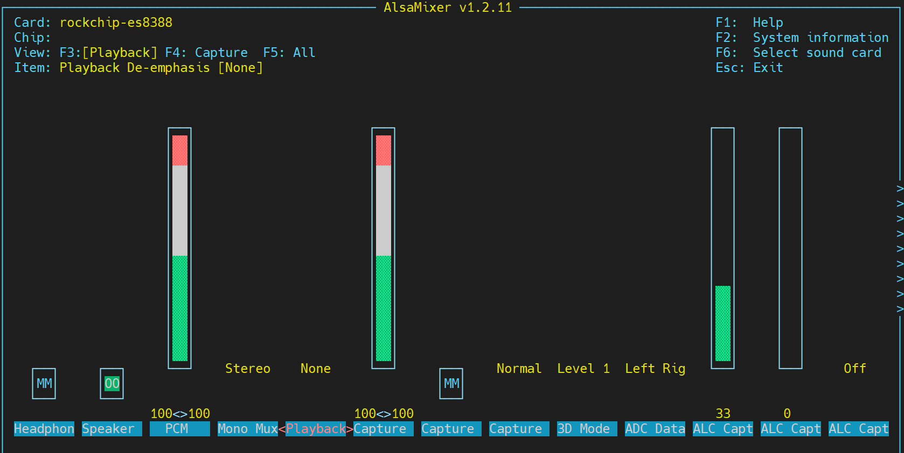
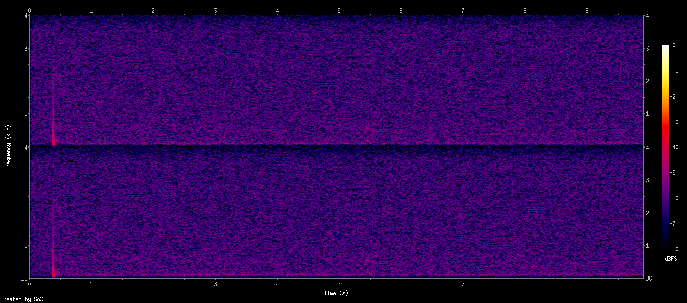
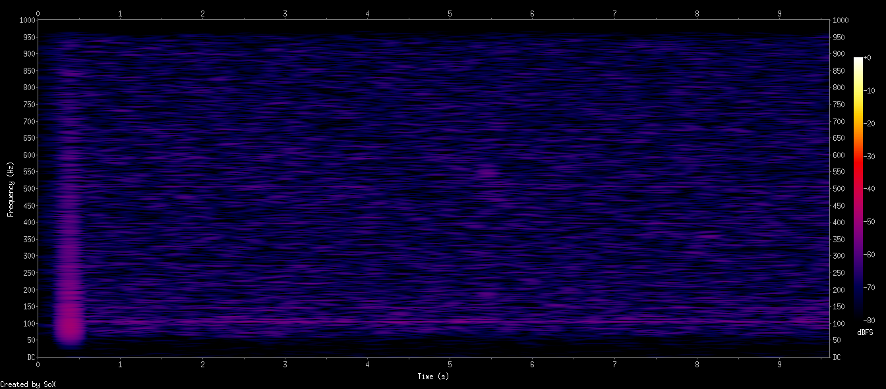
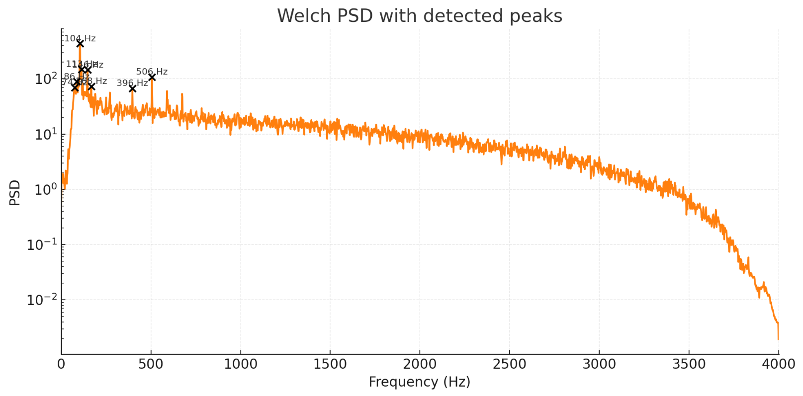
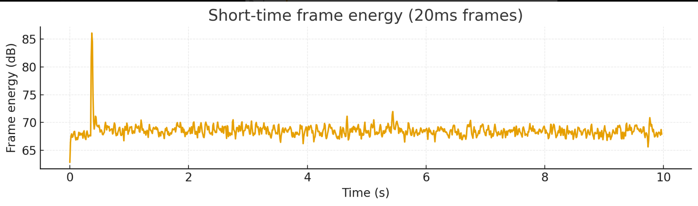
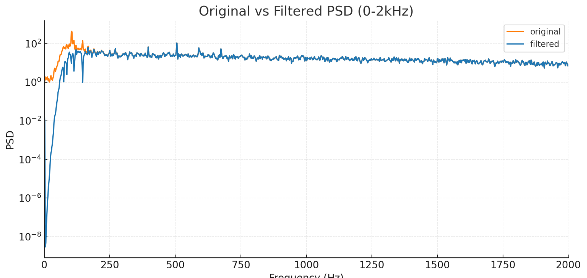

# 音频录制播放与噪声分析
## 音频播放

### 扬声器设备

先看以下这个扬声器如何使用，先列出音频播放设备

```bash
aplay -l
    **** List of PLAYBACK Hardware Devices ****
    card 0: rockchipes8388 [rockchip-es8388], device 0: dailink-multicodecs ES8323 HiFi-0 [dailink-multicodecs ES8323 HiFi-0]
      Subdevices: 1/1
      Subdevice #0: subdevice #0
    card 1: rockchiphdmiin [rockchip,hdmiin], device 0: 2a640000.sai-dummy_codec dummy_codec-0 [2a640000.sai-dummy_codec dummy_codec-0]
      Subdevices: 1/1
      Subdevice #0: subdevice #0
    card 2: rockchipdp0 [rockchip-dp0], device 0: rockchip-dp0 spdif-hifi-0 [rockchip-dp0 spdif-hifi-0]
      Subdevices: 1/1
      Subdevice #0: subdevice #0
    card 3: rockchiphdmi [rockchip-hdmi], device 0: rockchip-hdmi i2s-hifi-0 [rockchip-hdmi i2s-hifi-0]
      Subdevices: 1/1
      Subdevice #0: subdevice #0

```

可以看出，总共检测到 **4张音频卡**（card 0 ~ card 3）

-   **播放音频到扬声器/耳机**：使用 `card 0, device 0`
-   **HDMI音频输出**：使用 `card 3, device 0`
-   **DisplayPort音频**：使用 `card 2, device 0`
-   **捕获HDMI输入音频**：使用 `card 1, device 0`

扬声器是**card0：subdevice#0**，对应alsa设备就是**hw:0,0**

```bash
**** List of PLAYBACK Hardware Devices ****
card 0: rockchipes8388 [rockchip-es8388], device 0: dailink-multicodecs ES8323 HiFi-0 [dailink-multicodecs ES8323 HiFi-0]
  Subdevices: 1/1
  Subdevice #0: subdevice #0
```

### **创建并播放简单测试音**

```bash
# 创建8kHz采样率的1kHz正弦波WAV文件（5秒）
ffmpeg -f lavfi -i "sine=frequency=1000:duration=5" -c:a pcm_s16le -ar 8000 test_tone.wav
# 播放该文件
aplay test_tone.wav
	Playing WAVE 'test_tone.wav' : Signed 16 bit Little Endian, Rate 8000 Hz, Mono
```

测试的命令都成功了，但是没有听到声音，需要查看这个扬声器的属性，很可能是音频路由问题，首先需要确定排查思路：

音频芯片（ES8388）设计是：

-   **软件控制层**：`Speaker Switch` - 控制音频流是否发送到芯片
-   **硬件控制层**：`OUT1/OUT2 Switch` - 控制芯片物理引脚输出

### 音频播放调试

先打开音频可视化工具看一下

```
alsamixer -c 0
```



可以看出playback的状态不正常： **MM 00**，需要进一步确认是哪个配置的问题，使用 **PulseAudio控制工具**

```bash
pactl list short sinks
    0       alsa_output.0.HiFi__hw_rockchipes8388__sink     module-alsa-card.c      s16le 2ch 44100Hz       SUSPENDED
    1       alsa_output.1.stereo-fallback   module-alsa-card.c      s16le 2ch 44100Hz       SUSPENDED
```

作一些解释：

-   **Sink**（接收器）：音频输出的终点
-   **PulseAudio架构**

```ini
应用程序 → 音频流 → PulseAudio服务器 → Sink → 硬件
(播放器)          (混音器)        (输出设备)   (声卡)
```

**状态说明**

-   **RUNNING**：正在播放音频
-   **IDLE**：空闲，准备就绪
-   **SUSPENDED**：挂起，节能模式
-   **UNLINKED**：未连接

 **设备详情**

-   **sink 0**：`alsa_output.0.HiFi__hw_rockchipes8388__sink`
    -   对应ALSA声卡0（ES8388音频芯片）
    -   高保真（HiFi）输出
-   **sink 1**：`alsa_output.1.stereo-fallback`
    -   备用/回退输出设备
    -   当主设备不可用时使用

 **两个音频sink都处于SUSPENDED状态**

```ini
0 ... SUSPENDED
1 ... SUSPENDED
```

**SUSPENDED状态意味着**：

-   PulseAudio认为没有音频流需要播放
-   为了节能，自动挂起了音频输出
-   系统准备好接收音频，但当前没有活跃的音频流

**根本原因链条**：

1.  **系统启动时** → PulseAudio加载音频设备

2.  **没有活跃音频流** → PulseAudio挂起设备（SUSPENDED）

3.  **硬件路由未激活** → OUT1/OUT2开关默认关闭

4.  **开始播放音频时**：

    -   PulseAudio唤醒设备
    -   **但**硬件开关（OUT/OUT2）还是关闭状态
    -   需要手动 `amixer -c 0 sset 'OUT1' on`

    经过我测试，在打开

    ```
    amixer -c 0 sset 'OUT2' on
    ```

    之后，扬声器音频就可以正常播放了，这里作为记录，列出我调试过程中使用到的一些有用的命令

    ```bash
    #1. 查看更详细的sink信息
    pactl list sinks
        Sink #0
            ...
        Sink #1
    		...
    # 2. 查看当前音频流
    pactl list sink-inputs
    #3.alsa内容控制
    amixer -c 0 scontents
    	...
    amixer -c 0 get 'Speaker'
    amixer -c 0 get 'Master'
    amixer -c 0 get 'Headphone'
    ```

对于这个问题有多个解决方案，下面列出

**方案1：阻止自动挂起**

```bash
# 编辑PulseAudio配置
vi /etc/pulse/default.pa
    # 防止自动挂起
    load-module module-suspend-on-idle timeout=0  # 0表示永不挂起
    # 增加超时时间
    load-module module-suspend-on-idle timeout=3600  # 1小时
# 重启PulseAudio
pulseaudio -k
pulseaudio --start
```

**方案2：启动时自动激活硬件**

```bash
# 创建启动脚本 /etc/pulse/audio-init.sh
#!/bin/bash
# 等待PulseAudio启动
sleep 3
# 激活硬件输出
amixer -c 0 sset 'OUT2' on
amixer -c 0 sset 'Speaker' on
# 设置合适音量
amixer -c 0 sset 'Output 2' 90%
```

**方案3：使用udev规则**

```bash
# 创建 /etc/udev/rules.d/90-audio.rules
ACTION=="add", SUBSYSTEM=="sound", KERNEL=="card0", \
    RUN+="/usr/bin/amixer -c 0 sset 'OUT2' on"
#重启后生效
```

**方案4：最简单的临时测试**

```bash
# 先激活设备再播放
amixer -c 0 sset 'Speaker' on
amixer -c 0 sset 'OUT2' on
amixer -c 0 sset 'Output 2' 90%
#也可以永久保存设置（并未生效）
alsactl store
```

**总结：问题实际上是：**

-   **软件层**：PulseAudio正常
-   **驱动层**：ALSA正常识别设备
-   **硬件层**：OUT2物理开关需要手动激活

**tips：音频路由**

```bash
# 假设有多个音频设备：
# 0 - 内置扬声器
# 1 - USB耳机
# 2 - HDMI输出

# 将Chrome音频发送到耳机
pactl move-sink-input $(pactl list short sink-inputs | grep chrome | awk '{print $1}') 1
# 将音乐播放器发送到HDMI
pactl move-sink-input $(pactl list short sink-inputs | grep spotify | awk '{print $1}') 2
```

## 音频录制

使用得硬件是百问网200w usb摄像头+音频mems一体化模块，如下图所示


### 设备信息获取

首先需要获得整个mems得信息，它是通过usb与rk3576通信得，有几个方法能看出它得信息

```bash
v4l2-sysfs-path
    Video device: video36
            video: video37
            sound card: hw:4
            pcm capture: hw:4,0
            mixer: hw:4
    Video device: video37
            sound card: hw:4
            pcm capture: hw:4,0
            mixer: hw:4
   .....
alsactl info
    ......
    - card: 4
      id: Camera
      name: USB 2.0 Camera
      longname: lihappe8 Corp. USB 2.0 Camera at usb-xhci-hcd.8.auto-1.2.2, high speed
      driver_name: USB-Audio
      mixer_name: USB Mixer
      components: USB038f:0541
      controls_count: 4
      pcm:
        - stream: CAPTURE
          devices:
            - device: 0
              id: USB Audio
              name: USB Audio
              subdevices:
                - subdevice: 0
                  name: subdevice #0
    .....
```

可以看出在alsa里这个设备得name是**hw:4,0**

### 音频录制测试

```bash
#录制一段背景噪声
arecord -D hw:4,0 -f S16_LE -r 8000 -c 2 -d 10 noise
	Recording WAVE 'noise.wav' : Signed 16 bit Little Endian, Rate 8000 Hz, Stereo
aplay noise.wav
	Playing WAVE 'noise.wav' : Signed 16 bit Little Endian, Rate 8000 Hz, Stereo
```

可以听到明显得”吱吱“声，这个mems的底噪还是很大的，后续需要对其进行降噪，才可以进行正常的语音通讯。

### 噪声分析

用sox生成频谱图

```bash
sox noise.wav -n spectrogram -o noise_spectrogram.pn
```

 

```
#全局频谱
sox noise.wav -n spectrogram -d 10 -x 1200 -z 80 -o noise_full.png
```



```
sox noise.wav -r 2000 -c 1 noise_2k.wav
sox noise_2k.wav -n spectrogram -d 10 -x 1200 -z 80 -o noise_low.png
```



**整体观察背景噪声属于「近似白噪声 + 低频强峰 + 中频轻微纹理噪声」**

**1. 0～200Hz 附近有非常明显的低频能量团（尤其 \<100Hz）**

这一般意味着：

-   **机械/电源相关噪声**
-   **风扇、震动、机箱共振**
-   **电源纹波（50Hz / 60Hz + 基波）**
-   **麦克风指向性/箱体耦合放大超低频噪声**

**2. 1kHz～4kHz 范围是随机噪声（近似白噪声），能量较低**

说明麦克风底噪属于典型：

-   MEMS 麦克风本底噪声
-   ADC 自噪声
-   放大器输入噪声

这部分是**系统底噪**。

**3. 高频（>6kHz）完全没有奇怪峰值**

这非常好 → 没有明显：

-   数字 EMI
-   时钟泄漏
-   采样抖动噪声

------

**4. 没有明显「啸叫模式」出现**

三张图都没有看到典型啸叫特征：

-   啸叫通常是固定频率一条亮线持续不变
-   图中只有**起始瞬间的脉冲（可能是开始录音时的点击声）**

没有稳定峰随时间持续。

**逐图分析**

------

**(A) 第一张图：全频谱（到 4kHz）**

看起来特点是：

 整体偏红/紫，噪声密度高但均匀
		 50Hz 左右有明显竖线
 		100Hz、150Hz 也有轻微能量

➜ 这几乎肯定是：

**工频噪声（50/60Hz）+ 谐波（100/150Hz）**

**原因：**

-   USB 供电带来的大量 50/60Hz hum
-   声卡或麦克风的模拟前端隔离不好
-   地线不干净（如 USB 共地回路）

------

**(B) 第二张图：动态范围压窄的版本（-80dBFS）**

这一张另外暴露出：

在 1.8kHz ～ 2.2kHz 有一条非常窄的横线

非常淡，但稳定存在。

这表示：

 **系统时钟/PLL 干扰泄漏**

常见于：

-   I2S/MCLK 泄漏
-   PCB 上麦克风的时钟耦合
-   数字电源噪声叠加到麦克风模拟部分

这部分不会导致啸叫，但会降低 SNR。

------

**(C) 第三张图：低频到 1000Hz**

非常典型：

 \<150Hz 区域噪声比其他频段高很多

像一个大“灯泡”形状，非常明显。

这说明：

 **低频振动 + 电源噪声是主要底噪来源**

包括：

-   机箱震动、风扇、台面共振
-   电源 50/60Hz + 谐波
-   麦克风本身的 LF roll-off 不够

------

**综合判断：背景噪声构成比例**

| 噪声类型                       | 占比 | 特征                           |
| ------------------------------ | ---- | ------------------------------ |
| **低频机械/电源噪声 (\<200Hz)** | 50%  | 最大来源，来自电源、机箱、振动 |
| **工频泄漏 50/60Hz + 谐波**    | 25%  | 图中最强的固定峰               |
| **麦克风本底白噪声**           | 20%  | 散布在 1k~4kHz 随机噪声        |
| **数字时钟泄漏（2kHz 附近）**  | 5%   | 很弱但可见的一条细线           |

### PSD噪声模型分析

使用python生成PSD噪声模型

```python
import numpy as np
import matplotlib.pyplot as plt
from scipy.io import wavfile
from scipy.signal import welch, find_peaks, spectrogram, butter, sosfilt
import IPython.display as ipd
import os

rate, data = wavfile.read("/mnt/data/noise.wav")
if data.ndim>1:
    data = data.mean(axis=1)
data = data.astype(np.float32)
N = len(data)
duration = N / rate

# Calculate overall RMS and dBFS
# Assuming 16-bit PCM if dtype was int16; determine scale
# infer max possible value from original dtype by reloading header:
import struct
# Determine dtype max
# but we'll normalize by max of int16 if dtype came as int16, else use max(abs(data))
max_possible = 32768.0
rms = np.sqrt(np.mean(data**2))
dbfs_rms = 20*np.log10(rms / max_possible) if rms>0 else -np.inf

# Welch PSD
f, Pxx = welch(data, fs=rate, nperseg=4096, scaling='density')
# find peaks in PSD (in linear)
peaks, props = find_peaks(Pxx, height=np.max(Pxx)*0.15, distance=5)
peak_freqs = f[peaks]
peak_heights = props['peak_heights']

# Find dominant low-frequency peak under 500Hz
low_idx = np.where(f<=500)[0]
low_f = f[low_idx]
low_P = Pxx[low_idx]
lp_peaks, lp_props = find_peaks(low_P, height=np.max(low_P)*0.2)
lp_freqs = low_f[lp_peaks]
lp_heights = lp_props['peak_heights']

# Short-time energy to find transient (e.g., first second pulse)
frame_ms = 20
frame_len = int(rate * frame_ms/1000)
hop = frame_len//2
frames = []
for start in range(0, N-frame_len, hop):
    frames.append(np.sum(data[start:start+frame_len]**2))
frames = np.array(frames)
frame_times = (np.arange(len(frames))*hop)/rate

# detect where energy spikes relative to median
median_e = np.median(frames)
spikes = np.where(frames > median_e*8)[0]  # 8x median
spike_times = frame_times[spikes]

# Spectrogram
f_s, t_s, Sxx = spectrogram(data, fs=rate, nperseg=2048, noverlap=1024, scaling='density', mode='magnitude')

# Plot PSD with peaks marked
plt.figure(figsize=(10,5))
plt.semilogy(f, Pxx, color='tab:orange')
plt.scatter(peak_freqs, peak_heights, color='k', zorder=5)
for pf, ph in zip(peak_freqs, peak_heights):
    plt.text(pf, ph*1.1, f"{pf:.0f} Hz", fontsize=8, ha='center')
plt.xlim(0, rate/2)
plt.xlabel("Frequency (Hz)")
plt.ylabel("PSD")
plt.title("Welch PSD with detected peaks")
plt.grid(alpha=0.3)
plt.tight_layout()
plt.savefig("/mnt/data/psd_peaks.png")

# Plot spectrogram (dB)
Sxx_db = 20*np.log10(Sxx + 1e-12)
plt.figure(figsize=(10,5))
plt.pcolormesh(t_s, f_s, Sxx_db, shading='gouraud')
plt.colorbar(label='dB')
plt.ylim(0, 4000)
plt.xlabel("Time (s)")
plt.ylabel("Frequency (Hz)")
plt.title("Spectrogram (dB)")
plt.tight_layout()
plt.savefig("/mnt/data/spectrogram_db.png")

# Prepare summary
summary = {
    "sampling_rate": rate,
    "duration_s": duration,
    "rms": float(rms),
    "dbfs_rms": float(dbfs_rms),
    "dominant_peaks_hz": [float(p) for p in peak_freqs[:8]],
    "dominant_peaks_vals": [float(p) for p in peak_heights[:8]],
    "low_freq_peaks_hz": [float(p) for p in lp_freqs],
    "low_freq_peaks_vals": [float(p) for p in lp_heights],
    "spike_times_s": [float(s) for s in spike_times[:10]],
    "spectrogram_image": "/mnt/data/spectrogram_db.png",
    "psd_image": "/mnt/data/psd_peaks.png"
}

import json
with open("/mnt/data/noise_analysis_summary.json","w") as f:
    json.dump(summary, f, indent=2)

# Display small tables and figures
from caas_jupyter_tools import display_dataframe_to_user
import pandas as pd

df_peaks = pd.DataFrame({
    "freq_hz": peak_freqs,
    "psd_val": peak_heights
})
display_dataframe_to_user("Detected PSD Peaks", df_peaks.head(20))

plt.figure(figsize=(10,3))
plt.plot(frame_times, 10*np.log10(frames+1e-12))
plt.xlabel("Time (s)")
plt.ylabel("Frame energy (dB)")
plt.title("Short-time frame energy (20ms frames)")
plt.grid(alpha=0.3)
plt.tight_layout()
plt.savefig("/mnt/data/frame_energy.png")
plt.show()

# Show audio player
ipd.display(ipd.Audio("/mnt/data/noise.wav"))

summary
```

  


 



**得出关键量化结果：**

-   采样率：**8000 Hz**
-   时长：**10.0 s**
-   全段 RMS = **223.11 (样点)**，换算为 **-43.34 dBFS**（以 16-bit 满量程 32768 作归一）： **说明底噪中等偏高**。
-   检测到的**显著频率峰**（Welch PSD peak，按强度顺序，列出前几项）：
    -   约 **74.2 Hz**, **85.94 Hz**, **103.52 Hz**, **113.28 Hz**, **146.48 Hz**, **167.97 Hz**, 以及较小的 396 Hz 等。
-   低频段（≤500 Hz）主要峰：**85.94, 95.70, 103.52, 113.28, 146.48 Hz** —— 多个近频段峰，像是工频/开关电源谐波或机械谐振的集合。
-   瞬态能量峰（短时能量帧，20 ms）检测到在：**约 0.36–0.38 s** 有几个短脉冲（可能是启动点击/人为触碰/瞬态事件）。

结论：**噪声由明显的低频“hum/纹波/振动”组成 + 宽带白噪声**（中高频），低频是主要能量所在。 

### 降噪方案

**1.在音频链路上加 2 阶高通 (fc = 80 Hz)**

-   直接把大部分机械/供电低频去掉，不损伤语音带宽（语音主要 >100Hz）。
-   实现：用 DSP 库里的 butter/sos 或自行实现biquad（Direct Form I 或 II）。

**2 针对性陷波（notch）**

-   若 HPF 后仍留有几个极窄强峰（如 103Hz），加一两个 Q=20~40 的陷波。Q 越高带宽越窄，越不伤及邻近频段，但系数更接近 1。
-   考虑实时性需要串联 `hp -> notch(强峰1) -> notch(强峰2)`。

**3 本质还是硬件**

-   更换或改善模拟供电（低噪 LDO、更多旁路电容、星形接地）或使用SNR更好的数字 MEMS 麦克风。
-   在嵌入式板子上，尽量远离开关电源走线与麦克风差分/模拟线。

**对实时音质的考虑**

-   如果需要非常低延迟（例如回声取消 / 实时 loopback），得使用 IIR（biquad）单向实时实现（延迟极低），但注意相位会改变，若不允许相位改变（比如做更精确的定位），用 FIR + zero-phase 会有延迟代价。

### 参考滤波系数

>   说明：下面给出的系数是标准二阶节（biquad）格式，按 `[b0, b1, b2, a0, a1, a2]`（a0 已正规化为 1 或者给出时需要归一化）排列。实现时通常把 a0 规一化为 1，然后按 Direct Form I/II 实现。

**高通：2nd-order Butterworth（fc = 80 Hz, fs = 8000 Hz）**

`sos_hp` 第一节系数（已归一化 a0=1）：

```ini
b0 = 0.9565432255568767
b1 = -1.9130864511137533
b2 = 0.9565432255568767
a0 = 1.0
a1 = -1.911197067426073
a2 = 0.9149758348014336
```

**若干陷波（notch, Q=30）**

>   （示例三条，取自检测到的峰位）格式同上（b0,b1,b2,a0,a1,a2），a0 已正规化为 1 在下面输出中：

-   notch @ **103.515625 Hz**

```
b0 = 0.998648305437691
b1 = -1.99069933085876
b2 = 0.998648305437691
a0 = 1.0
a1 = -1.99069933085876
a2 = 0.9972966108753819
```

-   notch @ **146.484375 Hz**

```
b0 = 0.9980904047539934
b1 = -1.9829844796660758
b2 = 0.9980904047539934
a0 = 1.0
a1 = -1.9829844796660758
a2 = 0.9961808095079867
```

-   notch @ **74.21875 Hz**

```
b0 = 0.9990299707952924
b1 = -1.9946663265604048
b2 = 0.9990299707952924
a0 = 1.0
a1 = -1.9946663265604048
a2 = 0.9980599415905849
```

这些噪声分析是作传统**频减法**音频滤波必要的素材，采用标准的rnnoise AI降噪则不需要，但如果自己改进rnnoise，做模型微调则需要参考，以获得更好的降噪效果。