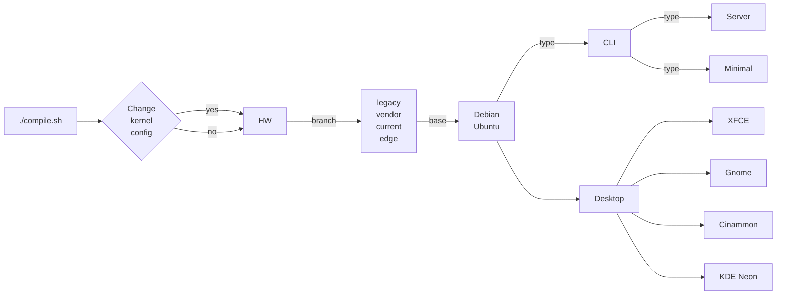

# 概述

:::tip
本章介绍 Armbian 构建系统的核心能力、主要优势以及整体目录结构，帮助你快速了解 Armbian 构建系统能做什么。
:::

## 1. 它能做什么？

- 构建针对低资源硬件优化的定制化 **内核**、**镜像** 或基于 Debian 的 Linux **发行版**；
- 包含文件系统生成、底层控制软件、内核镜像以及 **引导加载程序** 的编译；
- 通过在不同平台间保持系统标准，提供 **一致的用户体验**。



## 2. 主要优势

- 具备交互式图形界面，简单易用；
- 生成广泛认可且维护良好的用户空间；
- 复杂操作的学习曲线平缓。

以下是与业界主流标准构建软件相比的其他异同点、优势和劣势。

| 功能 | Armbian | Yocto | Buildroot |
| :--- | :--- | :--- | :--- |
| 目标用途 | 通用 | 嵌入式 | 嵌入式 / 物联网 |
| U-boot 和内核 | 从源码编译 | 从源码编译 | 从源码编译 |
| 板级支持维护 | 完整 | 外部 | 外部 |
| 根文件系统 | 基于 Debian 或 Ubuntu | 定制 | 定制 |
| 包管理器 | APT | 任意 | 无 |
| 可配置性 | 有限 | 强大 | 强大 |
| Initramfs 支持 | 是 | 是 | 是 |
| 上手难度 | 快速 | 非常慢 | 较慢 |
| 交叉编译 | 支持 | 支持 | 支持 |

## 3. 框架结构

```text
├── cache                                工作 / 缓存目录
│   ├── aptcache                         软件包
│   ├── ccache                           C/C++ 编译器缓存
│   ├── docker                           Docker 最新拉取
│   ├── git-bare                         精简版 Git
│   ├── git-bundles                      完整版 Git
│   ├── initrd                           内存磁盘
│   ├── memoize                          Git 状态
│   ├── patch                            内核驱动补丁
│   ├── pip                              Python
│   ├── rootfs                           压缩的用户空间
│   ├── sources                          内核、u-boot 及其他源码
│   ├── tools                            附加工具（如 ORAS）
│   └── utility
├── config                               软件包仓库配置
│   ├── targets.conf                     开发板构建目标配置
│   ├── boards                           开发板配置
│   ├── bootenv                          各系列初始引导加载程序环境
│   ├── bootscripts                      各系列初始引导加载程序脚本
│   ├── cli                              各发行版 CLI 软件包配置
│   ├── desktop                          各发行版桌面软件包配置
│   ├── distributions                    发行版设置
│   ├── kernel                           各系列内核构建配置
│   ├── sources                          内核和 u-boot 源码位置及脚本
│   ├── templates                        填充 userpatches 的用户配置模板
│   └── torrents                         外部编译器和 rootfs 缓存种子
├── extensions                           通过特定功能扩展构建系统
├── lib                                  主要构建框架库
│   ├── functions
│   │   ├── artifacts
│   │   ├── bsp
│   │   ├── cli
│   │   ├── compilation
│   │   ├── configuration
│   │   ├── general
│   │   ├── host
│   │   ├── image
│   │   ├── logging
│   │   ├── main
│   │   └── rootfs
│   └── tools
├── output                               构建产物
│   ├── deb                              Deb 软件包
│   ├── images                           可引导镜像 - RAW 或压缩格式
│   ├── debug                            补丁和构建日志
│   ├── config                           内核配置导出位置
│   └── patch                            已创建补丁的位置
├── packages                             支持脚本、二进制 blob、软件包
│   ├── blobs                            壁纸、各种配置、闭源引导加载程序
│   ├── bsp-cli                          自动添加到 armbian-bsp-cli 软件包
│   ├── bsp-desktop                      自动添加到 armbian-bsp-desktop 软件包
│   ├── bsp                              rootfs 的脚本和配置叠加层
│   └── extras-buildpkgs                 可选的编译和打包引擎
├── patch                                补丁集合
│   ├── atf                              ARM 可信固件
│   ├── kernel                           Linux 内核补丁
│   │   └── family-branch                按内核系列和分支划分
│   ├── misc                             Linux 内核打包补丁
│   └── u-boot                           通用引导加载程序补丁
│       ├── u-boot-board                 针对特定开发板
│       └── u-boot-family                针对整个内核系列
├── tools                                处理内核补丁和配置的工具
└── userpatches                          用户：配置补丁区域
    ├── config-example.conf              用户：用户配置示例文件
    ├── customize-image.sh               用户：镜像封装前执行的脚本
    ├── atf                              用户：ARM 可信固件
    ├── extensions                       用户：通过特定功能扩展构建系统
    ├── kernel                           用户：按内核系列划分的 Linux 内核
    ├── misc                             用户：杂项
    └── u-boot                           用户：通用引导加载程序补丁
```
