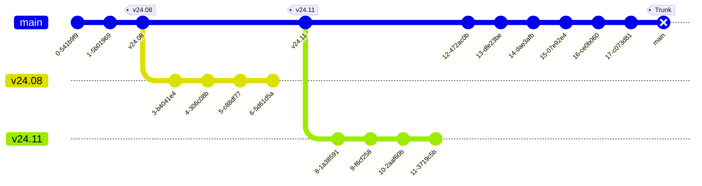

# 构建准备

:::tip
本章介绍搭建 Armbian 构建环境所需的软硬件要求，以及构建前需要完成的准备工作。
:::

## 1. 系统要求

- x86_64 / aarch64 / riscv64 架构的机器
- 至少 8GB 内存（非 [BTF](https://docs.kernel.org/bpf/btf.html) 构建可更少）和约 50GB 磁盘空间，可用于虚拟机、容器或裸机安装
- **Armbian / Ubuntu Noble 24.04.x** 用于原生构建，或任何支持 Docker 的 Linux 发行版用于容器化构建
- **Windows 10/11 + WSL2 子系统**，运行 Armbian / Ubuntu Noble 24.04.x
- 超级用户权限（已配置的 sudo 或 root 访问权限）
- 请确保系统为最新版本！例如，过时的 Docker 二进制文件可能会导致问题

## 2. 克隆代码仓库

```bash
git clone https://github.com/armbian/build
cd build
```

:::info
- 请确保构建脚本的完整路径**不包含空格**
- 如需使用稳定分支，请使用最新的点版本 `--branch=v24.11`
:::



## 3. 交互式构建

运行构建框架：

```bash
./compile.sh
```

## 4. 命令行（CLI）

```bash
./compile.sh [命令] [开关...] [配置...]
```

每次只能指定一个命令。

**开关（Switches）** 是构建框架本身（例如 `DEBUG=yes`）或特定命令使用的参数设置。

**配置文件** 是按指定顺序加载的 bash shell 脚本，主要用于设置开关，但也可以设置钩子函数。它们必须位于 `userpatches` 目录中，且必须命名为 `config-${arg}.conf` 或 `config-${arg}.conf.sh`（其中 `${arg}` 是命令行参数）：二者选其一，不可同时使用。

命令行上设置的开关会覆盖配置文件中的设置，无论它们在命令行上的出现顺序如何。

完整的构建 [命令](./3_BuildCommands.md) 和 [开关](./4_BuildSwitches.md) 列表请参考相关文档。

### 4.1 示例

```bash
./compile.sh build \
BOARD=uefi-x86 \
BRANCH=current \
BUILD_DESKTOP=yes \
BUILD_MINIMAL=no \
DESKTOP_APPGROUPS_SELECTED='browsers chat desktop_tools' \
DESKTOP_ENVIRONMENT=gnome \
DESKTOP_ENVIRONMENT_CONFIG_NAME=config_base \
KERNEL_CONFIGURE=no \
RELEASE=noble
```

或者，使用已设置好所有开关的配置文件 `userpatches/config-myboard.conf`：

```bash
./compile.sh build myboard
```

### 4.2 含义说明

以上命令将为基于 Intel 的硬件（**uefi-x86**）生成基于 **Ubuntu 24.04 Noble** 的 **Gnome 桌面**环境镜像。除基础桌面外，镜像还将包含 **browsers**（浏览器）和 **desktop_tools**（桌面工具）分组中的软件包，并使用 **current** 内核分支中未经修改的内核。

### 4.3 故障排除："unknown terminal type" 错误

运行脚本时，尤其是在使用现代终端模拟器（如 Ghostty、Kitty、WezTerm）时，可能会遇到类似以下错误：

```text
'xterm-ghostty': unknown terminal type
```

**快速解决方法：** 可以在运行脚本前强制指定更通用的终端类型：

```bash
env TERM=xterm-256color ./compile.sh
```

## 5. 日志

日志写入 **output/logs** 目录。旧日志（当前构建之外的所有日志）会被压缩并移至 **output/logs/archive**。

日志格式包括：

- ANSI — 带 ANSI 转义码的彩色文本 — `*.log.ans`
- ASCII（如果安装了 ansi2txt）— 不带颜色转义码的纯文本 — `*.log`
- Markdown 摘要 — `*.md`
- Raw（如果设置了 `RAW_LOG=yes`）— 包含所有原始日志的 tar 文件 — `*.raw.tar`

如需更详细的日志，请设置开关 `DEBUG=yes`。

## 6. GitHub Actions

如果你没有合适的设备自行构建镜像，可以使用 Armbian 官方的 [GitHub Action](https://github.com/marketplace/actions/rebuild-armbian)。

### 6.1 最小工作流示例

在你的仓库中创建 `.github/workflows/build.yml`：

```yaml
name: Build Armbian Image
on:
  workflow_dispatch:

jobs:
  build:
    runs-on: ubuntu-latest # ubuntu-24.04-arm, ubuntu-24.04-riscv
    steps:
      - uses: armbian/build@main
        with:
          armbian_token: ${{ secrets.GITHUB_TOKEN }}
          armbian_board: "uefi-x86" # orangepi5 bananapif3
          armbian_release: "noble" # trixie
          armbian_target: "build"
          armbian_ui: "minimal" # server xfce
          armbian_runner_clean: "yes" # 推荐用于 GitHub 运行器
```

该 Action 将构建镜像，在你的仓库中创建 GitHub Release，并上传构建产物。

### 6.2 输入参数参考

| 输入参数 | 必填 | 默认值 | 说明 |
| :--- | :--- | :--- | :--- |
| `armbian_token` | **是** | — | GitHub 访问令牌（`GITHUB_TOKEN` 或 PAT） |
| `armbian_board` | 否 | `uefi-x86` | 硬件平台（例如 `orangepi5`、`rock-5b`） |
| `armbian_target` | 否 | `kernel` | 构建目标：`kernel`（内核）或 `build`（完整镜像） |
| `armbian_branch` | 否 | `main` | Armbian 框架分支 |
| `armbian_kernel_branch` | 否 | `current` | 内核分支：`current`、`edge` 等 |
| `armbian_release` | 否 | `noble` | 用户空间发行版（例如 `noble`、`bookworm`、`trixie`） |
| `armbian_ui` | 否 | `minimal` | `minimal`、`server`，或桌面环境名称（例如 `xfce`、`gnome`） |
| `armbian_version` | 否 | *自动* | 覆盖版本号；若未设置，补丁级别将从 `stable.json` 自动递增 |
| `armbian_compress` | 否 | `sha,img,xz` | 输出压缩方式 |
| `armbian_extensions` | 否 | — | 以逗号分隔的要启用的构建扩展列表 |
| `armbian_pgp_key` | 否 | — | 用于镜像签名的 GPG 私钥（请以密文存储） |
| `armbian_pgp_password` | 否 | — | GPG 密码短语（请以密文存储） |
| `armbian_release_title` | 否 | `Armbian image` | GitHub Release 标题 |
| `armbian_release_body` | 否 | *（指向构建工具的链接）* | GitHub Release 正文内容 |
| `armbian_release_tag` | 否 | *自动* | GitHub Release 标签；默认为计算出的版本号 |
| `armbian_artifacts` | 否 | `build/output/images/` | 待上传产物的路径 |
| `armbian_runner_clean` | 否 | — | 设置为任意非空值可在 GitHub 托管运行器上释放磁盘空间 |

### 6.3 自定义配置

如果你的仓库中包含 `userpatches/` 目录，它将自动合并到构建框架中。这样你就可以添加自定义内核配置、补丁或覆盖文件，而无需 fork 主构建仓库。
