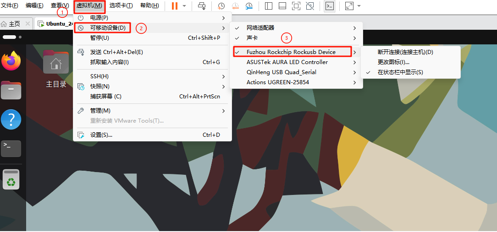
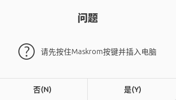
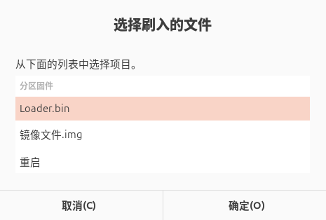
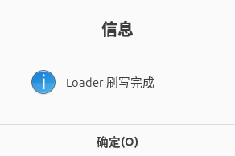
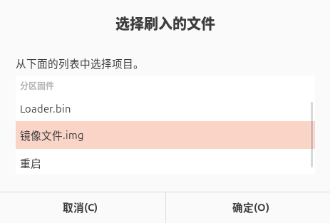
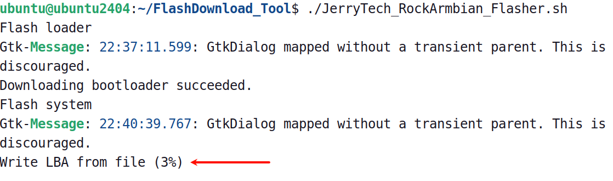
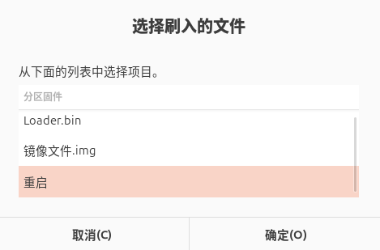

# 在Linux下烧录ArmBian系统

本章将讲解如何在Linux系统内给 dshanpi-a1 烧录 ArmBian 系统。

## 准备工作

### 1. 硬件准备

烧录系统镜像，除了dshanpi-a1板子，还需要准备 **TypeC-3.2 10Gbps速率USB线 、30W PD电源适配器** （建议韦东山店铺购买，其他的没测试）。如下所示：

| TypeC-3.2 10Gbps速率USB线：                                  | 30W PD电源适配器：                                           |
| ------------------------------------------------------------ | ------------------------------------------------------------ |
|  |  |

### 2. 软件下载

软件上，我们需要在 PC 端下载 **系统镜像、烧录工具和引导固件** ，也可以在Linux下使用wget命令下载。下载链接如下：

> 按住 `ctrl` 键，鼠标 `左键` 点击链接，即可一键下载

- **ArmBianOS 系统镜像：** [DshanPi-A1_ArmbianOS](https://dl.100ask.net/Hardware/MPU/RK3576-DshanPi-A1/100ASK_Armbian_25.11.0-trunk_Dshanpi-a1_noble_vendor_6.1.115_gnome_desktop.img.7z)
- **烧录工具 FlashDownload_Tool：**  [FlashDownload_Tool.tar.gz](https://dl.100ask.net/Hardware/MPU/RK3576-DshanPi-A1/FlashDownload_Tool.tar.gz)
- **DshanPi-A1 引导固件：** [rk3576_spl_loader_v1.09.107.bin](https://dl.100ask.net/Hardware/MPU/RK3576-DshanPi-A1/rk3576_spl_loader_v1.09.107.bin)

## 系统镜像烧录

准备工作完成后，

① 接上 **usb3.0 otg** 线（数据线另一端接电脑的 USB3.0 蓝色接口），

② 按住 **`MASKROM`** 按键，**先不松开** ，

③ 再接上电源，dshanpi-a1 就会进入 **`MASKROM`** 烧录模式。参照下图操作：

### 运行烧录工具

这里以 Ubuntu24 虚拟机为例，需要确保设备连接到虚拟机上，如下：

打开烧录工具 ，执行以下指令：

~~~bash
cd FlashDownload_Tool/
sudo chmod +x JerryTech_RockArmbian_Flasher.sh
./JerryTech_RockArmbian_Flasher.sh
~~~

执行脚本之后，会出现以下画面：

前面进入了 Maskrom 模式，这里选择是，接着会进入如下画面：

选择 Loader.bin，点击 确定，找到 `rk3576_spl_loader_v1.09.107.bin`，等待烧录完成，如下：

Loader.bin 烧录完成后，点击确定，接着烧录系统镜像，如下：

找到系统镜像`100ASK_xxx.img`，等待烧录完成，如下：

开始烧录后，需要给点耐心，等待 **下载完成** ，即表明烧录完成。

点击确定，最后 重启设备，即可完成系统烧录操作。

