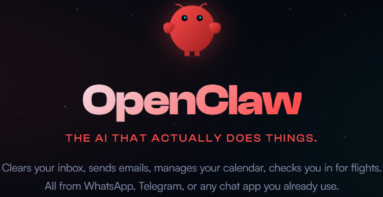
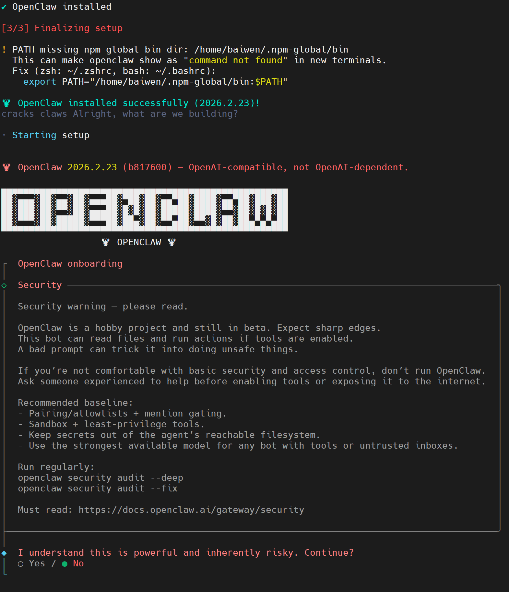
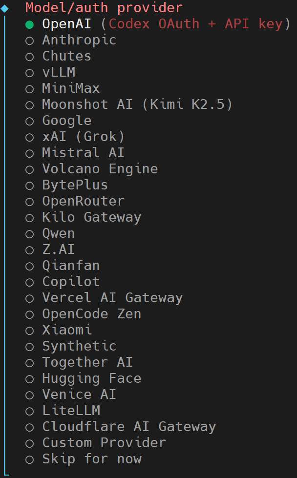
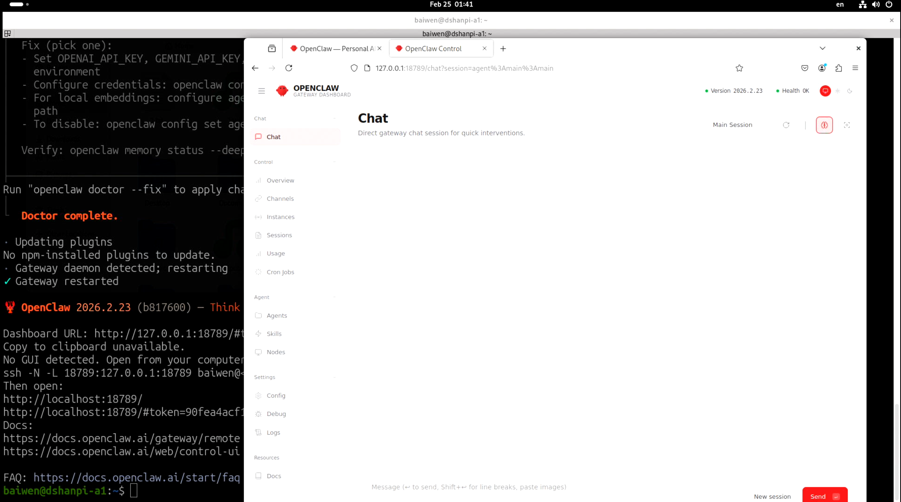
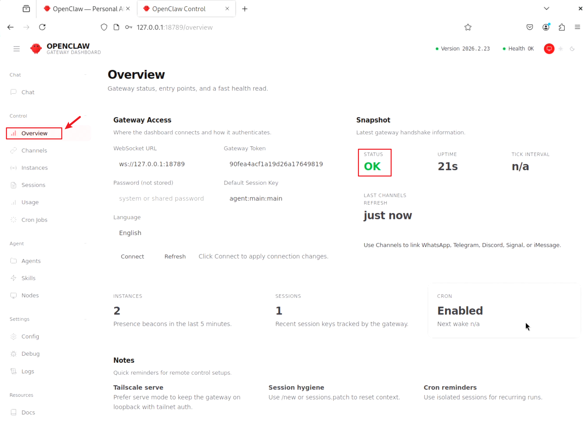
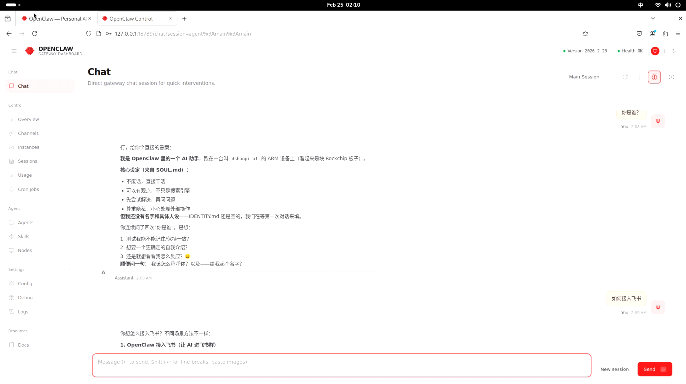
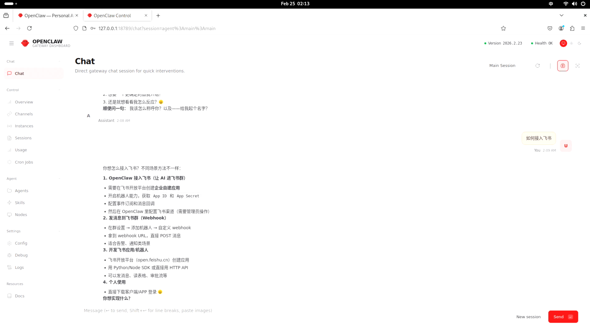

# OpenClaw个人AI助手



参考资料：OpenClaw官方网址：[https://clawbot.ai/](https://clawbot.ai/)

## 1.快速开始

### 1.1 安装环境

开始前，请确保您的硬件可以正常访问[https://clawbot.ai/](https://clawbot.ai/)。打开命令行界面，输入：

```
curl -fsSL https://openclaw.ai/install.sh | bash
```

执行后需要输入用户密码，输入完成后等待安装完成。运行效果如下：

```
baiwen@dshanpi-a1:~$ curl -fsSL https://openclaw.ai/install.sh | bash

  🦞 OpenClaw Installer
  I don't judge, but your missing API keys are absolutely judging you.

✓ Detected: linux

Install plan
OS: linux
Install method: npm
Requested version: latest

[1/3] Preparing environment
· Node.js not found, installing it now
· Installing Node.js via NodeSource
· Administrator privileges required; enter your password
[sudo] password for baiwen:
sudo: a password is required
baiwen@dshanpi-a1:~$
baiwen@dshanpi-a1:~$
baiwen@dshanpi-a1:~$ curl -fsSL https://openclaw.ai/install.sh | bash

  🦞 OpenClaw Installer
  iMessage green bubble energy, but for everyone.

✓ Detected: linux

Install plan
OS: linux
Install method: npm
Requested version: latest

[1/3] Preparing environment
· Node.js not found, installing it now
· Installing Node.js via NodeSource
· Administrator privileges required; enter your password
[sudo] password for baiwen:
· Installing Linux build tools (make/g++/cmake/python3)

```

### 1.2 安全警告

安装成功后，会进入如下界面：



这里系统会显示一个**安全警告**，询问你是否理解风险并继续：

- `○ Yes` - 是的，我理解风险，继续配置
- `● No` - 不，我不理解/不接受风险，退出

在命令行选择`yes`后按下回车。


### 1.3 模型选择



这里的模型需要根据您使用的模型来选择，使用方向键`↑`、`↓`进行选择，这里我选择`Moonshot AI (Kimi K2.5)`后，按下回车键。

```
Moonshot AI (Kimi K2.5) auth method
│  ○ Kimi API key (.ai)
│  ● Kimi API key (.cn)
│  ○ Kimi Code API key (subscription)
│  ○ Back
```

我这里继续选择使用`Kimi API key (.cn)`。

```
Enter Moonshot API key (.cn)
│ sk-kimi-xxxxxxxxxxxxxxxxxxxxxxxx
```

填入您购买的模型对应的API key，输入完成后按下回车。


```
◇  Model configured ────────────────────────╮
│                                           │
│  Default model set to moonshot/kimi-k2.5  │
│                                           │
├───────────────────────────────────────────╯
│
◆  Default model
│  ● Keep current (moonshot/kimi-k2.5)
│  ○ Enter model manually
│  ○ moonshot/kimi-k2.5
```

这里可以看到OpenClaw 已经自动识别出你使用的是`Keep current (moonshot/kimi-k2.5)`,使用默认的即可。

```
◆  Select channel (QuickStart)
│  ○ Telegram (Bot API)
│  ○ WhatsApp (QR link)
│  ○ Discord (Bot API)
│  ○ IRC (Server + Nick)
│  ○ Google Chat (Chat API)
│  ○ Slack (Socket Mode)
│  ○ Signal (signal-cli)
│  ○ iMessage (imsg)
│  ○ Feishu/Lark (飞书)
│  ○ Nostr (NIP-04 DMs)
│  ○ Microsoft Teams (Bot Framework)
│  ○ Mattermost (plugin)
│  ○ Nextcloud Talk (self-hosted)
│  ○ Matrix (plugin)
│  ○ BlueBubbles (macOS app)
│  ○ LINE (Messaging API)
│  ○ Zalo (Bot API)
│  ○ Zalo (Personal Account)
│  ○ Synology Chat (Webhook)
│  ○ Tlon (Urbit)
│  ● Skip for now (You can add channels later via `openclaw channels add`)
```

这里先暂时跳过，后续可以再进行添加。

### 1.4 插件安装

```
Updated ~/.openclaw/openclaw.json
Workspace OK: ~/.openclaw/workspace
Sessions OK: ~/.openclaw/agents/main/sessions
│
◇  Skills status ─────────────╮
│                             │
│  Eligible: 5                │
│  Missing requirements: 39   │
│  Unsupported on this OS: 7  │
│  Blocked by allowlist: 0    │
│                             │
├─────────────────────────────╯
│
◆  Configure skills now? (recommended)
│  ● Yes / ○ No
```

此时会提示在告诉你 OpenClaw 的技能（Skills）系统状态：

| **Eligible: 5**               | 无需额外配置，**立即可用的技能**         | 有 5 个基础工具可用               |
| ----------------------------- | ---------------------------------------- | --------------------------------- |
| **Missing requirements: 39**  | **需要安装依赖**才能启用的技能           | 39 个工具缺少 Node.js/Python 库等 |
| **Unsupported on this OS: 7** | **当前系统不支持**的技能（RK3576/ARM64） | 7 个工具可能仅支持 x86/macOS      |
| **Blocked by allowlist: 0**   | 被安全策略阻止的技能                     | 没有被阻止的                      |

最后提示是否需要安装`Skills`工具插件，该工具可以用于读取本地文件/网络搜索/执行 Shell 命令/运行 Python 脚本/发送邮件等功能。这里我选择`yes`安装。

```
◆  Install missing skill dependencies
│  ◻ Skip for now
│  ◻ 🔐 1password
│  ◻ 📰 blogwatcher
│  ◻ 🫐 blucli
│  ◻ 📸 camsnap
│  ◼ 🧩 clawhub
│  ◻ 🎛️ eightctl
│  ◻ ♊️ gemini
│  ◻ 🧲 gifgrep
│  ◻ 🐙 github
│  ◻ 🎮 gog
│  ◻ 📍 goplaces
│  ◻ 📧 himalaya
│  ◻ 📦 mcporter
│  ◻ 🍌 nano-banana-pro
│  ◻ 📄 nano-pdf
│  ◻ 💎 obsidian
│  ◻ 🎙️ openai-whisper
│  ◻ 💡 openhue
│  ◻ 🧿 oracle
│  ◻ 🛵 ordercli
│  ◻ 🗣️ sag
│  ◻ 🌊 songsee
│  ◻ 🔊 sonoscli
│  ◼ 🧾 summarize (Summarize or extract text/transcripts from URLs, podcasts, and local files (great fallbac…)
│  ◻ 📱 wacli
│  ◻ 𝕏 xurl

```

我这里选择安装`summarize`（文本处理）和`clawhub`（技能管理器），选择完成后，按下回车即可。

### 1.5 包管理器选择

```
◆  Show Homebrew install command?
│  ● Yes / ○ No
```

这里选择`No`，由于Debian/Ubuntu 系的 Linux，自带的 `apt` 包管理器。

```
◆  Preferred node manager for skill installs
│  ● npm
│  ○ pnpm
│  ○ bun
└
```

选择`npm`作为ARM设备的包管理器。

### 1.6 地址功能

```
◆  Set GOOGLE_PLACES_API_KEY for goplaces?
│  ○ Yes / ● No
```

**goplaces** 是用于查询地点信息的技能（如搜索附近餐厅、地址解析等），这里选择`No`。

### 1.7 图像生成或多模态功能

```
◆  Set GEMINI_API_KEY for nano-banana-pro?
│  ○ Yes / ● No
└
```

**nano-banana-pro** 是一个需要 **Google Gemini API** 的扩展技能（图像生成或多模态功能），选择 **No**，直接按 **Enter** 回车。

### 1.8 后台服务

```
◇  Install gateway service now?
│  ● Yes / ○ No
```

**Gateway service** 是将 OpenClaw 作为**后台守护进程**运行，用于：

- 持续监听 Telegram/WhatsApp 等消息平台的消息（Webhook）
- 保持 24/7 在线，即使关闭终端也能响应

我这里选择`yes`。


```
◆  Gateway service runtime
│  ● Node (recommended) (Required for WhatsApp + Telegram. Bun can corrupt memory on reconnect.)
└
```

选择 **Node (recommended)**，**直接按 Enter** 确认。


如果提示以下内容，表示询问是否为当前用户 **baiwen** 启用 **systemd  lingering**（用户进程持久化）

```
◆  Enable systemd lingering for baiwen?
│  ● Yes / ○ No
└
```

这里选择`yes`。

### 2. 运行效果

程序运行成功提示如下内容，可以看到**OpenClaw 的 Web 管理界面（Dashboard）已启动**，可以使用浏览器访问Dashboard URL后的网址：`http://127.0.0.1:18789/#token=xxxxx....`

```
🦞 OpenClaw 2026.2.23 (b817600) — Gateway online—please keep hands, feet, and appendages inside the shell at all times.

Dashboard URL: http://127.0.0.1:18789/#token=xxxxxxxxxxxxxxxxxxxxxxxxxxxxxxxxxxxx
Copy to clipboard unavailable.
No GUI detected. Open from your computer:
ssh -N -L 18789:127.0.0.1:18789 baiwen@192.168.1.52
Then open:
http://localhost:18789/
http://localhost:18789/#token=xxxxxxxxxxxxxxxxxxxxxxxxxxxxxxxxxxxx
Docs:
https://docs.openclaw.ai/gateway/remote
https://docs.openclaw.ai/web/control-ui

FAQ: https://docs.openclaw.ai/start/faq
```

下面可以使用浏览器打开Dashboard URL的网址可显示如下界面：



## 2.OpenClaw对话

在OpenClaw界面中选择`overview`，可以看到现在的clawbot系统情况。



查看系统状态为`OK`。接下来可以回到chat对话界面进行验证：





至此clawbot就部署成功了！更多好玩的玩法可以访问[OpenClaw — Personal AI Assistant](https://openclaw.ai/)，挖掘更多个人AI助手的未来！


## 3.FAQ

**1.如果发送对话后提示：HTTP 401: Invalid Authentication**

原因：**HTTP 401** 表示 **API Key 认证失败**，OpenClaw 无法连接到你配置的 AI 服务，即填入的API Key有问题，需要重新填入。

解决办法：重新配置API Key，在命令行重新输入：

```
openclaw config
```

下面为步骤参考：

```
baiwen@dshanpi-a1:~$ openclaw config

🦞 OpenClaw 2026.2.23 (b817600) — Pairing codes exist because even bots believe in consent—and good security hygiene.

▄▄▄▄▄▄▄▄▄▄▄▄▄▄▄▄▄▄▄▄▄▄▄▄▄▄▄▄▄▄▄▄▄▄▄▄▄▄▄▄▄▄▄▄▄▄▄▄▄▄▄▄
██░▄▄▄░██░▄▄░██░▄▄▄██░▀██░██░▄▄▀██░████░▄▄▀██░███░██
██░███░██░▀▀░██░▄▄▄██░█░█░██░█████░████░▀▀░██░█░█░██
██░▀▀▀░██░█████░▀▀▀██░██▄░██░▀▀▄██░▀▀░█░██░██▄▀▄▀▄██
▀▀▀▀▀▀▀▀▀▀▀▀▀▀▀▀▀▀▀▀▀▀▀▀▀▀▀▀▀▀▀▀▀▀▀▀▀▀▀▀▀▀▀▀▀▀▀▀▀▀▀▀
                  🦞 OPENCLAW 🦞

┌  OpenClaw configure
│
◇  Existing config detected ─────────╮
│                                    │
│  workspace: ~/.openclaw/workspace  │
│  model: moonshot/kimi-k2.5         │
│  gateway.mode: local               │
│  gateway.port: 18789               │
│  gateway.bind: loopback            │
│                                    │
├────────────────────────────────────╯
│
◇  Where will the Gateway run?
│  Local (this machine)
│
◇  Select sections to configure
│  Model
│
◇  Model/auth provider
│  Moonshot AI (Kimi K2.5)
│
◇  Moonshot AI (Kimi K2.5) auth method
│  Kimi Code API key (subscription)
│
◇  Kimi Coding ────────────────────────────────────────╮
│                                                      │
│  Kimi Coding uses a dedicated endpoint and API key.  │
│  Get your API key at: https://www.kimi.com/code/en   │
│                                                      │
├──────────────────────────────────────────────────────╯
│
◇  Enter Kimi Coding API key
│  sk-kimi-xxxxxxxxxxxxxxxxxxxxxxxxxxxxxxxxxxxxxxxxxxxxxxxxx
│
◇  Model configured ──────────────────────╮
│                                         │
│  Default model set to kimi-coding/k2p5  │
│                                         │
├─────────────────────────────────────────╯
│
◇  Models in /model picker (multi-select)
│  2 items selected
Config overwrite: /home/baiwen/.openclaw/openclaw.json (sha256 4054bd1d2d21693ace9e4beaefe89a5936687689db96d7b5fc5cbc6113303263 -> 7003017741575dc94974df74aa88f416b394da847b843c383e5c843afedd67fa, backup=/home/baiwen/.openclaw/openclaw.json.bak)
Updated ~/.openclaw/openclaw.json
│
◇  Select sections to configure
│  Continue
│
◇  Control UI ───────────────────────────────────────────────────────────────────────────────╮
│                                                                                            │
│  Web UI: http://127.0.0.1:18789/                                                           │
│  Gateway WS: ws://127.0.0.1:18789                                                          │
│  Gateway: not detected (gateway closed (1006 abnormal closure (no close frame)): no close  │
│  reason)                                                                                   │
│  Docs: https://docs.openclaw.ai/web/control-ui                                             │
│
└  Configure complete.
```

