# OpenFang系统级AI员工

参考资料：

- [OpenFang — The Agent Operating System](https://www.openfang.sh/)
- [RightNow-AI/openfang: Open-source Agent Operating System](https://github.com/RightNow-AI/openfang)


**OpenFang** 是由 **RightNow-AI** 开源的 **AI Agent 操作系统**（v0.1.0），用 **Rust** 编写（约 13.7 万行代码），目标是让 AI 智能体像 Linux 进程一样被调度、隔离和管理，实现真正的 7×24 小时自主运行。

## 1.环境搭建

开始前，请确保您的硬件可以正常访问[OpenFang — The Agent Operating System](https://www.openfang.sh/)。打开命令行界面，输入：

```
curl -fsSL https://openfang.sh/install | sh
```

运行效果：

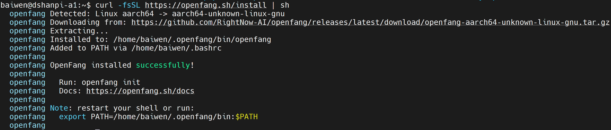


安装OpenSSL库：

```
wget http://ports.ubuntu.com/ubuntu-ports/pool/main/o/openssl1.0/libssl1.0.0_1.0.2n-1ubuntu5.13_arm64.deb

sudo dpkg -i libssl1.0.0_1.0.2n-1ubuntu5.13_arm64.deb

ls -la /usr/lib/aarch64-linux-gnu/libssl.so*
```


## 2.初始化

导入openfang可执行程序环境：

```
export PATH=/home/baiwen/.openfang/bin:$PATH
```

初始化openfang：

```
openfang init
```

执行效果：

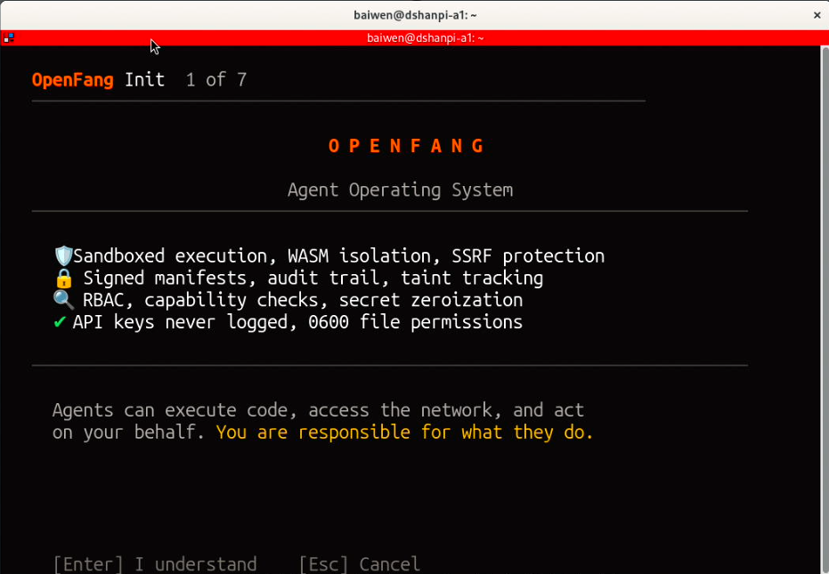

按下回车键，同意安全警告。

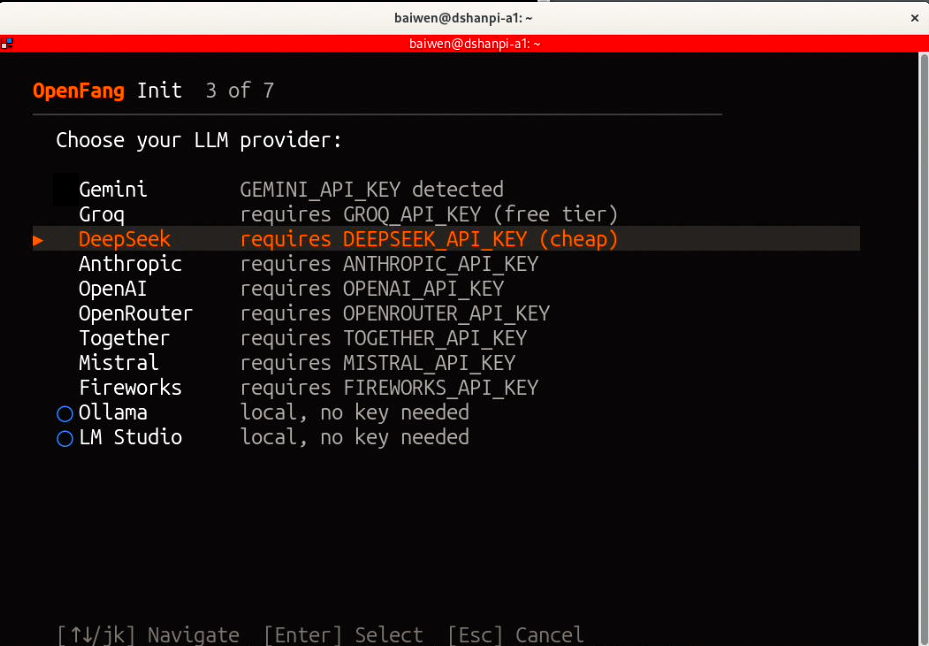

选择AI模型，这里我以DeepSeek模型为例，选择后按下回车。

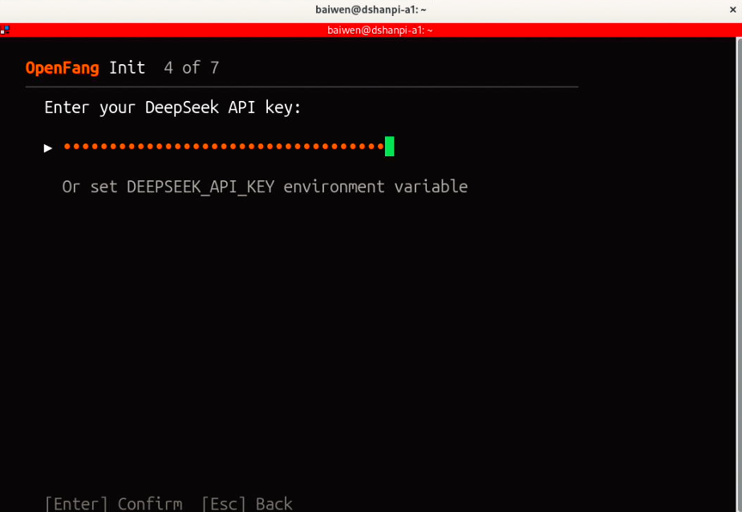

填入gemini获取的API Key。

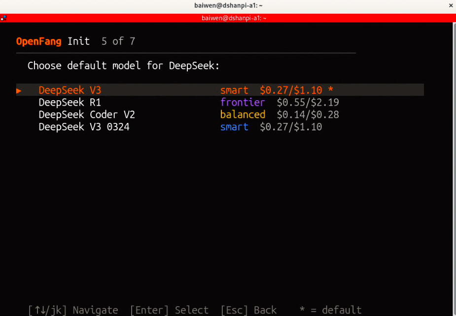

根据自己的需求，选择对应的模型，后面有大致的费用展示。

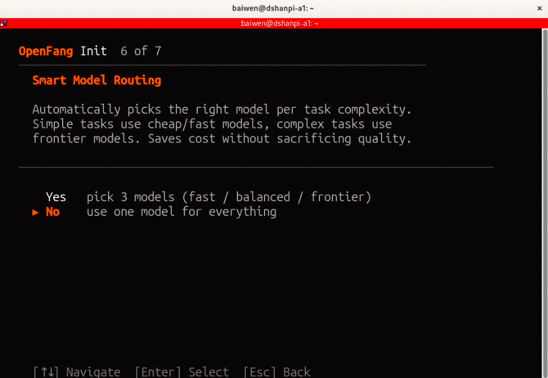

这里为了方便起见，只选择使用一个模型处理任何事情，选择`No`。如果您想选择3个模型处理事情，可以选择`Yes`。

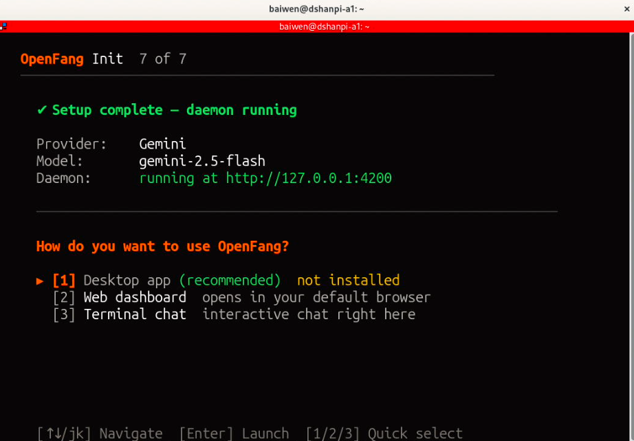

选择对应的模型。

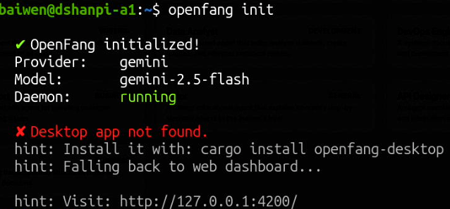

初始化完成后，会自动启动Openfang服务。可以使用浏览器访问`http://127.0.0.1:4200`。

## 3.测试服务

使用系统内置的浏览器访问`http://127.0.0.1:4200`，可进入如下界面：

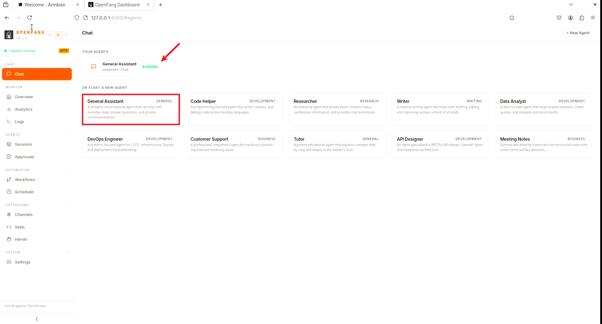

点击正在运行的Agent服务，如果没有可选择红框处的`General Assistant`多功能对话助手。

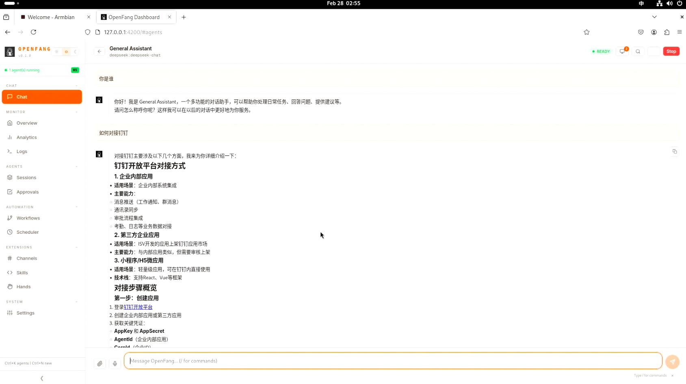


可以点击`Overview`查看系统状态，例如：Agent的运行状态、Token的使用等信息。

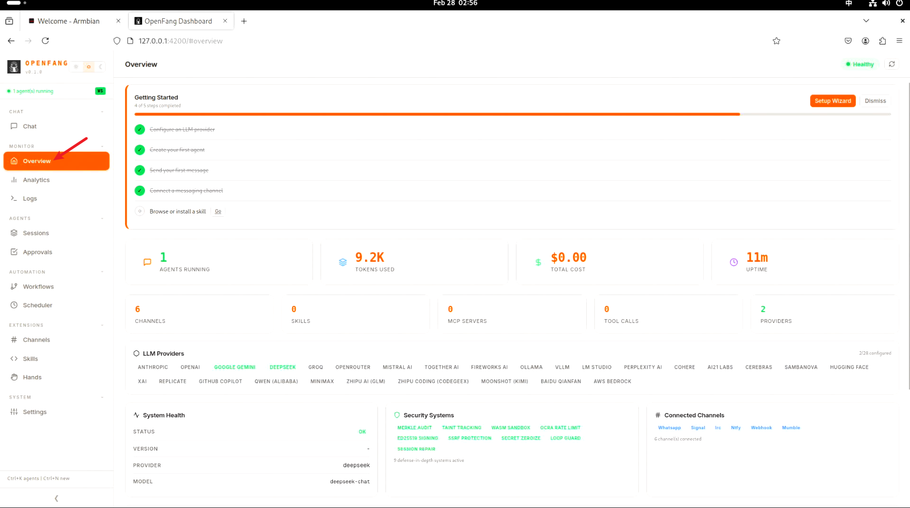

