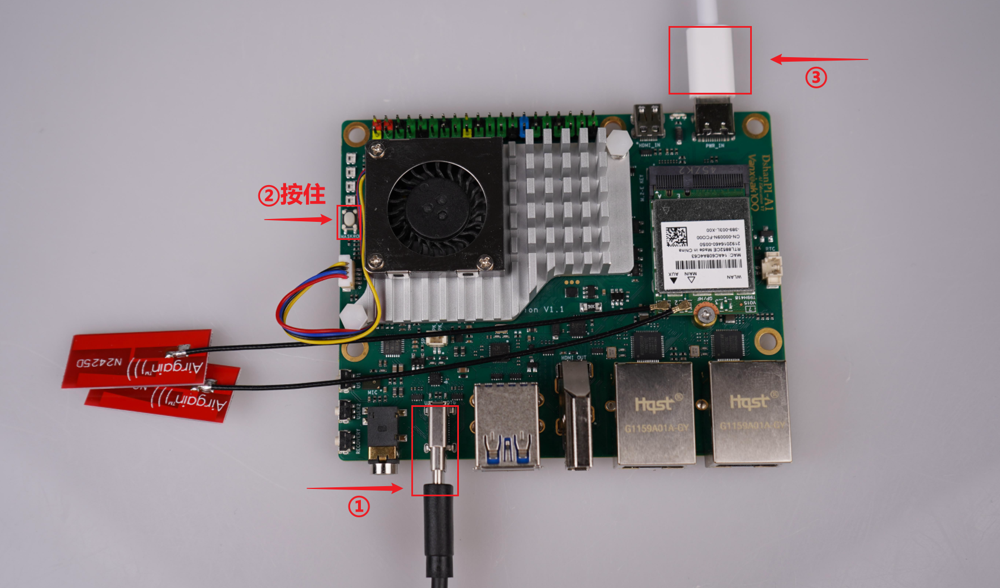
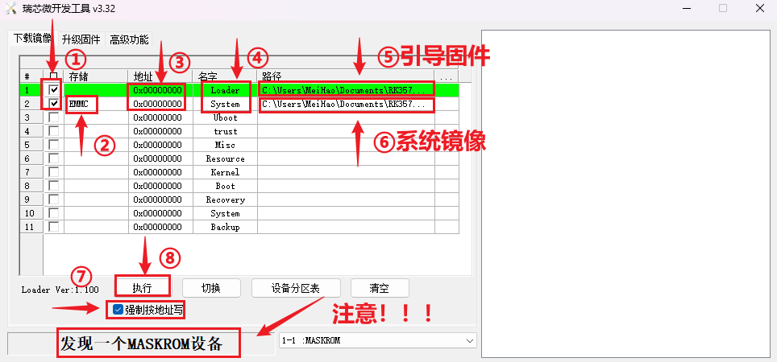
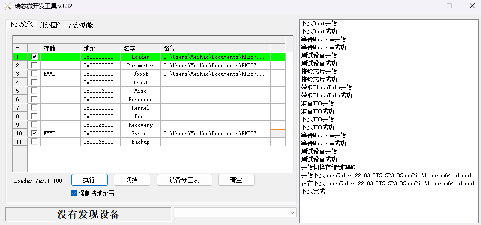
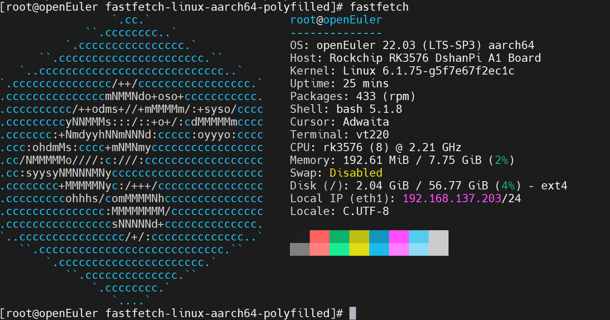

# 烧录OpenEuler系统

本章节将讲解如何把我们提供的 OpenEuler 系统镜像烧录至 EMMC。

## OpenEuler系统简介

openEuler 是一个**面向数字基础设施的开源操作系统**，其内核基于 Linux，由华为发起并捐赠给开放原子开源基金会，现由全球开发者共同维护。它广泛支持**服务器、云计算、边缘计算、嵌入式**等多种应用场景，并特别注重对**多样性计算架构**（如鲲鹏、ARM、x86、RISC-V 等）的支持。

## 准备工作

### 1. 硬件准备

烧录系统镜像，除了dshanpi-a1板子，还需要准备 **TypeC-3.2 10Gbps速率USB线 、30W PD电源适配器** （建议韦东山店铺购买，其他的没测试）。如下所示：

| TypeC-3.2 10Gbps速率USB线：                                  | 30W PD电源适配器：                                           |
| ------------------------------------------------------------ | ------------------------------------------------------------ |
|  |  |

### 2. 软件下载

软件上，我们需要在 PC 端下载 **系统镜像、烧录工具和驱动安装工具包** 。下载链接如下：

> 按住 `ctrl` 键，鼠标 `左键` 点击链接，即可一键下载

- **ArchLinux 系统镜像：** [DshanPi-A1_OpenEuler_Image](https://dl.100ask.net/Hardware/MPU/RK3576-DshanPi-A1/images/openEuler/openEuler-22.03-LTS-SP3-DShanPi-A1-aarch64-alpha1.img.xz)
- **烧录工具 RKDevTool：**  [RKDevTool_Release_v3.32.zip](https://dl.100ask.net/Hardware/MPU/RK3576-DshanPi-A1/RKDevTool_Release_v3.32.zip)
- **驱动安装工具包 DriverAssitant：** [DriverAssitant_v5.1.1.zip](https://dl.100ask.net/Hardware/MPU/RK3576-DshanPi-A1/DriverAssitant_v5.1.1.zip)
- **DshanPi-A1 引导固件：** [rk3576_spl_loader_v1.09.107.bin](https://dl.100ask.net/Hardware/MPU/RK3576-DshanPi-A1/rk3576_spl_loader_v1.09.107.bin)

### 3. 烧录驱动安装

在烧录之前，我们需要先安装烧录驱动，在前面下载的资料里找到驱动安装工具包 **`DriverAssitant_vxxx`** ，打开启动下载程序 **`DriverInstall.exe`** ，点击驱动安装即，如下：

> 如果之前安装过了，这里可以选择跳过。

## 系统镜像烧录

准备工作完成后，

① 接上 **usb3.0 otg** 线（数据线另一端接电脑的 USB3.0 蓝色接口），

② 按住 **`MASKROM`** 按键，**先不松开** ，

③ 再接上电源，dshanpi-a1 就会进入 **`MASKROM`** 烧录模式。参照下图操作：

### 运行烧录工具

打开烧录工具 ，参考下图配置烧录工具：

- ① 勾上前两个选项；
- ② 第二个选项设置为 **`EMMC`** ；
- ③ 地址默认都设置为 **`0x00000000`** ；
- ④ 名字照着上图设置；
- ⑤ Loader的路径设置为前面我们下载的引导固件 **`rk3576_spl_loader_v1.09.107.bin`** ；
- ⑥ Systerm的路径设置为前面我们下载并解压的系统镜像 **`openEuler-22.03-LTS-SP3-DShanPi-A1-aarch64-alpha1.img`** ；
- ⑦ 勾上强制按地址写；
- ⑧ 点击执行（一定要显示为 **MASKROM** 模型才可以烧录）。

开始烧录后，需要给点耐心，等待烧录工具右下角出现 **下载完成** ，即表明烧录完成。

### 启动logs

烧录完成后，会自行启动系统，输入用户名： **root** ，密码： **openeuler** ，如下：

