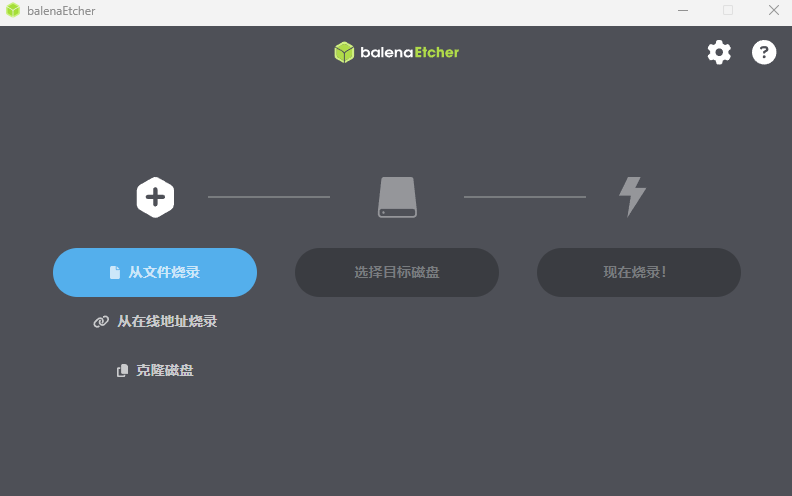
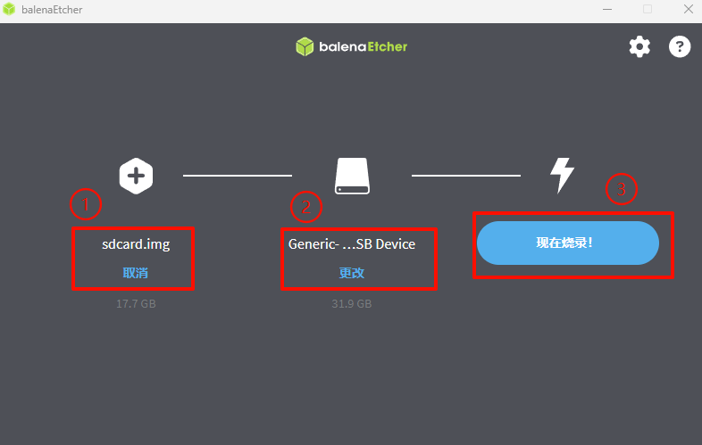
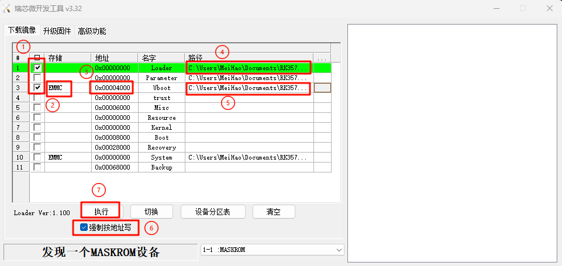
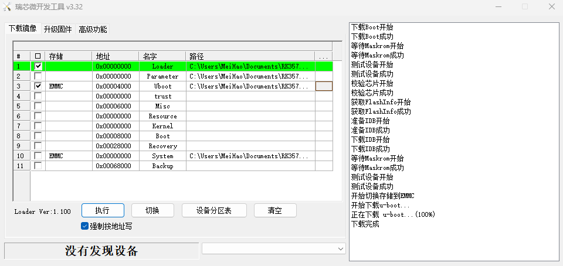
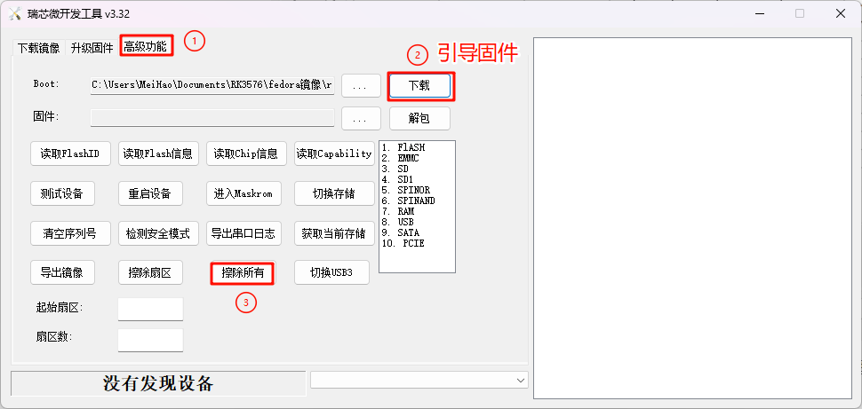
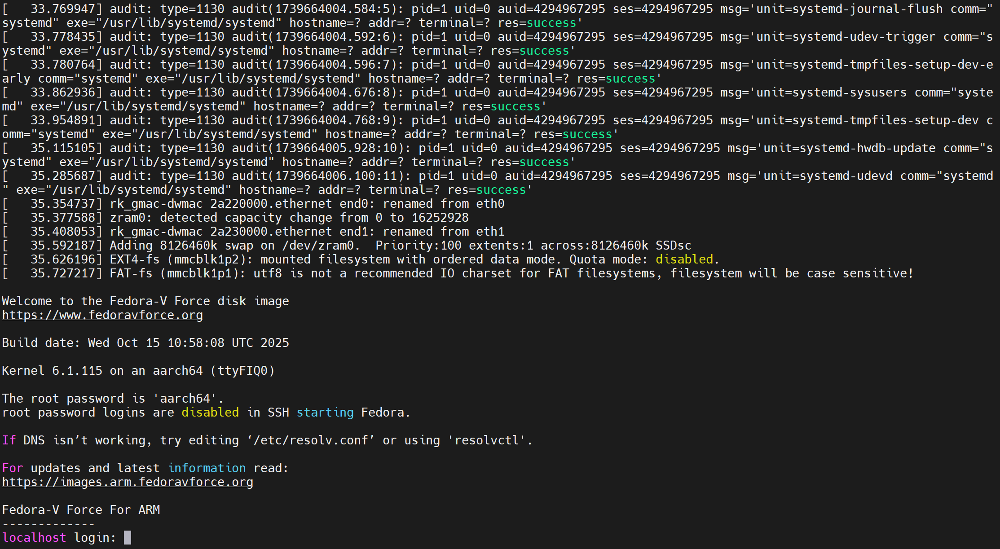
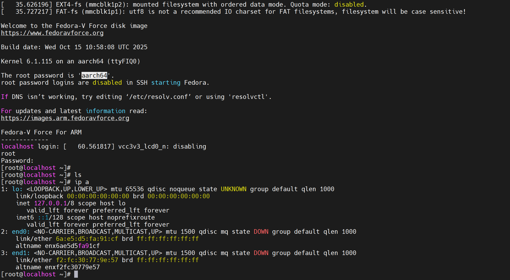

# 烧录Fedora系统

本章节将带领您在 dshanpi-a1 上烧录Fedora系统。

## Fedora系统简介

Fedora 是一个由社区驱动的 Linux 发行版，由 Fedora 项目开发并获 Red Hat 公司赞助。它以集成最新开源技术、快速创新和对上游社区的贡献而闻名，是 Red Hat Enterprise Linux (RHEL) 的上游源。

## 工具准备

烧录Fedora系统之前，先准备以下：

硬件：

- 16G以上的TF卡 * 1

- 读卡器 * 1

软件：

- TF卡烧录工具：[balenaEtcher](https://etcher.balena.io/)
- 瑞芯微烧录工具：[RKDevTool_Release_v3.32.zip](https://dl.100ask.net/Hardware/MPU/RK3576-DshanPi-A1/RKDevTool_Release_v3.32.zip)
- 系统镜像：[Fedora-Minimal-42-20251015101536.aarch64.Rockchi..>](https://dl.100ask.net/Hardware/MPU/RK3576-DshanPi-A1/images/Fedora/Fedora-Minimal-42-20251015101536.aarch64.Rockchip-RK3576.DshanPi-A1.raw.gz)
- u-boot固件：[u-boot.itb](https://dl.100ask.net/Hardware/MPU/RK3576-DshanPi-A1/images/Fedora/u-boot.itb)
- 引导固件：[rk3576_spl_loader_v1.09.107.bin](https://dl.100ask.net/Hardware/MPU/RK3576-DshanPi-A1/rk3576_spl_loader_v1.09.107.bin)

## 制作TF卡镜像

> 在 dshanpi-a1 上运行 Fedora 系统，需要依赖TF卡。

打开下载并安装好的TF卡烧录工具balenaEtcher，如下所示：

接下来，按照下面步骤，制作TF镜像：

① 把准备好的 TF卡 和 读卡器 ，插入PC端的USB口。

② 解压系统镜像 Fedora-Minimal-42-20251015101536.aarch64.Rockchip-RK3576.DshanPi-A1.raw.gz，会得到一个sdcard.img，点击 **“从文件烧录”**  ，选择解压之后的系统镜像 sdcard.img 。

③ 目标磁盘会自动选择插入PC端的TF卡 和 读卡器。点击 **“现在烧录”** 。

## 烧录u-boot固件

打开 瑞芯微烧录工具RKDevTool ，dshanpi-a1 进入 **MASKROM** 模式，参考下图进行设置：

① 勾选上1，3两个勾选框；

② 勾选框3对应的存储设置为 “EMMC” ；

③ 勾选框3对应的地址设置为 “0x00004000” ;

④ 勾选框1对应的路径选择我们下载好的引导固件 `rk3576_spl_loader_v1.09.107.bin` ；

⑤ 勾选框3对应的路径选择我们下载好的u-boot固件 `u-boot.itb` ；

⑥ 勾选上 “强制按地址写” ；

⑦ 点击 “执行” 。

等待一小会，烧录u-boot固件即可完成，如下所示：

需要注意的是，如果 dshanpi-a1 emmc已有其他系统，需先在 **MASKROM** 模式下，擦除所有，再进行烧录u-boot固件步骤。

## 启动系统

u-boot固件烧录完成之后，掉电 dshanpi-a1 ，插入制作好的TF卡系统镜像，打开串口终端，上电 dshanpi-a1，等待系统启动即可，如下：

输入 **root** ，密码：**aarch64** ，就能进入Fedora 系统。

Fedora 系统没有支持 dshanpi-a1 配套的WiFi模块，如果想要联网，需插上网线。

