# 构建自定义系统

## 获取SDK

仓库源码：https://github.com/dshanpi/RK3576-DshanPiA1_LEDE

## 配置开发环境

### 下载vmware

使用浏览器打开网址 https://www.vmware.com/products/workstation-pro/workstation-pro-evaluation.html 参考下图箭头所示，点击下载安装 Windows版本的VMware Workstation ，点击 **DOWNLOAD NOW** 即可开始下载。

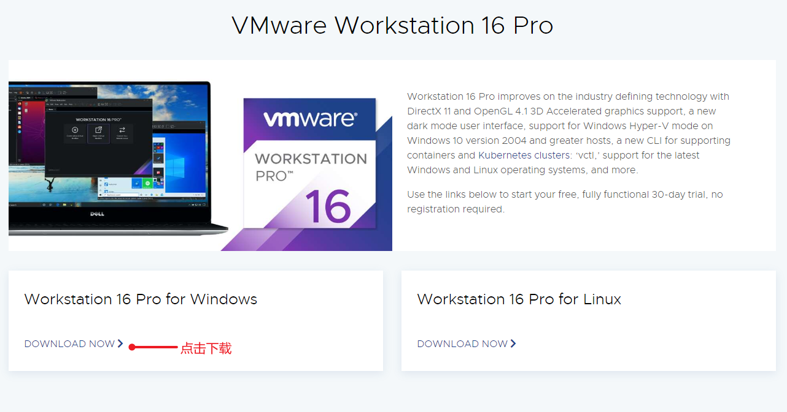

下载完成后全部使用默认配置一步步安装即可。

### 获取Ubuntu24镜像

- 使用浏览器打开 https://www.linuxvmimages.com/images/ubuntu-2404/ 找到如下箭头所示位置，点击 **VMware Image** 下载。


下载过程可能会持续 10 到 30 分钟，具体要依据网速而定。

### 运行虚拟机系统

1. 解压缩 虚拟机系统镜像压缩包，解压缩完成后，可以看到里面有如下两个文件，接下来，我们会使用 后缀名为 .vmx 这个 配置文件。

   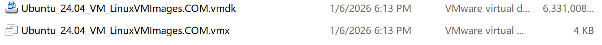

1. 打开已经安装好的 vmware workstation 软件 点击左上角的 **文件** --> **打开** 找到上面的 Ubuntu_24.04_VM_LinuxVMImages.COM.vmx 文件，之后会弹出新的虚拟机对话框页面。

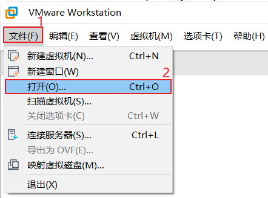

如下图所示为 为我们已经虚拟机的配置界面，那面我们可以 点击 红框 2 编辑虚拟机设置 里面 去调正 我们虚拟机的 内存 大小 和处理器个数，

建议内存为 16GB 及以上，处理器至少8个(因为编译openwrt涉及到C++ 需要足够的CPU核心数和内存支持)，对于硬盘可以设置为512G/1024G， 网络模式设置为 桥接 ，一定要把 显示器的3D 加速图形 显示 选择关掉。

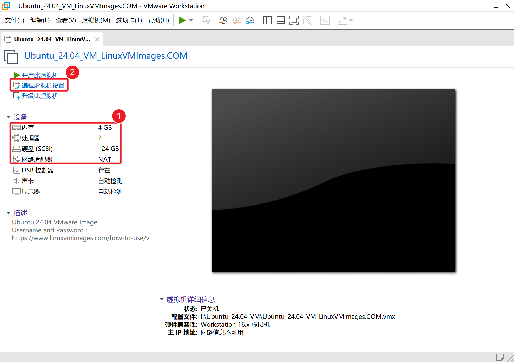

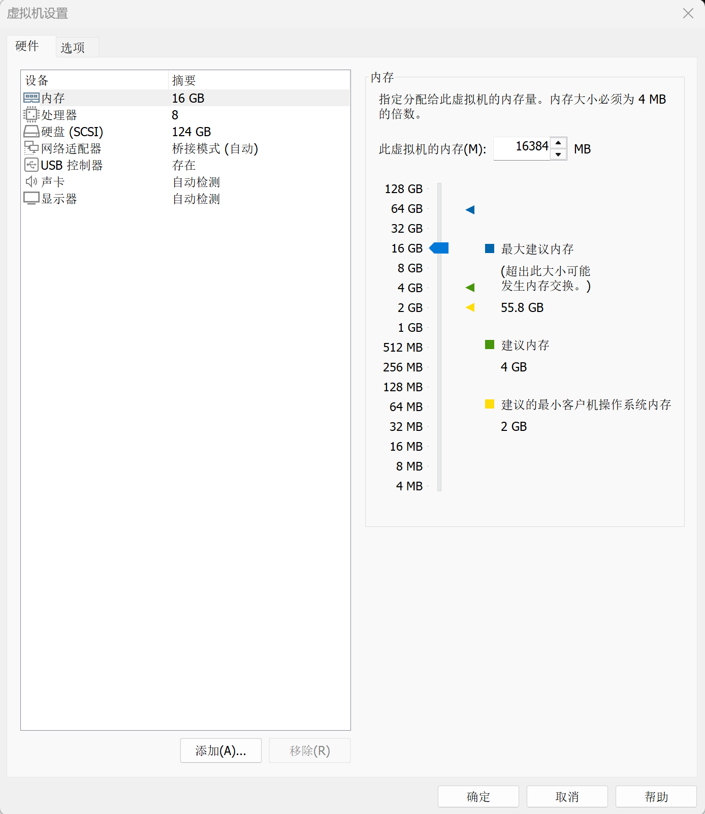

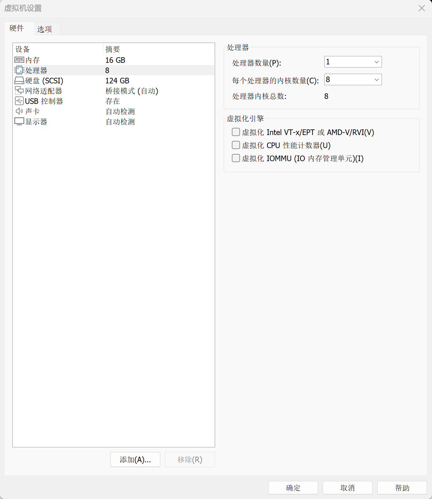

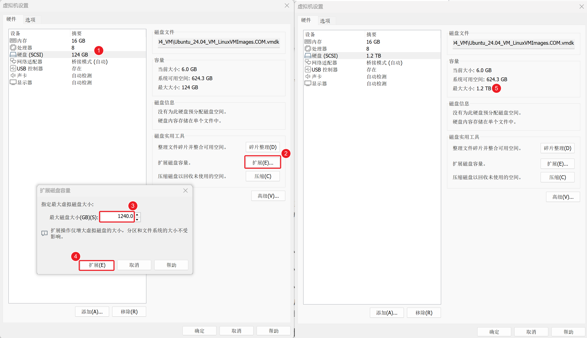

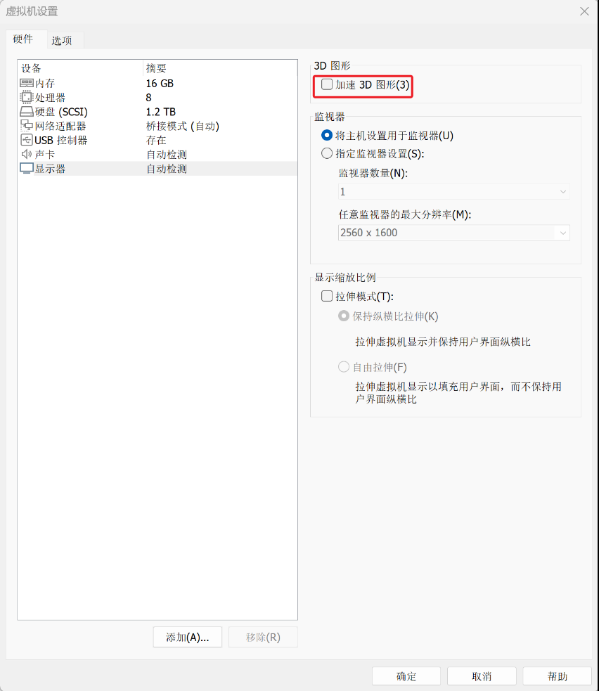

配置完成后，就可以开启虚拟机了。

第一次打开会提示 一个 虚拟机已经复制的 对话框，我们这时，只需要 点击 我已复制虚拟机 就可以继续启动虚拟机系统了。

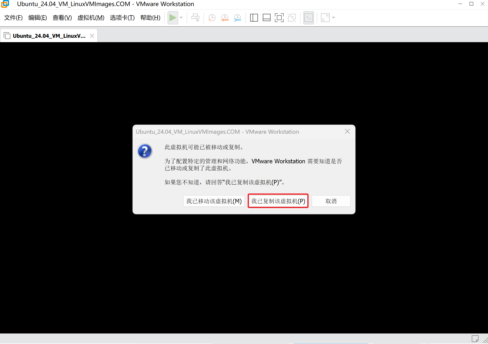

等待数秒，系统就会自动启动了，启动以后 鼠标点击 **Ubuntu** 字样，就可以进入登录对话框，输入 密码 ubuntu 即可登录进入ubuntu系统内。

注意：

**Ubuntu默认的用户名密码分别为 ubuntu ubuntu**

**Ubuntu默认的用户名密码分别为 ubuntu ubuntu**

**Ubuntu默认的用户名密码分别为 ubuntu ubuntu**

**ubuntu默认需要联网，如果你的 Windows电脑已经可以访问Internet 互联网，ubuntu系统后就会自动共享 Windows电脑的网络 进行连接internet 网络。**

### 安装环境依赖

- 安装必要软件包, 鼠标点击进入 ubuntu界面内，键盘同时 按下 **ctrl + alt + t** 三个按键会快速唤起，终端界面，唤起成功后，在终端里面执行如下命令进行安装必要依赖包。

```bash
sudo apt install -y ack antlr3 asciidoc autoconf automake autopoint binutils bison build-essential \
bzip2 ccache clang cmake cpio curl device-tree-compiler flex gawk gcc-multilib g++-multilib gettext \
genisoimage git gperf haveged help2man intltool libc6-dev-i386 libelf-dev libfuse-dev libglib2.0-dev \
libgmp3-dev libltdl-dev libmpc-dev libmpfr-dev libncurses5-dev libncursesw5-dev libpython3-dev \
libreadline-dev libssl-dev libtool llvm lrzsz msmtp ninja-build p7zip p7zip-full patch pkgconf \
python3 python3-pyelftools python3-setuptools qemu-utils rsync scons squashfs-tools subversion \
swig texinfo uglifyjs upx-ucl unzip vim wget xmlto xxd zlib1g-dev
```


如果你发现你的ubuntu虚拟机 第一次启动 无法 通过 windows下复制 命令 粘贴到 ubuntu内，则需要先手敲 执行如下命令 安装一个 用于 虚拟机和 windows共享剪切板的工具包。

```bash
sudo apt install open-vm-tools
sudo apt install open-vm-tools-desktop 
```


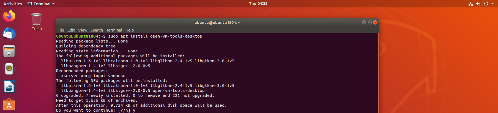

安装完成后，点击右上角的 电源按钮，重启ubuntu系统，或者 直接输入 sudo reboot 命令进行重启。

这时就可以 通过windows端向ubuntu内粘贴命令复制文本这些操作了。

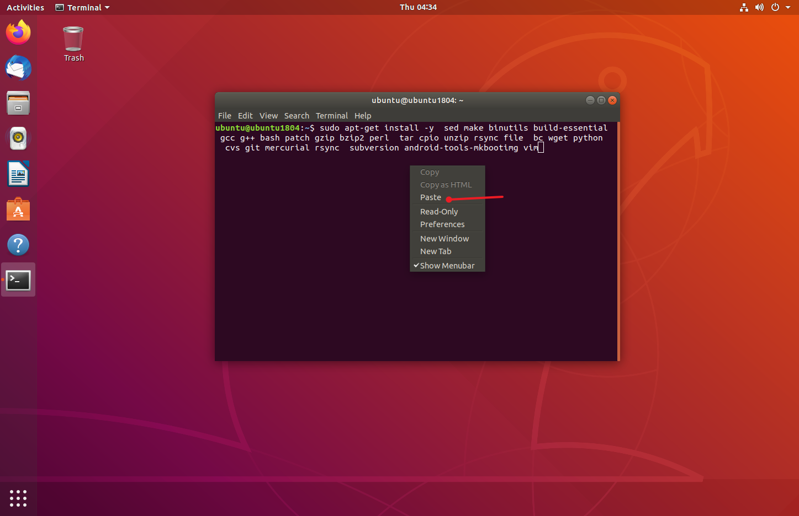

做完这一步以后，就可以继续往下，获取源码，开启开发流程了。

## 构建系统镜像

### 获取源码
直接git clone百问网的仓库即可，注意有些环境可能github访问受限，克隆不下来，可以参考[《一、单板介绍与开发环境搭建 - 3.3 WSL网络代理设置》](https://www.yuque.com/jason-0nd0f/ts7m5t/dq8nprtdhgq5lk2a#SD6lh)中的内容，配置http/https终端代理即可。

```bash
git clone https://github.com/dshanpi/RK3576-DshanPiA1_LEDE.git
```

在下载完源码后，更新feeds，下载对应的包：

```bash
cd RK3576-DshanPiA1_LEDE
./scripts/feeds update -a
./scripts/feeds install -a
```


### 选择单板

在更新feeds完成后，我们可以先使用默认的minimal配置做为基础，然后在上面做自定义配置即可，示例如下：

```bash
cp minimal.config .config
make defconfig # 会自动补齐缺失的配置项，使其成为可编译的完整配置
```


后续的配置可以保存为defconfig，加入版本管理中，具体方法查看本文 《4.5 保存配置》章节。

生成了基础配置后，就可以进行自定义配置了，自定义配置的命令为：

```bash
make menuconfig
```


系统的配置，简单划分的话，可以主要分为以下几个部分：


### 编译选择软件包


首先执行下载操作，解决完下载过程中可能遇到的问题，然后再执行编译流程。

避免默认的编译过程中下载，可能会某个包失败了后，再编译的时候，会挨个检查之前的包是否下载和编译完成了，这样不利于调试，执行命令如下：

```bash
# 当下载失败的时候，使用-j1查看具体的失败信息
# 下载的源码包都存放在工程根目录的dl目录下
make download -j$(nproc)

#第一次编译推荐用单线程，测试多线程编译会失败！
make V=s -j1
```


二次编译的时候，可以执行:

```bash
make V=s -j$(nproc)
```


如果需要重新配置，按照下面流程执行：

```bash
rm -rf .config
make menuconfig
make V=s -j$(nproc)
```


### 验证镜像

编译完成后，会在对应的bin/target/xxxx目录生成两个类型的镜像包，一个是ext4一个是squashfs的，如果有恢复默认配置需求，需要使用squashfs的镜像包。


注意：在OpenWrt编译完成后，可以刷写的镜像会被压缩成zip格式文件，需要先执行解压操作，然后才能做为烧录工具的刷机镜像，示例如下：

```bash
jason@ubuntu24:~/LEDE/bin/targets/rockchip/armv8$ gunzip -k openwrt-rockchip-armv8-100ask_dshanpia1-squashfs-sysupgrade.img.gz -f
gzip: openwrt-rockchip-armv8-100ask_dshanpia1-squashfs-sysupgrade.img.gz: decompression OK, trailing garbage ignored
```


解压得到img镜像后，参考《[单板介绍与开发环境搭建 - 4.3开始烧录](https://www.yuque.com/jason-0nd0f/ts7m5t/dq8nprtdhgq5lk2a)》内容，进行刷机。

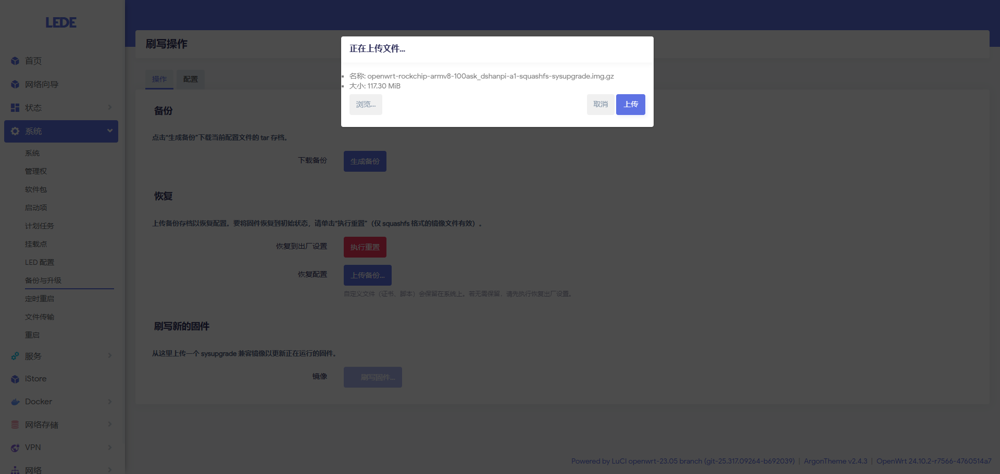

> 注意：web页面在线升级选择的为压缩后的镜像包！

openwrt系统自带的在线刷机功能使用的时候有问题，参考《[现有功能优化 - 1.3 sysupgrade镜像无法使用](https://www.yuque.com/jason-0nd0f/ts7m5t/hru38u3g3erf1yuv#G6G2J)》章节进行适配，适配后便可以直接通过web的方式直接刷机，示例如下：
