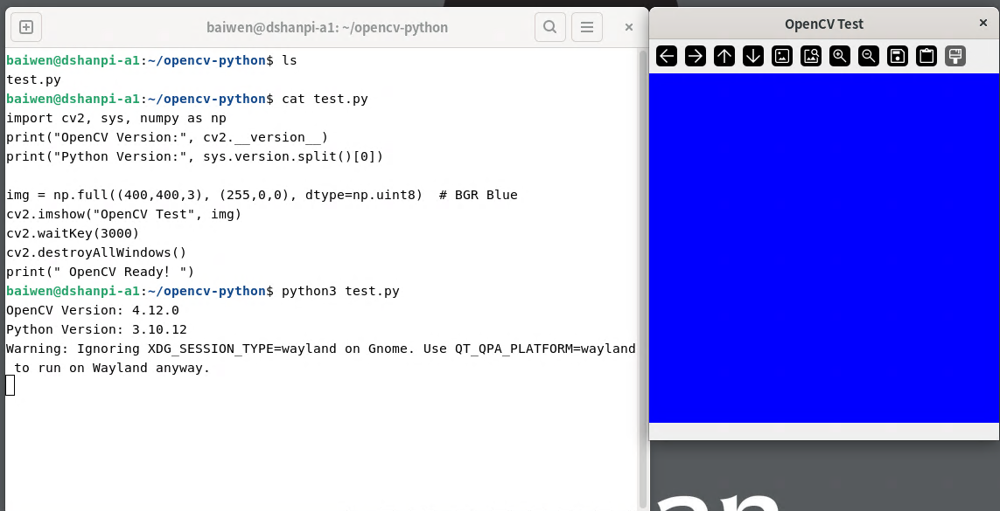
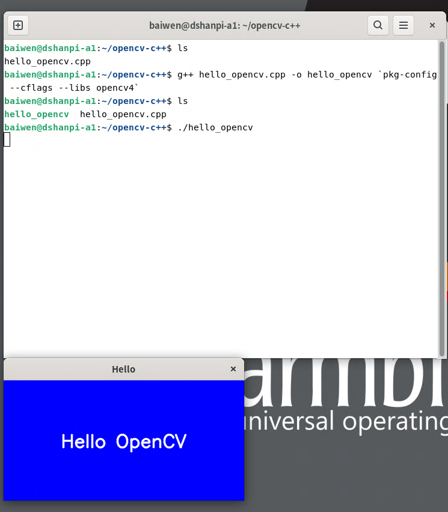
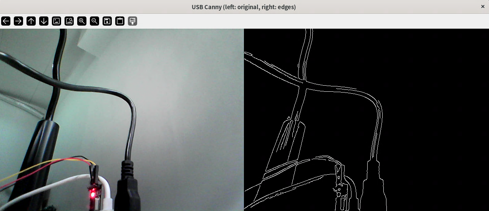
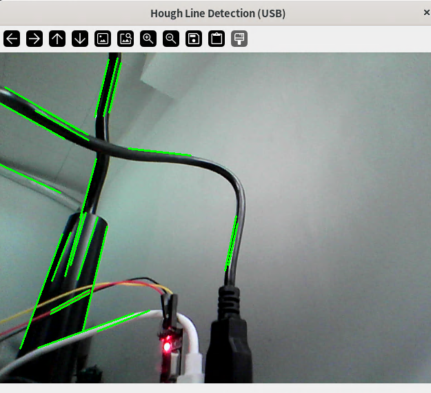
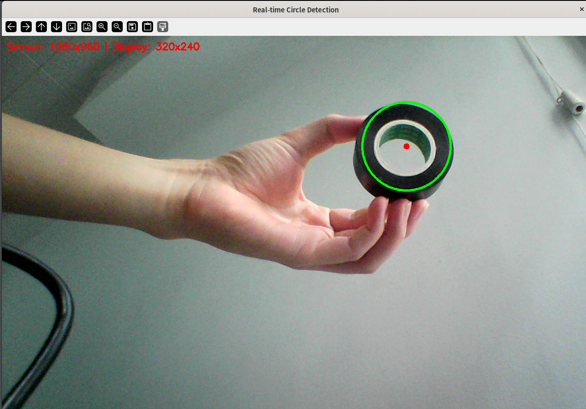
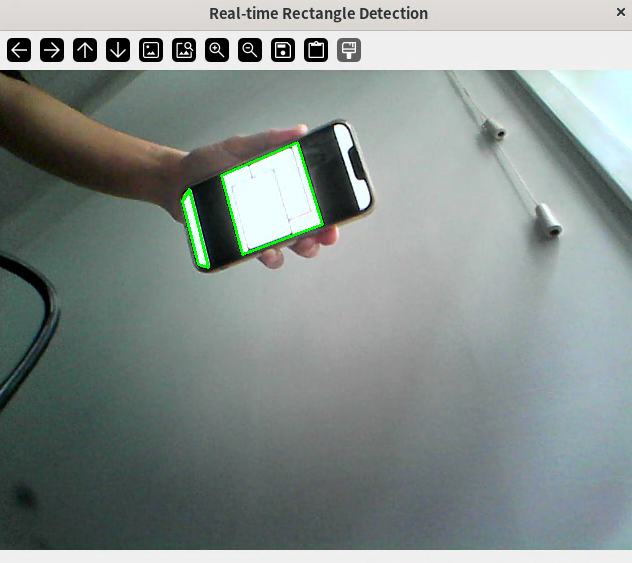
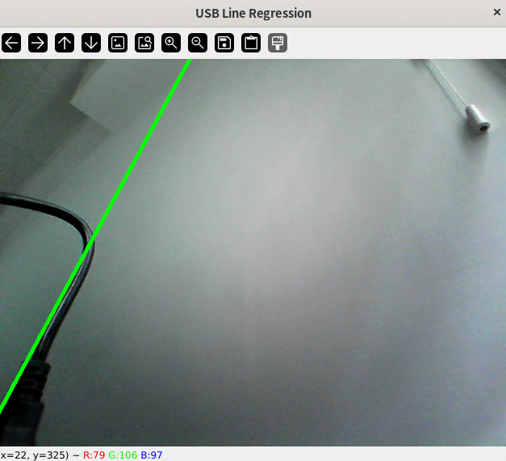
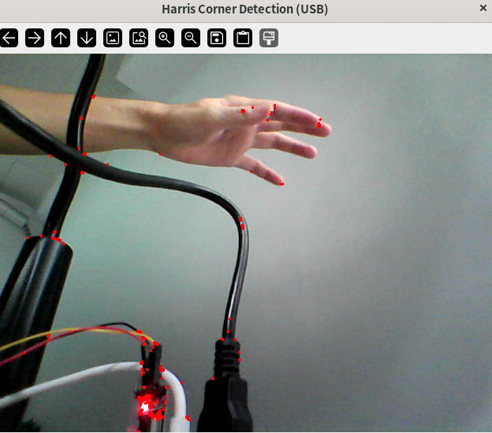
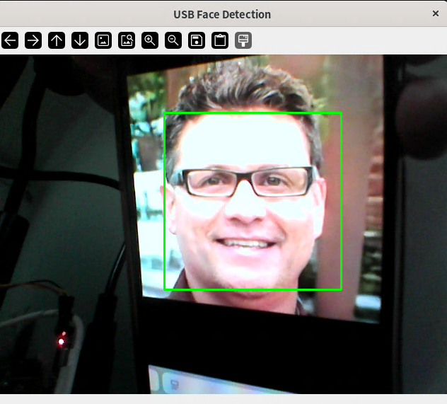

# OpenCV

​	OpenCV（Open Source Computer Vision Library，开源计算机视觉库）诞生于 1999 年 Intel Research，如今由 OpenCV.org 基金会维护，是目前**全球使用最广泛**的开源计算机视觉与机器学习软件库之一。

| 维度         | 说明                                                         |
| ------------ | ------------------------------------------------------------ |
| **语言绑定** | C++（原生）、Python（最流行）、Java、JavaScript、MATLAB、Go、Rust 等 |
| **平台覆盖** | Linux、Windows、macOS、Android、iOS、RTOS、WebAssembly       |
| **硬件加速** | CPU（SSE/AVX/NEON）、CUDA、OpenCL、Vulkan、Metal、NPU（VPI、RKNPU、TIM-VX…） |
| **算法规模** | 2500+ 优化算法，涵盖传统 CV 与深度学习                       |
| **生态工具** | 训练框架（Model Zoo）、标注工具（CVAT）、优化工具（OpenVINO、TensorRT 插件） |


## 1.Python库

### 1.1 APT安装

```
pip3 install opencv-python
```

如果是国内用户可指定国内源安装，执行：

```
pip3 install opencv-python -i https://pypi.tuna.tsinghua.edu.cn/simple
```


### 1.2 测试

新建文件`test.py`，将下面的内容填入：

```
import cv2, sys, numpy as np
print("OpenCV Version:", cv2.__version__)
print("Python Version:", sys.version.split()[0])

img = np.full((400,400,3), (255,0,0), dtype=np.uint8)  # BGR Blue
cv2.imshow("OpenCV Test", img)
cv2.waitKey(3000)
cv2.destroyAllWindows()
print("OpenCV Ready！")
```

填写完代码后执行：

```
python3 test.py
```

运行效果如下：




## 2.C++库

### 2.1 APT安装

```
sudo apt install libopencv-dev -y
```


### 2.2 测试

```
#include <opencv2/opencv.hpp>

int main()
{
    // 画布尺寸
    int width = 400, height = 200;

    // 创建蓝色背景 (BGR)
    cv::Mat img(height, width, CV_8UC3, cv::Scalar(255, 0, 0));

    // 配置文字
    std::string text = "Hello OpenCV";
    int fontFace = cv::FONT_HERSHEY_SIMPLEX;
    double fontScale = 1.0;
    int thickness = 2;

    // 计算文字大小，使文字居中
    int baseline = 0;
    cv::Size textSize = cv::getTextSize(text, fontFace, fontScale, thickness, &baseline);
    cv::Point org((width - textSize.width) / 2,
                  (height + textSize.height) / 2);

    // 绘制文字（白色）
    cv::putText(img, text, org, fontFace, fontScale,
                cv::Scalar(255, 255, 255), thickness, cv::LINE_AA);

    // 保存到磁盘
    cv::imwrite("hello_opencv.jpg", img);

    cv::imshow("Hello", img);
    cv::waitKey(3000);

    return 0;
}
```

**编译 & 运行:**

```
# 编译
g++ hello_opencv.cpp -o hello_opencv `pkg-config --cflags --libs opencv4`

# 运行
./hello_opencv
```



## 3.本地编译

1.下载OpenCV包（以4.12为例）

```
wget https://github.com/opencv/opencv/archive/refs/tags/4.12.0.zip
```

如果无法下载可访问OpenCV官网资源下载：[https://opencv.org/releases/](https://opencv.org/releases/)


2.解压OpenCV库

```
unzip 4.12.0.zip
```

解压完成后进入OpenCV库目录。

3.安装编译依赖

```
sudo apt update
sudo apt install -y build-essential cmake git pkg-config \
  libgtk-3-dev libavcodec-dev libavformat-dev libswscale-dev \
  libtbb-dev libjpeg-dev libpng-dev libtiff-dev libdc1394-dev \
  libv4l-dev libxvidcore-dev libx264-dev libopenexr-dev \
  libgstreamer1.0-dev libgstreamer-plugins-base1.0-dev \
  python3-dev python3-numpy
```


4.编译

- 在OpenCV库目录下新建编译文件夹：

```
mkdir build
cd build
```

- 生成cmake编译规则

```
cmake ..
```

- 编译

```
make -j$(nproc)
```

- 安装

```
sudo make install
sudo ldconfig
```

## 4.更多示例代码

注意：下面的Python代码均会使用USB摄像头，请提前将USB摄像头接入到板子的USB口中！！！

### 4.1 Canny 边缘检测

```
#!/usr/bin/env python3
import cv2

# Open the default USB camera (index 0)
cap = cv2.VideoCapture(0, cv2.CAP_V4L2)  # CAP_V4L2 is faster on Linux
if not cap.isOpened():
    raise RuntimeError("Cannot open camera; check connection or permissions")

# Optional: set resolution
cap.set(cv2.CAP_PROP_FRAME_WIDTH, 640)
cap.set(cv2.CAP_PROP_FRAME_HEIGHT, 480)

# Canny thresholds
low_th  = 100
high_th = 200

while True:
    ret, frame = cap.read()
    if not ret:
        print("Failed to grab frame")
        break

    # 1. Convert to grayscale and apply Gaussian blur
    gray = cv2.cvtColor(frame, cv2.COLOR_BGR2GRAY)
    blur = cv2.GaussianBlur(gray, (5, 5), 0)

    # 2. Canny edge detection
    edges = cv2.Canny(blur, low_th, high_th)

    # 3. Convert single-channel edge map back to 3-channel for display
    edges_bgr = cv2.cvtColor(edges, cv2.COLOR_GRAY2BGR)

    # 4. Concatenate original and edge images side by side
    combined = cv2.hconcat([frame, edges_bgr])
    cv2.imshow("USB Canny (left: original, right: edges)", combined)

    # 5. Exit on 'q' or ESC
    key = cv2.waitKey(1) & 0xFF
    if key in (27, ord('q')):
        break

# Release resources
cap.release()
cv2.destroyAllWindows()
```

运行效果：




### 4.2 线段检测

```
#!/usr/bin/env python3
import cv2
import numpy as np

# open default USB camera
cap = cv2.VideoCapture(0, cv2.CAP_V4L2)
if not cap.isOpened():
    raise RuntimeError("Cannot open camera")

# optional resolution
cap.set(cv2.CAP_PROP_FRAME_WIDTH, 640)
cap.set(cv2.CAP_PROP_FRAME_HEIGHT, 480)

# Hough parameters
rho_res   = 1          # pixel resolution
theta_res = np.pi/180  # radian resolution
thresh    = 80         # accumulator threshold
min_len   = 50         # minimum line length
max_gap   = 10         # maximum gap between segments

while True:
    ret, frame = cap.read()
    if not ret:
        print("Failed to grab frame")
        break

    # 1. grayscale + blur
    gray = cv2.cvtColor(frame, cv2.COLOR_BGR2GRAY)
    blur = cv2.GaussianBlur(gray, (5, 5), 0)

    # 2. Canny edge map
    edges = cv2.Canny(blur, 50, 150)

    # 3. Probabilistic Hough Transform
    lines = cv2.HoughLinesP(edges,
                            rho_res,
                            theta_res,
                            threshold=thresh,
                            minLineLength=min_len,
                            maxLineGap=max_gap)

    # 4. draw lines on copy of original frame
    display = frame.copy()
    if lines is not None:
        for x1, y1, x2, y2 in lines[:, 0]:
            cv2.line(display, (x1, y1), (x2, y2), (0, 255, 0), 2)

    # 5. show result
    cv2.imshow("Hough Line Detection (USB)", display)

    # 6. exit on 'q' or ESC
    key = cv2.waitKey(1) & 0xFF
    if key in (27, ord('q')):
        break

# cleanup
cap.release()
cv2.destroyAllWindows()
```

运行效果：



### 4.3 圆检测

```
#!/usr/bin/env python3
import cv2
import numpy as np

# camera configuration
SENSOR_W, SENSOR_H = 1280,960   # native sensor resolution
FRAME_W, FRAME_H   = 320, 240    # processing / display resolution

# open camera 0 and set native resolution
cap = cv2.VideoCapture(0)
cap.set(cv2.CAP_PROP_FRAME_WIDTH,  SENSOR_W)
cap.set(cv2.CAP_PROP_FRAME_HEIGHT, SENSOR_H)

if not cap.isOpened():
    print(f"Failed to open camera 1 at {SENSOR_W}x{SENSOR_H}! Check connection.")
    exit()

print(f"Camera configured: capture {SENSOR_W}x{SENSOR_H} → process {FRAME_W}x{FRAME_H}")

# scale factor for parameter adaptation
SCALE_FACTOR = max(SENSOR_W / FRAME_W, SENSOR_H / FRAME_H)

while True:
    # grab full-resolution frame
    ret, frame_high_res = cap.read()
    if not ret:
        print("Frame capture failed, exiting...")
        break

    # down-scale for processing
    frame = cv2.resize(frame_high_res, (FRAME_W, FRAME_H))

    # grayscale + blur
    gray  = cv2.cvtColor(frame, cv2.COLOR_BGR2GRAY)
    blur  = cv2.GaussianBlur(gray, (9, 9), 2)

    # adapt detection parameters according to scale
    min_dist_scaled   = max(20, int(50  / SCALE_FACTOR))
    min_radius_scaled = max(5,  int(10  / SCALE_FACTOR))
    max_radius_scaled = min(100,int(100 / SCALE_FACTOR))

    # detect circles via Hough transform
    circles = cv2.HoughCircles(
        blur,
        cv2.HOUGH_GRADIENT,
        dp=1,
        minDist=min_dist_scaled,
        param1=50,
        param2=30,
        minRadius=min_radius_scaled,
        maxRadius=max_radius_scaled
    )

    # draw detected circles on the high-resolution frame
    if circles is not None:
        circles = np.uint16(np.around(circles))
        for x, y, r in circles[0, :]:
            # map coordinates back to high-resolution space
            x_hr = int(x * SCALE_FACTOR)
            y_hr = int(y * SCALE_FACTOR)
            r_hr = int(r * SCALE_FACTOR)

            # draw circle and center
            cv2.circle(frame_high_res, (x_hr, y_hr), r_hr, (0, 255, 0), 3)
            cv2.circle(frame_high_res, (x_hr, y_hr), 3,   (0, 0, 255), 5)

    # overlay resolution info
    cv2.putText(frame_high_res,
                f"Sensor: {SENSOR_W}x{SENSOR_H} | Display: {FRAME_W}x{FRAME_H}",
                (10, 30),
                cv2.FONT_HERSHEY_SIMPLEX,
                0.7,
                (0, 0, 255),
                2)

    # display result
    cv2.imshow("Real-time Circle Detection", frame_high_res)

    # quit on 'q'
    if cv2.waitKey(1) & 0xFF == ord('q'):
        break

# cleanup
cap.release()
cv2.destroyAllWindows()
```

运行效果：



### 4.4 矩形检测

```
#!/usr/bin/env python3
import cv2
import numpy as np

# ------------ camera setup ------------
cap = cv2.VideoCapture(0, cv2.CAP_V4L2)  # change index if necessary
if not cap.isOpened():
    raise RuntimeError("Cannot open camera")

cap.set(cv2.CAP_PROP_FRAME_WIDTH, 640)
cap.set(cv2.CAP_PROP_FRAME_HEIGHT, 480)

# ------------ parameters ------------
# Canny thresholds
CANNY_LOW  = 50
CANNY_HIGH = 150
# contour approximation accuracy (epsilon = arcLength * ratio)
APPROX_RATIO = 0.02
# min area filter (ignore tiny noise)
MIN_AREA = 500

while True:
    ret, frame = cap.read()
    if not ret:
        print("Frame read failed")
        break

    # ---------- pre-processing ----------
    gray  = cv2.cvtColor(frame, cv2.COLOR_BGR2GRAY)
    blur  = cv2.GaussianBlur(gray, (5, 5), 0)
    edges = cv2.Canny(blur, CANNY_LOW, CANNY_HIGH)

    # ---------- find contours ----------
    contours, _ = cv2.findContours(edges, cv2.RETR_EXTERNAL,
                                   cv2.CHAIN_APPROX_SIMPLE)

    # ---------- loop over contours ----------
    for cnt in contours:
        area = cv2.contourArea(cnt)
        if area < MIN_AREA:
            continue

        # polygonal approximation
        epsilon = APPROX_RATIO * cv2.arcLength(cnt, True)
        approx  = cv2.approxPolyDP(cnt, epsilon, True)

        # we need 4 vertices => rectangle
        if len(approx) == 4:
            cv2.drawContours(frame, [approx], -1, (0, 255, 0), 2)

    # ---------- display ----------
    cv2.imshow("Real-time Rectangle Detection", frame)

    # quit on 'q' or ESC
    key = cv2.waitKey(1) & 0xFF
    if key in (27, ord('q')):
        break

# ---------- cleanup ----------
cap.release()
cv2.destroyAllWindows()
```

运行效果：



### 4.5 快速线性回归

```
#!/usr/bin/env python3
import cv2
import numpy as np

# ---------- camera ----------
cap = cv2.VideoCapture(0, cv2.CAP_V4L2)
if not cap.isOpened():
    raise RuntimeError("Cannot open camera")
cap.set(cv2.CAP_PROP_FRAME_WIDTH, 640)
cap.set(cv2.CAP_PROP_FRAME_HEIGHT, 480)

# ---------- parameters ----------
CANNY_LOW   = 50
CANNY_HIGH  = 150
HOUGH_RHO   = 1
HOUGH_THETA = np.pi / 180
HOUGH_TH    = 100            # Hough threshold
MIN_LINE    = 50             # minLineLength
MAX_GAP     = 10             # maxLineGap
DRAW_COLOR  = (0, 255, 0)
DRAW_THICK  = 3

def draw_regression(frame, points):
    """Fit y = kx + b with NumPy polyfit and draw the line."""
    if points.shape[0] < 2:
        return
    x, y = points[:, 0], points[:, 1]
    k, b = np.polyfit(x, y, 1)          # 1-degree polynomial = linear
    h, w = frame.shape[:2]
    x0, x1 = 0, w
    y0, y1 = int(k * x0 + b), int(k * x1 + b)
    cv2.line(frame, (x0, y0), (x1, y1), DRAW_COLOR, DRAW_THICK)

while True:
    ret, frame = cap.read()
    if not ret:
        print("Frame read failed")
        break

    gray  = cv2.cvtColor(frame, cv2.COLOR_BGR2GRAY)
    blur  = cv2.GaussianBlur(gray, (5, 5), 0)
    edges = cv2.Canny(blur, CANNY_LOW, CANNY_HIGH)

    # Hough line segments
    lines = cv2.HoughLinesP(edges,
                            HOUGH_RHO,
                            HOUGH_THETA,
                            HOUGH_TH,
                            minLineLength=MIN_LINE,
                            maxLineGap=MAX_GAP)

    # collect endpoints
    pts = []
    if lines is not None:
        for x1, y1, x2, y2 in lines[:, 0]:
            pts.extend([[x1, y1], [x2, y2]])

    if pts:
        pts = np.array(pts, dtype=np.float32)
        draw_regression(frame, pts)

    cv2.imshow("USB Line Regression", frame)
    if cv2.waitKey(1) & 0xFF in (27, ord('q')):
        break

cap.release()
cv2.destroyAllWindows()
```

运行效果：



### 4.6 角点检测

```
#!/usr/bin/env python3
import cv2
import numpy as np

# ---------- open camera ----------
cap = cv2.VideoCapture(0, cv2.CAP_V4L2)   # change index if needed
if not cap.isOpened():
    raise RuntimeError("Cannot open camera")

# optional resolution
cap.set(cv2.CAP_PROP_FRAME_WIDTH, 640)
cap.set(cv2.CAP_PROP_FRAME_HEIGHT, 480)

# ---------- Harris parameters ----------
HARRIS_BLOCK_SIZE = 2          # neighbourhood size
HARRIS_KSIZE      = 3          # Sobel aperture
HARRIS_K          = 0.04       # Harris detector free parameter
THRESH_RATIO      = 0.01       # corner response threshold ratio

while True:
    ret, frame = cap.read()
    if not ret:
        print("Frame read failed")
        break

    # ---------- Harris corner detection ----------
    gray  = cv2.cvtColor(frame, cv2.COLOR_BGR2GRAY)
    gray  = np.float32(gray)
    dst   = cv2.cornerHarris(gray,
                             blockSize=HARRIS_BLOCK_SIZE,
                             ksize=HARRIS_KSIZE,
                             k=HARRIS_K)
    # dilate corners for better visibility
    dst = cv2.dilate(dst, None)

    # threshold corner response
    frame[dst > THRESH_RATIO * dst.max()] = [0, 0, 255]

    # ---------- show ----------
    cv2.imshow("Harris Corner Detection (USB)", frame)

    # quit on 'q' or ESC
    key = cv2.waitKey(1) & 0xFF
    if key in (27, ord('q')):
        break

# ---------- cleanup ----------
cap.release()
cv2.destroyAllWindows()
```

运行效果：



### 4.7 人脸检测

```
#!/usr/bin/env python3
import cv2

# 0. 打开摄像头
cap = cv2.VideoCapture(0, cv2.CAP_V4L2)
if not cap.isOpened():
    raise RuntimeError("Cannot open camera")

# 1. 加载 Haar 人脸模型（已随 OpenCV 安装）
face_cascade = cv2.CascadeClassifier(cv2.data.haarcascades +
                                     'haarcascade_frontalface_default.xml')

while True:
    ret, frame = cap.read()
    if not ret:
        break

    # 2. 灰度化 + 检测
    gray = cv2.cvtColor(frame, cv2.COLOR_BGR2GRAY)
    faces = face_cascade.detectMultiScale(gray,
                                          scaleFactor=1.1,
                                          minNeighbors=5,
                                          minSize=(50, 50))

    # 3. 画框
    for (x, y, w, h) in faces:
        cv2.rectangle(frame, (x, y), (x + w, y + h),
                      (0, 255, 0), 2)

    # 4. 显示
    cv2.imshow("USB Face Detection", frame)
    if cv2.waitKey(1) & 0xFF in (27, ord('q')):
        break

cap.release()
cv2.destroyAllWindows()
```

运行效果：

