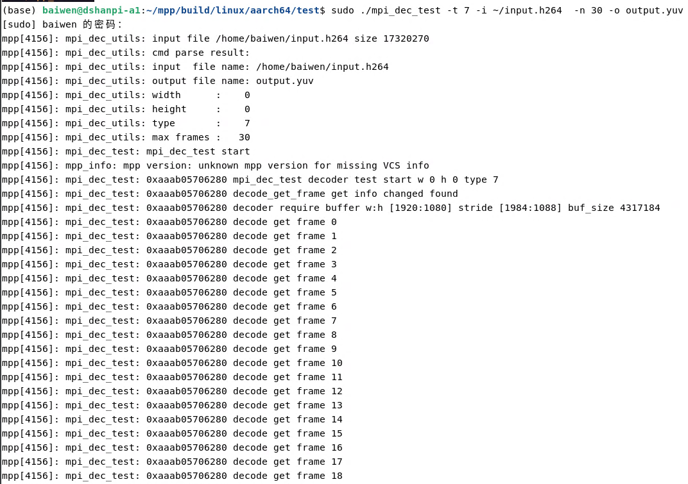
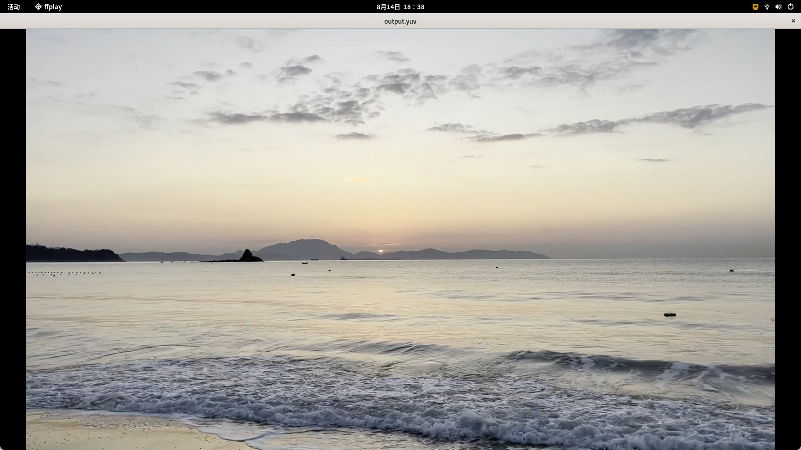
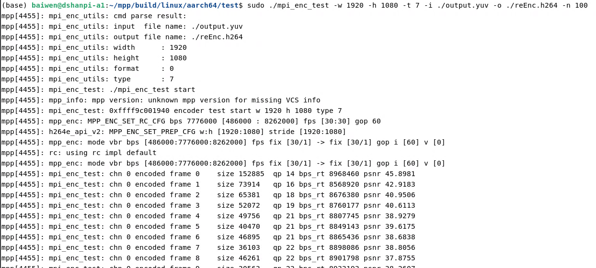
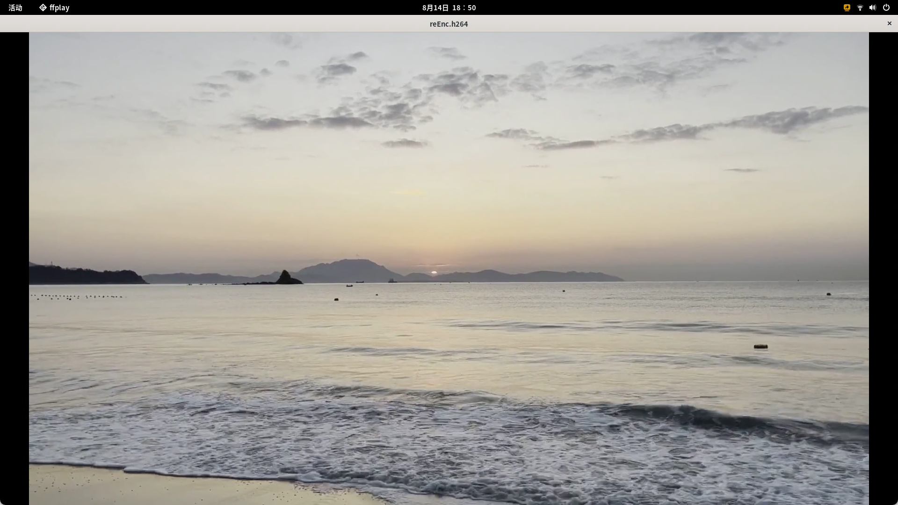

# 视频编解码

参考资料：

- 瑞芯微官方MPP文档：[mpp/doc at develop · rockchip-linux/mpp](https://github.com/rockchip-linux/mpp/tree/develop/doc)
- 瑞芯微官方MPP仓库：[rockchip-linux/mpp: Media Process Platform (MPP) module](https://github.com/rockchip-linux/mpp)

瑞芯微提供的媒体处理软件平台（Media Process Platform，简称MPP）是适用于瑞芯微芯片系列的通用媒体处理软件平台。该平台对应用软件屏蔽了芯片相关的复杂底层处理，其目的是为了屏蔽不同芯片的差异，为使用者提供统一的视频媒体处理接口（Media Process Interface，缩写MPI）。MPP提供的功能包括：

-   视频解码
    -   H.265 / H.264 / H.263 / VP9 / VP8 / MPEG-4 / MPEG-2 / MPEG-1 / VC1 / MJPEG / AV1
-   视频编码
    -   H.265 / H.264 / VP8 / MJPEG
-   视频处理
    -   视频拷贝，缩放，色彩空间转换，场视频解交织（Deinterlace）

## 1.获取与编译MPP库

1.安装基础依赖：

```
sudo apt update
sudo apt install git cmake
```

2.获取MPP库

```
git clone https://github.com/rockchip-linux/mpp.git
```

3.编译

```
cd mpp/build/linux/aarch64/
./make-Makefiles.bash
make
sudo make install
```

编译完成后可以在`test`目录下看到测试程序。


## 2.测试

安装ffmpeg库，以便查看编码结果：

```
sudo apt install ffmpeg -y
```


### 2.1 解码测试

1.进入测试目录

```
cd test
```

2.以input.h264(此文件可在)解码30帧为例，对demo和输出进行说明。运行的命令为：

```
sudo ./mpi_dec_test -t 7 -i ./input.h264  -n 100 -o output.yuv
```

命令参数的描述说明如下：

| 命令参数 | 描述说明                                        |
| -------- | ----------------------------------------------- |
| -i       | 输入的码流文件。                                |
| -o       | 输出的图像文件。                                |
| -w       | 图像宽度，单位为像素。                          |
| -h       | 图像高度，单位为像素。                          |
| -t       | 码流文件的协议类型。                            |
| -f       | 图像色彩空间格式以及内存排布方式，默认为NV12。  |
| -n       | 最大解码帧数。测试时若码流较长，可仅输出前n帧。 |
| -s       | MPP实例数，默认为1。                            |
| -v       | 日志选项：q为静默标志；f为fps显示标志。         |
| -slt     | 输出帧对应的校验文件。                          |
| -help    | 打开帮助文档。                                  |

运行效果：



使用ffmpeg查看解码文件：

```
ffplay -f rawvideo -pixel_format nv12 -video_size 1920x1080 -framerate 30 output.yuv
```

运行效果：



> 按下q可退出！

### 2.2 编码测试

这里以刚刚解码出来为例，将其重新编码为h264文件。

```
sudo ./mpi_enc_test -w 1920 -h 1080 -t 7 -i ./output.yuv -o ./reEnc.h264 -n 100
```

命令参数的描述说明如下：

| 命令参数 | 描述说明                                                     |
| -------- | ------------------------------------------------------------ |
| -i       | 输入的图像文件。                                             |
| -o       | 输出的码流文件。                                             |
| -w       | 图像宽度，单位为像素。                                       |
| -h       | 图像高度，单位为像素。                                       |
| -hstride | 垂直方向相邻两行之间的距离，单位为byte。                     |
| -vstride | 图像分量之间的以行数间隔数，单位为1。                        |
| -f       | 图像色彩空间格式以及内存排布方式，默认为NV12。               |
| -t       | 码流文件的协议类型。                                         |
| -tsrc    | 源码流格式，仅在测试整体编解码性能时使用。                   |
| -n       | 最大解码帧数。测试时若码流较长，可仅输出前n帧。              |
| -g       | gop参考模式，对应不同的TSVC码流。                            |
| -rc      | 码率控制模式。0:VBR; 1:CBR; 2:FIXQP; 3:AVBR。                |
| -bps     | 码率约束参数。命令格式：bps_target:bps_min:bps_max。         |
| -fps     | 输入/输出帧率控制，默认为30。该命令参数仅说明输入帧率和输出帧率之间的比例关系，与实际帧率无关。 |
| -qc      | 质量控制。                                                   |
| -s       | MPP实例数，默认为1。                                         |
| -v       | 日志选项：q为静默标志；f为fps显示标志。                      |
| -ini     | 额外的编码配置文件ini（暂未生效）。                          |
| -slt     | 输出码流对应的校验文件。                                     |

运行效果：



使用ffmpeg查看编码文件：

```
ffplay -i reEnc.h264
```

运行效果如下：



> 按下q可退出！
