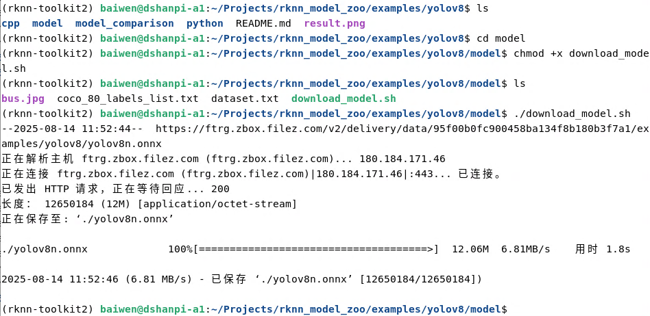

# RKNN环境搭建

参考资料：

- RKNN官方资料仓库：https://github.com/airockchip/rknn-toolkit2/

## 1.RKNN简介

​	RKNN（Rockchip Neural Network）是 Rockchip 面向自家 NPU（RKNPU 系列）推出的 **完整 AI 软件栈**。
从 **模型转换 → 模拟评估 → 板端推理**，用户只需一条命令即可把 PyTorch/ONNX/TensorFlow/Caffe 模型部署到 **RK3576、RK3588、RK356x、RK1808** 等芯片上运行。核心组件与工作流程如下：

```
┌────────────┐      ┌────────────────┐      ┌────────────┐
│   PyTorch  │ ──►  │  RKNN-Toolkit2 │ ──►  │   RK3576   │
│   ONNX…    │  PC  │  (量化+编译)   │  USB │  NPU 推理  │
└────────────┘      └────────────────┘      └────────────┘
```

RKNN 软件栈可帮助用户将 AI 模型快速部署到 Rockchip 芯片上，整体框架如下：


为了使用 RKNPU，用户需先在电脑上运行 RKNN-Toolkit2，将训练好的模型转换成 RKNN 格式，然后在开发板上通过 RKNN C API 或 Python API 进行推理。

**RKNN-Toolkit2**：一个软件开发套件，用于在 PC 和 Rockchip NPU 平台上完成模型转换、推理及性能评估。

**RKNN-Toolkit-Lite2**：提供面向 Rockchip NPU 平台的 Python 编程接口，帮助用户部署 RKNN 模型并加速 AI 应用落地。

**RKNN Runtime**：提供面向 Rockchip NPU 平台的 C/C++ 编程接口，帮助用户部署 RKNN 模型并加速 AI 应用落地。

**RKNPU 内核驱动**：负责与 NPU 硬件交互，已开源，可在 Rockchip 内核代码中找到。


## 2.获取RKNN仓库

新建一个名称为 Projects 的文件夹，并将 RKNN-Toolkit2 和 RKNN Model Zoo 仓库存放至该目录下：

```
# 新建 Projects 文件夹
mkdir Projects 
cd Projects
# 下载 RKNN-Toolkit2 仓库
git clone -b v2.3.2 https://github.com/airockchip/rknn-toolkit2.git
# 下载 RKNN Model Zoo 仓库
git clone -b v2.3.2 https://github.com/airockchip/rknn_model_zoo.git
```

## 3.安装 RKNN 环境

### 3.1 安装Conada

1.获取conda安装脚本

```
wget -c https://repo.anaconda.com/archive/Anaconda3-2025.06-1-Linux-aarch64.sh
```

2.启动安装脚本

```
bash Anaconda3-2025.06-1-Linux-aarch64.sh
```

- 按下回车确认安装：

```
Please, press ENTER to continue
>>> 
```

- 输入`yes`：

```
Do you accept the license terms? [yes|no]
>>> yes
```

- 按下回车确认安装路径：

```
Anaconda3 will now be installed into this location:
/home/baiwen/anaconda3

  - Press ENTER to confirm the location
  - Press CTRL-C to abort the installation
  - Or specify a different location below

[/home/baiwen/anaconda3] >>> 
```

- 等待安装，安装成功后将anaconda添加到PATH环境变量中

```
You can undo this by running `conda init --reverse $SHELL`? [yes|no]
[no] >>> yes
```

- 安装成功后会看到如下信息：

```
Thank you for installing Anaconda3!
```

- 激活一下环境

```
source ~/.bashrc
```


激活成功后可以看到终端前面有`(base)`。

### 3.2 创建RKNN环境

1.在命令行终端

```
conda create -n rknn-toolkit2 python=3.8
```

2.激活rknn-toolkit2环境

```
conda activate rknn-toolkit2
```

3.检查python环境

```
python --version
```

Conda常用命令：

|             命令             | 描述         |
| :--------------------------: | :----------- |
|   conda activate env-name    | 激活环境     |
|       conda deactivate       | 退出环境     |
|        conda env list        | 列出所有环境 |
| conda env remove -n env-name | 删除环境     |
|     conda list env-name      | 查看包列表   |

### 3.3 安装RKNN-Toolkit2

1.激活rknn-toolkit2环境，进入RKNN-Toolkit2仓库目录

```
cd ~/Projects/rknn-toolkit2/rknn-toolkit2/packages/arm64/
```


2.根据架构平台和 Python 版本安装依赖

```
#安装编译依赖
conda install compilers cmake
#安装RKNN依赖
pip install -r arm64_requirements_cp38.txt
```

> 如果是国内用户可使用国内源：pip install -r arm64_requirements_cp38.txt -i https://pypi.tuna.tsinghua.edu.cn/simple

3.安装rknn_toolkit2

```
pip install ./rknn_toolkit2-2.3.2-cp38-cp38-manylinux_2_17_aarch64.manylinux2014_aarch64.whl
```


4.验证安装情况

```
# 进入 Python 交互模式
python3
# 导入 RKNN 类
from rknn.api import RKNN
```

若没有报错，则代表 RKNN-Toolkit2 环境安装成功。


### 3.4 安装RKNN Toolkit Lite2

1.进入RKNN Toolkit Lite2目录

```
cd ~/Projects/rknn-toolkit2/rknn-toolkit-lite2/packages
```

2.安装RKNN Toolkit Lite2依赖

```
pip install ./rknn_toolkit_lite2-2.3.2-cp38-cp38-manylinux_2_17_aarch64.manylinux2014_aarch64.whl
```

3.验证安装环境

```
# 进入 Python 交互模式
python3
# 导入 RKNN 类
>>> from rknnlite.api import RKNNLite as RKNN
```


### 3.5 安装NPU Runtime库

1.进入Runtime库目录

```
cd ~/Projects/rknn-toolkit2/rknpu2/runtime/Linux
```

2.拷贝Runtime库至系统库

```
sudo cp librknn_api/aarch64/librknnrt.so /usr/lib/
sudo cp rknn_server/aarch64/usr/bin/* /usr/bin/
sudo mkdir -p /usr/lib64/
sudo cp /usr/lib/librknnrt.so /usr/lib64/
```

3.增加可执行程序

```
sudo chmod +x /usr/bin/rknn_server
sudo chmod +x /usr/bin/start_rknn.sh
sudo chmod +x /usr/bin/restart_rknn.sh
```

4.重启 rknn_server 服务

```
restart_rknn.sh
```


## 4.测试模型转换

1.激活rknn-toolkit2环境，进入模型仓库路径，这里以`yolov8`为例：

```
cd ~/Projects/rknn_model_zoo/examples/yolov8
```


2.获取模型

```
cd model
chmod +x download_model.sh
./download_model.sh
```



下载完成后可以在当前目录下看到`yolov8n.onnx`文件。


3.执行模型转换程序

```
#进入程序目录
cd ../python/
#执行程序
python3 convert.py ../model/yolov8n.onnx rk3576
```

模型转换完成后可以，在`../model/`目录下看到`yolov8.rknn`文件


## 5.测试模型推理

1.进入模型仓库路径，这里以`yolov8`为例：

```
cd ~/Projects/rknn_model_zoo/examples/yolov8
```

2.进入程序目录：

```
cd python/
```

3.运行模型推理代码：

```
python3 yolov8.py --target rk3576 --model_path ../model/yolov8.rknn --img_show
```

运行效果：

