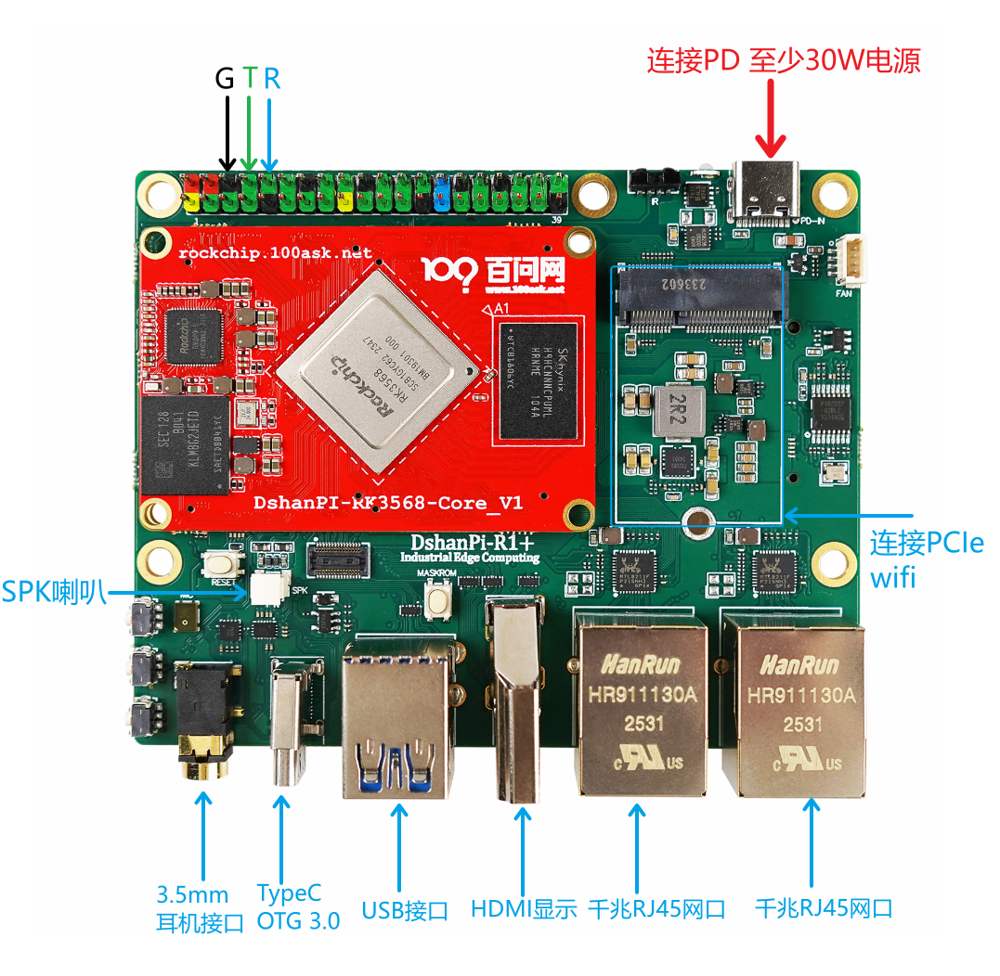
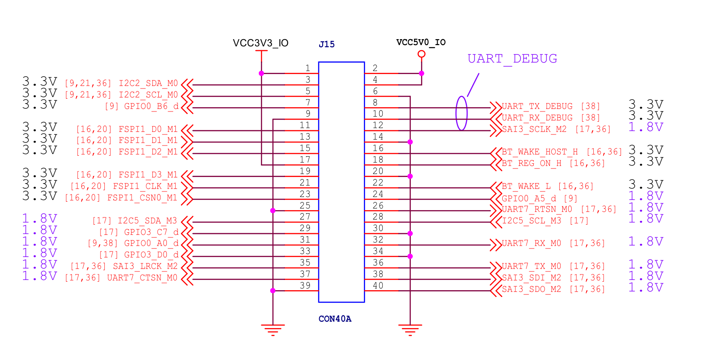
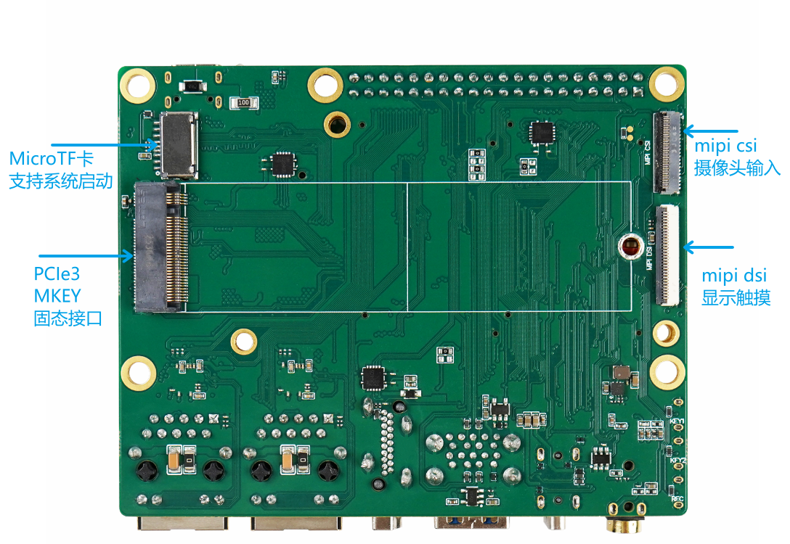

# 硬件连接指南
## 首次启动
:::tip
本指南针对首次使用百问网DshanPI-R1+ 开发板用户，结合各配套外设模块，详细阐述标准的接线与开机流程，确保系统能够安全、正常运行。
首次启动请务必按照如下步骤操作，R1+板内默认烧录为100ASK定制armbian系统，拿到手后初次启动要参考如下步骤连接硬件，之后阅读 首次启动初始化账号 页面 设置网络等基本信息。
:::

```plaintext
[电源适配器]---(Type-C接口)-->[dshanpi-a1开发板]<---(HDMI线)---[显示器]
                                            |          |
                                     [USB鼠标]   [USB键盘]
                                     [TF/SD卡] (可选)
                                     [以太网线] (可选)
```

### 1. PD 电源适配器连接

- **推荐设备**：建议使用官方认证的 30W PD 电源适配器，确保供电稳定可靠。
- **操作步骤**：
  1. 使用电源适配器自带的 Type-C 线缆；
  2. Type-C 一端插入 dshanpi-R1+ 板的 PD 供电接口；
  3. 另一端插入电源适配器；
  4. 插好适配器后接通电源，开发板即会自动启动。

- **注意事项**：
  - 切勿用电流小于 30W 的非 PD 适配器，以免影响系统稳定性；
  - 使用第三方 PD 电源适配器时请注意电压电流参数与官方一致（使用第三方PD电源导致板子硬件损坏不保修）。
    电源适配器推荐购买我们的 30W PD电源适配器，其他的没有测试过。


### 2. USB鼠标键盘连接

- 准备工作：请准备一套标准 USB 接口的鼠标和键盘（有线或无线均可，但无线需配 USB 接收器）。
- 操作步骤：
  - 将 USB 键盘和 USB 鼠标分别插入dshanpi-R1+  板上的 USB 接口（通常有多个 USB2.0/USB3.0端口可选）。
  - 若为无线套装，将无线接收器插入任一 USB 接口即可。
- 注意事项：
  - 务必插牢，避免接触不良。
  - 无法使用蓝牙鼠标键盘。




### 3. HDMI 连接

- **准备工作**：
  - 1 根标准 HDMI 线；
  - 1 台支持 HDMI 输入的显示器、电视或带 HDMI 输入的笔记本电脑（如有需要，也可用 USB 转 HDMI 模块作为中转适配）。
- **操作步骤**：
  1. 将 HDMI 线一端插入 dshanpi-R1+  开发板的 HDMI 输出口；
  2. 另一端插入显示设备的 HDMI 输入口；
  3. 确保显示器已切换至正确 HDMI 通道，并处于开机状态。
- **扩展说明**：
  - 如需连接高清电视，建议使用高品质 HDMI 线确保信号稳定；
  - 若使用 USB 转 HDMI，需先将 USB 插入板载 USB 口，HDMI 插到模块上。

准备一根 HDMI 线，接入 dshanpi-R1+ 的 HDMI 接口（另一端可以连接电脑的 HDMI 接口或USB转HDMI模块的接口），连接接口


## 其他设备连接
### 串口连接

串口debug引脚在 dshanpi-R1+扩展引脚上，我们需要借助 USB转TTL模块 来登录我们的串口终端，需要注意的是：

-  dshanpi-R1+的 **TX** 引脚需要接到 -》USB转TTL模块的 **RX** 引脚；
- dshanpi-R1+的 **RX** 引脚需要接到 -》USB转TTL模块的 **TX** 引脚；
- dshanpi-R1+的 **GND** 引脚需要接到 -》USB转TTL模块的 **GND** 引脚；

串口连接只需接这三根线即可，无需接上VCC引脚。扩展引脚参考如下：




### 其余模块连接

准备一块PCIE WiFi6模块，我们将需要接入到 dshanpi-R1+的 M.2 E KEY 接口上，如下：

接入后，我们需要拧上螺丝，即可固定住 PCIE WiFi6模块。如下：


