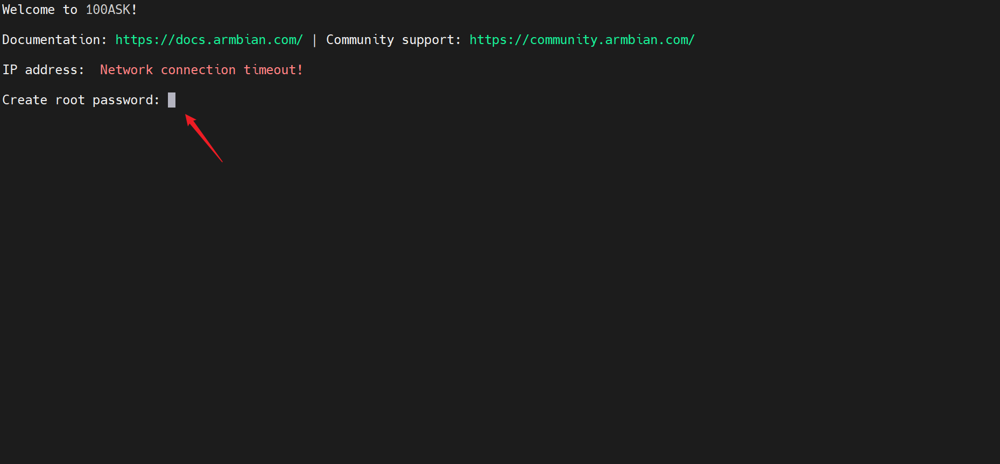
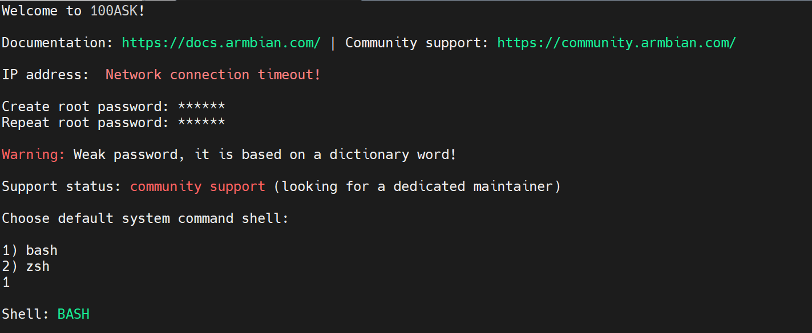
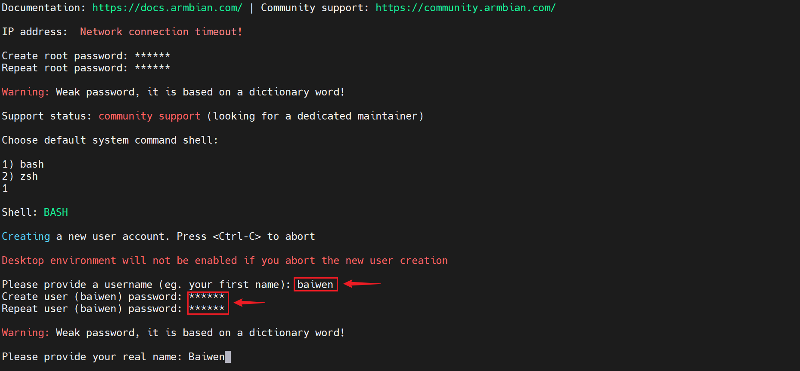
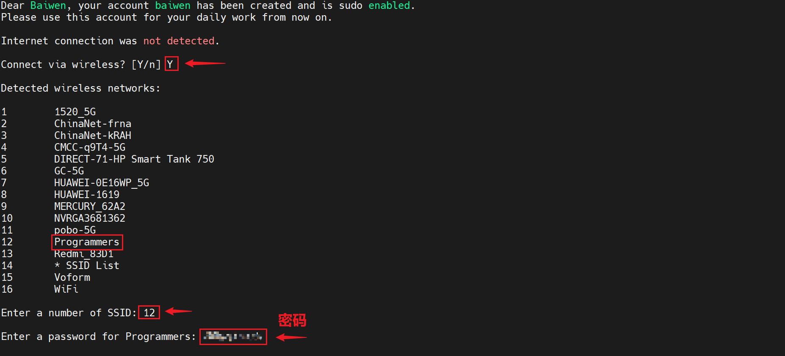
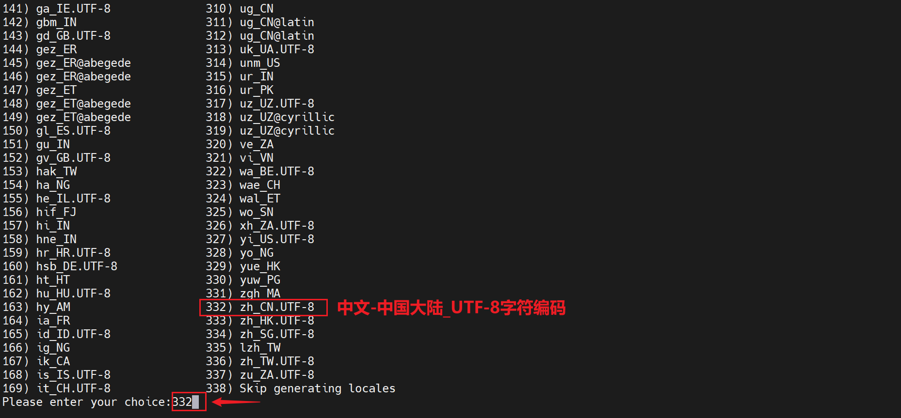
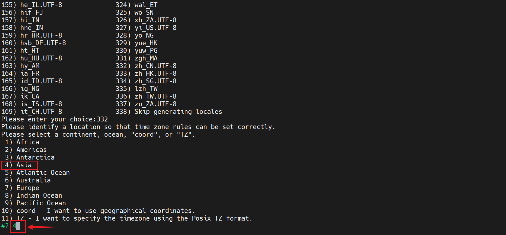
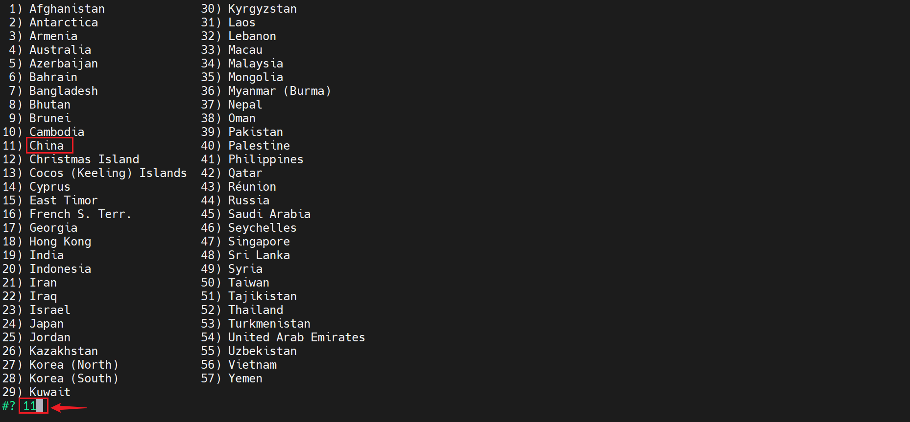
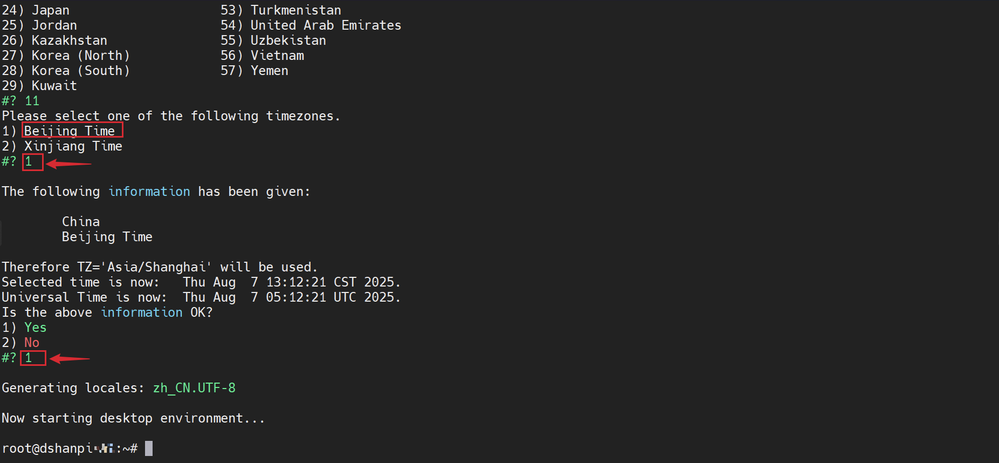
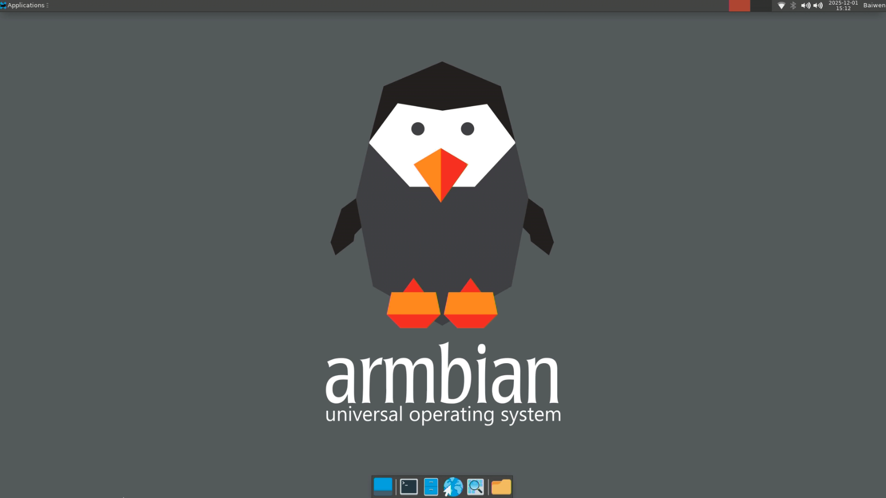

# 首次启动设置

本章节将带领您完成百问网 DShanPi-R1+ 的首次启动快速配置，从零开始，一步到位。

:::tip 提示
如果在操作过程中遇到问题，请查阅本文档末尾的 **常见问题与解决方案** 部分。
:::

## 启动设置步骤

### 1. 设置 Root 密码

首次上电启动后，系统会提示设置 root 用户的密码。请输入您自定义的密码（例如 **`100ask`**）。

**操作：** 输入两次相同的密码，然后按回车键确认。

### 2. 选择默认 Shell

系统提供多种 Shell 供选择。推荐选择 `bash`，因其兼容性最强。

**操作：** 输入 `1`，然后按回车键确认。

### 3. 创建普通用户

为了安全起见，建议创建一个普通用户。

*   **用户名**：例如 **`baiwen`**
*   **密码**：例如 `100ask`

**操作：**
1.  输入用户名并回车。
2.  输入两次相同的密码并回车。
3.  当提示 `Please provide your real name` 时，输入全名或直接回车确认。

### 4. 配置网络 (WiFi)

系统会询问是否现在连接 WiFi。您可以选择立即连接 (`Y`) 或稍后连接 (`n`)。

#### 选项 A: 立即连接 WiFi (推荐)

1.  输入 `Y` 并回车，系统会自动扫描附近的 WiFi 网络。
2.  找到您的 WiFi 名称，输入密码并回车。

连接成功后，系统会自动配置时区等信息，您只需根据提示选择即可（通常直接回车）。

#### 选项 B: 稍后连接 (手动设置区域)

如果您选择输入 `n` 跳过 WiFi 连接，则需要手动设置区域和时区。

1.  **选择语言编码**：推荐选择 `zh_CN.UTF-8`，输入对应编号并回车。
    

2.  **选择区域**：选择 `Asia` (亚洲)，输入 `4` 并回车。
    

3.  **选择国家**：选择 `China` (中国)，输入 `11` 并回车。
    

4.  **选择时区**：选择 `Beijing Time` (北京时间)，输入 `1` 并回车。
    

设置完成后，系统会自动登录到 root 用户。

## 常见问题与解决方案

问题 1：在屏幕上如何进行设置？

**解决方案：**
接上 USB 鼠标和键盘，操作方式与命令行一致。设置完成后，将进入如下桌面环境：

问题 2：首次启动直接提示输入用户名和密码，未出现配置向导？

**解决方案：**
这是正常现象，可能通过以下方式解决：
1.  **默认账户登录**：尝试使用默认的 root 用户登录。
    *   **用户名**：`root`
    *   **密码**：`100ask`
2.  **重新烧录**：如果默认密码无效，可能是镜像已配置过，建议参考烧录教程重新烧录系统镜像。

