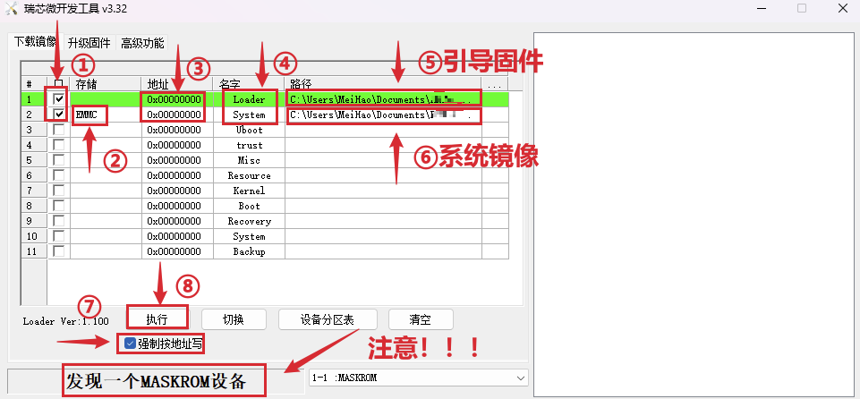
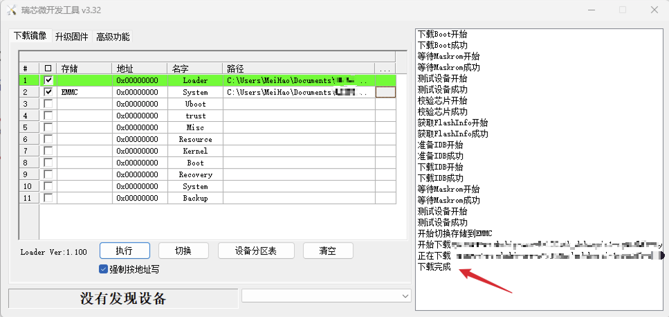
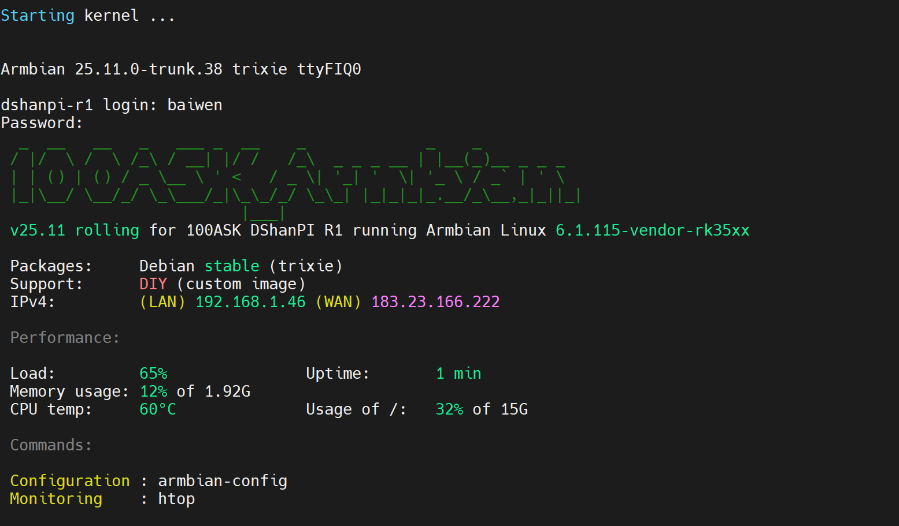
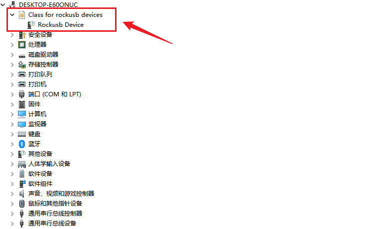

# 烧录 ArmBian 系统

本章节将讲解如何把我们提供的 ArmBian 系统镜像烧录至 EMMC。

## 准备工作

### 1. 硬件准备

烧录系统镜像，除了 DShanPi-R1+ ，还需要准备 **TypeC-3.2 10Gbps 速率 USB 线** 和 **30W PD 电源适配器**。

:::info 硬件建议
建议使用韦东山店铺购买的线材和电源，以确保兼容性和稳定性。
:::

  

    
<strong>TypeC-3.2 10Gbps 速率 USB 线</strong>

    
  

  

    
<strong>30W PD 电源适配器</strong>

    
  

### 2. 软件下载

我们需要在 PC 端下载 **系统镜像**、**烧录工具**、**驱动安装工具包** 以及 **引导固件**。

:::tip 下载提示
按住 `Ctrl` 键，鼠标 `左键` 点击下方链接，即可一键下载。
:::

| 软件名称 | 说明 | 下载链接 |
| :--- | :--- | :--- |
| **ArmBian 带桌面系统镜像** | DShanPi-R1+ ArmBian 带桌面系统镜像 | [点击下载](https://dl.100ask.net/Hardware/MPU/RK3568-DshanPI-R1%2B/Images/armbian/100ASK_Armbian_25.11.0-trunk_Dshanpi-r1_trixie_vendor_6.1.115_xfce_desktop.img.7z) |
| **ArmBian 无桌面系统镜像** | DShanPi-R1+ ArmBian 无桌面系统镜像 | [点击下载](https://dl.100ask.net/Hardware/MPU/RK3568-DshanPI-R1%2B/Images/armbian/Armbian_community_25.11.0-trunk.413_Dshanpi-r1_trixie_vendor_6.1.115_minimal.img.xz) |
| **RKDevTool** | 瑞芯微烧录工具 (v3.32) | [点击下载](https://dl.100ask.net/Hardware/MPU/RK3568-DshanPI-R1%2B/Tools/RKDevTool_Release_v3.32.zip) |
| **DriverAssitant** | 驱动安装工具包 (v5.1.1) | [点击下载](https://dl.100ask.net/Hardware/MPU/RK3568-DshanPI-R1%2B/Tools/DriverAssitant_v5.1.1.zip) |
| **引导固件** | DShanPi-R1+ 引导固件 (SPL Loader) | [点击下载](https://dl.100ask.net/Hardware/MPU/RK3568-DshanPI-R1%2B/Images/armbian/rk356x_spl_loader_v1.16.112.bin) |

### 3. 烧录驱动安装

在烧录之前，我们需要先安装烧录驱动。

1.  解压前面下载的 **`DriverAssitant_vxxx.zip`**。
2.  运行 **`DriverInstall.exe`**。
3.  点击 **驱动安装** 按钮。

:::info 提示
如果之前已经安装过瑞芯微的驱动，这里可以选择跳过。
:::

## 系统镜像烧录

### 1. 进入 Maskrom 烧录模式

请严格按照以下步骤操作，使开发板进入 Maskrom 模式：

:::danger 关键步骤
**请务必按照顺序操作：**
1.  先连接 USB 数据线。
2.  **按住 MASKROM 按键不放**。
3.  再接上电源。
:::

1.  **连接数据线**：使用 USB3.0 OTG 线连接开发板和电脑的 USB3.0 接口（通常为蓝色）。
2.  **按住按键**：按住板子上的 **`MASKROM`** 按键，**不要松开**。
3.  **连接电源**：接上电源适配器。
4.  **确认状态**：此时开发板将进入 Maskrom 模式，RKDevTool 工具下方会显示发现 **MASKROM** 设备。

### 2. 配置并运行烧录工具

打开 **RKDevTool** 烧录工具，参考下图进行配置：

请按照以下步骤仔细配置烧录选项：

1.  **勾选项目**：勾选列表中的前两个选项（Loader 和 System）。
2.  **设置存储类型**：确保第二个选项（System）的存储类型设置为 **`EMMC`**。
3.  **检查地址**：所有项的地址默认设置为 **`0x00000000`**，无需修改。
4.  **设置名称**：名称可参考上图设置，通常保持默认即可。
5.  **加载引导固件 (Loader)**：
    *   点击第一行（Loader）最右侧的路径选择框。
    *   选择之前下载的 **`rk356x_spl_loader_v1.16.112.bin`** 文件。
6.  **加载系统镜像 (System)**：
    *   点击第二行（System）最右侧的路径选择框。
    *   选择之前下载并解压得到的 **`xxx.img`** 文件。
7.  **强制按地址写**：勾选右侧的 **`强制按地址写`** 选项。
8.  **开始烧录**：
    *   确保底部状态栏显示 **发现一个MASKROM设备**。
    *   点击 **`执行`** 按钮开始烧录。

:::note 烧录过程
开始烧录后，请耐心等待。烧录工具右侧会显示进度，直到出现 **下载完成** 字样，即表明烧录完成。
:::

### 3. 启动日志 

烧录完成后，输入创建好的用户名和密码，会自动重启并进入系统。如果连接了串口调试工具，可以看到类似的启动日志：

## 常见问题与解决方案

执行烧录操作后，烧录工具没有显示 MASKROM 设备？

**解决方案：**

1.  **检查驱动**：确保已正确安装 DriverAssitant 驱动。
2.  **检查设备管理器**：查看设备管理器中是否出现瑞芯微的 USB 设备（如下图所示）。
3.  **重试连接**：
    *   尝试重新插拔 USB3.0 OTG 接口的数据线。
    *   尝试更换电脑的 USB 接口。
    *   重启电脑后再次尝试。

