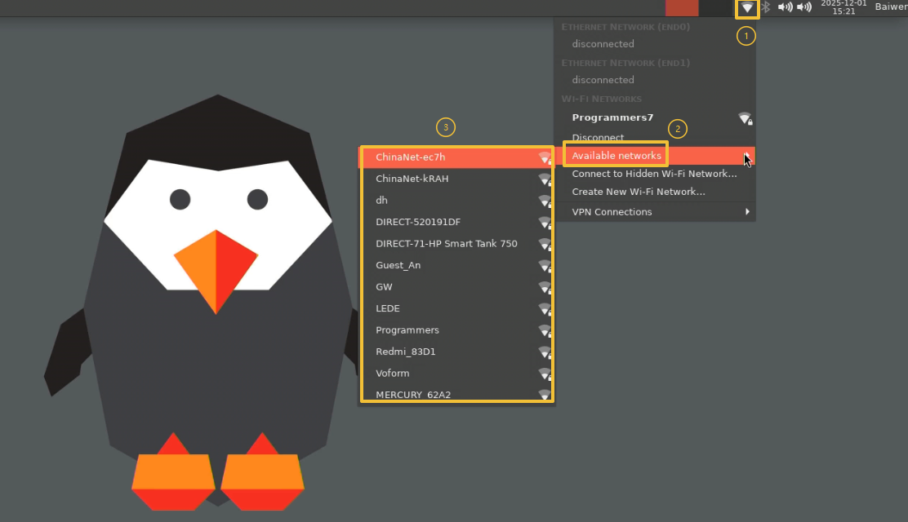
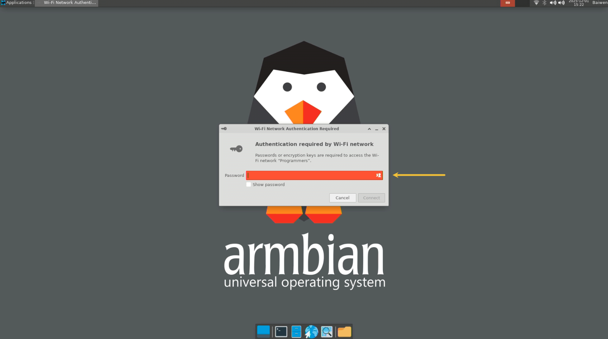

# 网络连接指南

本章节将讲解如何在百问网 DShanPi-R1+ 设备上连接网络。支持 **千兆有线网络** 和 **无线 WiFi** 两种方式。

:::info 说明
千兆有线网口支持即插即用，连接网线后即可自动获取 IP 地址，无需额外配置。本章重点讲解无线 WiFi 的连接方法。
:::

## 桌面环境连接 WiFi

如果您使用的是带有屏幕的桌面环境，可以通过图形化界面快速连接 WiFi。

### 连接步骤

1.  点击任务栏右上角的网络图标，展开 WiFi 列表。
    

2.  在列表中找到您的 WiFi 名称（SSID），点击进行连接。

3.  在弹出的对话框中输入 WiFi 密码。
    

4.  点击确认，等待连接成功。

## 命令行连接 WiFi

在终端或 SSH 环境下，推荐使用 `nmcli` 工具来管理网络连接。`nmcli` 是 NetworkManager 的命令行接口，功能强大且易于使用。

### 常用命令速查

| 功能 | 命令示例 |
| :--- | :--- |
| **查看网络设备** | `nmcli device` |
| **扫描 WiFi** | `nmcli device wifi list` |
| **连接 WiFi** | `nmcli device wifi connect "SSID" password "密码"` |
| **查看连接状态** | `nmcli connection show` |
| **断开连接** | `nmcli connection down <连接名>` |
| **删除连接** | `nmcli connection delete <连接名>` |

### 连接示例

#### 1. 扫描可用 WiFi

执行以下命令查看周围的 WiFi 热点：

```bash
nmcli device wifi list
```

**输出示例：**

```bash
IN-USE  BSSID              SSID           MODE   CHAN  RATE      SIGNAL  BARS  SECURITY
*       74:39:89:F8:F0:AE  Programmers7   Infra  40    405 Mbit/s  85      ▂▄▆█  WPA2
        F0:92:B4:A6:03:91  ChinaNet-kRAH  Infra  1     130 Mbit/s  60      ▂▄▆_  WPA1 WPA2
        ...
```

#### 2. 连接 WiFi

使用以下命令连接目标 WiFi（请替换 SSID 和密码）：

```bash
# 语法：nmcli device wifi connect <WiFi名称> password <WiFi密码>
nmcli device wifi connect Programmers7 password 100askxxx
```

:::success 成功提示
如果连接成功，终端会显示类似 `Device 'wlan0' successfully activated with '...'` 的提示信息。
:::

#### 3. 验证网络连接

连接成功后，可以使用 `ping` 命令测试网络连通性：

```bash
ping -c 4 www.baidu.com
```

如果能正常接收到数据包，说明网络配置成功。
