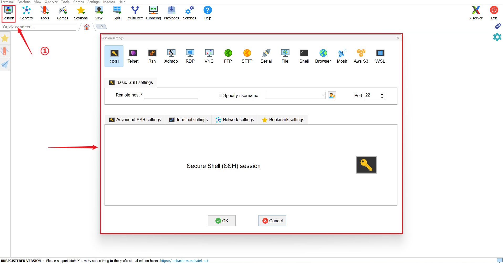
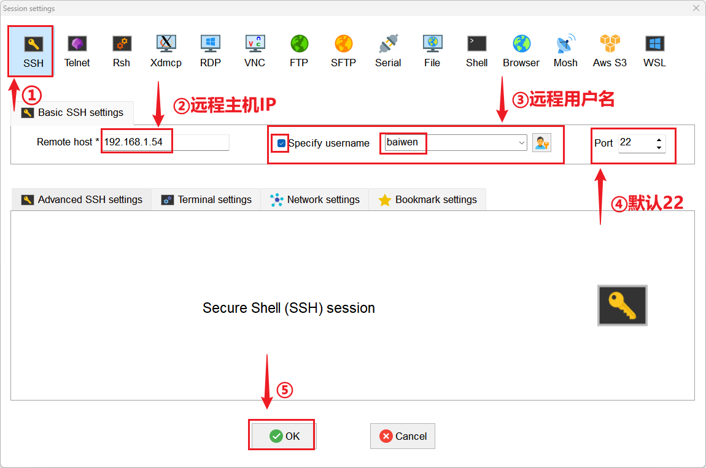

# 远程登录配置

本章节将讲解如何通过 SSH 工具登录远程设备终端。

## 前置条件

:::info 说明
默认情况下，DShanPi-R1+ 的 SSH 服务已经安装并配置为按需启动（Socket Activation）。以下内容用于排查无法连接的问题，正常情况下只需确保网络畅通即可。
:::

### 1. 本地端准备

*   **SSH 客户端工具**：
    *   **Windows**: 推荐使用 MobaXterm, PuTTY, 或 Git Bash。
    *   **Linux / macOS**: 直接使用终端自带的 `ssh` 命令。
*   **连接信息**：
    *   **IP 地址**: 远程设备的 IP 地址。
    *   **端口**: 默认为 **22**。
    *   **用户名**: 例如 `root` 或 `baiwen`。
    *   **密码**: 对应用户的登录密码。

### 2. 网络连通性检查

确保本地电脑能访问到远程设备的 IP 地址。

**测试方法：**

```bash
# 测试是否能 ping 通
ping <远程IP地址>

# 测试 22 端口是否开放
telnet <远程IP地址> 22
```

:::tip 提示
如果 `ping` 不通，请检查设备是否已连接到网络，或是否与电脑在同一局域网内。
:::

### 3. 远程端服务检查

DShanPi-R1 默认已安装 OpenSSH Server。

**检查 SSH 服务状态：**

```bash
sudo systemctl status ssh
```

**预期输出：**

```bash
○ ssh.service - OpenBSD Secure Shell server
     Loaded: loaded (/usr/lib/systemd/system/ssh.service; disabled; preset: ena>
     Active: inactive (dead)
TriggeredBy: ● ssh.socket
```

:::note 注意
输出显示 `inactive (dead)` 和 `TriggeredBy: ● ssh.socket` 是正常现象。这意味着 SSH 服务由 Socket 监听，只有在接收到连接请求时才会激活，以节省系统资源。
:::

## SSH 登录步骤

本节以 Windows 主机使用 **MobaXterm** 为例进行演示。

### 1. 创建新会话

打开 MobaXterm，点击左上角的 **Session** (会话) 按钮，或者使用快捷键 `Ctrl` + `Shift` + `N`。



### 2. 配置 SSH 连接

在弹出的窗口中，按照以下步骤配置：



1.  **选择类型**：点击 **SSH** 图标。
2.  **远程主机** (Remote host)：输入设备的 **IP 地址**。
    *   *提示：IP 地址可通过串口终端输入 `ip addr` 查看，或在路由器后台查看。*
3.  **指定用户名** (Specify username)：勾选该选项，并输入用户名（如 `root`）。
4.  **端口** (Port)：保持默认 **22**。
5.  **连接**：点击 **OK** 按钮开始连接。

### 3. 输入密码

首次连接时，终端会提示输入密码：

1.  输入用户的密码（输入过程中不会显示字符）。
2.  按 **回车** 键确认。
3.  如果弹出 "Save password" (保存密码) 提示，可根据需要选择 Yes 或 No。

:::success 成功
登录成功后，您将看到远程设备的命令行提示符，即可开始进行远程操作。
:::
