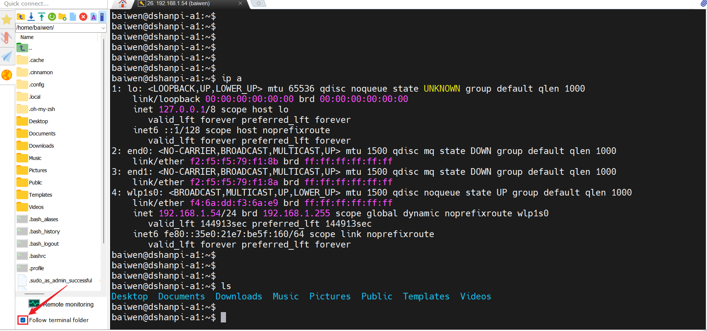
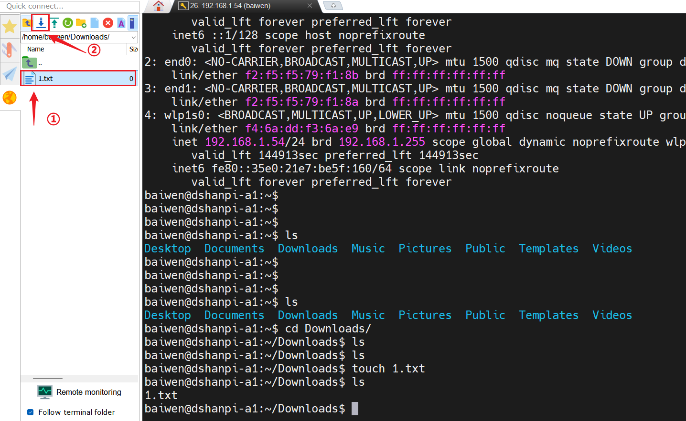
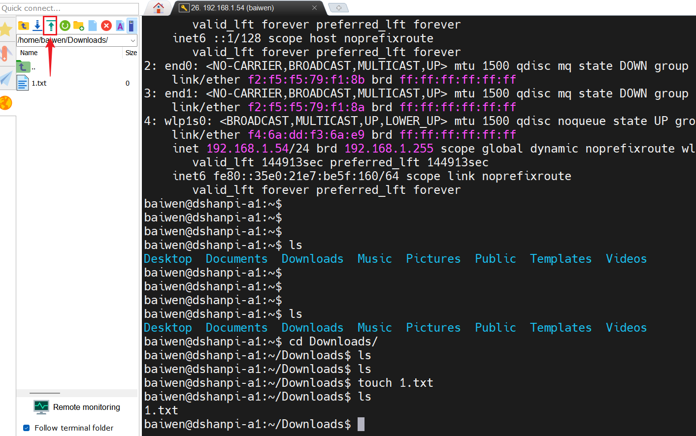
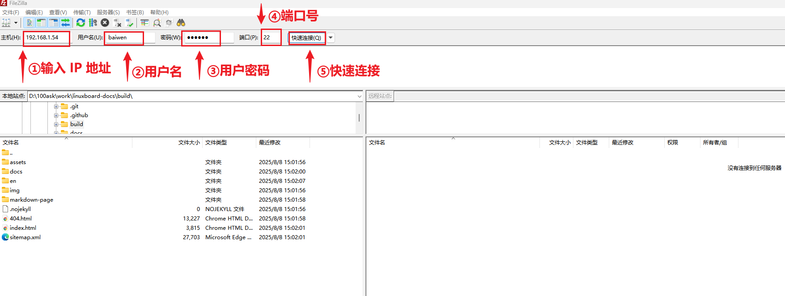
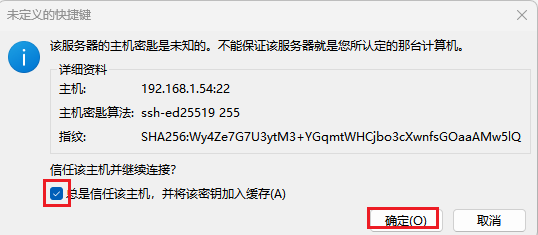
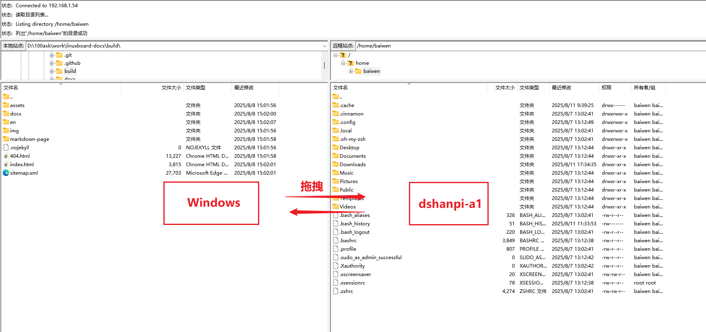

# 文件传输指南

本章节将讲解百问网 DShanPi-R1+ 与不同设备间如何进行文件传输。

import Tabs from '@theme/Tabs';
import TabItem from '@theme/TabItem';

<Tabs>
  <TabItem value="windows" label="Windows 环境" default>

在 Windows 环境下，我们推荐使用 **MobaXterm** 或 **FileZilla** 进行文件传输。

### 方式一：使用 MobaXterm (推荐)

MobaXterm 在建立 SSH 连接的同时，会自动开启 SFTP 文件传输面板，非常便捷。

**操作步骤：**

1.  **开启同步**：在 SSH 会话界面的左侧文件栏，勾选 `Follow terminal folder` (跟随终端目录)。这样，左侧文件列表会自动同步显示终端当前所在的目录。
    

2.  **下载文件 (设备 -> 电脑)**：
    *   选中要下载的文件。
    *   点击上方的 **下载图标** (蓝色向下箭头)，或者直接将文件拖拽到 Windows 桌面。
    

3.  **上传文件 (电脑 -> 设备)**：
    *   点击上方的 **上传图标** (绿色向上箭头)，选择文件。
    *   或者直接将 Windows 中的文件拖拽到左侧文件栏中。
    

:::tip 提示
如果上传后左侧列表没有及时更新，可以点击文件栏上方的 **刷新图标**。
:::

### 方式二：使用 FileZilla

FileZilla 是一款专业的 FTP/SFTP 客户端，适合大量文件的管理。

*   **下载地址**：[FileZilla Client Download](https://filezilla-project.org/download.php?type=client)

**连接步骤：**

1.  打开 FileZilla，在顶部快速连接栏输入信息：
    *   **主机**：设备的 IP 地址
    *   **用户名**：例如 `root`
    *   **密码**：对应密码
    *   **端口**：`22`
    

2.  点击 **快速连接**。首次连接时会弹出指纹确认窗口，勾选 "总是信任该主机" 并确定。
    

3.  连接成功后，左侧为 **本地站点** (Windows)，右侧为 **远程站点** (设备)。直接拖拽文件即可实现互传。
    

  </TabItem>
  <TabItem value="linux_mac" label="Linux / macOS 环境">

在 Linux 或 macOS 系统下，推荐使用 `scp` 命令进行高效的文件传输。

### 基本语法

```bash
# 上传：本地 -> 远程
scp [选项] /本地/文件 用户名@远程IP:/远程/目录

# 下载：远程 -> 本地
scp [选项] 用户名@远程IP:/远程/文件 /本地/目录
```

:::note 常用选项
*   `-r`：递归复制整个目录。
:::

### 使用示例

假设远程设备的 IP 为 `192.168.1.67`，用户名为 `ubuntu`。

#### 1. 下载文件 (远程 -> 本地)

将远程设备 `/home/ubuntu/Documents/1.txt` 下载到当前目录：

```bash
scp ubuntu@192.168.1.67:/home/ubuntu/Documents/1.txt .
```

**输出示例：**

```bash
$ scp ubuntu@192.168.1.67:/home/ubuntu/Documents/1.txt .
The authenticity of host '192.168.1.67' can't be established.
Are you sure you want to continue connecting (yes/no/[fingerprint])? yes
ubuntu@192.168.1.67's password: 
1.txt                               100%    7     0.5KB/s   00:00    
```

#### 2. 上传文件 (本地 -> 远程)

将本地 `2.txt` 上传到远程设备的 `/home/ubuntu/Documents/` 目录：

```bash
scp ./2.txt ubuntu@192.168.1.67:/home/ubuntu/Documents/
```

#### 3. 传输文件夹

上传 `100ask` 文件夹到远程设备：

```bash
scp -r ./100ask ubuntu@192.168.1.67:/home/ubuntu/Documents/
```

下载远程设备的 `dshanpi` 文件夹到本地 `~/Downloads/`：

```bash
scp -r ubuntu@192.168.1.67:/home/ubuntu/Documents/dshanpi ~/Downloads/
```

  </TabItem>
</Tabs>
