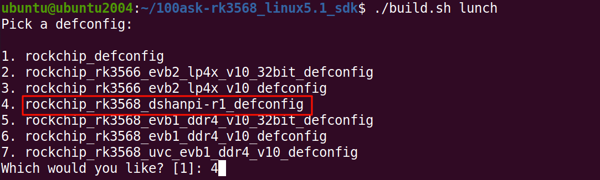
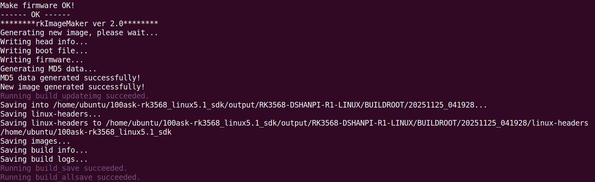

# Buildroot系统构建

本章节将讲解如何基于DshanPi-R1 Buildroot SDK快速构建系统镜像。

## 1. 获取虚拟机

> 注意：提供的虚拟机包含了 Buildroot SDK，环境也已搭建好，Ubuntu默认版本是20.04，不要升级系统版本！！！

获取链接如下：

https://pan.baidu.com/s/15M8zuHOwl_SITl6cSk_7Vg?pwd=eaax 提取码: eaax

## 2. 编译SDK

打开虚拟机，等待一会，进入登录界面（虚拟机用户名： **`ubuntu`** ，密码： **`ubuntu`** ），新建终端，执行以下命令，进入SDK根目录：

~~~bash
cd 100ask-rk3568_linux5.1_sdk/
~~~

如下：

~~~bash
.
├── app
├── buildroot
├── build.sh -> device/rockchip/common/scripts/build.sh
├── debian
├── device
├── docs
├── envsetup.sh -> buildroot/build/envsetup.sh
├── external
├── kernel
├── Makefile -> device/rockchip/common/Makefile
├── output
├── prebuilts
├── README.md -> device/rockchip/common/README.md
├── rkbin
├── rkflash.sh -> device/rockchip/common/scripts/rkflash.sh
├── rockdev -> output/firmware
├── tools
├── u-boot
└── yocto

14 directories, 5 files
~~~

编译SDK命令只需两条：

**① 选择板级配置文件**

在SDK根目录下，执行以下命令，选择 **`rockchip_rk3568_dshanpi-r1_defconfig`** ：

~~~bash
./build.sh lunch
~~~

如下：

**② 编译SDK**

继续在当前路径下，执行以下命令，编译SDK:

~~~bash
./build.sh
~~~

编译耗时因电脑性能而异，请耐心等待。完成后如下：

编译完成，镜像将自动生成于路径 `output/update/Image/`。

~~~bash
cd /home/ubuntu/100ask-rk3568_linux5.1_sdk/output/update/Image
~~~

如下：

~~~bash
.
├── boot.img -> ../../../kernel/boot.img
├── MiniLoaderAll.bin -> ../../../u-boot/rk356x_spl_loader_v1.16.112.bin
├── misc.img -> ../../../device/rockchip/common/images/wipe_all-misc.img
├── oem.img -> ../../firmware/oem.img
├── package-file
├── parameter.txt -> ../../../device/rockchip/.chips/rk3566_rk3568/parameter-buildroot-fit.txt
├── recovery.img -> ../../../buildroot/output/rockchip_rk3568_recovery/images/recovery.img
├── rootfs.img -> ../../../buildroot/output/rockchip_rk3568_dshanpi-r1/images/rootfs.ext2
├── uboot.img -> ../../../u-boot/uboot.img
├── update.img
├── update.raw.img
└── userdata.img -> ../../firmware/userdata.img

0 directories, 12 files
~~~

其中 `update.img` 正是用于烧录到 DshanPi-R1 的最终镜像。

## 3. SDK命令使用

在SDK根目录下，执行以下命令，可以看到 `./build.sh` 的使用参数：

~~~bash
cd ~/100ask-rk3568_linux5.1_sdk/
./build.sh help
~~~

如下：

~~~bash
Usage: build.sh [OPTIONS]
Available options:
chip               - choose chip
defconfig          - choose defconfig
 *_defconfig       - switch to specified defconfig
    Available defconfigs:
	rockchip_defconfig
	rockchip_rk3566_evb2_lp4x_v10_32bit_defconfig
	rockchip_rk3566_evb2_lp4x_v10_defconfig
	rockchip_rk3568_dshanpi-r1_defconfig
	rockchip_rk3568_evb1_ddr4_v10_32bit_defconfig
	rockchip_rk3568_evb1_ddr4_v10_defconfig
	rockchip_rk3568_uvc_evb1_ddr4_v10_defconfig
 olddefconfig      - resolve any unresolved symbols in .config
 savedefconfig     - save current config to defconfig
 menuconfig        - interactive curses-based configurator
kernel             - build kernel
modules            - build kernel modules
linux-headers      - build linux-headers
loader             - build loader (uboot|spl)
uboot              - build u-boot
spl                - build spl
uefi               - build uefi
wifibt             - build Wifi/BT
rootfs             - build default rootfs
buildroot          - build buildroot rootfs
yocto              - build yocto rootfs
debian             - build debian rootfs
recovery           - build recovery
pcba               - build PCBA
security_check     - check contidions for security features
createkeys         - build secureboot root keys
security_uboot     - build uboot with security paramter
security_boot      - build boot with security paramter
security_recovery  - build recovery with security paramter
security_rootfs    - build rootfs and some relevant images with security paramter (just for dm-v)
firmware           - generate and check firmwares
updateimg          - build update image
otapackage         - build OTA update image
sdpackage          - build SDcard update image
all                - build all basic image
save               - save images and build info
allsave            - build all & firmware & updateimg & save
cleanall           - cleanup
post-rootfs        - trigger post-rootfs hook scripts
shell              - setup a shell for developing
help               - usage

Default option is 'allsave'.
~~~

