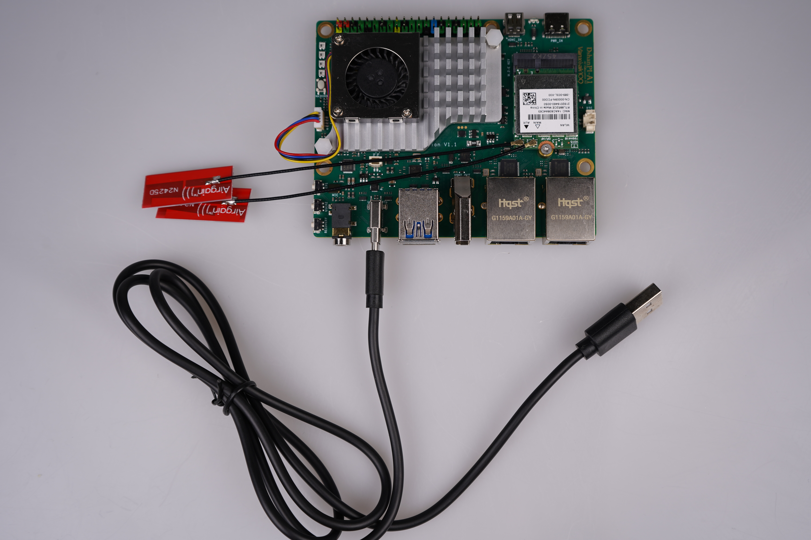
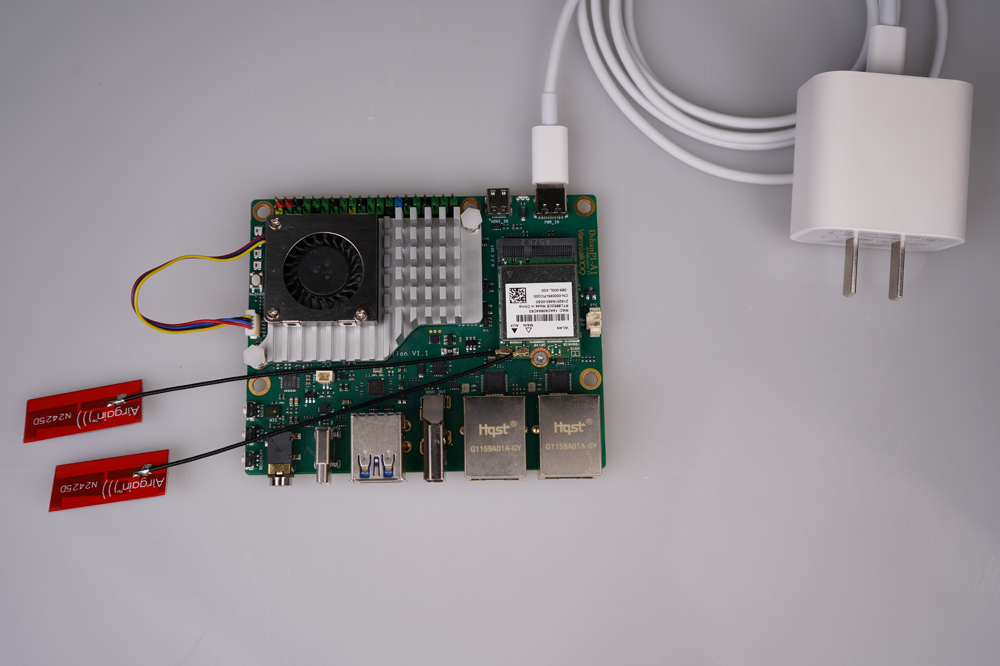
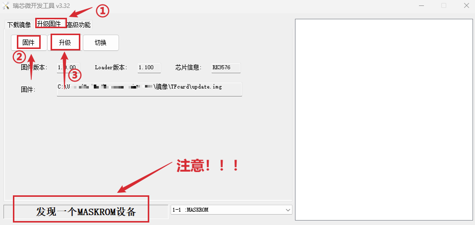
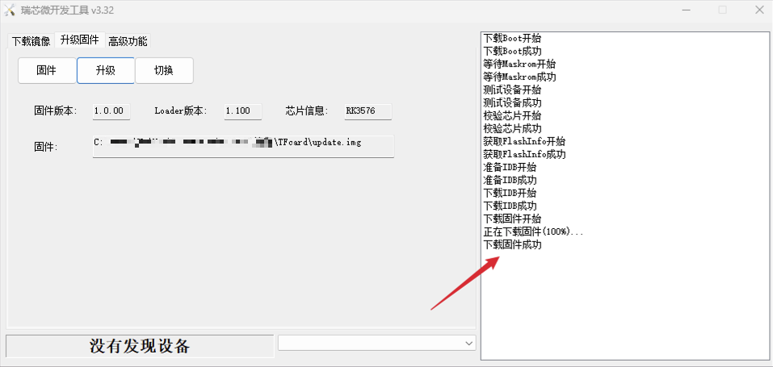

# 烧录Buildroot系统

本章节将讲解如何把 Buildroot 系统镜像烧录至 DShanPi-R1 。

## 准备工作

### 1. 硬件准备

烧录系统镜像，除了 DShanPi-R1 板子，还需要准备 **TypeC-3.2 10Gbps速率USB线 、30W PD电源适配器** （建议韦东山店铺购买，其他的没测试）。如下所示：

TypeC-3.2 10Gbps速率USB线：

 30W PD电源适配器：

### 2. 软件下载

软件上，我们需要在 PC 端下载 **系统镜像、烧录工具和驱动安装工具包** 。下载链接如下：

> 按住 `ctrl` 键，鼠标 `左键` 点击链接，即可一键下载

- **Buildroot 系统镜像：** [DshanPi-R1_Buildroot_Image](https://dl.100ask.net/Hardware/MPU/RK3568-DshanPI-R1%2B/Images/Buildroot/DShanPi-R1_Buildroot_Default.zip)

  `md5校验值：884412ab96fdfd6080e8961501b65aa4` 

- **烧录工具 RKDevTool：**  [RKDevTool_Release_v3.32.zip](https://dl.100ask.net/Hardware/MPU/RK3576-DshanPi-A1/RKDevTool_Release_v3.32.zip)

- **驱动安装工具包 DriverAssitant：** [DriverAssitant_v5.1.1.zip](https://dl.100ask.net/Hardware/MPU/RK3576-DshanPi-A1/DriverAssitant_v5.1.1.zip)

### 3. 烧录驱动安装

在烧录之前，我们需要先安装烧录驱动，在前面下载的资料里找到驱动安装工具包 **`DriverAssitant_vxxx`** ，打开启动下载程序 **`DriverInstall.exe`** ，点击驱动安装即，如下：

> 如果之前安装过了，这里可以选择跳过。

## 烧录系统镜像

准备工作完成后，① 接上 **usb3.0 otg** 线（数据线另一端接电脑的 USB3.0 蓝色接口），② 按住 **`MASKROM`** 按键，**先不松开** ，③ 再接上电源，DShanPi-R1 就会进入 **`MASKROM`** 烧录模式。参照下图操作：

打开瑞芯微烧录工具 ，参考下图配置烧录工具：

- ① 进入 **`升级固件`** 界面；
- ② 点击 **`固件`** ，找到 **前面下载的 buildroot 系统镜像** 或者 **自行编译的系统镜像** ；
- ③ 点击 **`升级`** ，进行烧录（一定要显示为 **MASKROM** 模型才可以烧录）

开始烧录后，需要给点耐心，等待烧录工具右下角出现 **下载固件成功** ，即表明烧录完成。

烧录完成后，会自行启动系统。

## 常见问题与解决方案

- **问题：执行烧录操作后烧录工具没有显示MASKROM设备？**
  - **解决方案：** 检查设备管理器是否出现以下设备，烧录驱动是否安装，如果安装了，插拔一下otg 接口的数据线或者重启电脑。

