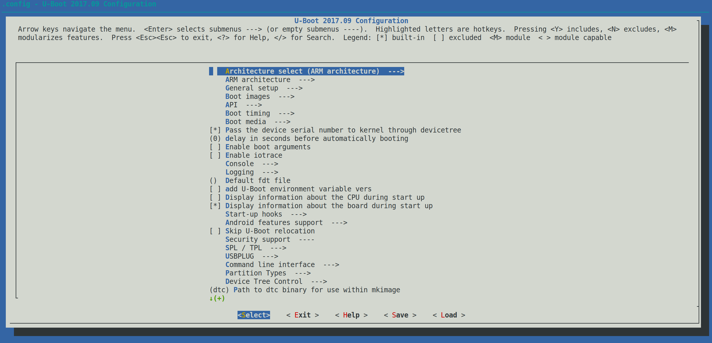
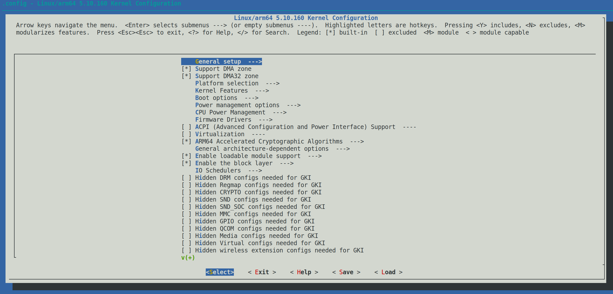
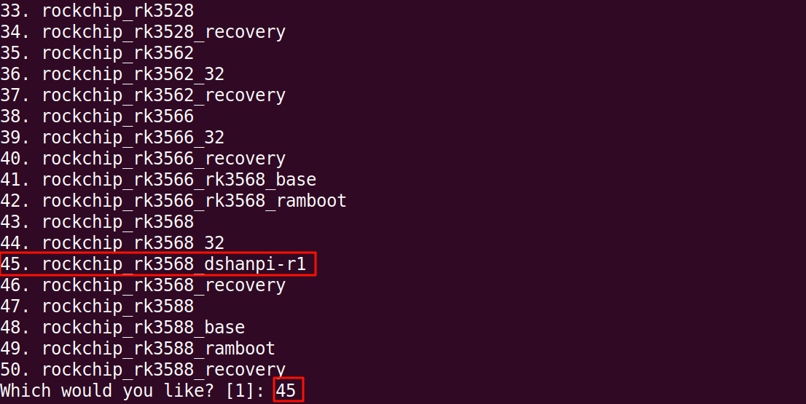
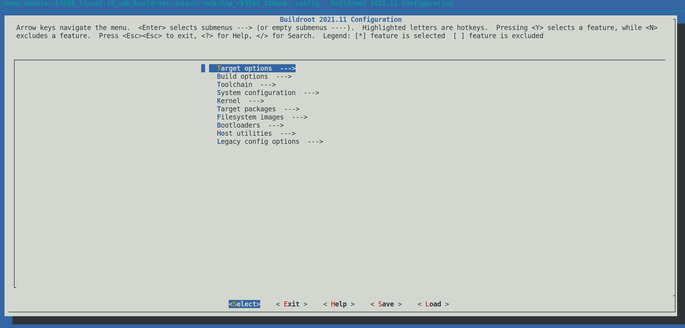

# SDK 开发指南

本章节深入讲解如何在 **Rockchip Linux 5.10 SDK** 中对 **U-Boot**、**Kernel** 和 **Buildroot** 进行独立的配置与编译。

:::info 前置条件
*   所有操作默认在 **Ubuntu 虚拟机** 中执行。
*   假设您已经完成了 SDK 的下载和基础环境搭建（参考 [Buildroot系统构建](./05-1_BuildSDK.md)）。
*   **默认已执行过板级配置文件选择** (`./build.sh lunch`)。
:::

import Tabs from '@theme/Tabs';
import TabItem from '@theme/TabItem';

---

## U-Boot 开发

U-Boot 是嵌入式系统的引导加载程序。虽然 Rockchip 原生 U-Boot 对硬件支持已非常完善，但有时我们仍需进行定制。

<Tabs>
  <TabItem value="config" label="配置 U-Boot" default>

    ### 修改 U-Boot 配置
    
    如果需要修改 U-Boot 的功能（如启动延时、命令支持等），请按以下步骤操作：

    1.  **进入 U-Boot 目录并加载默认配置**：
        ```bash
        cd /home/ubuntu/100ask-rk3568_linux5.1_sdk/u-boot/
        make rk3568_defconfig
        ```

    2.  **打开图形化配置菜单**：
        ```bash
        make menuconfig
        ```
        

    3.  **保存配置**：
        在菜单中修改完成后，选择 `<Save>` 保存并 `<Exit>` 退出。
        
        :::caution 注意
        仅退出菜单不会永久保存更改到源码中。必须执行以下命令更新 `defconfig` 文件：
        :::

        ```bash
        make savedefconfig
        cp defconfig configs/rk3568_defconfig
        ```

    ### 修改设备树 (Device Tree)
    
    U-Boot 的设备树文件位于 `u-boot/arch/arm/dts/` 目录下。RK3568 的设备树包含关系如下：

    ```mermaid
    graph LR
    A[rk3568-evb.dts] --> B[rk3568.dtsi]
    B --> C[rk3568-pinctrl.dtsi]
    A --> D[rk3568-u-boot.dtsi]
    ```
    
    *   **rk3568-evb.dts**: 主板级设备树
    *   **rk3568.dtsi**: 芯片级通用配置
    *   **rk3568-u-boot.dtsi**: U-Boot 特有配置

  </TabItem>
  <TabItem value="compile" label="编译 U-Boot">

    ### 独立编译 U-Boot

    Rockchip SDK 提供了便捷的编译脚本 `./build.sh`。

    在 **SDK 根目录** 下执行以下命令：

    ```bash
    cd ~/100ask-rk3568_linux5.1_sdk
    ./build.sh uboot
    ```

    编译完成后，生成的镜像位于 `output/firmware/` 或 `u-boot/` 目录下。

  </TabItem>
</Tabs>

---

## Kernel 开发

内核开发主要涉及驱动程序的增减和设备树的修改，以适配特定的板载硬件。

<Tabs>
  <TabItem value="config" label="配置 Kernel" default>

    ### 修改内核配置
    
    如果需要将某个驱动编译进内核（Built-in）或编译成模块（Module）：

    1.  **进入 Kernel 目录**：
        ```bash
        cd /home/ubuntu/100ask-rk3568_linux5.1_sdk/kernel/
        ```
        
    2.  **打开图形化配置菜单**：
        ```bash
        make ARCH=arm64 menuconfig
        ```
        

    3.  **保存配置**：
        修改完成后，需将配置保存回 `defconfig` 文件，防止下次编译时丢失：

        ```bash
        make ARCH=arm64 savedefconfig
        cp defconfig arch/arm64/configs/rockchip_dshanpi-r1_linux_defconfig
        ```

    ### 修改设备树
    
    DshanPi-R1 的内核设备树文件路径为：
    
    `SDK/kernel/arch/arm64/boot/dts/rockchip/rk3568-dshanpi-r1-linux.dts`

    ```bash
    ls kernel/arch/arm64/boot/dts/rockchip/rk3568-dshanpi-r1-linux.dts
    ```

  </TabItem>
  <TabItem value="compile" label="编译 Kernel">

    ### 独立编译 Kernel

    在 **SDK 根目录** 下执行以下命令：

    ```bash
    cd ~/100ask-rk3568_linux5.1_sdk
    ./build.sh kernel
    ```

    *   生成的内核镜像 (`boot.img`) 将位于 `output/firmware/`。
    *   设备树二进制文件 (`.dtb`) 将位于 `kernel/arch/arm64/boot/dts/rockchip/`。

  </TabItem>
</Tabs>

---

## Buildroot 开发

Buildroot 用于构建根文件系统（RootFS）。DshanPi-R1 SDK 默认使用 Buildroot 进行系统构建。

<Tabs>
  <TabItem value="structure" label="目录结构" default>
  
    Buildroot 源码位于 `SDK/buildroot/` 目录下。核心目录说明如下：

    | 目录 | 说明 |
    | :--- | :--- |
    | **configs/** | 存放预定义的板级配置文件 (`*_defconfig`) |
    | **board/** | 存放特定硬件平台的板级支持文件 (脚本、补丁等) |
    | **package/** | 包含所有可用软件包的定义和构建规则 (如 `ffmpeg`, `qt5` 等) |
    | **output/** | 存放构建产物 (镜像、文件系统、工具链) |
    | **dl/** | 存放下载的源码包 (Download) |

  </TabItem>
  <TabItem value="config" label="配置 Buildroot">

    ### 修改 Buildroot 配置
    
    例如：添加新的软件包（Package）或修改系统设置。

    1.  **初始化环境并选择配置**：
        在 **SDK 根目录** 下执行：
        ```bash
        cd ~/100ask-rk3568_linux5.1_sdk
        source envsetup.sh
        ```
        在弹出的菜单中选择 `rockchip_rk3568_dshanpi-r1` (通常是编号对应选项)。
        
        

    2.  **进入配置菜单**：
        ```bash
        cd buildroot
        make menuconfig
        ```
        

    3.  **保存配置**：
        修改完成后，执行以下命令保存到默认配置文件：

        ```bash
        make savedefconfig BR2_DEFCONFIG=configs/rockchip_rk3568_dshanpi-r1_defconfig
        ```

  </TabItem>
  <TabItem value="compile" label="编译 Buildroot">

    ### 独立编译 Buildroot

    在 **SDK 根目录** 下执行以下命令：

    ```bash
    cd ~/100ask-rk3568_linux5.1_sdk
    ./build.sh buildroot
    ```

    :::tip 提示
    编译 Buildroot 通常耗时较长，因为它需要下载并编译选定的所有软件包。
    :::

  </TabItem>
</Tabs>
