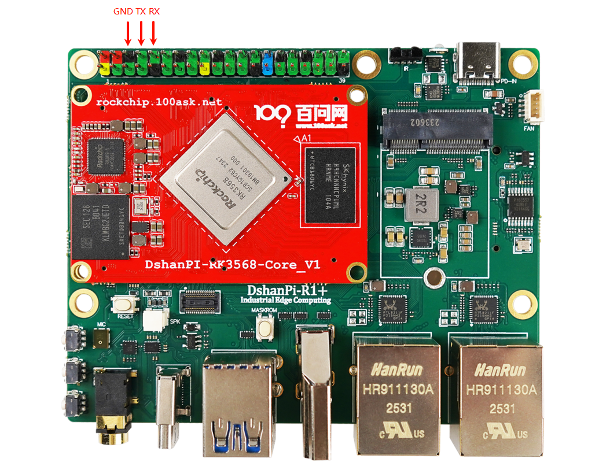
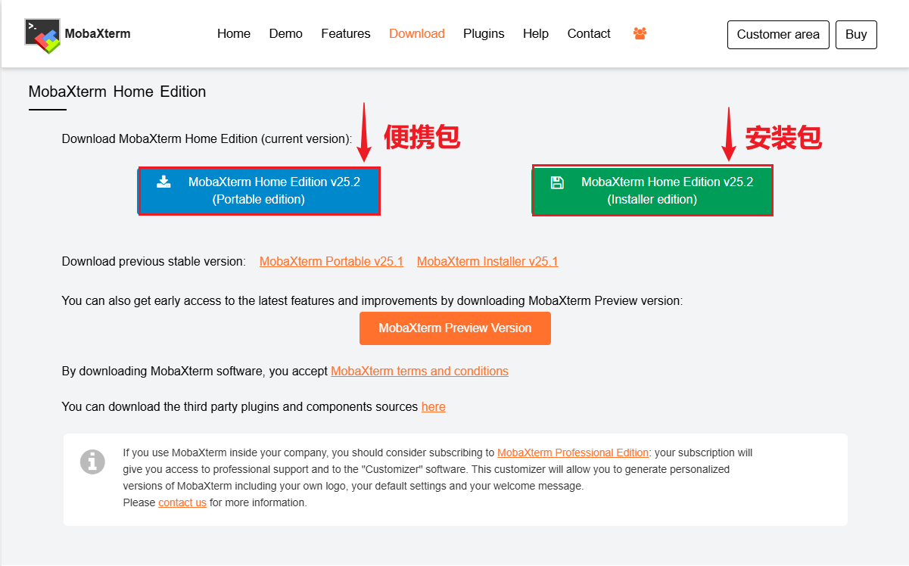
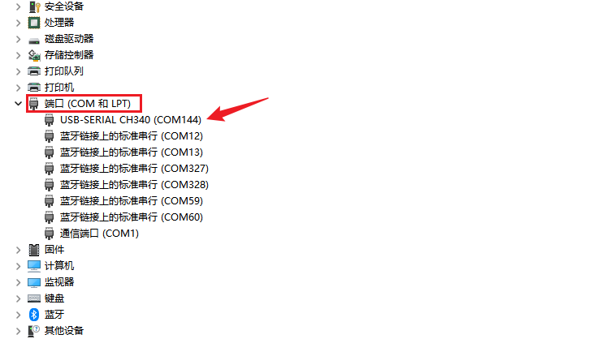
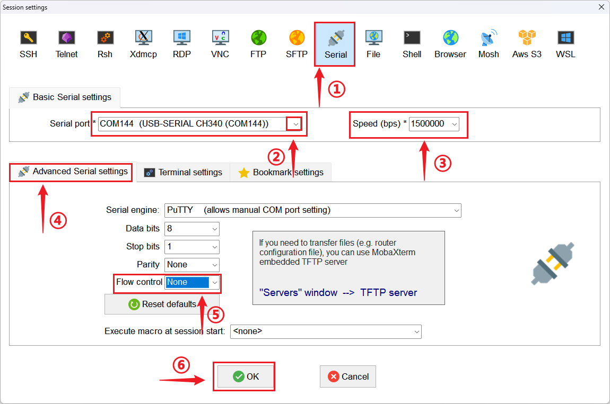
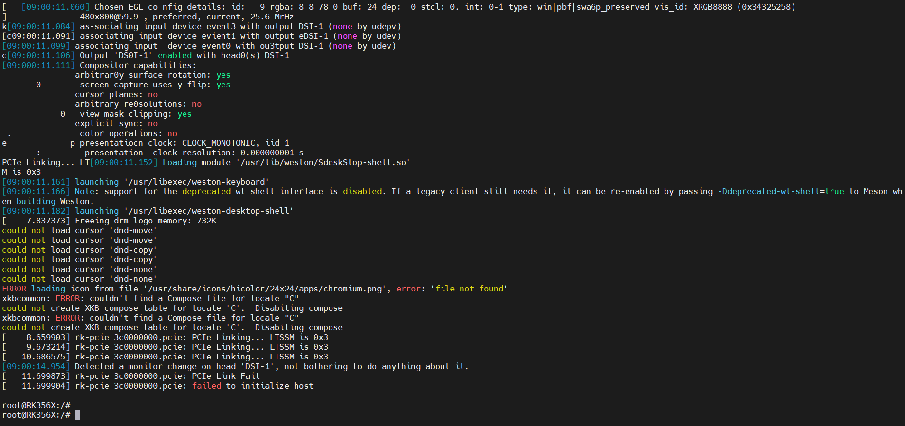

# 连接串口终端

本章节将详细讲解如何连接 DShanPi-R1 的串口终端，以便进行系统调试和命令交互。

## 准备工作

在开始之前，请确保您已准备好以下硬件设备和软件工具。

### 硬件清单

| 设备名称 | 数量 | 说明 |
| :--- | :---: | :--- |
| **DShanPi-R1 开发板** | 1 | 目标调试设备 |
| **Type-C 数据线** | 1 | 用于供电或数据传输 |
| **USB 转串口模块** | 1 | 如 CH340、CP2102 等，推荐支持 3.3V 电平 |
| **电源适配器** | 1 | 建议使用 5V/3A 电源 |

### 软件工具

*   **MobaXterm**：一款功能强大的终端工具（推荐 Windows 用户使用）。
*   **驱动程序**：USB 转串口芯片驱动（通常 Windows 10/11 会自动安装）。

---

## 硬件连接指南

请参考下图找到开发板上的扩展引脚 DEBUG 接口位置。

:::caution 接线注意事项
连接 USB 转串口模块时，请务必遵循 **“交叉连接”** 原则，即 TX 接 RX，RX 接 TX。
:::

具体引脚对应关系如下：

| DShanPi-R1 引脚 | 连接方向 | USB 转串口模块引脚 |
| :---: | :---: | :---: |
| **GND** | \<--> | **GND** |
| **TX** | ---> | **RX** |
| **RX** | \<--- | **TX** |

---

## 软件安装与配置

### 1. 获取 MobaXterm

MobaXterm 提供了丰富的功能，包括 SSH、串口、VNC 等。

*   **官方下载地址**：[MobaXterm Download Page](https://mobaxterm.mobatek.net/download-home-edition.html)

:::tip 版本选择建议
建议下载 **Portable edition (便携版)**，解压即用，无需安装，非常方便。
:::

### 2. 检查串口设备

连接好硬件后，打开电脑的 **设备管理器**，展开 **“端口 (COM 和 LPT)”** 列表。

*   **识别设备**：找到类似 `USB-SERIAL CH340` 的设备。
*   **记录端口号**：记住其对应的端口号（例如 `COM144`），后续配置需要用到。

:::info 驱动检查
如果在设备管理器中未找到对应端口，或显示黄色感叹号：
1.  检查 USB 线是否连接牢固。
2.  检查是否已安装对应的 USB 转串口驱动（可使用驱动精灵或前往芯片官网下载）。
:::

### 3. 配置 MobaXterm 会话

请按照以下步骤配置串口参数：

1.  **新建会话**：点击左上角的 **`Session`** 按钮（或快捷键 `Ctrl+Shift+N`）。
    

2.  **设置串口参数**：
    *   选择 **`Serial`** 协议图标。
    *   **Serial port**：选择之前记录的端口号（如 COM144）。
    *   **Speed (Bps)**：设置为 **`1500000`** (注意：DShanPi-R1 默认波特率为 1.5M)。
    *   **Flow control**：在 `Advanced Serial settings` 中，将其设置为 **`None`**。
    *   点击 **`OK`** 启动会话。

    

3.  **验证连接**：
    会话启动后，如果屏幕空白，请尝试按一下 `Enter` 键，或者给开发板重新上电/复位。正常情况下，您将看到系统的启动日志。

    

---

## 常见问题排查

终端无任何显示或显示乱码

这是最常见的问题，请按以下顺序检查：
1.  **检查波特率**：确认 MobaXterm 中的速率设置为 **1500000**。
2.  **检查接线**：确认 TX 和 RX 是否接反，尝试交换连接。
3.  **检查端口**：确认选择了正确的 COM 端口。

提示 "Unable to open serial port" (无法打开串口)

1.  **端口被占用**：检查是否有其他串口助手或终端软件正在占用该端口，请关闭它们。
2.  **驱动异常**：在设备管理器中检查驱动状态，尝试重新插拔 USB 模块。

可以接收数据但无法发送数据

1.  **检查 TX 连接**：这是典型的 TX（电脑端）到 RX（开发板端）链路中断的表现，请重点检查该线路。
2.  **检查流控**：确认 Flow control 已设置为 None。

会话启动后看不到打印信息

1.  **错过启动信息**：如果开发板已经启动完成，此时连接串口可能没有输出。尝试按 `Enter` 键激活控制台。
2.  **复位设备**：按下开发板的复位键，观察是否有启动日志输出。

