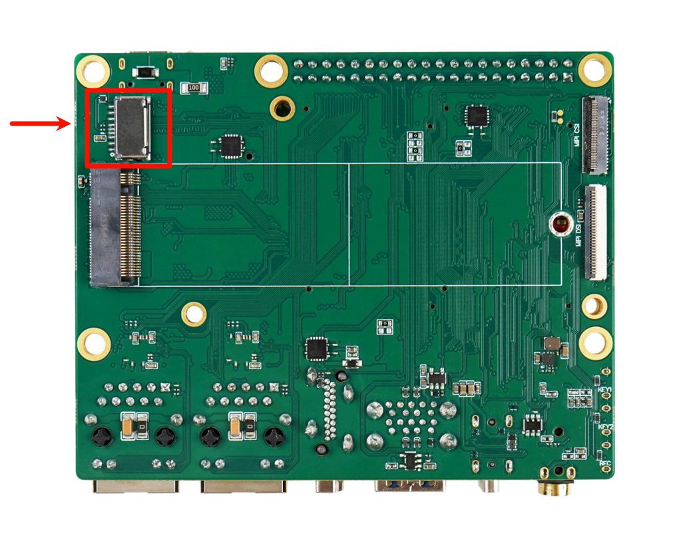
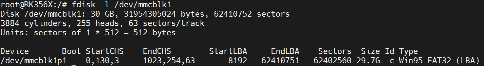
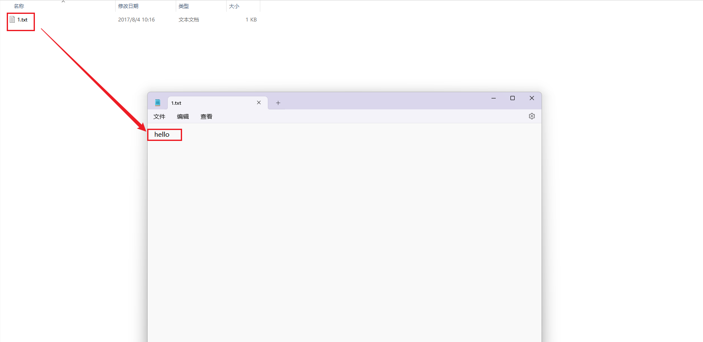

# TF卡测试指南

本章节将讲解如何在 DShanPi-R1 上测试 TF 卡功能。

## 准备工作

| 项目 | 名称 | 数量 | 说明 |
| :--- | :--- | :--- | :--- |
| **硬件** | DShanPi-R1 开发板 | 1 | - |
| | Type-C 数据线 | 1 | 用于供电或数据传输 |
| | USB 转串口模块 | 1 | 用于连接串口终端 |
| | 电源适配器 | 1 | 推荐 5V/2A 或以上 |
| | TF 卡 | 1 | 建议 Class 10 以上 |
| **软件** | MobaXterm | - | 串口终端工具 |

## 开启串口终端

:::info 提示
执行后续操作前，请确保已连接好串口终端。如果不清楚如何连接，请先阅读 **《连接串口终端》** 章节。
:::

## 测试步骤

### 1. 插入 TF 卡

登录开发板串口终端成功后，将 TF 卡插入开发板卡槽。



插入 TF 卡后，终端会自动打印识别信息：

```bash
[  587.837925] mmc_host mmc1: Bus speed (slot 0) = 375000Hz (slot req 400000Hz, actual 375000HZ div = 0)
[  587.934652] mmc_host mmc1: Bus speed (slot 0) = 148500000Hz (slot req 150000000Hz, actual 148500000HZ div = 0)
[  588.046415] dwmmc_rockchip fe2b0000.dwmmc: Successfully tuned phase to 270
[  588.046447] mmc1: new ultra high speed SDR104 SDHC card at address 0001
[  588.048172] mmcblk1: mmc1:0001 SD16G 29.8 GiB
[  588.050354]  mmcblk1: p1
```

系统检测到设备 `mmcblk1`，并发现分区 `p1`。

### 2. 查看分区信息

执行以下指令，查看该分区的文件系统类型：

```bash
fdisk -l /dev/mmcblk1
```

**输出示例：**



:::note
从信息可知，`p1` 分区的文件系统为 `FAT32`，系统可以直接挂载。
:::

### 3. 挂载与读写测试

我们将 `mmcblk1p1` 分区挂载到 `/mnt/sdcard/` 目录，并进行读写测试。

1.  **挂载分区**：

    ```bash
    mount /dev/mmcblk1p1 /mnt/sdcard/
    ```

2.  **查看内容**：

    ```bash
    cd /mnt/sdcard/
    ls
    # 输出示例: 'System Volume Information'
    ```

3.  **创建文件并写入数据**：

    ```bash
    # 创建文件
    touch 1.txt
    
    # 写入内容
    echo hello > 1.txt
    
    # 查看内容
    cat 1.txt
    # 输出: hello
    ```

### 4. 卸载与验证

测试完成后，卸载分区并在 PC 端验证。

1.  **卸载分区**：

    ```bash
    cd /
    sync
    umount /mnt/sdcard/
    ```

2.  **PC 端验证**：

    将 TF 卡拔出并插入 PC，查看是否存在 `1.txt` 文件及其内容。

    

    :::success 测试结果
    如果能在 PC 端看到修改后的文件，说明 TF 卡读写功能正常。
    :::
