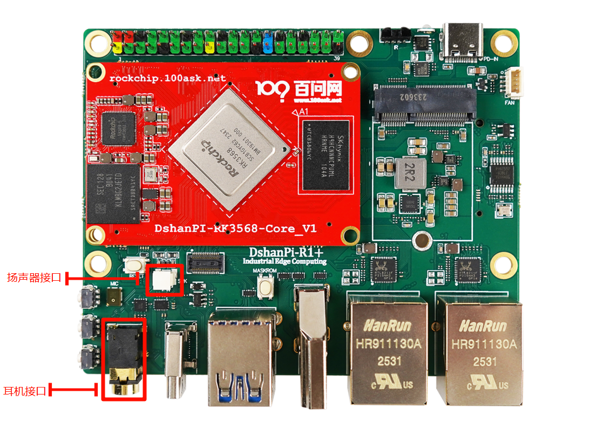
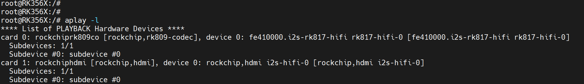

# 录音播放功能

本章节将讲解在 DShanPi-R1 上如何测试录音播放功能。

## 准备工作

**硬件：**

- DShanPi-R1板卡 x1
- TypeC线 x1 
- TTL转串口模块 x1
- 电源适配器
-  插孔式耳机 X1
-  扬声器 x1

**软件：**

- 软件：终端工具 MobaXterm

## 打开串口终端

执行后面操作前，需要连接好串口终端。如果不清楚如何连接串口终端，可以先阅读《连接串口终端》章节。串口终端连接之后，还需要接上一根插孔式耳机和扬声器，连接图如下：



## 前言

一个音频文件（如 `xxx.wav`）首先以数字化的音频数据存储在板卡上。当系统使用播放器程序（例如 `aplay` 或其他应用）播放该文件时，应用程序会将音频文件解析成可播放的 PCM 数据。如果音频文件本身就是 PCM（如大部分 `.wav`），则无需解码；如果是 MP3/AAC/FLAC 则需先调用对应的解码器获得 PCM。

解析后的 PCM 音频数据通过系统音频框架（例如 ALSA、PulseAudio 或 PipeWire）传递给音频驱动。驱动将 PCM 数据送入 SoC 内部的 I²S/PCM 控制器，再通过数字音频接口传输到外部音频 Codec（声卡芯片）。

音频 Codec 接收 PCM 数据后，使用内部的 DAC（数模转换器）将数字信号转换成模拟音频信号。模拟信号通常会经过耳放（放大电路）驱动耳机或扬声器，最终转换成声音被大家听到。

## 查看声卡设备

### 播放通道

执行以下指令，可列出所有 ALSA 能识别到的声卡与其播放通道：

~~~bash
aplay -l
~~~



说明：

`card X`
 → 代表声卡编号（从 0 开始）

`device Y`
 → 代表声卡上的一个播放设备编号

组合成设备节点：

```
hw:<card>,<device>
例如：hw:0,0
```

这些编号会用于播放：

~~~bash
aplay -D plughw:0,0 output.wav
~~~

### 录音通道

同样，执行以下指令，列出 ALSA 能识别到的所有声卡及其录音通道：

~~~bash
arecord -l
~~~

执行后会显示类似：

```
**** List of CAPTURE Hardware Devices ****
card 0: rockchiprk809, device 0: fe410000.i2s-rk817-hifi
```

说明：

`card X`

声卡编号（从 0 开始）

`device Y`

该声卡上的某个录音设备编号

组合成录音设备节点：

```bash
hw:<card>,<device>
例如：hw:0,0
```

用于录音时指定：

~~~bash
arecord -D plughw:0,0 output.wav -vvv
~~~

## 配置声卡设备

### 列出声卡所有控制器

可以使用 `amixer` 工具列出声卡0上的几个控制器。

~~~bash
#"-c 0" 指定 card0

# amixer controls -c 0
numid=1,iface=CARD,name='Headphones Jack'
numid=3,iface=MIXER,name='Capture MIC Path'
numid=2,iface=MIXER,name='Playback Path'
~~~

每个控制器有一个 `numid`（编号）和名称，描述了该声卡的特定控制功能：

**Headphones Jack**（numid=1）

- 这个控制项表示耳机插孔的音频输出设置，通常用于控制耳机插孔是否启用或禁用。

**Capture MIC Path**（numid=3）

- 这是用于麦克风输入的控制项，表示录音或声音捕获路径的配置。

**Playback Path**（numid=2）

- 这是音频回放路径的控制项，用于选择或调整播放的音频输出路径，比如耳机、扬声器等。

### 查询所有控制器信息

每个控制器都有对应的信息和状态可以进行查看、配置，先执行以下指令，查看每个控制器有哪些信息可配置，

~~~bash
#"-c 0" 指定 card0

# amixer contents -c 0
numid=1,iface=CARD,name='Headphones Jack'
  ; type=BOOLEAN,access=r-------,values=1
  : values=off
numid=3,iface=MIXER,name='Capture MIC Path'
  ; type=ENUMERATED,access=rw------,values=1,items=4
  ; Item #0 'MIC OFF'
  ; Item #1 'Main Mic'
  ; Item #2 'Hands Free Mic'
  ; Item #3 'BT Sco Mic'
  : values=2
numid=2,iface=MIXER,name='Playback Path'
  ; type=ENUMERATED,access=rw------,values=1,items=11
  ; Item #0 'OFF'
  ; Item #1 'RCV'
  ; Item #2 'SPK'
  ; Item #3 'HP'
  ; Item #4 'HP_NO_MIC'
  ; Item #5 'BT'
  ; Item #6 'SPK_HP'
  ; Item #7 'RING_SPK'
  ; Item #8 'RING_HP'
  ; Item #9 'RING_HP_NO_MIC'
  ; Item #10 'RING_SPK_HP'
  : values=2
~~~

声卡 `card 0` 的每个控制项详细信息，包括类型、可选项和当前的值。具体信息如下：

**Headphones Jack**（numid=1）

- 类型：`BOOLEAN`（布尔值），只读（`r-------`）。
- 当前状态：`off`，表示耳机插孔目前关闭。

**Capture MIC Path**（numid=3）

- 类型：`ENUMERATED`（枚举类型），读写（`rw------`）。
- 可选项：
  - `MIC OFF`：麦克风关闭
  - `Main Mic`：主麦克风
  - `Hands Free Mic`：免提麦克风
  - `BT Sco Mic`：蓝牙 SCO（同步连接导向）麦克风
- 当前值：`Hands Free Mic`（`values=2`），表示当前使用的是免提麦克风。

**Playback Path**（numid=2）

- 类型：`ENUMERATED`，读写。
- 可选项（共有 11 种音频播放路径）：
  - `OFF`：关闭播放
  - `RCV`：接收器
  - `SPK`：扬声器
  - `HP`：耳机
  - `HP_NO_MIC`：耳机无麦克风
  - `BT`：蓝牙
  - `SPK_HP`：扬声器和耳机
  - `RING_SPK`：铃声扬声器
  - `RING_HP`：铃声耳机
  - `RING_HP_NO_MIC`：铃声耳机无麦克风
  - `RING_SPK_HP`：铃声扬声器和耳机
- 当前值：`SPK`（`values=2`），表示当前播放路径设置为扬声器。

### 具体查询某个控制器

假设需要查询声卡0，控制器编号为2的内容，执行以下指令，

~~~bash
# -c 指定声卡 && cget 指定控制器

# amixer -c 0 cget numid=2
numid=2,iface=MIXER,name='Playback Path'
  ; type=ENUMERATED,access=rw------,values=1,items=11
  ; Item #0 'OFF'
  ; Item #1 'RCV'
  ; Item #2 'SPK'
  ; Item #3 'HP'
  ; Item #4 'HP_NO_MIC'
  ; Item #5 'BT'
  ; Item #6 'SPK_HP'
  ; Item #7 'RING_SPK'
  ; Item #8 'RING_HP'
  ; Item #9 'RING_HP_NO_MIC'
  ; Item #10 'RING_SPK_HP'
  : values=2
~~~

从上面可以看到 声卡0编号为2 的控制器 的值是2，也就是 'SPK'，这表明音频输出目前被设置为扬声器。

### 设置某个控制器值

假设需要设置声卡0，编号为2的控制器为耳机输出，执行以下指令，

~~~bash
# -c 指定声卡 && cget 指定控制器 && 'HP' 需要设置为'HP'

# amixer -c 0 cset numid=2 'HP'
numid=2,iface=MIXER,name='Playback Path'
  ; type=ENUMERATED,access=rw------,values=1,items=11
  ; Item #0 'OFF'
  ; Item #1 'RCV'
  ; Item #2 'SPK'
  ; Item #3 'HP'
  ; Item #4 'HP_NO_MIC'
  ; Item #5 'BT'
  ; Item #6 'SPK_HP'
  ; Item #7 'RING_SPK'
  ; Item #8 'RING_HP'
  ; Item #9 'RING_HP_NO_MIC'
  ; Item #10 'RING_SPK_HP'
  : values=3
~~~

可以看到 `values` 被设置成`3` 。

## 测试录音播放

了解了上面内容之后，执行以下指令，测试录音播放功能：

录音：

~~~bash
arecord -D "plughw:0,0"  -f cd -r 48000   output.wav -vvv
~~~

播放：
~~~bash
aplay -D "plughw:0,0"   -f cd -r 48000  output.wav
~~~


