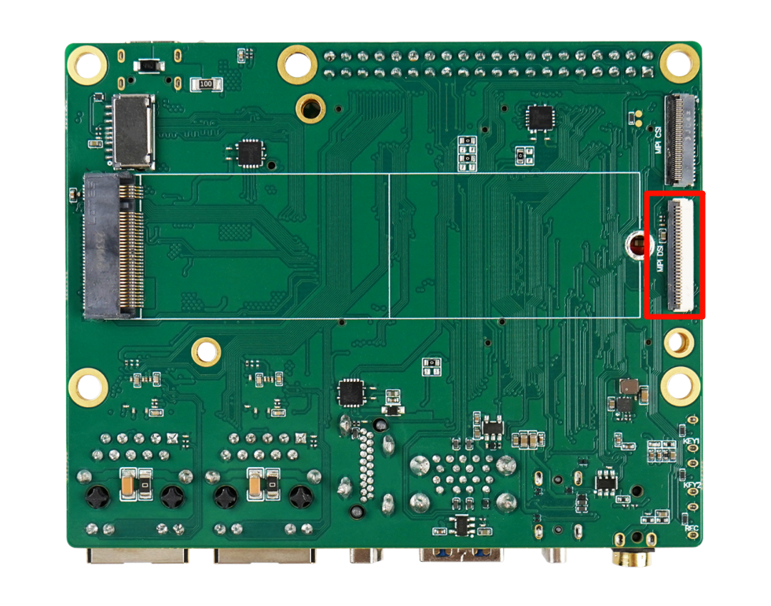
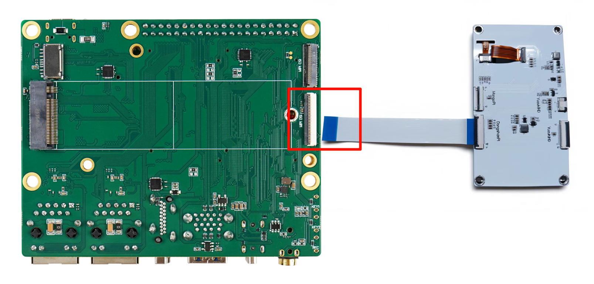
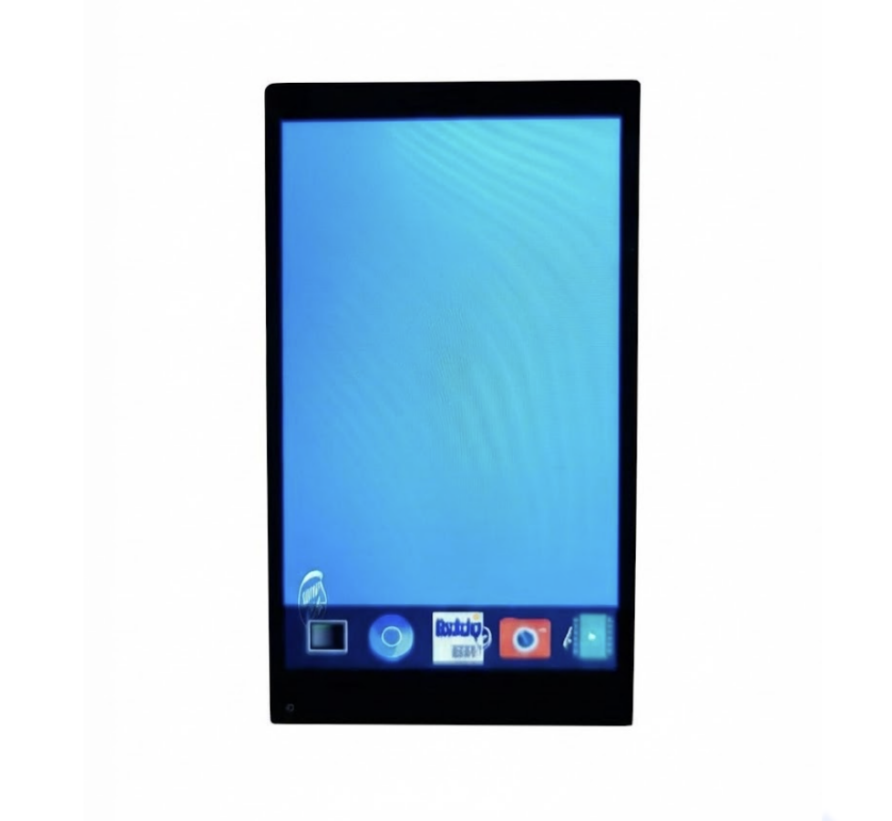

# MIPI屏显示测试

本章节将讲解如何在 DShanPi-R1 上测试 MIPI 屏显示功能。

## 准备工作

| 项目 | 名称 | 数量 | 说明 |
| :--- | :--- | :--- | :--- |
| **硬件** | DShanPi-R1 开发板 | 1 | - |
| | Type-C 数据线 | 1 | - |
| | USB 转串口模块 | 1 | - |
| | 电源适配器 | 1 | - |
| | 4寸 MIPI 屏 | 1 | [点击购买](https://detail.tmall.com/item.htm?spm=a21n57.1.item.47.7a34523cQFFK9o&priceTId=2147815317249010973624408e1cac&utparam={"aplus_abtest":"be747d2137a72f53186e76e1e5eb9fdc"}&id=732427203033&ns=1&abbucket=7&xxc=taobaoSearch&pisk=fTiiKIxp7Vz6LLtU89r6ke-D3NYpWOZb5jIYMoF28WPCXrPv5j4mMXaqXlHttSl-i-ntDm0CmYMjXdZvClM_coRJw3hmCAZjun_RocjULRHF0irVsAr1QoRJwnbdLPOT0qFBFzeF88NUQ-z4upxUh8Z43rSwKWy0FZ5ZgjkeK-eVbSP406WUB-qV_5z4LyyzHSSa05PeK-NUgcCC07mqADRwqRyTUD-iXR4gimelmRoF2yVPdWScmKegSNHatiSqx2TkjeFwP9FbX5gzIjt5flzmPxemshjZiYiItJlymgFZdY385c-5lzqaOrnavt-ZLkFgzPaGIMMTb5zrfc6NXXU0s2oa-tSqdlP0uqcMsNNZWX47LyWDVJh8TAiZ-K1EQbFgbJzp4LDUu2n_PcdFjuuSBl3qGUQQjxuaxg7N8a-KviweHD7flPyQK7eZvmXlwJiZtpvhPFaadRdJKpbflPyQK7pHKa1_7Jw9w) |
| **软件** | MobaXterm | - | 串口终端工具 |

## 1. 连接屏幕

:::danger 注意事项
**请务必先连接屏幕排线，然后再给开发板上电！**
如果在上电状态下插拔屏幕，可能会导致硬件损坏。
:::

### 接口位置

MIPI 屏接口位置如下图所示：

### 连接方式

请使用 MIPI 屏幕排线连接，注意 **蓝色面朝上** 接入 MIPI DSI 接口。

## 2. 开启串口终端

:::info 提示
执行后续操作前，请确保已连接好串口终端。如果不清楚如何连接，请先阅读 **《连接串口终端》** 章节。
:::

## 3. 验证显示

接好屏幕并上电启动开发板后，屏幕会自动点亮并显示开机 Logo，如下图所示：

