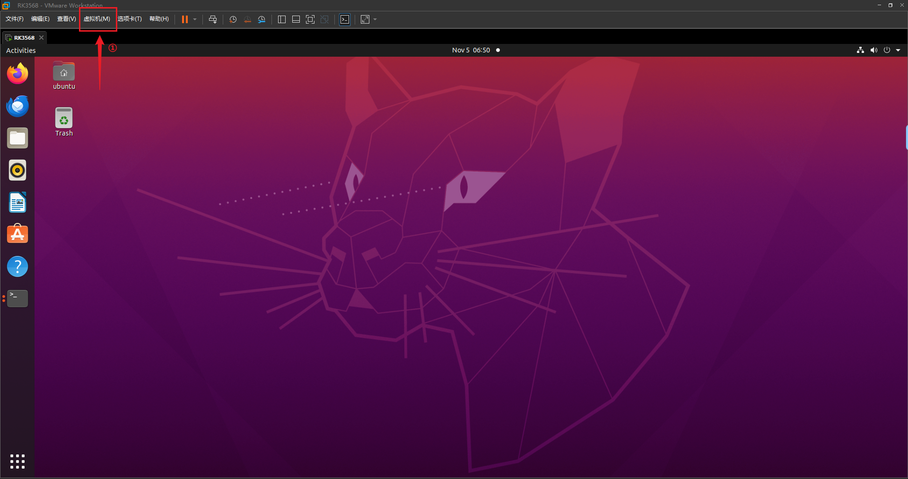
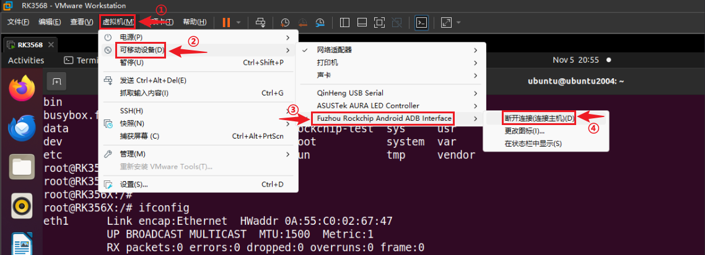
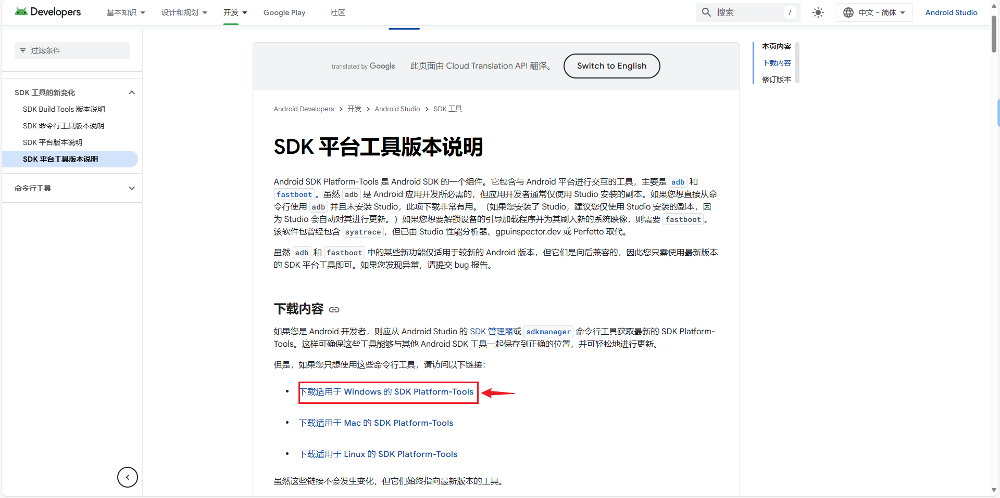
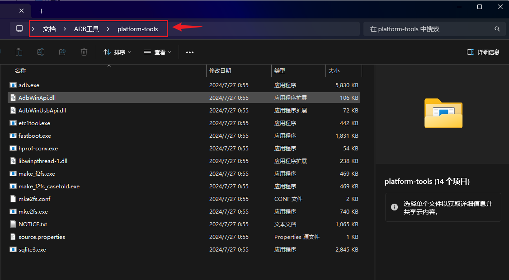
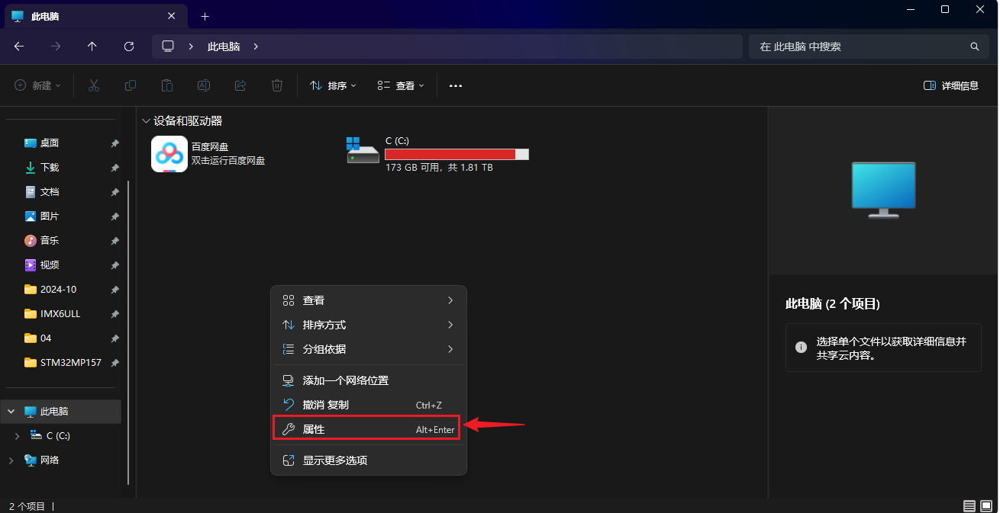
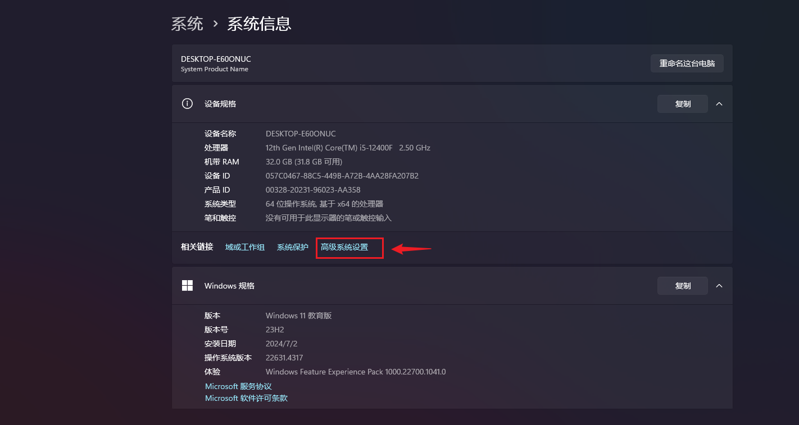
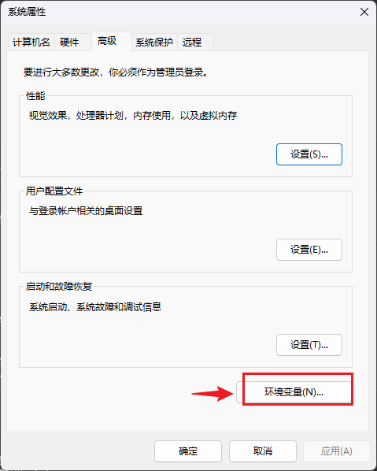
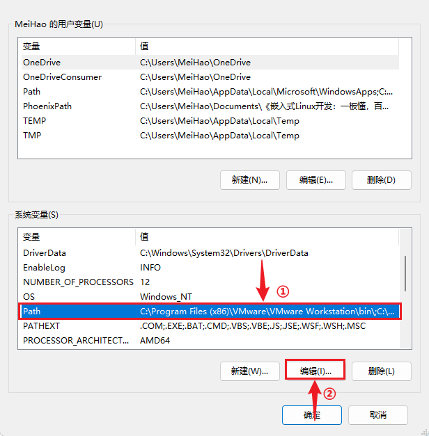
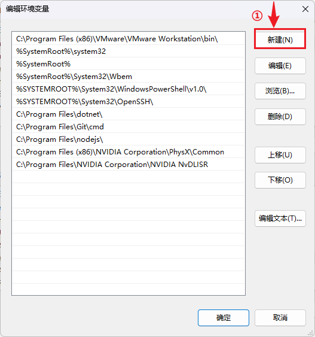
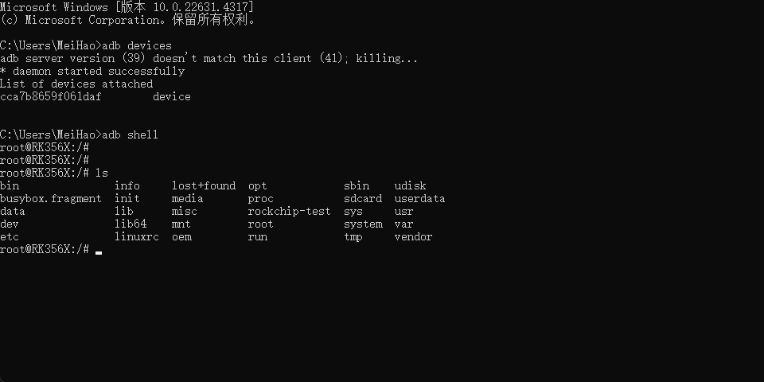

# ADB功能使用指南

本章节将讲解如何在 DShanPi-R1 上测试 ADB 功能。

## 准备工作

**硬件准备：**

- DShanPi-R1板卡 x1
- TypeC线 x1 
- USB转串口模块 x1
- 电源适配器 x1

**软件准备：**

- 终端工具 MobaXterm

## 前言

ADB，全称为 **Android Debug Bridge**，是一个用于与安卓设备进行通信和调试的命令行工具，但现在不仅仅是 安卓设备，在嵌入式开发中，很多 Linux 设备也同样支持 adb 调试，例如 Rockchip 平台。可以使用这个工具在Ubuntu上登录终端，也可以在Windows上登录终端。下面将分别讲解。

## 硬件连接

使用一根可传输数据的TypeC线，连接板卡如下位置：


## 连接ADB终端

### Ubuntu下使用ADB

#### 连接adb设备

打开VMware，进入ubuntu系统，点击虚拟机。



找到板卡的ADB端口，断开与主机(windows)的连接连接至ubuntu。


#### 下载adb工具

在ubuntu上，执行快捷键 `ctrl + alt + t` 打开终端。执行以下指令，下载adb工具。

~~~bash
sudo apt update
sudo apt install adb
~~~

下载完成后，执行以下指令，查看是否下载成功，

~~~bash
ubuntu@ubuntu2004:~$ adb version
Android Debug Bridge version 1.0.39
Version 1:8.1.0+r23-5ubuntu2
Installed as /usr/lib/android-sdk/platform-tools/adb
ubuntu@ubuntu2004:~$ 
~~~

使用adb登录之前，执行以下指令，查看是否能列出开发板设备并且是否可用。

~~~bash
ubuntu@ubuntu2004:~$ adb devices
List of devices attached
cca7b8659f061daf	device

ubuntu@ubuntu2004:~$
~~~

#### 登录系统

看到有设备列出，并且显示`device`，表示设备连接正常。确认无误之后，执行以下指令，使用adb登录系统。

~~~
adb shell
~~~


### Windows下使用ADB

#### 连接adb设备

当板卡otg接口通过TypeC线接上电脑之后，默认是连接至windows，如果之前选择了默认连接至ubuntu，需要断开ubuntu，连接至主机(windows)



断开之后，可以在设备管理器，看到有adb设备显示。


#### 下载adb工具

想要在windows上使用adb，与在ubuntu使用是类似，需要下载adb工具，进入官网 [adb下载](https://developer.android.google.cn/tools/releases/platform-tools?hl=zh-cn)，



下载完成后，解压，得到一个 `platform-tools`文件，复制该文件夹路径，添加至环境变量。



进入此电脑，鼠标右键选择属性



找到 `高级系统设置`，点击进入。



选择环境变量。



在系统变量里，找到 `Path`选项，点击编辑。



选择 `新建`，



把之前复制的文件夹路径粘贴上去，最后点击确定。


设置好环境变量之后，快捷键`win + r`，输入 `cmd` 运行对话框，执行 `adb devices`，


#### 登录系统

看到有设备列出，并且显示`device`，表示设备连接正常。确认无误之后，执行以下指令，使用adb登录系统。

~~~bash
adb shell
~~~



## ADB文件互传

ADB（Android Debug Bridge）提供 主机端 与 设备端 之间的：

- 📤 **文件上传（PC → 设备）**
- 📥 **文件下载（设备 → PC）**

主要使用：

- `adb push`（推送文件到设备）
- `adb pull`（从设备拉取文件）

常用的基本指令如下：

**主机 → 设备： `adb push`**

```
adb push <本地路径> <设备路径>
```

例子：

```
adb push demo.txt /sdcard/
adb push ./my.apk /data/local/tmp/
adb push build/output.bin /data/
```

**设备 → 主机： `adb pull`**

```
adb pull <设备路径> <本地路径>
```

例子：

```
adb pull /sdcard/demo.txt .
adb pull /data/logs/log.txt ./logs/
adb pull /system/build.prop ./backup/
```

上面例子中，点 `.` 表示当前目录。
