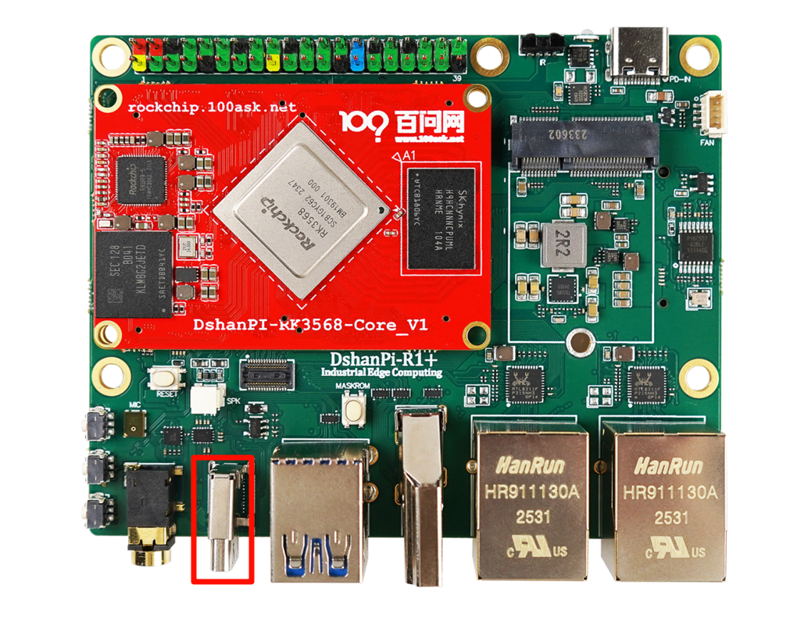
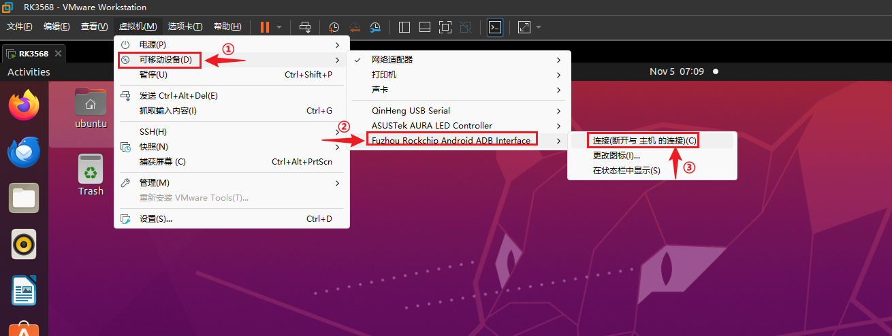
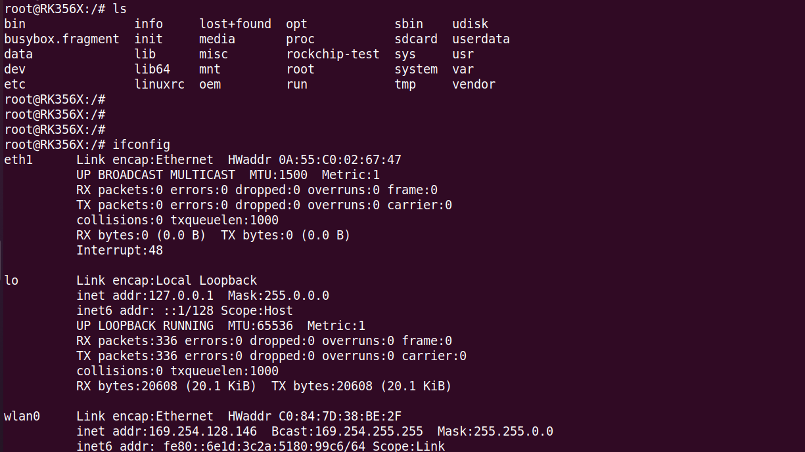
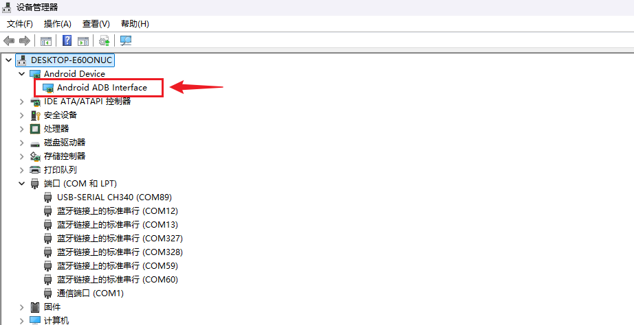
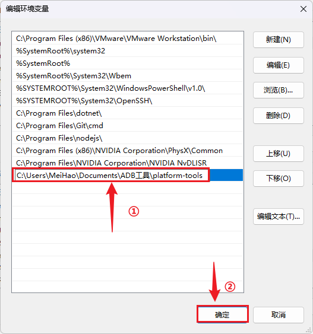
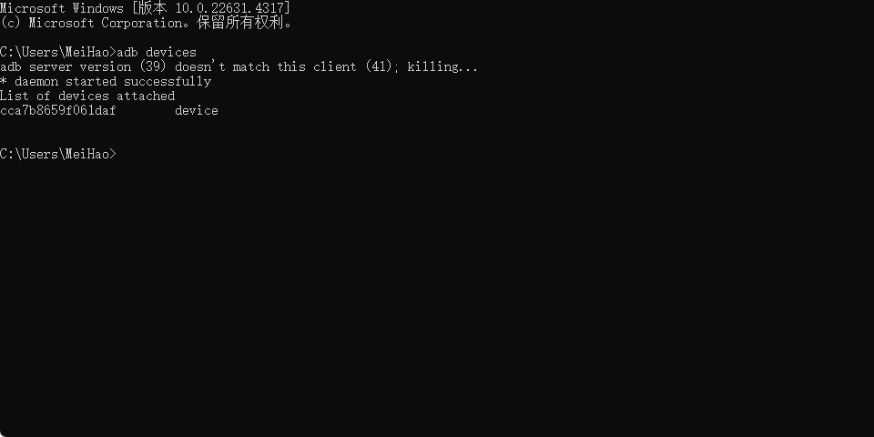

# ADB 功能使用指南

本章节将讲解如何在 DShanPi-R1 上测试 ADB (Android Debug Bridge) 功能。

## 准备工作

| 项目 | 名称 | 数量 | 说明 |
| :--- | :--- | :--- | :--- |
| **硬件** | DShanPi-R1 开发板 | 1 | - |
| | Type-C 数据线 | 1 | 需支持数据传输 |
| | USB 转串口模块 | 1 | - |
| | 电源适配器 | 1 | - |
| **软件** | MobaXterm | - | 串口终端工具 |

## ADB 简介

:::info 什么是 ADB？
ADB (Android Debug Bridge) 是一个用于与设备进行通信的通用命令行工具。虽然名字中带有 "Android"，但在嵌入式 Linux 开发中（如 Rockchip 平台），ADB 也是非常常用的调试工具，支持通过 USB 或网络进行 shell 登录、文件传输等操作。
:::

## 硬件连接

使用 Type-C 数据线连接开发板的 OTG 接口（通常用于 ADB 调试）和电脑。



## 连接 ADB 终端

import Tabs from '@theme/Tabs';
import TabItem from '@theme/TabItem';

<Tabs>
  <TabItem value="ubuntu" label="Ubuntu 环境" default>

  ### 1. 连接设备至虚拟机
  
  打开 VMware，确保开发板通过 USB 连接到虚拟机中的 Ubuntu 系统。
  
  1.  点击虚拟机菜单栏的 **"可移动设备"**。
  2.  找到开发板对应的 ADB 设备（通常显示为 Google 或 Rockchip 设备）。
  3.  选择 **"连接 (断开与主机的连接)"**。

  

  ### 2. 安装 ADB 工具
  
  在 Ubuntu 终端中执行以下指令安装 ADB：

  ```bash
  sudo apt update
  sudo apt install adb
  ```

  验证安装是否成功：

  ```bash
  adb version
  # 输出示例: Android Debug Bridge version 1.0.39 ...
  ```

  ### 3. 验证连接与登录
  
  查看已连接的设备：

  ```bash
  adb devices
  ```
  
  **输出示例：**
  ```text
  List of devices attached
  cca7b8659f061daf	device
  ```

  如果显示 `device`，则表示连接正常。执行以下指令登录系统：

  ```bash
  adb shell
  ```

  

  </TabItem>
  <TabItem value="windows" label="Windows 环境">

  ### 1. 检查设备管理器
  
  将开发板连接至电脑（确保未被虚拟机占用），打开 **设备管理器**，应能看到 ADB 设备。

  

  ### 2. 下载与配置 ADB
  
  1.  **下载工具**：访问 [ADB 官方下载页面](https://developer.android.google.cn/tools/releases/platform-tools?hl=zh-cn) 下载 Windows 版本。
  2.  **解压**：下载后解压得到 `platform-tools` 文件夹。
  3.  **配置环境变量**：
      *   复制 `platform-tools` 文件夹的完整路径。
      *   右键 **此电脑** -> **属性** -> **高级系统设置** -> **环境变量**。
      *   在 **系统变量** 中找到 `Path`，点击 **编辑** -> **新建**。
      *   粘贴刚才复制的路径，点击 **确定** 保存。

  

  ### 3. 验证连接与登录
  
  按 `Win + R` 打开运行对话框，输入 `cmd` 打开命令提示符。

  查看已连接的设备：

  ```cmd
  adb devices
  ```

  

  如果显示 `device`，则表示连接正常。执行以下指令登录系统：

  ```cmd
  adb shell
  ```

  </TabItem>
</Tabs>

## ADB 文件互传

ADB 提供了强大的文件传输功能，主要通过 `push` 和 `pull` 命令实现。

### 1. 推送文件 (PC -> 开发板)

使用 `adb push` 将本地文件发送到开发板。

**语法：**
```bash
adb push <本地路径> <设备路径>
```

**示例：**
```bash
# 将当前目录下的 demo.txt 发送到开发板的 /sdcard/ 目录
adb push demo.txt /sdcard/

# 将 my.apk 发送到 /data/local/tmp/
adb push ./my.apk /data/local/tmp/
```

### 2. 拉取文件 (开发板 -> PC)

使用 `adb pull` 将开发板上的文件复制到本地。

**语法：**
```bash
adb pull <设备路径> <本地路径>
```

**示例：**
```bash
# 将开发板 /sdcard/demo.txt 复制到当前目录 (.)
adb pull /sdcard/demo.txt .

# 将日志文件复制到本地 logs 目录
adb pull /data/logs/log.txt ./logs/
```
