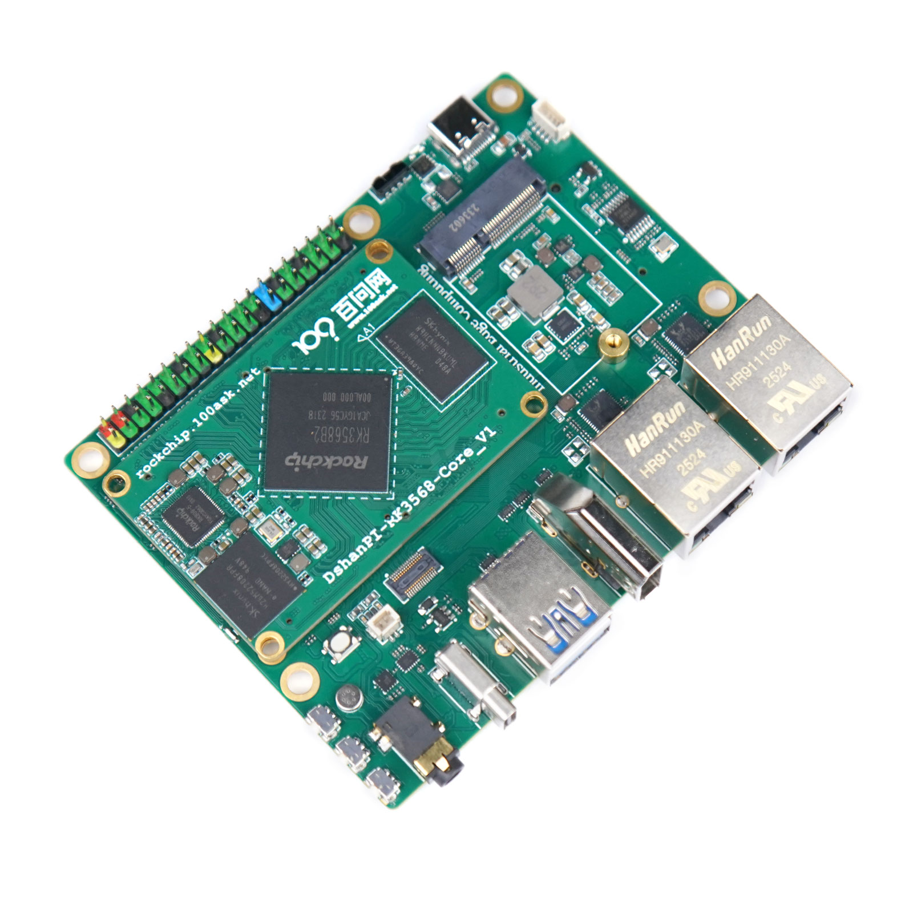
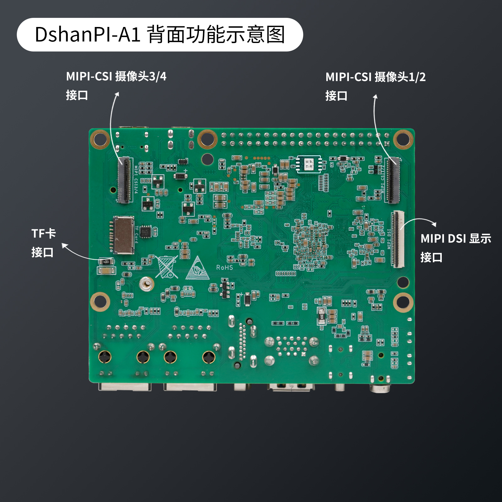
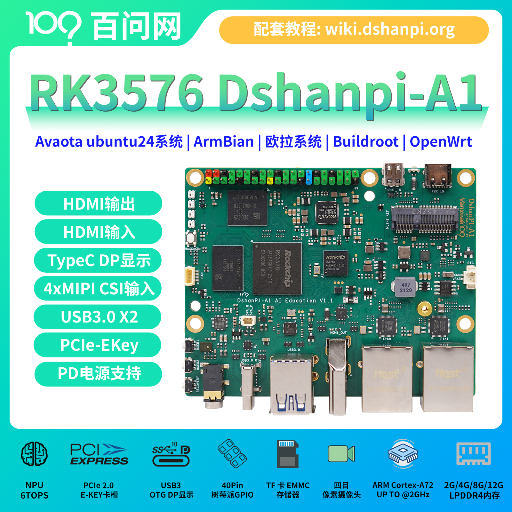

# DshanPi-R1+ 介绍

DshanPi-R1+ 提供中高端性能 SBC 体验，包括 PCIe、USB3.0、双千兆、HDMI等丰富的接口。

:::tip
- 源码仓库：https://github.com/dshanpi/
- QQ交流群：798273638
- 商品链接：[DShanPi-R1+](https://detail.tmall.com/item.htm?abbucket=2&id=862472411027&mi_id=00007EzWN63NZuNRhmNOKXzCUZhjNk9eKGlf3iK1YlGk5OQ&ns=1&priceTId=2150489f17645779278947485e0e76&skuId=6037094570300&spm=a21n57.1.hoverItem.10&utparam=%7B%22aplus_abtest%22%3A%22dae92bd3a6614310bc40fa47a72554b2%22%7D&xxc=taobaoSearch)
- 镜像站点：https://dl.100ask.net/Hardware/MPU/RK3568-DshanPI-R1%2B/
:::

## DshanPi-R1+ Education

DshanPi-R1+ Education 基于瑞芯微的RK3568处理器设计，集成了4个Cortex-A55及支持NEON指令集，支持4K@60fps的H.265、VP9和H.264解码器。
还支持1080p@60fps的H.264和H.265编码器。内置Mali-G52 GPU，能够完全兼容OpenGL ES 1.1/2.0/3.2、OpenCL 2.0和Vulkan 1.1。
内嵌的NPU算力高达1TOPS，支持INT8/INT16/FP16混合运算。

import Tabs from '@theme/Tabs';
import TabItem from '@theme/TabItem';

<Tabs>
  <TabItem value="apple" label="正面功能示意图" default>
    
  </TabItem>
  <TabItem value="orange" label="背面功能示意图">
    
  </TabItem>
  <TabItem value="banana" label="产品宣传主图">
    
  </TabItem>
</Tabs>

### 规格参数

DshanPi-R1+ Education RK3568 SBC详细规格参数介绍： 

### 系统支持的外设驱动

✅: 支持—  ❌: 暂不支持 —  🚫: 无计划支持   —⚠：支持但未完整测试

| 系统版本       | Armbian  | Buildroot  | OpenWrt |
|--------------------|-------------------|----------------|---------------|
| SPI            | ✅                | ✅             | ✅            |
| I2C            | ✅                | ✅             | ✅            |
| PWM            | ✅                | ✅             | ✅            |
| UART           | ✅                | ✅             | ✅            |
| MMC            | ✅                | ✅             | ✅            |
| GPIO           | ✅                | ✅             | ✅            |
| NPU            | ✅                | ✅             | ✅           |
| USB2.0         | ✅                | ✅             | ✅            |
| USB3.0         | ✅                | ✅             | ✅            |
| PCI-e         | ✅                | ✅             | ✅            |
| 视频编码       | ✅                | ✅             | ✅            |
| 视频解码       | ✅                | ✅             | ✅            |
| MIPI CSI       | ❌                | ❌             | ❌            |
| Audio          | ✅                | ✅             | ❌            |
| WIFI           | ✅                | ❌             | ✅            |

