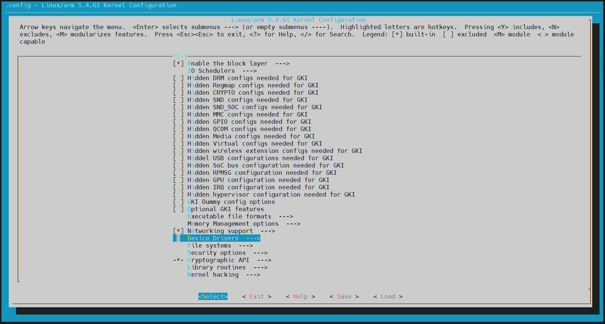
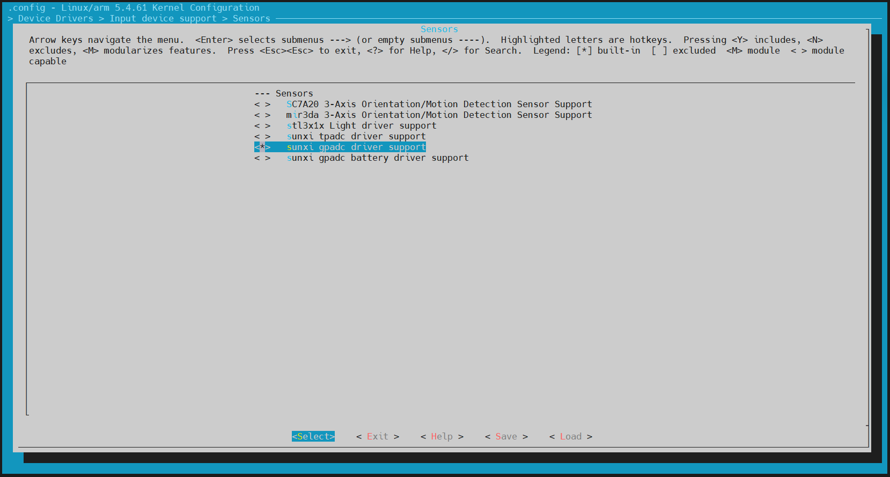
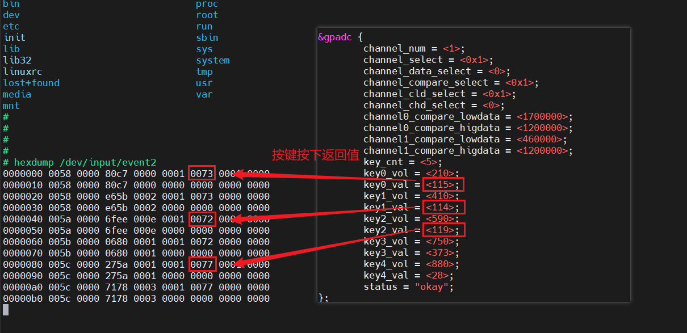

# GPADC检测按键

## 1.GPADC

GPADC（General Purpose Analog to Digital Converter）是指高精度数模转换模块，拥有12bit分辨率，8位采集精度。模拟输入范围0~1.8V，最高采样率1MHz。

GPADC 驱动路径：

~~~bash
t113i_tinasdk5.0-v1/kernel/linux-5.4/drivers/input/sensor/sunxi_gpadc.c
t113i_tinasdk5.0-v1/kernel/linux-5.4/drivers/input/sensor/sunxi_gpadc.h
~~~

### 1.1 GPADC硬件介绍

查看原理图，如下：

AVCC 为 1.8V 电源供电，通过一个电阻串联到GPADC的按键组。按键通过不同阻值的电阻相连接，按下不同的按键，GPADC0 口的电压不同，CPU 通过对这个电压的采样来决定具体是哪一个按键被按下。上图按键与电压的对应关系如下表所示：

| 0.21V | 0.41V | 0.59V |
| :---- | :---- | :---- |
| VOL+  | VOL-  | MENU  |

当按键按下时，会触发 GPADC 模块的中断，CPU 会采集 GPADC 的数据，采集到的数据转换成相应的键值之后通过 input 子系统上传到 `/dev/input/event` 节点，程序便可以从相应的节点获取数据。

### 1.2 GPADC软件配置

**设备树配置**

GPADC 的设备树配置分为两个部分：

第一部分包括基础的寄存器配置、设备驱动绑定配置和时钟中断配置。这一部分的配置位于 `t113i_tinasdk5.0-v1/kernel/linux-5.4/arch/arm/boot/dts/sun8iw20p1.dtsi` 文件内。**这一部分通常不需要修改。**

~~~bash
gpadc: gpadc@2009000 {
        compatible = "allwinner,sunxi-gpadc";
        reg = <0x0 0x02009000 0x0 0x400>;
        interrupts = <GIC_SPI 57 IRQ_TYPE_LEVEL_HIGH>;
        clocks = <&ccu CLK_BUS_GPADC>;
        clock-names = "bus";
        resets = <&ccu RST_BUS_GPADC>;
        status = "okay";
};
~~~

第二部分包括采样相关的配置，键值，电压数据等等，在 `t113i_tinasdk5.0-v1/device/config/chips/t113_i/configs/evb1_auto/linux-5.4/board.dts` 文件内。

~~~bash
&gpadc {
        channel_num = <1>;
        channel_select = <0x1>;
        channel_data_select = <0>;
        channel_compare_select = <0x1>;
        channel_cld_select = <0x1>;
        channel_chd_select = <0>;
        channel0_compare_lowdata = <1700000>;
        channel0_compare_higdata = <1200000>;
        channel1_compare_lowdata = <460000>;
        channel1_compare_higdata = <1200000>;
        key_cnt = <5>;
        key0_vol = <210>;
        key0_val = <115>;
        key1_vol = <410>;
        key1_val = <114>;
        key2_vol = <590>;
        key2_val = <119>;
        key3_vol = <750>;
        key3_val = <373>;
        key4_vol = <880>;
        key4_val = <28>;
        status = "okay";
};
~~~

**内核驱动配置**

进入源码根目录`t113i_tinasdk5.0-v1/`

执行`./build.sh menuconfig`，找到`Device Drivers`，进入。

找到 `Input device support `，进入。

找到 `Sensors` 空格勾选并进入。

空格选中 `<*> sunxi gpadc driver support` ，保存并退出配置页面。

在源码根目录上，先编译内核`./build.sh kernel`，再执行`./build.sh `，最后打包`./build.sh pack`。

打包完成后，生成的固件保存在 `t113i_tinasdk5.0-v1/out/t113_i/evb1_auto/buildroot` 目录下，镜像是`t113_i_linux_evb1_auto_uart0.img`：

~~~bash
ubuntu@dshanpi:~/meihao/t113i_tinasdk5.0-v1/out/t113_i/evb1_auto/buildroot$ ls -la
total 825244
drwxrwxr-x 4 ubuntu ubuntu      4096 7月  17 08:53 .
drwxrwxr-x 4 ubuntu ubuntu      4096 7月  16 20:29 ..
-rw-rw-r-- 1 ubuntu ubuntu         6 7月  17 08:53 arisc
-rwxrwxr-x 1 ubuntu ubuntu  12986128 7月  17 08:53 bImage
-rw-rw-r-- 1 ubuntu ubuntu        66 7月  17 08:53 .board.dtb.d.dtc.tmp
-rw-rw-r-- 1 ubuntu ubuntu     79218 7月  17 08:53 .board.dtb.dts.tmp
-rw-rw-r-- 1 ubuntu ubuntu     40960 7月  16 16:31 boot0_mmc_car_fastboot_sun8iw20p1.bin
-rw-rw-r-- 1 ubuntu ubuntu     45056 7月  16 16:31 boot0_mmcfastboot_sun8iw20p1.bin
-rw-rw-r-- 1 ubuntu ubuntu     49152 7月  16 16:31 boot0_nand_car_fastboot_sun8iw20p1.bin
-rw-rw-r-- 1 ubuntu ubuntu     53248 7月  16 16:31 boot0_nandfastboot_sun8iw20p1.bin
-rw-rw-r-- 1 ubuntu ubuntu     49152 7月  16 16:31 boot0_nand_sun8iw20p1.bin
-rw-rw-r-- 1 ubuntu ubuntu     40960 7月  16 16:31 boot0_sdcard_sun8iw20p1.bin
-rw-rw-r-- 1 ubuntu ubuntu     32768 7月  16 16:31 boot0_spinor_sun8iw20p1.bin
-rw-rw-r-- 1 ubuntu ubuntu   9521152 7月  17 08:53 boot.img
-rw-rw-r-- 1 ubuntu ubuntu      4924 7月  17 08:53 .buildconfig
drwxrwxr-x 7 ubuntu ubuntu      4096 7月  17 08:54 buildroot
-rw-rw-r-- 1 ubuntu ubuntu    127042 7月  17 08:53 .config
lrwxrwxrwx 1 ubuntu ubuntu        18 7月  17 08:53 dist -> lib/modules/5.4.61
-rwxrwxr-x 1 ubuntu ubuntu    168392 7月  17 08:53 dtc
-rw-rw-r-- 1 ubuntu ubuntu     21152 7月  16 16:31 fes1_sun8iw20p1.bin
drwxrwxr-x 3 ubuntu ubuntu      4096 7月  17 08:53 lib
-rw-rw-r-- 1 ubuntu ubuntu   4000287 7月  17 08:53 rootfs.cpio.gz
-rw-r--r-- 1 ubuntu ubuntu 186701904 7月  17 08:54 rootfs.ext4
-rw-r--r-- 1 ubuntu ubuntu  58269696 7月  17 08:54 rootfs.squashfs
-rw-rw-r-- 1 ubuntu ubuntu  86446080 7月  17 08:54 rootfs.ubifs
-rw-rw-r-- 1 ubuntu ubuntu     86016 7月  16 16:31 sboot_sun8iw20p1.bin
-rw-rw-r-- 1 ubuntu ubuntu     57824 7月  17 08:53 sunxi.dtb
-rw-rw-r-- 1 ubuntu ubuntu     67864 7月  16 20:29 .sunxi.dts
-rw-rw-r-- 1 ubuntu ubuntu   2354346 7月  17 08:53 System.map
-rwxrwxr-x 2 ubuntu ubuntu 276659200 7月  16 20:29 t113_i_linux_evb1_auto_uart0.img
-rw-rw-r-- 1 ubuntu ubuntu    981756 7月  16 16:31 u-boot-sun8iw20p1.bin
-rw-rw-r-- 1 ubuntu ubuntu   5169888 7月  17 08:53 uImage
-rwxrwxr-x 1 ubuntu ubuntu 136330284 7月  17 08:53 vmlinux
-rw-rw-r-- 1 ubuntu ubuntu  62050327 7月  17 08:53 vmlinux.tar.bz2
-rwxrwxr-x 1 ubuntu ubuntu   5169824 7月  17 08:53 zImage
~~~

根据之前的烧录方式进行烧录。

## 2.测试按键

烧录完成后，进入开发板，执行`cat /proc/bus/input/devices`,查看对应的设备节点。

~~~bash
# cat /proc/bus/input/devices
I: Bus=0019 Vendor=0001 Product=0001 Version=0100
N: Name="sunxi-keyboard"
P: Phys=sunxikbd/input0
S: Sysfs=/devices/virtual/input/input0
U: Uniq=
H: Handlers=kbd event0
B: PROP=0
B: EV=3
B: KEY=1000 800 c0000 0 0 10000000

I: Bus=0019 Vendor=0001 Product=0001 Version=0100
N: Name="sunxi-ts"
P: Phys=sunxi_ts/input0
S: Sysfs=/devices/platform/soc@3000000/2009c00.rtp/input/input1
U: Uniq=
H: Handlers=event1
B: PROP=0
B: EV=b
B: KEY=400 0 0 0 0 0 0 0 0 0 0
B: ABS=3

I: Bus=0019 Vendor=0001 Product=0001 Version=0100
N: Name="sunxi-gpadc0"
P: Phys=sunxigpadc0/input0
S: Sysfs=/devices/virtual/input/input2
U: Uniq=
H: Handlers=kbd event2
B: PROP=0
B: EV=100003
B: KEY=200000 0 0 0 0 0 0 0 8c0000 0 0 10000000

#
~~~

可以看到`sunxi-gpadc0`对应的设备节点是`/dev/input/event2`。

### 2.1 hexdump测试

在开发板上，执行`/dev/input/event2`，检测按键按下状态：

~~~bash
# hexdump /dev/input/event2
0000000 1dcd 0000 b22e 0004 0001 0073 0001 0000
0000010 1dcd 0000 b22e 0004 0000 0000 0000 0000
0000020 1dcd 0000 5e10 0007 0001 0073 0000 0000
0000030 1dcd 0000 5e10 0007 0000 0000 0000 0000
0000040 1dce 0000 5bbf 0007 0001 0072 0001 0000
0000050 1dce 0000 5bbf 0007 0000 0000 0000 0000
0000060 1dce 0000 6374 0009 0001 0072 0000 0000
0000070 1dce 0000 6374 0009 0000 0000 0000 0000
0000080 1dcf 0000 4dc5 0005 0001 0077 0001 0000
0000090 1dcf 0000 4dc5 0005 0000 0000 0000 0000
00000a0 1dcf 0000 f5bb 0007 0001 0077 0000 0000
00000b0 1dcf 0000 f5bb 0007 0000 0000 0000 0000
~~~

可以在`t113i_tinasdk5.0-v1/device/config/chips/t113_i/configs/evb1_auto/linux-5.4/board.dts`里，设置`key*_val`值来自定义改变按键按下返回的值。

### 2.2 C程序测试

为了更加直观分辨哪个按键按下和松开，编写一个c文件用于读取按键。

在Ubuntu上，创建一个.c文件。

~~~bash
ubuntu@dshanpi:~/meihao/gpadc_test$ ls -la
total 24
drwxrwxr-x 2 ubuntu ubuntu  4096 7月  17 10:48 .
drwxrwxr-x 4 ubuntu ubuntu  4096 7月  17 10:21 ..
-rw-rw-r-- 1 ubuntu ubuntu  1181 7月  17 10:48 gpadc_test.c
ubuntu@dshanpi:~/meihao/gpadc_test$
~~~

写入以下内容：

~~~c
#include <stdio.h>
#include <linux/input.h>
#include <stdlib.h>
#include <sys/types.h>
#include <sys/stat.h>
#include <fcntl.h>
#include <sys/time.h>
#include <limits.h>
#include <unistd.h>
#include <signal.h>

#define DEV_PATH "/dev/input/event2"

static int g_igpadc_fd = 0;

static int test_gpadc(const char *event_file)
{
        int code = 0;
        int i = 0;

        struct input_event data;

        g_igpadc_fd = open(DEV_PATH,O_RDONLY);
        if(g_igpadc_fd <= 0)
        {
                printf("open %s error!\n",DEV_PATH);
                return -1;
        }

        for(i = 0;i < 20;i++)
        {
                read(g_igpadc_fd,&data,sizeof(data));

                /*如果按下按键*/
                if(data.type == EV_KEY && data.value == 1)
                {
                        if(data.code == 115)
                        {
                                code = 1;
                        }else if(data.code == 114)
                        {
                                code = 2;
                        }else if(data.code == 119)
                        {
                                code = 3;
                        }
                        printf("k%d pressed\n",code);
                        code = 0;
                }
                else if(data.type == EV_KEY && data.value == 0)
                {
                        if(data.code == 115)
                        {
                                code = 1;
                        }else if(data.code == 114)
                        {
                                code = 2;
                        }else if(data.code == 119)
                        {
                                code = 3;
                        }
                        printf("k%d releaseed\n",code);
                        code = 0;
                }
        }

        close(g_igpadc_fd);
        return 0;
}

int main()
{
        return test_gpadc(DEV_PATH);
}
~~~

编译之前，先找到相应的交叉编译工具，在源码根目录`t113i_tinasdk5.0-v1/`上，查看`.buildconfig`。

~~~bash
ubuntu@dshanpi:~/meihao/t113i_tinasdk5.0-v1$ vim .buildconfig
...
export LICHEE_TOOLCHAIN_PATH=/home/ubuntu/meihao/t113i_tinasdk5.0-v1/out/toolchain/gcc-linaro-5.3.1-2016.05-x86_64_arm-linux-gnueabi
~~~

可以看到交叉编译工具是`t113i_tinasdk5.0-v1/out/toolchain/gcc-linaro-5.3.1-2016.05-x86_64_arm-linux-gnueabi/bin/arm-linux-gnueabi-gcc`。

执行`t113i_tinasdk5.0-v1/out/toolchain/gcc-linaro-5.3.1-2016.05-x86_64_arm-linux-gnueabi/bin/arm-linux-gnueabi-gcc gpadc_test.c -o gpadc_test`编译应用程序，这里的交叉编译工具路径需要改为实际的路径。

~~~bash
ubuntu@dshanpi:~/meihao/gpadc_test$ /home/ubuntu/meihao/t113i_tinasdk5.0-v1/out/toolchain/gcc-linaro-5.3.1-2016.05-x86_64_arm-linux-gnueabi/bin/arm-linux-gnueabi-gcc gpadc_test.c -o gpadc_test
ubuntu@dshanpi:~/meihao/gpadc_test$
ubuntu@dshanpi:~/meihao/gpadc_test$ ls -la
total 24
drwxrwxr-x 2 ubuntu ubuntu  4096 7月  17 12:07 .
drwxrwxr-x 4 ubuntu ubuntu  4096 7月  17 10:21 ..
-rwxrwxr-x 1 ubuntu ubuntu 10652 7月  17 12:07 gpadc_test
-rw-rw-r-- 1 ubuntu ubuntu  1181 7月  17 10:48 gpadc_test.c
ubuntu@dshanpi:~/meihao/gpadc_test$ file gpadc_test
gpadc_test: ELF 32-bit LSB executable, ARM, EABI5 version 1 (SYSV), dynamically linked, interpreter /lib/ld-linux.so.3, for GNU/Linux 2.6.32, BuildID[sha1]=b8a92558e4a8aa4ea8ef04018054c8d4e55de7ff, with debug_info, not stripped
ubuntu@dshanpi:~/meihao/gpadc_test$
~~~

编译成功后，把可执行程序`gpadc_test`上传到开发板。

~~~bash
ubuntu@dshanpi:~/meihao/gpadc_test$ adb push gpadc_test /mnt/UDISK/
~~~

执行程序：

~~~bash
# cd /mnt/UDISK/
# ls
gpadc_test
## cd gpadc_test/
# ls
gpadc_test    gpadc_test.c
# ./gpadc_test
k1 pressed
k1 releaseed
k2 pressed
k2 releaseed
k3 pressed
k3 releaseed
k1 pressed
k1 releaseed
k2 pressed
k2 releaseed
#
~~~

