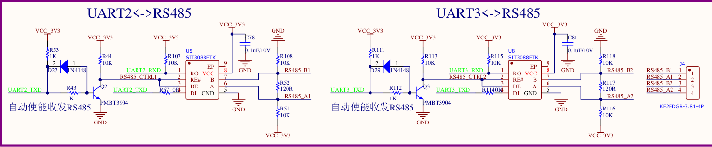
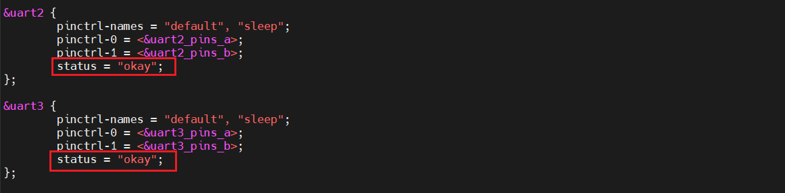

# 支持RS485功能

## 1.查看设备树

从原理图上可以知道，板子上的RS485是自动使能收发的，所以确保设备树上uart2，uart3使能即可使用。/

在ubuntu上，进入目录`t113i_tinasdk5.0-v1/device/config/chips/t113_i/configs/evb1_auto/linux-5.4`

查看设备树文件`board.dts`，确保uart2，uart3处于使能状态。

默认是处于使能状态。

## 2.测试RS485收发功能

在进行RS485功能测试前，需要使用两根接线端子(杜邦线)连接开发板的RS485接口，RS485_A1 连接 RS485_A2，RS485_B1 连接 RS485_B2。

RS485 是半双工，连接设备的时候一般接 A/B/GND，即源端的 A 连接目标设备的 A，源端的 B 连接目标设备的 B。

确保连接成功后，在开发板上执行以下几步：

**①配置uart2、uart3的波特率；**

由原理图可知：

uart2 ==> 端口1

uart3 ==> 端口2

设置uart2波特率。

~~~bash
# stty -F /dev/ttyS2 speed 115200
9600
# stty -F /dev/ttyS2 speed 115200
115200
#
~~~

执行两次，才可以成功设置波特率为115200。

同样设置uart3波特率。

~~~bash
# stty -F /dev/ttyS3 speed 115200
9600
# stty -F /dev/ttyS3 speed 115200
115200
~~~

**②后台监测端口1；**

~~~bash
# cat /dev/ttyS2 &
[1] 1372
#
~~~

**③控制端口2发送数据。**

~~~bash
# echo 100ask > /dev/ttyS3
100ask

~~~

可以看到有`100ask`打印出来。

同样可以控制**端口1**发送数据给**端口2**，因为上面已经设置过一次波特率了，不用再次设置。

**①后台监测端口2；**

在这之前先杀掉之前后台监测的端口1

~~~bash
# ps
...
1372 root     cat /dev/ttyS2
...
# kill -9 1372
#
[1]+  Killed                  cat /dev/ttyS2
#
~~~

再执行以下指令：

~~~bash
# cat /dev/ttyS3 &
[1] 1374
#
~~~

**②控制端口1发送数据。**

~~~bash
# echo 123456 > /dev/ttyS2
123456

#
~~~

