# Wi-Fi使用

本章节来讲解如何连接wifi进行上网，T113i-Industrial开发板板载的是 [XradioTech](http://www.xradiotech.com/) 所设计的 XR829 Wi-Fi 模组。

## 前提条件

> 在进入本章节学习之前，请做好以下准备。

当前版本`xr829 Wi-Fi模组`和`天线接口`硬件位置图，如下：

**准备工作：**

1. 硬件： T113i-Industrial开发板
2. 硬件： typeC线 X2 
3. 硬件： ipex 2.4G天线 X1
4. 软件： 全志线刷工具：[AllwinnertechPhoeniSuit](https://gitlab.com/dongshanpi/tools/-/raw/main/AllwinnertechPhoeniSuit.zip)
5. 软件： 全志USB烧录驱动：[AllwinnerUSBFlashDeviceDriver](https://gitlab.com/dongshanpi/tools/-/raw/main/AllwinnerUSBFlashDeviceDriver.zip)
6. 软件： 镜像（已适配xr829）：t113_i_linux_evb1_auto_uart0.img

## 硬件介绍

### Wi-Fi功能特性

XR829 Wi-Fi模组是一款集成了**2.4G IEEE 802.11b/g/n标准**的无线连接解决方案，并且支持**蓝牙2.1/4.0/4.1协议标准**。它主要应用于短距离无线连接，如平板电脑、智能电视等设备。以下是XR829 Wi-Fi模组的一些功能特性：

1. **STA模式管理**：支持STA（Station）模式，允许设备连接到无线网络。
2. **AP模式管理**：支持AP（Access Point）模式，允许设备作为无线热点供其他设备连接。
3. **Monitor模式管理**：提供Monitor模式，用于监听无线网络的流量。
4. **配网管理**：支持多种配网方式，如softap、soundwave、xconfig等，方便用户连接到无线网络。
5. **P2P模式管理**：正在考虑支持P2P（Peer to Peer）模式，用于设备间的直接连接。
6. **软件结构**：wifimanger2.0支持AP模式和monitor模式，集成了多种配网模式，方便用户使用。
7. **硬件资源适配**：需要根据硬件原理图进行配置，包括时钟、电源、SDIO等资源的适配。
8. **内核驱动适配**：需要在内核中添加Kconfig和Makefile配置，并通过menuconfig启用XR829 WLAN支持。
9. **Firmware支持**：根据不同晶振（24M或40M）提供相应的固件支持。
10. **应用工具适配**：提供了wifimanager、smartlinkd、softap等应用工具的适配，以方便进行Wi-Fi功能测试和使用。

### Wi-Fi软件结构

- **wifimanger**：主要用于STATION模式，提供Wi-Fi连接扫描等功能。
- **softap manager**：提供启动AP的功能。
- **smartlink**：对于 `NoInput` 的设备，通过借助第三方设备（如手机）实现透传配网的功能,包括 `softap/soundwave/xconfig/airkiss/` 等多种配网方式。
- **wpa_supplicant**：开源的无线网络配置工具，主要用来支持WEP，WPA/WPA2和WAPI无线协议和加密认证的，实际上的工作内容是通过 `socket` 与驱动交互上报数据给用户。
- **hostapd**：是一个用户态用于AP和认证服务器的守护进程。
- **monitor**：Wi-Fi处于混杂设备监听模式的处理应用。

### Wi-Fi天线安装

要使用Wi-Fi，需要连接一根ipex 2.4G天线，下面是将天线连接到T113i-Industrial开发板的指南图。

参考上图，拿到一根天线，对准天线接口，稍微用点力摁下去，听到咔擦一声，即可安装完毕。

## 装载驱动模块

### 登录开发板终端

操作开发板之前，需要连接好硬件，首先使用两根typeC线，一个根接`USB DEBUG`（用于串口调试），另一根接`USB OTG`（用于烧写和支持ADB文件传输），如下图所示：
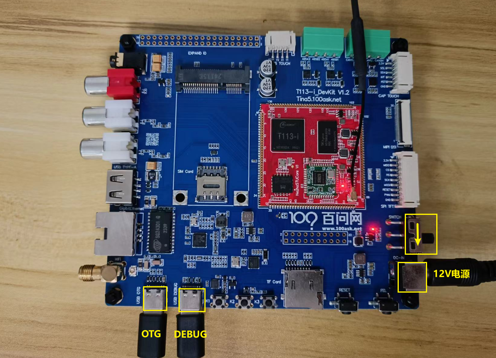

还需插上12V DCDC电源线用来供电，拨动开关，往电源方向拨。

连接好设备后，打开设备管理器，可以看到有一个名为CH343的COM3端口号，说明串口连接成功。（这边使用的串口模块的转换芯片是CH343）

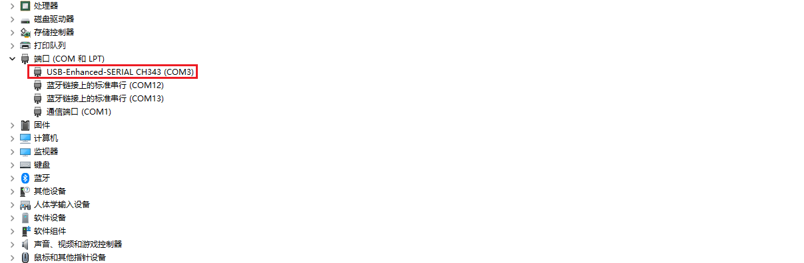

打开串口终端工具（类似的工具也可以），这里以MobaXterm为例讲解。

点击`Session`。

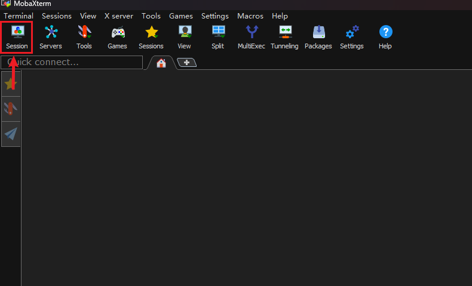

然后会跳出一个选择框，选择`Serial`。

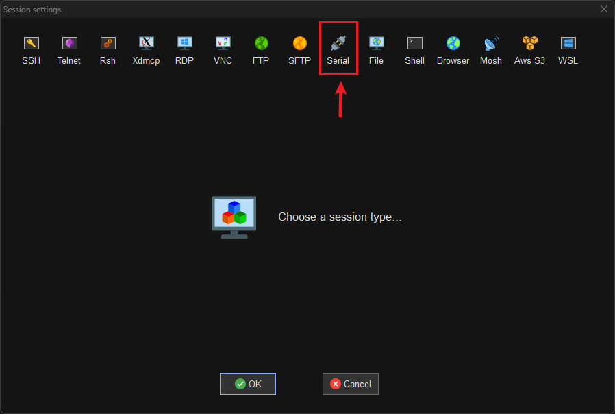

找到上面设备管理器显示的串口号（CH343），选上。

设置波特率为`115200`。

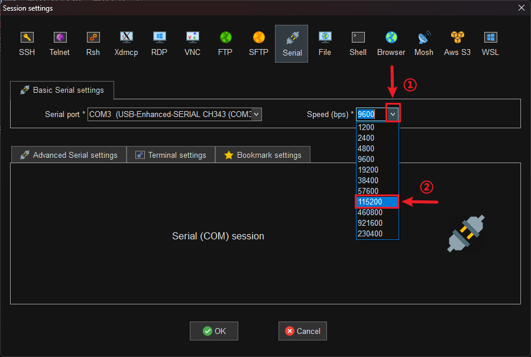

配置串口，修改`Flow control`为`None`。 

修改完成后点击OK即可进入开发板串口终端。

可以看到上面没有任何显示，需要按下开发板上的`RESET`按键，就可以看到串口打印信息。

点击键盘的`Enter`键，串口终端也能接受，自此登录开发板终端完成，接下来可以开始操作开发板了。

### 加载Wi-Fi驱动模块

本章节提供的镜像已经移植好了 XR829 Wi-Fi 模组和 Wi-Fi 的使用工具。所以只需要在开发板上进行wifi连接即可。

进入开发板串口终端，执行`ifconfig -a`，查看节点信息，想使用wifi，就需要有 `wlan0`节点。

~~~bash
# ifconfig -a
awlink0   Link encap:UNSPEC  HWaddr 00-00-00-00-00-00-00-00-00-00-00-00-00-00-00-00
          NOARP  MTU:16  Metric:1
          RX packets:0 errors:0 dropped:0 overruns:0 frame:0
          TX packets:0 errors:0 dropped:0 overruns:0 carrier:0
          collisions:0 txqueuelen:10
          RX bytes:0 (0.0 B)  TX bytes:0 (0.0 B)
          Interrupt:255

awlink1   Link encap:UNSPEC  HWaddr 00-00-00-00-00-00-00-00-00-00-00-00-00-00-00-00
          NOARP  MTU:16  Metric:1
          RX packets:0 errors:0 dropped:0 overruns:0 frame:0
          TX packets:0 errors:0 dropped:0 overruns:0 carrier:0
          collisions:0 txqueuelen:10
          RX bytes:0 (0.0 B)  TX bytes:0 (0.0 B)

eth0      Link encap:Ethernet  HWaddr 9A:47:64:F5:A8:4E
          BROADCAST MULTICAST  MTU:1500  Metric:1
          RX packets:0 errors:0 dropped:0 overruns:0 frame:0
          TX packets:0 errors:0 dropped:0 overruns:0 carrier:0
          collisions:0 txqueuelen:1000
          RX bytes:0 (0.0 B)  TX bytes:0 (0.0 B)
          Interrupt:40

ip6tnl0   Link encap:UNSPEC  HWaddr 00-00-00-00-00-00-00-00-00-00-00-00-00-00-00-00
          NOARP  MTU:1452  Metric:1
          RX packets:0 errors:0 dropped:0 overruns:0 frame:0
          TX packets:0 errors:0 dropped:0 overruns:0 carrier:0
          collisions:0 txqueuelen:1000
          RX bytes:0 (0.0 B)  TX bytes:0 (0.0 B)

lo        Link encap:Local Loopback
          inet addr:127.0.0.1  Mask:255.0.0.0
          inet6 addr: ::1/128 Scope:Host
          UP LOOPBACK RUNNING  MTU:65536  Metric:1
          RX packets:0 errors:0 dropped:0 overruns:0 frame:0
          TX packets:0 errors:0 dropped:0 overruns:0 carrier:0
          collisions:0 txqueuelen:1000
          RX bytes:0 (0.0 B)  TX bytes:0 (0.0 B)

sit0      Link encap:IPv6-in-IPv4
          NOARP  MTU:1480  Metric:1
          RX packets:0 errors:0 dropped:0 overruns:0 frame:0
          TX packets:0 errors:0 dropped:0 overruns:0 carrier:0
          collisions:0 txqueuelen:1000
          RX bytes:0 (0.0 B)  TX bytes:0 (0.0 B)

#
~~~

上面并没有看到 `wlan0` 节点，因为驱动没有被加载，需要手动执行 `insmod /lib/modules/5.4.61/xr829.ko` 装载驱动。

~~~bash
# insmod /lib/modules/5.4.61/xr829.ko
[  173.496018] ======== XRADIO WIFI OPEN ========
[  173.501856] [XRADIO] Driver Label:XR_V02.16.88_P2P_HT40_01.31
[  173.508696] [XRADIO] Allocated hw_priv @ (ptrval)
[  173.514978] sunxi-rfkill soc@3000000:rfkill@0: bus_index: 1
[  173.531312] sunxi-rfkill soc@3000000:rfkill@0: wlan power on success
[  173.738498] sunxi-mmc 4021000.sdmmc: sdc set ios:clk 0Hz bm PP pm UP vdd 21 width 1 timing LEGACY(SDR12) dt B
[  173.746231] [XRADIO] Detect SDIO card 1
[  173.749727] sunxi-mmc 4021000.sdmmc: no vqmmc,Check if there is regulator
[  173.774101] sunxi-mmc 4021000.sdmmc: sdc set ios:clk 400000Hz bm PP pm ON vdd 21 width 1 timing LEGACY(SDR12) dt B
[  173.797213] sunxi-mmc 4021000.sdmmc: sdc set ios:clk 400000Hz bm PP pm ON vdd 21 width 1 timing LEGACY(SDR12) dt B
[  173.811824] sunxi-mmc 4021000.sdmmc: sdc set ios:clk 400000Hz bm PP pm ON vdd 21 width 1 timing LEGACY(SDR12) dt B
[  173.834060] sunxi-mmc 4021000.sdmmc: sdc set ios:clk 400000Hz bm PP pm ON vdd 21 width 1 timing SD-HS(SDR25) dt B
[  173.845657] sunxi-mmc 4021000.sdmmc: sdc set ios:clk 50000000Hz bm PP pm ON vdd 21 width 1 timing SD-HS(SDR25) dt B
[  173.857505] sunxi-mmc 4021000.sdmmc: sdc set ios:clk 50000000Hz bm PP pm ON vdd 21 width 4 timing SD-HS(SDR25) dt B
[  173.870081] mmc1: new high speed SDIO card at address 0001
[  173.877097] [SBUS] XRadio Device:sdio clk=50000000
[  173.890482] [XRADIO] XRADIO_HW_REV 1.0 detected.
[  173.947031] [XRADIO] xradio_update_dpllctrl: DPLL_CTRL Sync=0x01400000.
[  173.980161] [XRADIO] Bootloader complete
[  174.002859] random: crng init done
[  174.006676] random: 2 urandom warning(s) missed due to ratelimiting
[  174.094363] [XRADIO] Firmware completed.
[  174.100603] [WSM] Firmware Label:XR_C09.08.52.64_DBG_02.100 2GHZ HT40 Jan  3 2020 13:14:37
[  174.109975] [XRADIO] Firmware Startup Done.
[  174.114975] [XRADIO_WRN] enable Multi-Rx!
[  174.122681] ieee80211 phy0: Selected rate control algorithm 'minstrel_ht'
#
~~~

如上所示，驱动模块已经安装成功。

## 连接Wi-Fi网络

### 开启Wi-Fi功能

加载驱动没有出现问题之后，执行`ifconfig -a`，即可看到 `wlan0` 节点。

使用wifi功能还需要执行指令`ifconfig wlan0 up`，来打开 `wlan0` 节点。

~~~bash
# ifconfig wlan0 up
[  324.579646] ieee80211_do_open: vif_type=2, p2p=0, ch=3, addr=f8:f2:1a:3e:86:2e
[  324.587897] [STA] !!!xradio_vif_setup: id=0, type=2, p2p=0, addr=f8:f2:1a:3e:86:2e
[  324.603169] [AP_WRN] BSS_CHANGED_ASSOC but driver is unjoined.

          RX bytes:0 (0.0 B)  TX bytes:0 (0.0 B)
~~~

打开完成后，执行`ifconfig`，即可看到 `wlan0` 节点。

~~~bash
# ifconfig
lo        Link encap:Local Loopback
          inet addr:127.0.0.1  Mask:255.0.0.0
          inet6 addr: ::1/128 Scope:Host
          UP LOOPBACK RUNNING  MTU:65536  Metric:1
          RX packets:0 errors:0 dropped:0 overruns:0 frame:0
          TX packets:0 errors:0 dropped:0 overruns:0 carrier:0
          collisions:0 txqueuelen:1000
          RX bytes:0 (0.0 B)  TX bytes:0 (0.0 B)

wlan0     Link encap:Ethernet  HWaddr F8:F2:1A:3E:86:2E
          UP BROADCAST MULTICAST  MTU:1500  Metric:1
          RX packets:0 errors:0 dropped:0 overruns:0 frame:0
          TX packets:0 errors:0 dropped:0 overruns:0 carrier:0
          collisions:0 txqueuelen:1000
~~~

### 扫描附近Wi-Fi

打开 `wlan0` 节点后，就可以在开发板上使用已经适配上的 `iw` 工具来扫描附近的Wi-Fi。

执行指令如下：

~~~bash
iw dev wlan0 scan | grep SSID
~~~

扫描到附近的wifi节点，结果显示：

~~~bash
# iw dev wlan0 scan | grep SSID
        SSID: Programmers
                 * SSID List
        SSID: ChinaNet-kRAH
        SSID: \xe9\xa1\xba\xe6\x88\x90\xe5\x8a\xb3\xe5\x8a\xa1
        SSID: Voform
        SSID: Guest_An
        SSID: Redmi_83D1
        SSID: pobo
                 * SSID List
        SSID: ChinaNet-ec7h
        SSID: ChinaNet-ccXn
        SSID: MERCURY_62A2
        SSID:
        SSID: ChinaNet-sqJr
        SSID: VANTEN
                 * SSID List
        SSID: HUAWEI-1619
        SSID: HUAWEI-yuanyuan
        SSID:
        SSID:
        SSID: WiFi
~~~

能扫描到附近的Wi-Fi节点，即可证明 XR829 Wi-Fi 模组可以正常使用。接下来就可以开始连接Wi-Fi节点了。

### 连接Wi-Fi

连接Wi-Fi节点，需要使用 `wpa_supplican`，该工具也已适配上。

`wpa_supplicant` 连接Wi-Fi节点的时候会从配置文件中读取账号和密码，以及加密方式等， 所以我们在运行wpa_supplicant工具的时候要提前写好配置文件。 配置文件名称自定，但是要以 .conf 为后缀，并保存在 /etc/ 目录下，这边给出一个配置文件的例子。

---

执行以下指令，进入配置文件：

~~~bash
vim /etc/wpa_supplicant.conf
~~~

添加如下内容：

~~~bash
ctrl_interface=/var/run/wpa_supplicant
update_config=1

network={
        ssid="Programmers"
        psk="100askxxx"
}
~~~

- **ctrl_interface**：这是 `wpa_supplicant` 的配置选项，用于定义一个 Unix 域套接字的路径，通过这个套接字，其他程序可以与 `wpa_supplicant` 进行通信，发送命令和查询状态。`/var/run/wpa_supplicant` 是 `wpa_supplicant` 配置文件中的一个参数，用于指定控制接口的路径。
- **update_config** : 这个配置项指示 `wpa_supplicant` 在网络连接成功或失败时更新配置文件。当设置为 `1` 时，任何通过控制接口添加或修改的网络配置都会被永久保存到配置文件中，这样在下次启动 `wpa_supplicant` 时，这些更改仍然有效。
- **ssid** : 这里指定了要连接的无线网络的 SSID（服务集标识符），即网络名称。（需要根据实际情况填写）
- **psk** ：`psk`（预共享密钥）是用于 WPA/WPA2 加密的密码。（需要根据实际情况填写）

---

在开发板上，执行以下指令，创建一个socket通信的目录，命名需要和上面配置文件里`ctrl_interface`的路径一样。

~~~bash
mkdir -p /var/log/wpa_supplicant
~~~

---

完成以上操作，执行以下指令，连接Wi-Fi节点：

~~~bash
wpa_supplicant -B -c /etc/wpa_supplicant.conf -i wlan0
~~~

### 获取IP地址

有以上这一些log信息打印，表明连接成功，但是还需要使用`udhcpc`工具来分配ip地址，否则无法连接外网。

执行以下指令，分配ip地址：

~~~bash
udhcpc -i wlan0
~~~

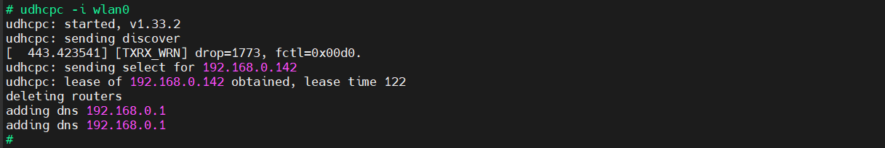

ip地址分配成功，即可连接外网，测试如下：

~~~bash
# ping www.baidu.com
PING www.baidu.com (183.2.172.185): 56 data bytes
64 bytes from 183.2.172.185: seq=0 ttl=52 time=10.186 ms
64 bytes from 183.2.172.185: seq=1 ttl=52 time=11.189 ms
64 bytes from 183.2.172.185: seq=2 ttl=52 time=78.292 ms
64 bytes from 183.2.172.185: seq=3 ttl=52 time=105.430 ms
64 bytes from 183.2.172.185: seq=4 ttl=52 time=15.267 ms
^C
--- www.baidu.com ping statistics ---
5 packets transmitted, 5 packets received, 0% packet loss
round-trip min/avg/max = 10.186/44.072/105.430 ms
#
~~~

分配的ip地址，也成功显示，如下。

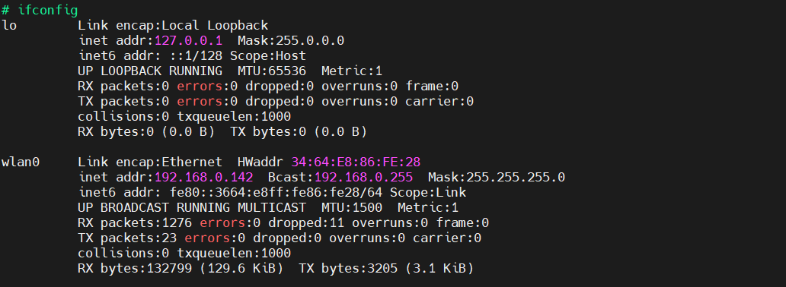

## 扩展-适配XR829模组

以上提供的镜像是已经适配了XR829模组，只需要按照前面的步骤，即可使用Wi-Fi功能。下面将讲解如何在 TinaSDK5 适配xr829模组。

### 获取环境变量

在ubuntu上，新建一个终端，进入TinaSDK5根目录，执行以下指令：

~~~bash
source build/envsetup.sh
~~~

其中：

- source build/envsetup.sh ：获取环境变量。

~~~bash
ubuntu@ubuntu1804:~/T113-i/tina5sdk-bsp$ source build/envsetup.sh 
NOTE: The SDK(/home/ubuntu/T113-i/tina5sdk-bsp) was successfully loaded
load openwrt... ok
Please run lunch next for openwrt.
load buildroot,bsp...ok
Invoke . build/quick.sh from your shell to add the following functions to your environment:
    croot                          - Changes directory to the top of the tree
    cbsp                           - Changes directory to the bsp
    cbsptest                       - Changes directory to the bsptest
    ckernel                        - Changes directory to the kernel
    cbrandy                        - Changes directory to the brandy
    cboot                          - Changes directory to the uboot
    cbr                            - Changes directory to the buildroot
    cchips                         - Changes directory to the board
    cconfigs                       - Changes directory to the board's config
    cbin                           - Changes directory to the board's bin
    cdts                           - Changes directory to the kernel's dts
    ckernelout                     - Changes directory to the kernel output
    cout                           - Changes directory to the product's output
    copenssl                       - Changes directory to the product's openssl-1.0.0
Usage: build.sh [args]
    build.sh                       - default build all
    build.sh bootloader            - only build bootloader
    build.sh kernel                - only build kernel
    build.sh buildroot_rootfs      - only build buildroot
    build.sh menuconfig            - edit kernel menuconfig
    build.sh saveconfig            - save kernel menuconfig
    build.sh recovery_menuconfig   - edit recovery menuconfig
    build.sh recovery_saveconfig   - save recovery menuconfig
    build.sh buildroot_menuconfig  - edit buildroot menuconfig
    build.sh buildroot_saveconfig  - save buildroot menuconfig
    build.sh clean                 - clean all
    build.sh distclean             - distclean all
    build.sh pack                  - pack firmware
    build.sh pack_debug            - pack firmware with debug info output to card0
    build.sh pack_secure           - pack firmware with secureboot
Usage: pack [args]
    pack                           - pack firmware
    pack -d                        - pack firmware with debug info output to card0
    pack -s                        - pack firmware with secureboot
    pack -sd                       - pack firmware with secureboot and debug info output to card0
ubuntu@ubuntu1804:~/T113-i/tina5sdk-bsp$
~~~

这样，就可以使用相应的指令来配置xr829模组。

### 内核设备树修改

**查看原理图**

对于wifi功能需要查看的引脚：

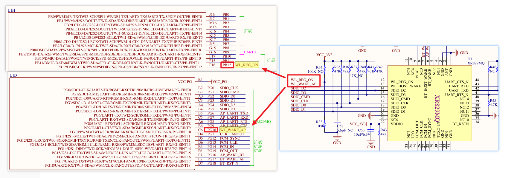

由图可知，

`WL_REG_ON`   对应的引脚是 ==> `PB12`

`WL_WAKE_AP` 对应的引脚是 ==> `PG10`

对于蓝牙功能需要查看的引脚：

由图可知，

`BT_RST_N` 对应的引脚是 ==> `PG18`

**修改内核设备树**

在TinaSDK源码中，进入目录`/device/config/chips/t113_i/configs/evb1_auto/linux-5.4`

修改目录下的内核设备树文件`board.dts`

~~~bash
vim board.dts
~~~

对于wifi设备树节点修改对应的引脚：

在普通模式下，键盘输入`/wlan`，找到wlan设备树节点，点击键盘上的`i`键，进入编辑模式，修改如下：

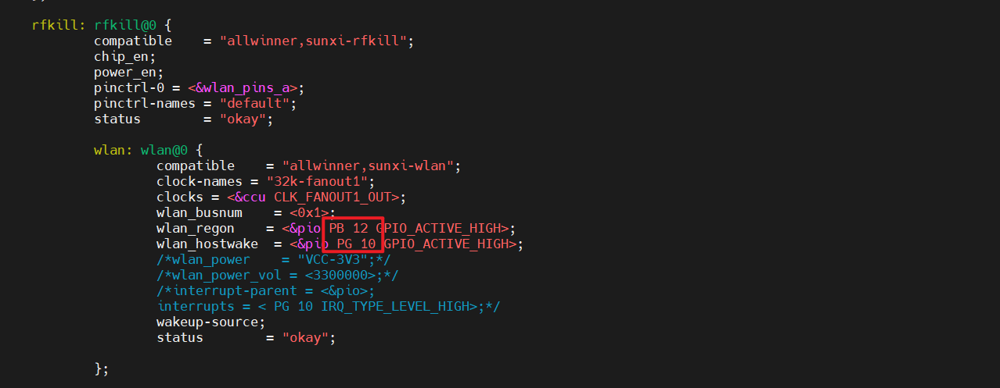

对于蓝牙设备树节点修改对应的引脚：

点击键盘的`esc`键进入普通模式，输入`/bt`，找到蓝牙设备树节点，点击键盘上的`i`键，进入编辑模式，修改如下：

修改完成后，普通模式下，输入`:wq`，回车之后，即可保存退出。

### 内核配置选择

进入TinaSDK源码目录，

执行`./build.sh menuconfig`进入内核配置界面。

找到`Device Drivers`，回车进入。

找到` Network device support`，回车进入。

找到` Wireless LAN`，回车进入。

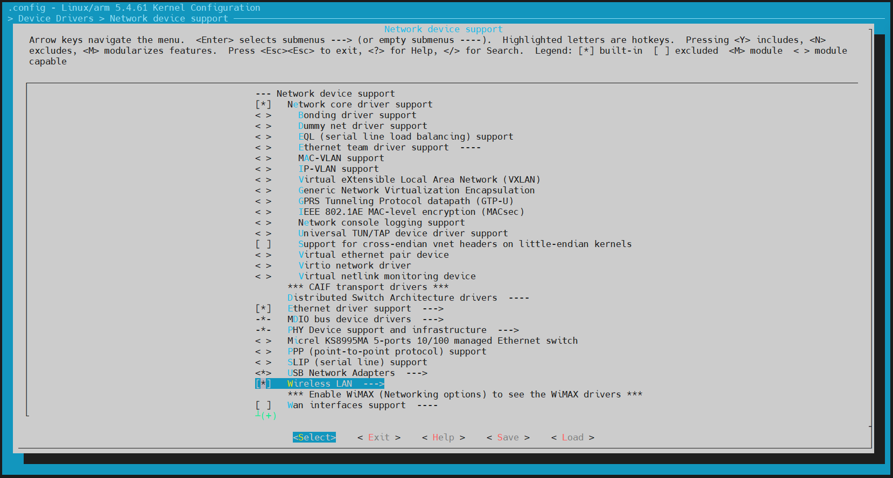

找到`XR829 WLAN support`，按住键盘`M`，选为编译成内核模块。

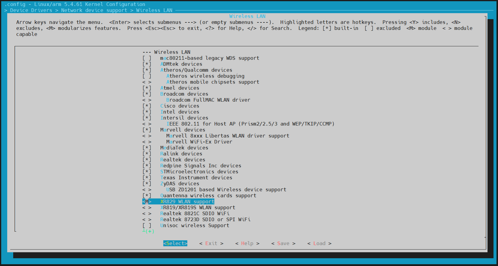

控制键盘上的方向键，选择`Save`，一路回车，保存完毕后，最后选择`Exit`，直到退出为止退出。

在TinaSDK源码目录下，执行`./build.sh kernel`

~~~bash
ubuntu@dshanpi:~/meihao/t113i_tinasdk5.0-v1$ ./build.sh kernel
========ACTION List: build_kernel ;========
options :
INFO: build kernel ...
INFO: prepare_buildserver
INFO: Prepare toolchain ...
Building kernel
...
Copy boot.img to output directory ...

sun8iw20p1 compile all(Kernel+modules+boot.img) successful

INFO: build dts ...
INFO: Prepare toolchain ...
removed '/home/ubuntu/meihao/t113i_tinasdk5.0-v1/out/t113_i/evb1_auto/buildroot/.board.dtb.d.dtc.tmp'
removed '/home/ubuntu/meihao/t113i_tinasdk5.0-v1/out/t113_i/evb1_auto/buildroot/.board.dtb.dts.tmp'
'/home/ubuntu/meihao/t113i_tinasdk5.0-v1/out/t113_i/kernel/build/arch/arm/boot/dts/.board.dtb.d.dtc.tmp' -> '/home/ubuntu/meihao/t113i_tinasdk5.0-v1/out/t113_i/evb1_auto/buildroot/.board.dtb.d.dtc.tmp'
'/home/ubuntu/meihao/t113i_tinasdk5.0-v1/out/t113_i/kernel/build/arch/arm/boot/dts/.board.dtb.dts.tmp' -> '/home/ubuntu/meihao/t113i_tinasdk5.0-v1/out/t113_i/evb1_auto/buildroot/.board.dtb.dts.tmp'
'/home/ubuntu/meihao/t113i_tinasdk5.0-v1/out/t113_i/kernel/staging/sunxi.dtb' -> '/home/ubuntu/meihao/t113i_tinasdk5.0-v1/out/t113_i/evb1_auto/buildroot/sunxi.dtb'
ubuntu@dshanpi:~/meihao/t113i_tinasdk5.0-v1$
~~~

### Tina配置选择

#### 1.添加xr829固件

在TinaSDK源码目录下，执行`./build.sh buildroot_menuconfig`，进入Tina配置界面。

找到`Target packages`，回车进入。

找到`allwinner platform private package select`，回车进入。

找到`wireless`，回车进入。

找到`firmware`，回车进入。

先点击键盘`y`，选择`xr829-firmware`，然后选择`xr829_24M`，因为板子上xr829芯片旁边用的晶振是24M的。

#### 2.开启odhcp6c

odhcp6c的核心作用在于简化并自动化IPv6网络环境下的地址配置过程，确保设备能够顺利接入并通信。

接着上面的操作，退出到`Target packages`下，找到`Networking applications`，进入。

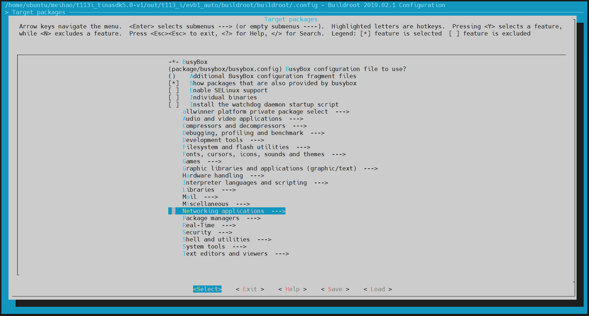

找到`odhcp6c`，点击键盘`y`，选上。

控制键盘的方向键，选择`Save`，一路回车，保存完毕后，最后选择`Exit`，直到退出为止。

### 编译打包更新

在TinaSDK源码目录下，执行`./build.sh`编译。

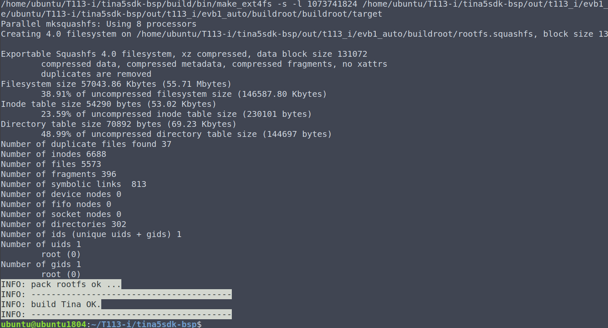

编译完成后，输入`./build.sh pack`

~~~bash
ubuntu@dshanpi:~/meihao/t113i_tinasdk5.0-v1$ ./build.sh pack
========ACTION List: mk_pack ;========
options :
INFO: packing firmware ...
INFO: /home/ubuntu/meihao/t113i_tinasdk5.0-v1/out/t113_i/common/keys
copying tools file
copying configs file
copying product configs file
linux copying boardt&linux_kernel_version configs file
...
update gpt file ok
update mbr file ok
/home/ubuntu/meihao/t113i_tinasdk5.0-v1/tools/pack/pctools/linux/eDragonEx/
/home/ubuntu/meihao/t113i_tinasdk5.0-v1/out/t113_i/evb1_auto/pack_out
Begin Parse sys_partion.fex
Add partion boot-resource.fex BOOT-RESOURCE_FEX
Add partion very boot-resource.fex BOOT-RESOURCE_FEX
FilePath: boot-resource.fex
FileLength=dad400Add partion env.fex ENV_FEX000000000
Add partion very env.fex ENV_FEX000000000
FilePath: env.fex
FileLength=20000Add partion env.fex ENV_FEX000000000
Add partion very env.fex ENV_FEX000000000
FilePath: env.fex
FileLength=20000Add partion boot.fex BOOT_FEX00000000
Add partion very boot.fex BOOT_FEX00000000
FilePath: boot.fex
FileLength=920800Add partion rootfs.fex ROOTFS_FEX000000
Add partion very rootfs.fex ROOTFS_FEX000000
FilePath: rootfs.fex
FileLength=b260880Add partion amp_rv0.fex AMP_RV0_FEX00000
Add partion very amp_rv0.fex AMP_RV0_FEX00000
FilePath: amp_rv0.fex
FileLength=29eb8BuildImg 0
Dragon execute image.cfg SUCCESS !
----------image is at----------

266M    /home/ubuntu/meihao/t113i_tinasdk5.0-v1/out/t113_i_linux_evb1_auto_uart0.img

pack finish
ubuntu@dshanpi:~/meihao/t113i_tinasdk5.0-v1$
~~~

打包完成后，根据前面`开发环境搭建`章节的烧写方式把镜像 `t113_i_linux_evb1_auto_uart0.img` 烧写到开发板上。

### 蓝牙使用

上面成功适配了xr829模组，xr829模组不仅支持Wi-Fi功能，并且还支持蓝牙功能，下面简单讲解如何连接蓝牙。

打开串口终端，开机进入开发板，执行`bt_test -i`，发现蓝牙起不来，报错。

查看`/etc/bluetooth/bt_init.sh`

~~~bash
start_hci_attach()
{
        h=`ps | grep "$bt_hciattach" | grep -v grep`
        [ -n "$h" ] && {
                killall "$bt_hciattach"
        }

        # reset_bluetooth_power

        "$bt_hciattach" -n ttyAS1 xradio >/dev/null 2>&1 &

        wait_hci0_count=0
        while true
        do
                [ -d /sys/class/bluetooth/hci0 ] && break
                usleep 100000
                let wait_hci0_count++
                [ $wait_hci0_count -eq 70 ] && {
                        echo "bring up hci0 failed"
                        exit 1
                }
        done
}
~~~

发现脚本有错：`"$bt_hciattach" -n ttyAS1 xradio >/dev/null 2>&1 &`

串口1的设备节点是`/dev/ttyS1`：

~~~bash
# ls /dev/tty
tty    tty14  tty20  tty27  tty33  tty4   tty46  tty52  tty59  tty8
tty0   tty15  tty21  tty28  tty34  tty40  tty47  tty53  tty6   tty9
tty1   tty16  tty22  tty29  tty35  tty41  tty48  tty54  tty60  ttyS0
tty10  tty17  tty23  tty3   tty36  tty42  tty49  tty55  tty61  ttyS1
tty11  tty18  tty24  tty30  tty37  tty43  tty5   tty56  tty62  ttyS2
tty12  tty19  tty25  tty31  tty38  tty44  tty50  tty57  tty63  ttyS3
tty13  tty2   tty26  tty32  tty39  tty45  tty51  tty58  tty7
# ls /dev/tty
~~~

修改如下：

~~~bash
start_hci_attach()
{
        h=`ps | grep "$bt_hciattach" | grep -v grep`
        [ -n "$h" ] && {
                killall "$bt_hciattach"
        }

        # reset_bluetooth_power

        "$bt_hciattach" -n ttyS1 xradio >/dev/null 2>&1 &

        wait_hci0_count=0
        while true
        do
                [ -d /sys/class/bluetooth/hci0 ] && break
                usleep 100000
                let wait_hci0_count++
                [ $wait_hci0_count -eq 70 ] && {
                        echo "bring up hci0 failed"
                        exit 1
                }
        done
}
~~~

重启开发板。

再次执行`bt_test -i`

~~~bash
# bt_test -i
[ACT D][ring_buff_init,27]enter

[ACT D][ring_buff_start,173]ring buffer start enter

[ACT D][ring_buff_start,187]ring buffer start quit

[ACT D][ring_buff_init,27]enter

[ACT D][ring_buff_start,173]ring buffer start enter

[ACT D][ring_buff_start,187]ring buffer start quit

1970-01-01 09:55:24:756: BTMG[_bt_manager_set_default_profile:374]:  enable default profile from bt config
1970-01-01 09:55:24:756: BTMG[_bt_manager_enable:258]:  btmanager version: Version:4.0.4.20231208, builed time: Jul 16 2024-16:53:44
1970-01-01 09:55:24:756: BTMG[_bt_manager_enable:259]:  enable state: 1, now bt adapter state : 0
197[  286.262531] sunxi-rfkill soc@3000000:rfkill@0: block state already is 1
0-01-01 09:55:24:757: BTMG[bt_test_adapter_status_cb:74]:  bt is turnning on.
[  286.471759] sunxi-rfkill soc@3000000:rfkill@0: set block: 0
[  286.488049] sunxi-rfkill soc@3000000:rfkill@0: bt power on success
[  286.515417] [XR_BT_LPM] bluedroid_write_proc_btwake: bluedroid_write_proc_btwake 1
[  286.523960] [XR_BT_LPM] bluedroid_write_proc_btwake: wakeup bt device
[  286.531339] [XR_BT_LPM] bluedroid_write_proc_lpm: disable lpm mode
Starting bluetoothd: OK
1970-01-01 09:55:29:953: BTMG[bt_routine:102]:  bt adapter info:
             address:6E:D6:22:1F:82:27
             Name: BlueZ 5.54
             Alias: aw-bt-test-82-27
             Discoverable: 1
             DiscoverableTimeout: 180

[ACT D][ring_buff_init,27]enter

1970-01-01 09:55:30:199: BTMG[bt_test_adapter_status_cb:59]:  BT is ON
1970-01-01 09:55:30:202: BTMG[bt_agent_register:226]:  set io capability: KeyboardDisplay
1970-01-01 09:55:30:208: BTMG[bt_manager_set_scan_mode:208]:  enter
1970-01-01 09:55:30:209: BTMG[pfd1_thread_process:1008]:  enter
[BT]:
~~~

成功，手机可以连接上蓝牙了。

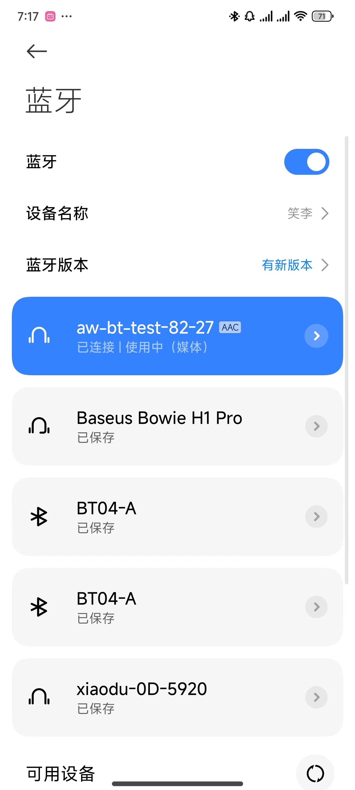

打印信息如下：

~~~bash
[BT]:1970-01-01 09:56:01:896: BTMG[bt_test_agent_authorize_service_cb:192]:  AGENT: 04:10:6B:F9:43:23 Authorize Service 0000110d-0000-1000-8000-00805f9b34fb
1970-01-01 09:56:02:183: BTMG[supervise_pcm_worker_start:131]:  transport A2DP:AAC
1970-01-01 09:56:02:184: BTMG[a2dp_pcm_worker_routine:115]:  codec:AAC, sampling:44100, channels:2, format_size:2
1970-01-01 09:56:02:191: BTMG[a2dp_pcm_worker_routine:149]:  Starting PCM loop
1970-01-01 09:56:02:545: BTMG[bt_test_agent_authorize_service_cb:192]:  AGENT: 04:10:6B:F9:43:23 Authorize Service 0000110e-0000-1000-8000-00805f9b34fb
1970-01-01 09:56:02:590: BTMG[bt_test_a2dp_sink_connection_state_cb:205]:  A2DP sink connected with device: 04:10:6B:F9:43:23
1970-01-01 09:56:02:626: BTMG[bluez_signal_mediatransport_properties_changed:506]:  Volume is :59
1970-01-01 09:56:02:626: BTMG[bt_test_avrcp_audio_volume_cb:287]:  AVRCP audio volume:04:10:6B:F9:43:23 : 59
1970-01-01 09:56:03:058: BTMG[bt_test_avrcp_play_state_cb:260]:  BT palying music paused with device: 04:10:6B:F9:43:23
1970-01-01 09:56:03:061: BTMG[bt_test_avrcp_track_changed_cb:276]:  BT playing music title: Not Provided
1970-01-01 09:56:03:061: BTMG[bt_test_avrcp_track_changed_cb:277]:  BT playing music artist:
1970-01-01 09:56:03:061: BTMG[bt_test_avrcp_track_changed_cb:278]:  BT playing music album:

[BT]:
~~~

