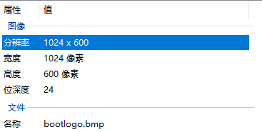

# 显示LOGO

## 修改Uboot设备树

在Tina-SDK目录下，进入到 device/config/chips/t113/configs/100ask 目录，找到 uboot-board.dts 文件，这个文件就是 uboot使用的 设备树配置文件,我们需要在这个设备树内增加对应的 7寸RGB显示屏 设备树节点。

~~~bash
ubuntu@ubuntu1804:~/tina-d1-h/device/config/chips/t113/configs/100ask$ ls -la
total 48
drwxrwxr-x 4 ubuntu ubuntu  4096 Jul  8 23:09 .
drwxrwxr-x 4 ubuntu ubuntu  4096 Mar 18 08:00 ..
-rwxrwxr-x 1 ubuntu ubuntu   215 Jun 30 21:42 BoardConfig.mk
lrwxrwxrwx 1 ubuntu ubuntu    19 Jul  8 23:09 board.dts -> linux-5.4/board.dts
drwxrwxr-x 2 ubuntu ubuntu  4096 Jul  9 02:37 configs
-rw-rw-r-- 1 ubuntu ubuntu  2106 Jun 30 21:42 env.cfg
lrwxrwxrwx 1 ubuntu ubuntu     9 Jul  8 23:09 linux -> linux-5.4
drwxrwxr-x 2 ubuntu ubuntu  4096 Jul  8 21:57 linux-5.4
-rwxrwxr-x 1 ubuntu ubuntu  8123 Jun 30 21:42 sys_config.fex
-rwxrwxr-x 1 ubuntu ubuntu  3283 Jul  8 22:05 sys_partition.fex
-rwxrwxr-x 1 ubuntu ubuntu 10955 Jul  8 21:59 uboot-board.dts
~~~

节点信息如下，可以通过 vim gedit nano等工具进行编辑增加。

注意： 要删除掉原来的 &lcd0 配置。

~~~bash
&lcd0 {
		/* part 1 */
        lcd_used            = <1>;
        lcd_driver_name     = "default_lcd";
	lcd_backlight       = <100>;
	/* part 2 */
	lcd_if = <0>;
	lcd_hv_if = <0>;
		
	/* part 3 */
        lcd_x               = <1024>;
        lcd_y               = <600>;
        lcd_width           = <154>;
        lcd_height          = <85>;
        lcd_dclk_freq       = <51>;
        lcd_hbp             = <140>;
        lcd_ht              = <1344>;
        lcd_hspw            = <20>;
        lcd_vbp             = <20>;
        lcd_vt              = <635>;
        lcd_vspw            = <3>;
		
	lcd_pwm_used        = <1>;
	lcd_pwm_ch          = <7>;
	lcd_pwm_freq        = <500>;
	lcd_pwm_pol         = <1>;

	/* part 5 */
	lcd_frm = <1>;
	lcd_io_phase = <0x0000>;
	lcd_gamma_en = <0>;
	lcd_cmap_en = <0>;
	lcd_hv_clk_phase = <0>;
	lcd_hv_sync_polarity= <0>;
				
	/* part 6 */
	lcd_power = "vcc-lcd";
	lcd_pin_power = "vcc-pd";
	pinctrl-0 = <&rgb18_pins_a>;
	pinctrl-1 = <&rgb18_pins_b>;
};
~~~

之后保存退出。

## 修改uboot配置

进入目录`/home/ubuntu/tina-d1-h/lichee/brandy-2.0/u-boot-2018/configs`，修改`sun8iw20p1_uart3_defconfig`。

在`sun8iw20p1_uart3_defconfig`文件最底部添加：

~~~bash
CONFIG_CMD_SUNXI_BMP=y
CONFIG_LZMA=y
CONFIG_DISP2_SUNXI=y
CONFIG_HDMI2_DISP2_SUNXI=y
CONFIG_AW_PHY=y
CONFIG_BOOT_GUI=y
~~~

返回TinaSDK根目录，执行`mboot`，编译uboot源码：

~~~bash
ubuntu@ubuntu1804:~/tina-d1-h/device/config/chips/t113/configs/100ask/configs$ croot
ubuntu@ubuntu1804:~/tina-d1-h$ make 
===This's tina environment.===
no need rebuild boot0, the newest file is: 
	1720490574.9106153280   Mon 08 Jul 2024 10:02:54 PM EDT   /home/ubuntu/tina-d1-h/lichee/brandy-2.0/spl/sboot/libsun8iw20p1_sboot.o
no need rebuild uboot, the newest file is: 
	1720490584.5113780720   Mon 08 Jul 2024 10:03:04 PM EDT   /home/ubuntu/tina-d1-h/lichee/brandy-2.0/u-boot-2018/u-boot.cfg.configs
=== Start build scp.bin ===
Platform t113 Skip marisc.
[2] 77703
make[1]: Entering directory '/home/ubuntu/tina-d1-h'
make[2]: Entering directory '/home/ubuntu/tina-d1-h'
make[3]: Entering directory '/home/ubuntu/tina-d1-h/target/allwinner'
make[4]: Entering directory '/home/ubuntu/tina-d1-h/target/allwinner/t113-100ask'
...
'sboot_sun8iw20p1.bin' -> '/home/ubuntu/tina-d1-h/lichee/brandy-2.0/spl/../../../device/config/chips/t113/bin/sboot_sun8iw20p1.bin'
'sboot_sun8iw20p1.bin' -> '/home/ubuntu/tina-d1-h/out/t113-100ask/sboot_sun8iw20p1.bin'
mboot0 success!
ubuntu@ubuntu1804:~/tina-d1-h$
~~~

编译uboot完成之后，执行编译`make`、打包`pack`。将最终的镜像烧写入开发板即可支持显示屏驱动。

> 注意： 
> 这一步只是在uboot增加了 显示屏的驱动节点支持，但是因为uboot并未去操作显示屏进行图像显示，所以启动时只能看到背光有亮。
> 如果出现花屏，很可能是原来存在logo图，但是logo图的尺寸与显示屏的尺寸不一样。

## 添加LOGO图

准备一张合适的logo图：

开发板连接RGB屏的尺寸是1024*600。

注意图片的格式是`.bmp`格式，图片名称最好是`bootlogo.bmp`:

制作好图片后，把它放到特定的目录`/home/ubuntu/tina-d1-h/device/config/chips/t113/configs/100ask/configs`中：

~~~bash
ubuntu@ubuntu1804:~/tina-d1-h/device/config/chips/t113/configs/100ask/configs$ ls
bootlogo.bmp  fastbootlogo.bmp
~~~

最后，编译`make`，打包`pack`，烧录开机即可显示logo图。