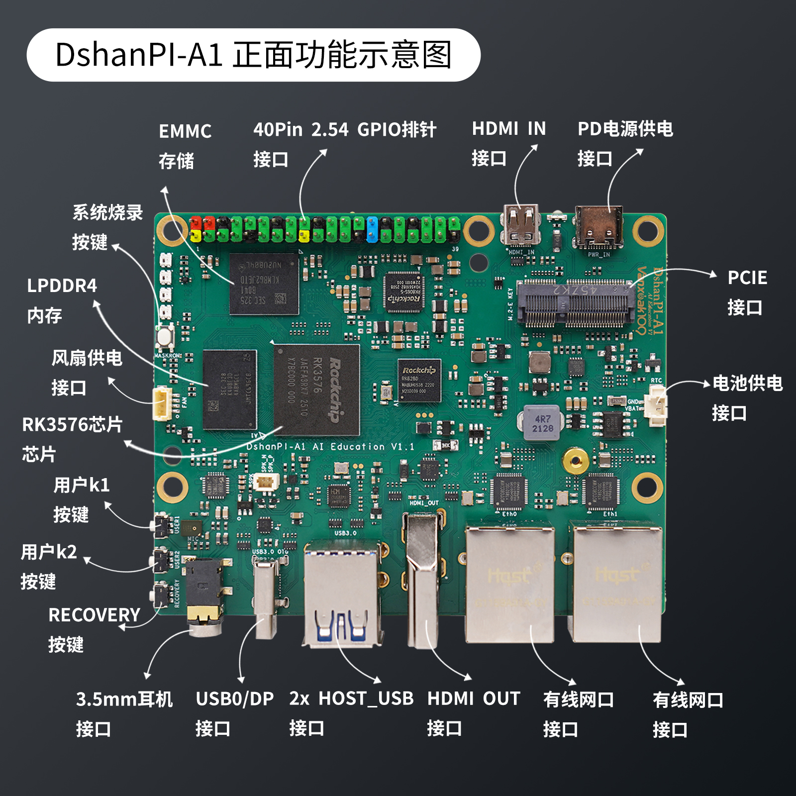
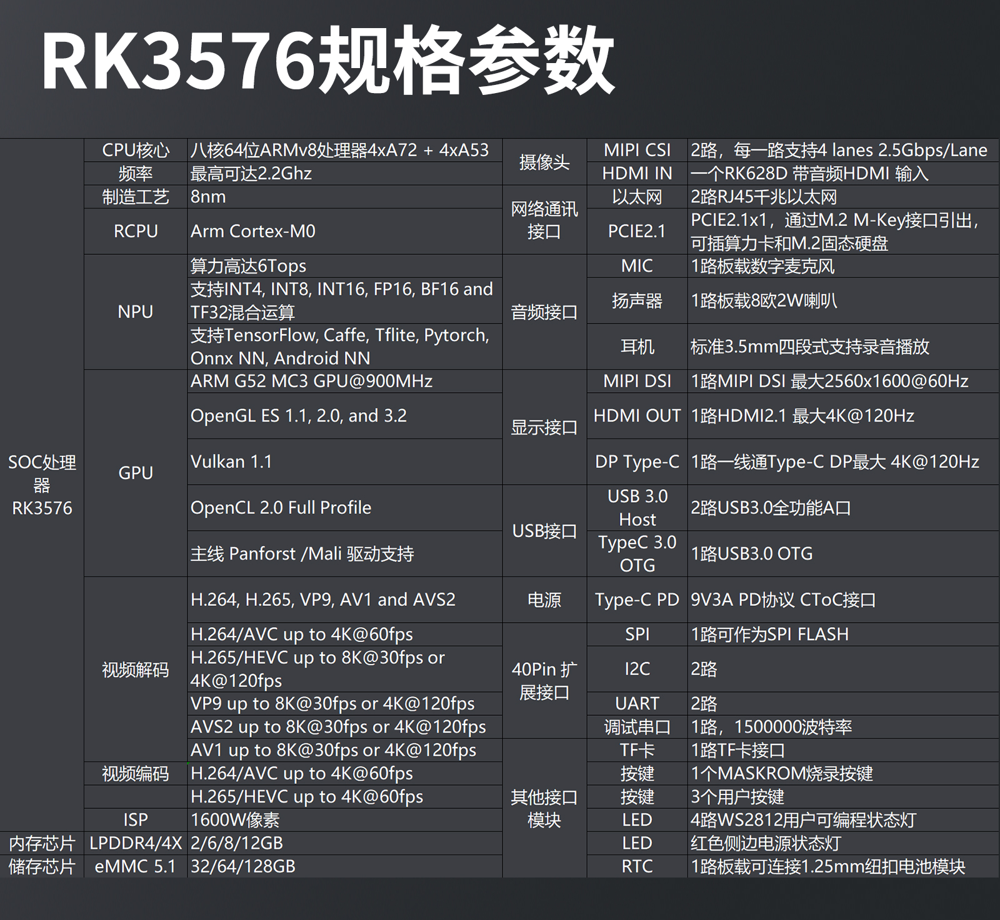

DshanPi-A1 focuses on AI education scenarios, providing a sustainable and evolving hardware and software ecosystem for teaching needs from beginner to advanced levels, in an integrated form of a "single-board computer + topic-based projects (paid)".
It offers a mid-to-high-end performance SBC experience, including rich interfaces such as PCIe, USB3.0, dual gigabit Ethernet, HDMI, HDMI-IN, DP, and more.

:::tip
- Source repo: https://github.com/dshanpi/
- QQ community group: 798273638
- Product link: https://detail.tmall.com/item.htm?id=953384132961
- Image site: https://dl.100ask.net/Hardware/MPU/RK3576-DshanPi-A1/
:::

<!-- truncate -->

## DShanPl-A1 Education

DShanPl-A1 Education is deeply optimized for AI education and project development. Designed based on Rockchip's RK3576 processor, it integrates 4 Cortex-A72 and 4 Cortex-A53 cores with NEON instruction set support. It supports 8K@30fps H.265, VP9, AVS2 and AV1 decoders, a 4K@60fps H.264 decoder and a 4K@60fps AV1 decoder; it also supports 4K@60fps H.264 and H.265 encoders. The built-in 3D GPU is fully compatible with OpenGL ES 1.1/2.0/3.2, OpenCL 2.0 and Vulkan 1.1. The embedded NPU delivers up to 6 TOPS of computing power, supporting INT4/INT8/INT16/FP16 hybrid operations.

import Tabs from '@theme/Tabs';
import TabItem from '@theme/TabItem';

<Tabs>
  <TabItem value="apple" label="Front Function Diagram" default>
    
  </TabItem>
  <TabItem value="orange" label="Back Function Diagram">
    
  </TabItem>
  <TabItem value="banana" label="Product Promo Image">
    
  </TabItem>
</Tabs>

### Specifications

DshanPI-A1 Education RK3576 SBC detailed specifications: 

### Peripheral Drivers Supported by the System

✅: Supported —  ❌: Not yet supported —  🚫: No plan to support   —⚠: Supported but not fully tested

| System Version       | Armbian  | Buildroot  | OpenWrt-LEDE | ArchLinux  | OpenEuler | Fedora |
|--------------------|-------------------|----------------|---------------|--------------------|------------------------|---------------------|
| SPI            | ✅                | ✅             | ✅            | ✅                 | ✅                     | ✅                  |
| I2C            | ✅                | ✅             | ✅            | ✅                 | ✅                     | ✅                  |
| PWM            | ✅                | ✅             | ✅            | ✅                 | ✅                     | ✅                  |
| UART           | ✅                | ✅             | ✅            | ✅                 | ✅                     | ✅                  |
| MMC            | ✅                | ✅             | ✅            | ✅                 | ❌                     | ✅                  |
| GPIO           | ✅                | ✅             | ✅            | ✅                 | ✅                     | ✅                  |
| NPU            | ✅                | ✅             | ⚠            | ✅                 | ❌                     | ❌                  |
| USB2.0         | ✅                | ✅             | ✅            | ✅                 | ❌                     | ❌                  |
| USB3.0         | ✅                | ✅             | ✅            | ✅                 | ❌                     | ❌                  |
| PCI-e         | ✅                | ✅             | ✅            | ✅                 | ❌                    | ❌                  |
| Video Encoding       | ✅                | ✅             | ✅            | ❌                 | ❌                     | ❌                  |
| Video Decoding       | ✅                | ✅             | ✅            | ❌                 | ❌                     | ❌                  |
| MIPI CSI       | ❌                | ✅             | ❌            | ❌                 | ❌                     | ❌                  |
| Audio          | ✅                | ✅             | ❌            | ❌                 | ❌                     | ❌                  |
| WIFI           | ✅                | ✅             | ✅            | ✅                 | ❌                     | ❌                  |

## DShanPl-R1+

:::tip
Status: In mass production
:::

DshanPI-R1+ RK3568 SBC product image: 

