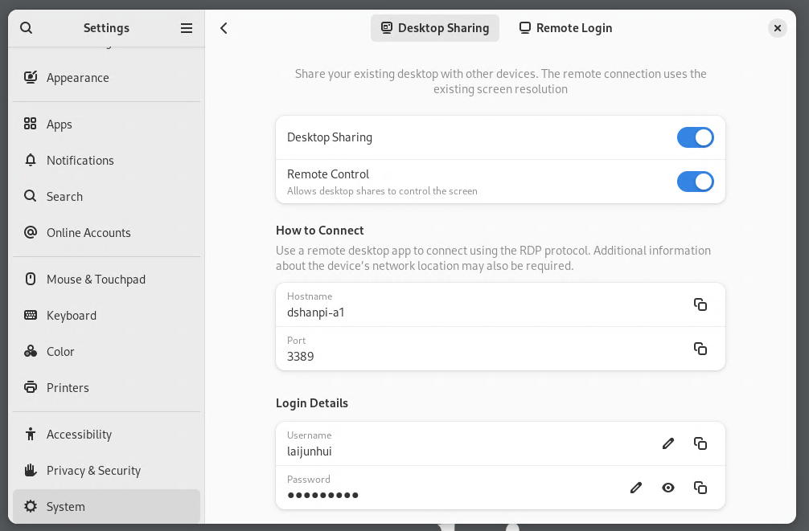
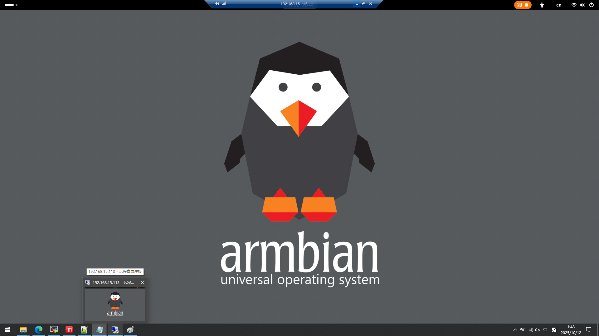
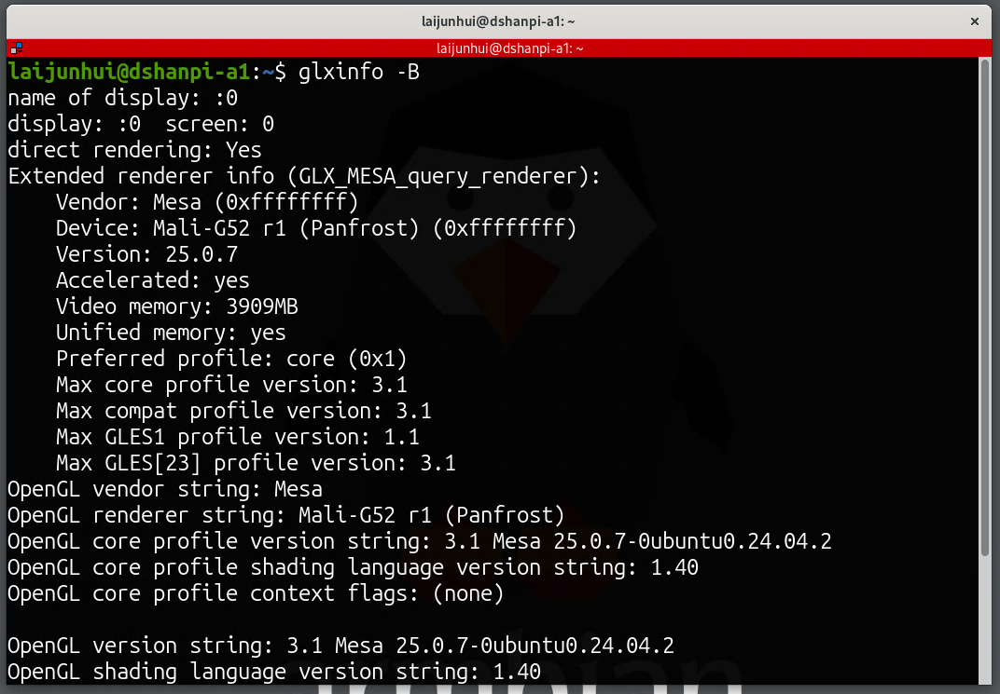
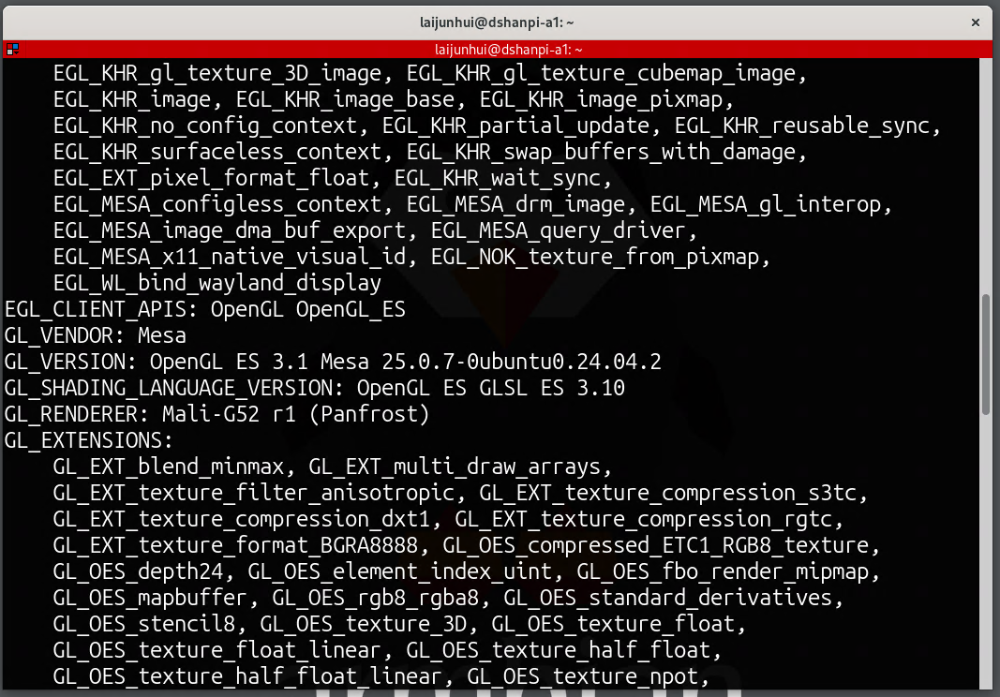

### Background and Problem


* Device used: DshanPI-A1, running the Armbian system, with Wayland as the window system and an open-source GPU driver.

* Initial attempt: Using NoMachine for remote desktop, but there are two issues:

1. It creates a virtual desktop by default instead of the physical desktop;

2. It has poor Wayland support, launching the X11 desktop in compatibility mode, which prevents OpenGL from using GPU acceleration.

<!-- truncate -->

### Solution: Using Armbian's Built-in Remote Desktop


1. **Install the necessary environment**

   Since the remote desktop components are not preinstalled by default, install them first via command:


```
sudo apt install gnome-remote-desktop
```


2. **Configure the remote desktop**

* Restart the settings window (close and reopen it), then navigate to `Settings → System → Remote Desktop`.

* Check `Desktop Sharing` and `Remote Control`.

* The initial password is randomly generated and needs to be manually changed to a custom password.

  

  

3. **Connect and verify**

* Open "Remote Desktop Connection" on Windows, and enter the device IP, username, and password.

* The first login may show a black screen; after restarting the device, the connection succeeds.

  

### Functional Verification

Test whether GPU acceleration works via commands:


* Run `glxinfo -B`; the output shows Mali GPU information (OpenGL support is normal);

  

* Run `es2_info`; the Mali GPU is also detected (OpenGLES support is normal).

  

Conclusion: The remote desktop can properly invoke GPU acceleration, meeting the requirements.

### References


* "Armbian 25.5.1 Noble Gnome Enabling Remote Desktop Feature"

  ([https://blog.csdn.net/u013833472/article/details/149032655](https://blog.csdn.net/u013833472/article/details/149032655))
