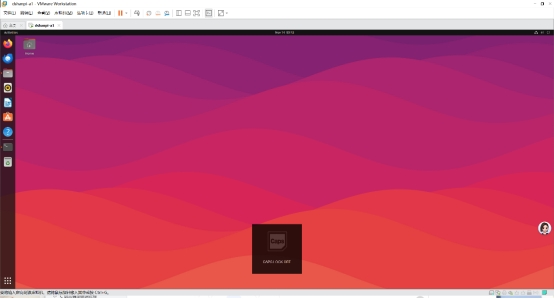
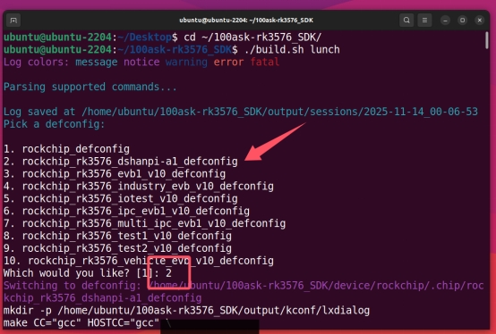
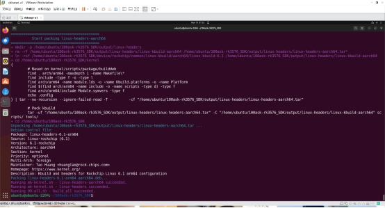
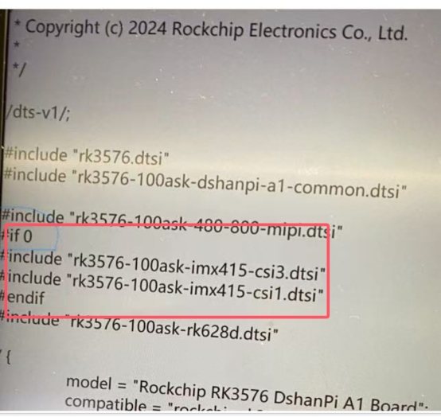
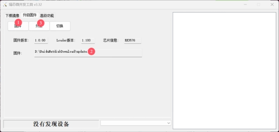
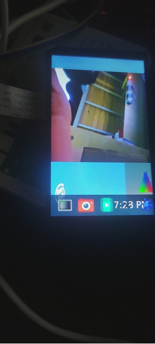

## Board Introduction

DshanPi-A1 is a high-performance AI embedded development board developed by Shenzhen Baiwen Web (Weidongshan Team). It is based on the Rockchip RK3576 chip and is designed specifically for AI education, edge computing, and smart device development.



## Core Specifications

| Parameter | Specification |
| --- | --- |
| Main SoC | Rockchip RK3576, 8nm process, octa-core 64-bit 4×Cortex-A72(2.2GHz)+4×Cortex-A53(1.8GHz) Rockchip Electronics Co., Ltd. |
| AI Compute | Built-in dedicated NPU, 6TOPS compute capability, supports INT4/INT8/INT16 mixed-precision operations |
| Memory/Storage | Onboard LPDDR4/4X memory, supports eMMC and UFS storage expansion, SD card slot |
| Display Interface | HDMI v2.1/eDP v1.3 combo interface, MIPI DSI (4-lane) Rockchip Electronics Co., Ltd. |
| Video Decoding | Supports 8K@30fps, 4K@120fps high-definition video |
| Network Connectivity | Supports WiFi6/BLE5.2 (requires external module), Gigabit Ethernet port (some versions) |
| USB Interface | Multiple USB3.0/2.0 (Type-C and Type-A) Rockchip Electronics Co., Ltd. |
| Other Interfaces | UART, I2C, SPI, GPIO, audio interface, CAN bus (some versions) |
| Power | Supports 30W PD fast charging (Type-C interface) |
| Dimensions | Compact design (specific dimensions not publicly disclosed) |

## Product Features

### 1️⃣ Powerful AI Processing Capability

· 6TOPS dedicated NPU can smoothly run lightweight large language models such as DeepSeek and Qwen

· Supports mainstream AI frameworks (TensorFlow, PyTorch, MXNet, etc.)

· Suitable for AI application development such as image recognition, speech processing, and smart surveillance

### 2️⃣ Rich Multimedia Performance

· Supports 8K video decoding, can be used as an HD media center

· HDMI IN function allows the development board to be used as a secondary display for a PC

· Built-in audio codec, supports 3.5mm audio output

### 3️⃣ Comprehensive Development Support

· Ships with DShanOS (Baiwen Web's self-developed Linux distribution)

· Comes with free teaching courses and documentation, lowering the learning barrier

· Supports Armbian system, with official image downloads available

· Provides a complete SDK and sample code for easy secondary development

### 4️⃣ Flexible Expansion Capability

· All GPIO interfaces are exposed, making it easy to connect various sensors and actuators

· Supports multiple communication protocols, suitable for IoT application development

· Can connect external cameras, displays, WiFi/4G modules, and more to expand functionality

## Application Scenarios

**·** AI Education and Learning: Suitable for embedded AI course teaching and experimentation

**·** Edge Computing Devices: Can deploy lightweight AI models to enable local intelligent decision-making

**·** Smart Home Hub: Build a high-performance, low-power smart home control center

**·** Industrial Automation: Suitable for smart device monitoring and data acquisition

**·** Commercial Display: Supports 8K display, can be used for advertising machines and information publishing systems

**·** AI Vision Systems: Can be used for face recognition, object detection, and other scenarios

## Companion Resources

**·** Official documentation site: https://wiki.dshanpi.org/docs/dshanpi-a1/

**·** Developer community: Weidongshan Embedded Developer Community ([100ask.org](https://100ask.org/))

**·** QQ technical exchange group: 798273638

**·** Free tutorials: Provides AI development courses from basic to advanced

## buildroot SDK Installation

### 1. Obtain the Official Virtual Machine

https://pan.baidu.com/s/15M8zuHOwl_SITl6cSk_7Vg?pwd=eaax Extraction code: eaax

### 2. Install and open vmware, run the virtual machine

Enter the ubuntu system, the account password is ubuntu


### 3. Build the SDK

Open the virtual machine and execute the following command to enter the SDK root directory:

```bash
cd ~/100ask-rk3576_SDK/
```


Select the configuration file:

```bash
./build.sh lunch
```



### 4. Build

Run the following command

```bash
./build.sh
```


Wait for the build to finish



## Device Tree Modification to Enable the Camera Node

Enter

```bash
/home/ubuntu/100ask-rk3576_SDK/kernel/arch/arm64/boot/dts/rockchip
```

Modify the file shown in the picture




Change to if1

Return to the SDK directory and use

```bash
./build.sh kernel
```


Finally

```bash
./build.sh updateimg
```


Finally, upload and flash (remember to enter MASKROM)



## Results


But there is still a bug, the screen camera color is still not displayed correctly.

## Problem Solving

At first, I suspected that the camera's .xml (.json) was not loaded. After debugging for a long time, there was still no result.

After extensive debugging, I finally found a solution:

### Step 1: Discover Key Clues from media-ctl Output

In the output of `media-ctl -p -d /dev/media0`, I noticed this key information:

```
entity 63: m00_b_rk628-csi9-0051 (1 pad, 1 link)
	type V4L2 subdev subtype Sensor flags 0
	device node name /dev/v4l-subdev2
	 pad 0: Source
	  [fmt:UYVY8_2X8/64x64@10000/600000 field:none]
	  -> "rockchip-csi2-dphy0":0 [ENABLED] ←note the [ENABLED] here
```


**Analysis Points**:

· A rk628-csi sensor entity exists in the system

· Its link state is [ENABLED], meaning it is occupying CSI hardware resources

· But the resolution is only 64x64, which is obviously not a normal camera output

### Step 2: Discover from dmesg Logs that IMX415 Driver Is Normal

From the output of `dmesg | grep -i imx415`:

```
[3.459474] imx415 3-0037: Detected imx415 id 0000e0
[3.515523] imx415 3-0037: Consider updating driver imx415 to match on endpoints
[3.515557] rockchip-csi2-dphy csi2-dphy3: dphy3 matches m01_f_imx415 3-0037: bustype 5
```

**Analysis Points**:

· The IMX415 sensor was correctly detected (ID: 0000e0)

· The driver loaded successfully and even established a matching relationship with CSI-DPHY

· But there is no message indicating successful V4L2 sub-device creation

### Step 3: Infer Hardware Connections from Device Tree Structure

From the device tree snippet:

```c
&csi2_dphy3 {
    port@0 {
        mipi_in_ucam3: endpoint@1 {
            remote-endpoint = <&imx415_out0>; ←IMX415 connects here
            data-lanes = <1 2 3 4>;
        };
    };
    port@1 {
        csidphy3_out: endpoint@0 {
            remote-endpoint = <&mipi3_csi2_input>;
        };
    };
};
```

**Analysis Points**:

· IMX415 is connected to the system via CSI-DPHY3

· But the actual media-ctl output shows that rockchip-csi2-dphy0 is occupied

· This indicates that there may be a resource allocation issue among multiple CSI interfaces

### Step 4: Infer Registration Failure from the Missing V4L2 Sub-device

When running the check command:

```bash
ls /sys/bus/i2c/devices/3-0037/v4l-subdev*/media_device/
# Output: No such file or directory
```


**Analysis Points**:

· The I2C device 3-0037 exists and the driver binding is normal

· But no corresponding V4L2 sub-device was created

· This usually means the driver probed successfully, but the subsequent V4L2 registration failed

### Step 5: Connect All Clues to Form a Complete Picture

Stringing the above clues together:

**1.** **Symptom**: IMX415 driver loaded but no V4L2 device

**2.** **Evidence 1**: rk628-csi is occupying the CSI link and its status is [ENABLED]

**3.** **Evidence 2**: IMX415 I2C communication is normal but the media device is missing

**4.** **Evidence 3**: The device tree shows that the two may share CSI hardware resources

**Logical Reasoning**:

· If the IMX415 hardware is faulty -> I2C probing should fail

· If there is an IMX415 driver issue -> dmesg should have error logs

· If the device tree configuration is wrong -> CSI matching would not succeed

**·** The only reasonable explanation: the hardware resources are occupied by another device

### Step 6: Start Practicing


Recompile the device tree and flash the development board, it runs perfectly!




## Summary

1. Hardware resource conflicts in embedded devices are common hidden issues, especially when multiple devices share links such as CSI and I2C. The device occupation status should be a key focus of investigation.

2. During development, make full use of tools such as media-ctl and dmesg, combined with device tree configuration analysis, to quickly locate resource allocation issues and avoid blind debugging.

3. For scenarios where the driver loads normally but functions abnormally, prioritize investigating key aspects such as hardware resource occupation and V4L2 sub-device registration to narrow down the scope of the problem.

4. The CSI interface resource allocation of the DshanPi-A1 development board must be precisely configured through the device tree. After modification, strictly follow the Buildroot build process to regenerate the image to ensure the configuration takes effect.