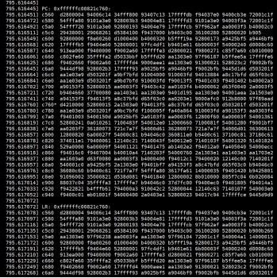
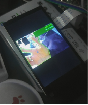
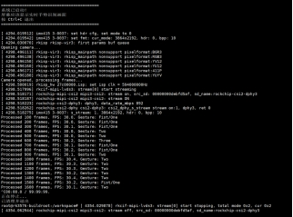
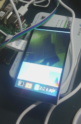
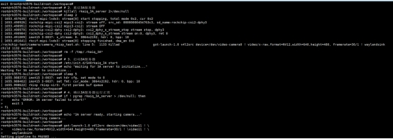

Previously we finished debugging the camera and the screen, so now we can finally start working on gesture recognition!

This time I will implement a real-time, OpenCV-based gesture recognition system on the RK3576 Buildroot system. The system can recognize five gestures (fist/one finger, two, three, four, five fingers) and display the processing results on the screen in real time.

Given the particularities of embedded systems, we will focus on how to render images in a Wayland environment with no X11 and no OpenGL.

## Gesture Recognition Algorithm

### Principle

Because there are concavities between our spread fingers, we can accurately identify the number of fingers by calculating the angle and depth of these concavity points.


### 1. Skin Color Detection

Use the HSV color space to extract the skin-color region:

```python
def detect_hand(self, frame):
    hsv = cv2.cvtColor(frame, cv2.COLOR_BGR2HSV)
    mask = cv2.inRange(hsv, [0, 30, 60], [25, 255, 255])  # skin color range

    # Morphological processing for denoising
    kernel = np.ones((7, 7), np.uint8)
    mask = cv2.morphologyEx(mask, cv2.MORPH_CLOSE, kernel, iterations=3)
    mask = cv2.morphologyEx(mask, cv2.MORPH_OPEN, kernel, iterations=2)

    # Find the largest contour
    contours, _ = cv2.findContours(mask, cv2.RETR_EXTERNAL, cv2.CHAIN_APPROX_SIMPLE)
    if contours:
        c = max(contours, key=cv2.contourArea)
        if cv2.contourArea(c) > 3000:  # area threshold to filter noise
            return c, mask
    return None, mask
```

### 2. Finger Counting (Convex Hull Defect Method)

Identify fingers by detecting the concavity points of the hand contour:

```python
def recognize(self, contour):
    hull = cv2.convexHull(contour, returnPoints=False)
    defects = cv2.convexityDefects(contour, hull)

    finger_count = 0
    for i in range(defects.shape[0]):
        s, e, f, d = defects[i, 0]
        start = tuple(contour[s][0])  # convex point 1
        end = tuple(contour[e][0])    # convex point 2
        far = tuple(contour[f][0])    # concavity point (between fingers)

        # Calculate the angle to determine whether it is a valid fingertip
        a = np.linalg.norm(np.array(start) - np.array(end))
        b = np.linalg.norm(np.array(start) - np.array(far))
        c = np.linalg.norm(np.array(end) - np.array(far))
        angle = np.arccos((b**2 + c**2 - a**2) / (2 * b * c))
        if angle <= np.pi / 2.2 and d > 8000:  # angle and depth thresholds
            finger_count += 1

    gestures = ["Fist/One", "Two", "Three", "Four", "Five"]
    return gestures[finger_count]
```

## How to Display the OpenCV-Processed Image

Theory alone is not enough - we need practice! How to display the OpenCV-processed image is the focus of this tutorial. Normally we use `cv2.imshow()` to display an image, but on an embedded system without X11/OpenGL this method is unavailable. We need to use the **GStreamer + Wayland** solution (the same approach as in our previous article).

### Exploration of Solutions

#### Solution A: stdin Pipe Transmission

The most intuitive idea is to transmit image data through the stdin pipe:

```python
proc = subprocess.Popen(['gst-launch-1.0', 'fdsrc', '!', ...], stdin=subprocess.PIPE)
proc.stdin.write(frame_data)
```

**Result**: Broken pipe errors occurred frequently and the data transmission was unstable. I suspect the pipe was timing out and closing automatically, or my format was wrong. So I directly tried using a FIFO to transmit raw data.

#### Solution B: Named Pipe (FIFO) for Raw Data Transmission

Try to transmit raw RGB data through a FIFO:

```bash
mkfifo /tmp/video_fifo
```



Unfortunately, this caused kernel crashes all too easily. At this point I was facing several problems: if I only used the command line to view the recognition results, I had no way of knowing whether the camera was running normally; but OpenCV and GStreamer reading the camera simultaneously was not possible (the camera can only be read by one process). Later I realized that the GStreamer display did not need to read the camera frame in real time - I only needed to display what OpenCV had processed. So I got to work, and tried to pass the OpenCV-processed image directly to the screen through GStreamer, but my skills were not up to the task and it came to nothing: the pipe either errored or closed. I stopped to think slowly, and finally came up with Solution C (getting to this step had already taken three days).

#### Solution C: Multi-File Sequence

Change the approach: save the processed images as a sequence of JPEG files:

```python
# Python side
cv2.imwrite(f'/dev/shm/gesture_frames/frame_{frame_index:03d}.jpg', processed)
```

```bash
# GStreamer side
gst-launch-1.0 multifilesrc location=frame_%03d.jpg loop=true ! jpegdec ! ...
```

**Result**: The screen finally showed some movement - I was thrilled! But the effect was poor, with severe ghosting, and because it was reading the folder's images in a loop, it kept looping the playback, which hurt both the appearance and the experience. So I decided to leverage the FIFO and, building on the previous idea, upgrade it to the current solution:

**OpenCV finishes processing a frame -> immediately encodes it as JPEG -> writes directly into the FIFO -> GStreamer immediately decodes and displays it**

#### Solution D: FIFO + JPEG Stream (Final Solution!)


```python
# Python side: write JPEG data directly into the FIFO
fifo = open('/tmp/gesture_fifo', 'wb')
_, jpeg = cv2.imencode('.jpg', processed, [cv2.IMWRITE_JPEG_QUALITY, 85])
fifo.write(jpeg.tobytes())
fifo.flush()
```

```bash
# GStreamer side: use jpegparse to automatically split JPEG frames
gst-launch-1.0 filesrc location=/tmp/gesture_fifo ! jpegparse ! jpegdec ! ...
```

**Supplement: Why does the JPEG stream work?**

1. The JPEG format has built-in start (0xFFD8) and end (0xFFD9) markers
2. GStreamer's `jpegparse` plugin can automatically recognize boundaries and split independent JPEG frames
3. It avoids the packet-sticking problem of raw data streams

**Result**: At last I could observe the picture smoothly (the pipeline did not stutter - it was even smoother than directly opening the camera icon on the screen to view the camera feed). I will put the demo video and code in the attachments.




## Bonus - The Camera's Second Launch Was Greenish and Dark

### Problem Description

I used the IMX415 camera on the RK3576 Buildroot system and displayed the picture through GStreamer + Wayland. I ran into a bizarre issue: **the first time the camera was started the colors were normal, but after the second start the picture became dark and greenish**.



### Preliminary Analysis: Comparing the Boot Logs

First I compared the kernel logs of the two launches and found a key difference:

**First launch (normal colors)**:
```
[20.528641] rkisp_hw 27c00000.isp: set isp clk = 594000000Hz
[20.529097] rkcif-mipi-lvds 3: stream[0] start streaming
[20.529317] rockchip-csi2-dphy 3: dphy3, data_rate_mbps 892
[20.529356] imx415 3-0037: s_stream: 1.3864x2192, hdr: 0, bpp: 10
```

**Second launch (abnormal colors)**:
```
[79.209321] rkisp_hw 27c00000.isp: set isp clk = 594000000Hz
[79.209967] rkisp rkisp-vir3: first params buf queue
[79.210051] rkisp rkisp-vir3: id: 0 no first iq setting cfg_upd: c000dfecc7fe473b en_upd: 0 en s: 5ffcc7fe473b
[79.210351] rkcif-mipi-lvds 3: stream[0] start streaming
```

Key finding: **the second launch had one extra warning** `no first iq setting`. This indicates that the ISP's image quality parameters were not loaded correctly, causing wrong default parameters to be used, which made the colors dark and greenish.

### Problem-Solving Process

#### Phase 1: Attempting a Hardware-level Fix

At first I thought the ISP driver state had not been reset correctly, and tried several methods:

1. **Attempt to unbind/bind the ISP driver**:
   ```bash
   echo "27c00000.isp" > /sys/bus/platform/drivers/rkisp_hw/unbind
   echo "27c00000.isp" > /sys/bus/platform/drivers/rkisp_hw/bind
   ```
   Result: **the camera could not be opened at all** - the operation was too aggressive and completely messed up the driver state.

2. **Tried v4l2-ctl reset, media-ctl reset, etc.**, but none of them solved the problem.

#### Phase 2: In-Depth Diagnosis of the System Configuration

I began systematically diagnosing the entire camera subsystem:

```bash
# Find the IQ parameter file
find / -name "*imx415*.xml" -o -name "*imx415*.json" 2>/dev/null
# Result: found /etc/iqfiles/imx415_CMK-OT2022-PX1_IR0147-50IRC-8M-F20.json

# Check the 3A server
ps aux | grep rkaiq_3A_server
# Result: the server is running

# View device topology
v4l2-ctl --list-devices
# Confirm /dev/video-camera0 -> video11
```

**Key findings**:

- The IQ parameter file exists
- The 3A server (rkaiq_3A_server) is running
- But why were the IQ parameters not loaded?

#### Phase 3: Capturing the 3A Server Log

I decided to run the 3A server in the foreground to view detailed output:

```bash
killall rkaiq_3A_server
/usr/bin/rkaiq_3A_server 2>&1 &
```

The startup log showed:
```
DBG: get rkisp-isp-subdev devname: /dev/v4l-subdev3
DBG: get rkisp-input-params devname: /dev/video18
DBG: get rkisp-statistics devname: /dev/video17
XCORE: K: cid[1] rk_aiq_uapi2_sysctl_init success. iq: /etc/iqfiles//imx415_CMK-OT2022-PX1_IR0147-50IRC-8M-F20.json
XCORE: K: cid[1] rk_aiq_uapi2_sysctl_prepare success. mode: 0
DBG: /dev/media1: wait stream start event..
```

**Major finding**: the 3A server was actually working fine! The IQ file had been loaded successfully!

At this point I ran a second camera launch test and observed:
```
[625.216117] rkisp-vir3: waiting on params stream one event timeout
```

**The truth came out**: on the second launch, the 3A server timed out and did not respond!

#### Phase 4: Finding the Root Cause

Through multiple tests and log analysis, I finally understood the nature of the problem:

**First launch flow (normal)**:
1. When the system boots, the 3A server starts automatically
2. The 3A server loads the IQ parameter file into memory
3. The 3A server pre-prepares the IQ parameter buffer
4. GStreamer starts the camera
5. The ISP requests IQ parameters
6. The 3A server responds immediately and pushes the IQ parameters
7. Colors are normal

**Second launch flow (abnormal)**:
1. Stop the first GStreamer process
2. The 3A server is still running, but has entered some waiting state
3. The IQ parameter buffer has already been consumed
4. GStreamer is restarted immediately
5. The ISP requests IQ parameters
6. **The 3A server cannot respond in time or is in an abnormal state**
7. The ISP uses default parameters to process the first frame
8. The `no first iq setting` warning appears
9. Colors are dark and greenish

### Solution

The root cause of the problem is: **after the camera's first run, the 3A server enters an abnormal state and cannot correctly respond to the IQ parameter request of the second launch**.

The final fix is simple: **restart the 3A server before each camera launch**.

I wrote a wrapper script:

```bash
#!/bin/sh

echo "=== Starting Camera with 3A Server Reset ==="

# 1. Stop all camera processes
pkill -9 gst-launch 2>/dev/null

# 2. Restart the 3A server
killall rkaiq_3A_server 2>/dev/null
sleep 2
rm -f /tmp/.rkaiq_3A*

# 3. Start the 3A server
/etc/init.d/S40rkaiq_3A start
echo "Waiting for 3A server to initialize..."
sleep 5

# 4. Confirm the 3A server is running normally
if ! pgrep rkaiq_3A_server > /dev/null; then
    echo "ERROR: 3A server failed to start!"
    exit 1
fi

echo "3A server ready, starting camera..."

# 5. Start the camera
gst-launch-1.0 v4l2src device=/dev/video11 ! \
    video/x-raw,format=NV12,width=640,height=480,framerate=30/1 ! \
    waylandsink

echo "Camera stopped"
exit 0
```



### Verification Result


After using the new script, I started the camera several times in a row and the colors were always normal; the log no longer showed `no first iq setting` or timeout errors.

### Lessons Learned

1. **Comparing logs is key to discovering problems**: by comparing the logs of the normal and abnormal cases, I quickly located the key clue `no first iq setting`

2. **Diagnose systematically**: do not blindly try things; first check the state of each component (IQ file, 3A server, device node)

3. **Run in the foreground to see detailed logs**: many background-service problems require foreground execution to see detailed output

4. **Understand the cooperation between components**: the RK platform's camera involves cooperation among the ISP driver, the 3A server, and the IQ parameter file - a problem in any link will cause an anomaly

5. **State management matters**: embedded-system service-restart problems are often caused by improper state-machine management; a thorough reset is the most reliable solution.