In this review, I will install the necessary tools for the gesture recognition system and debug the screen.

## Hardware and Environment Preparation

Before starting, let's clarify the equipment and environment on hand:

- **Core board**: Dshanpi-A1, with the Rockchip RK3576 chip as the main SoC.

- **Screen**: A 480x800 resolution MIPI screen.

- **System**: Buildroot Linux system.

- **Official SDK**

## Install Development Tools

Here is the list for this time:

| Package/Configuration Category         | Recommended Options and Purpose                                                                                               |
|-------------------------|--------------------------------------------------------------------------------------------------------------|
| Python Environment              | python3: Core interpreter. python-pip: Used to install Python packages not included in Buildroot. python-numpy: Provides efficient numerical computation support for OpenCV and other libraries. python-setuptools: A base build dependency for some Python packages. |
| Computer Vision and Image Processing    | opencv4: Be sure to enable python3 support. Provides the core computer vision library for image processing and gesture recognition algorithms. opencv4 contrib modules: Includes additional, more advanced algorithms. |
| Camera and Display Support        | gstreamer1 and related plugins: Build pipelines for camera image capture and screen display. gst1-plugins-base, gst1-plugins-good, gst1-plugins-bad, gst1-plugins-ugly: Provide a rich set of codecs and functional elements. gst1-python: Allows creating and manipulating GStreamer pipelines in Python. |

## SDK Configuration Process

### 1. Select the Chip Type

```bash
./build.sh chip
```


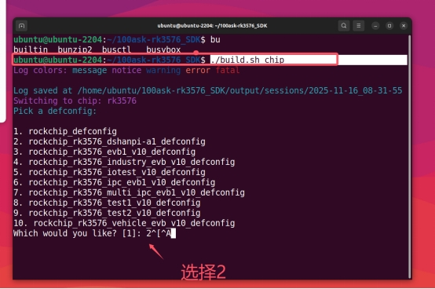

### 2. Enter buildroot Configuration

```bash
cd buildroot
make menuconfig
```


### 3. Select Target packages


### 4. Install the Python Environment

When you cannot find the installation path, press the `/` key to search:


Enter `python3` to search:


Enter the displayed Location path to configure:


### 5. Save the Configuration and Build

```bash
make
```

Return to the SDK main directory and run:

```bash
./build.sh rootfs
./build.sh updateimg
```

Finally, flash and run it on the development board.

## Development Board Debugging

### Check Tool Installation

```bash
python3 --version
pip3 --version
python3 -c "import numpy; print('NumPy version:', numpy.__version__)"
python3 -c "import cv2; print('OpenCV version:', cv2.__version__)"
```

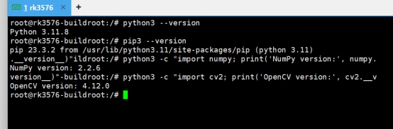

## Screen Debugging

### Problem Analysis

The system is already running the Weston compositor, which means we have a graphical interface environment. Attempting to directly operate the FrameBuffer (/dev/fb0) is ineffective because Weston has already occupied the display interface.

Through system inspection, we found:

- The `/dev/fb0` device exists
- The screen status is `connected`
- The resolution is 480x800

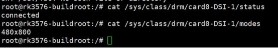

### Solution: GStreamer + Wayland

#### GStreamer Basic Test

```bash
gst-launch-1.0 videotestsrc pattern=smpte ! video/x-raw,width=480,height=800 ! waylandsink sync=false
```


#### Camera Direct-to-Display Test

```bash
gst-launch-1.0 v4l2src device=/dev/video11 ! video/x-raw,width=640,height=480 ! videoconvert ! waylandsink sync=false
```

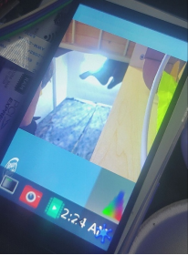

> Note: Please replace the device parameter with your camera's device node

### Test Script

```python
#!/usr/bin/env python3
# fixed_display_test.py

import subprocess
import time
import os

def check_camera_devices():
    """Check available camera devices"""
    print("=== Camera Device Check ===")

    try:
        # Use v4l2-ctl to check devices
        result = subprocess.run(["v4l2-ctl", "--list-devices"],
                        capture_output=True, text=True)
        if result.returncode == 0:
            print("Found video devices:")n            print(result.stdout)
        else:
            print("v4l2-ctl command execution failed")
    except Exception as e:
        print(f"Failed to check camera devices: {e}")

    # Test common camera devices
    camera_devices = ["/dev/video11", "/dev/video0", "/dev/video1", "/dev/video2"]
    print("\nTesting camera devices:")

    for device in camera_devices:
        if os.path.exists(device):
            print(f"Testing device: {device}")
            try:
                # Try to test the camera using GStreamer
                cmd = [
                  "gst-launch-1.0",
                  "-v",
                  "v4l2src", f"device={device}", "!",
                  "video/x-raw,width=640,height=480,framerate=15/1", "!",
                  "videoconvert", "!",
                  "waylandsink", "sync=false"
                ]

                process = subprocess.Popen(cmd)
                time.sleep(3) # Display for 3 seconds
                process.terminate()
                process.wait()
                print(f" {device}: Camera working normally")
                return device

            except Exception as e:
                print(f"{device}: Test failed - {e}")
        else:
            print(f"{device}: Device does not exist")

    return None

def test_static_patterns():
    """Test static patterns (will not change)"""
    print("\n=== Static Pattern Test ===")

    # Set Wayland environment
    os.environ['WAYLAND_DISPLAY'] = 'wayland-0'

    # Test static patterns (will not change)
    static_patterns = [
        ("smpte100", "SMPTE 100% color bars"),
        ("ball", "Clock pattern"),
        ("blink", "Blink pattern"),
        ("pinwheel", "Pinwheel pattern"),
        ("spokes", "Spokes pattern"),
    ]

    for pattern, description in static_patterns:
        print(f"Displaying: {description}")
        try:
            cmd = [
                "gst-launch-1.0",
                "videotestsrc", f"pattern={pattern}", "!",
                "video/x-raw,width=480,height=800,framerate=15/1", "!",
                "waylandsink", "sync=false"
            ]

            process = subprocess.Popen(cmd)
            time.sleep(3)
            process.terminate()
            process.wait()
            print(f"{description} displayed successfully")

        except Exception as e:
            print(f"{description} display failed: {e}")

def test_custom_resolution():
    """Test custom resolution display"""
    print("\n=== Custom Resolution Test ===")

    resolutions = [
        (480, 800, "Portrait 480x800"),
        (800, 480, "Landscape 800x480"),
        (640, 480, "Standard 640x480"),
        (400, 800, "Portrait 400x800"),
    ]

    for width, height, desc in resolutions:
        print(f"Testing resolution: {desc}")
        try:
            cmd = [
                "gst-launch-1.0",
                "videotestsrc", "pattern=smpte100", "!",
                f"video/x-raw,width={width},height={height},framerate=15/1", "!",
                "videoconvert", "!",
                "waylandsink", "sync=false"
            ]

            process = subprocess.Popen(cmd)
            time.sleep(2)
            process.terminate()
            process.wait()
            print(f" {desc} displayed successfully")

        except Exception as e:
            print(f" {desc} display failed: {e}")

if __name__ == "__main__":
    print("=" * 50)

    # 1. Check camera
    camera_device = check_camera_devices()

    # 2. Test static patterns
    test_static_patterns()

    # 3. Test different resolutions
    test_custom_resolution()

    print("\n" + "=" * 50)
    if camera_device:
        print(f"Available camera device: {camera_device}")
    else:
        print("No available camera device found")
    print("All tests completed")
```

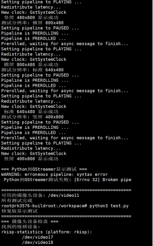

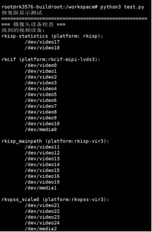

### Run Results

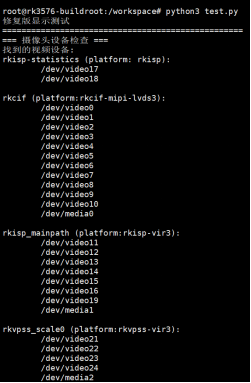


> I will put the demo video in the attachments

## Bonus Chapter: FileZilla File Transfer

### FileZilla Connection Settings

[FileZilla - The free FTP solution](https://filezilla-project.org/)

### Check SSH Service

```bash
ss -tuln | grep 22
```

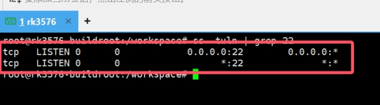

### Network Sharing Settings

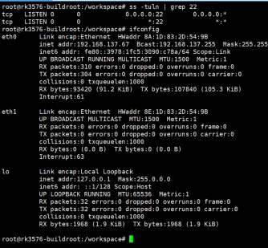

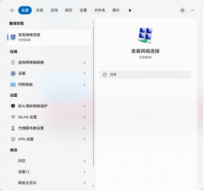

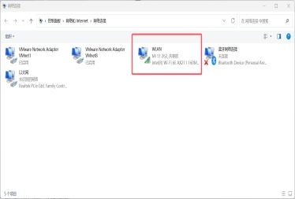

Select the network that can access the internet, and click Properties:


### Connect to the Development Board

```bash
ifconfig
```

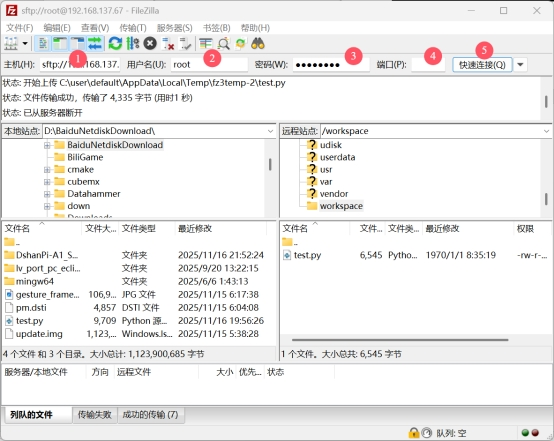

Connect using FileZilla:

- IP: Development board IP address
- Username: root
- Password: rockchip
- Port: 22

## Summary

Looking back at the entire debugging process, the following key points are worth special attention:

1. **Display Path Selection**: On systems running a compositor such as Weston, prioritize the GStreamer + waylandsink solution for displaying images, rather than directly operating the FrameBuffer.

2. **Camera Device Node**: Be sure to use the `v4l2-ctl --list-devices` command to confirm the device node corresponding to the camera, and specify it correctly in the code.

3. **Screen Resolution**: Note that the screen resolution detected by the system (which can be queried via `cat /sys/class/drm/card0-DSI-1/modes`) may be slightly different from the physical resolution. When creating display frames, use this as the reference or make adjustments accordingly.


At this point, we have successfully set up the gesture recognition programming environment on the Dshanpi A1 development board and resolved the display issues with the MIPI screen and camera. Although the process was full of twists and turns, it laid a solid foundation for the subsequent actual writing of gesture recognition algorithms. I hope my experience can be of help to everyone!