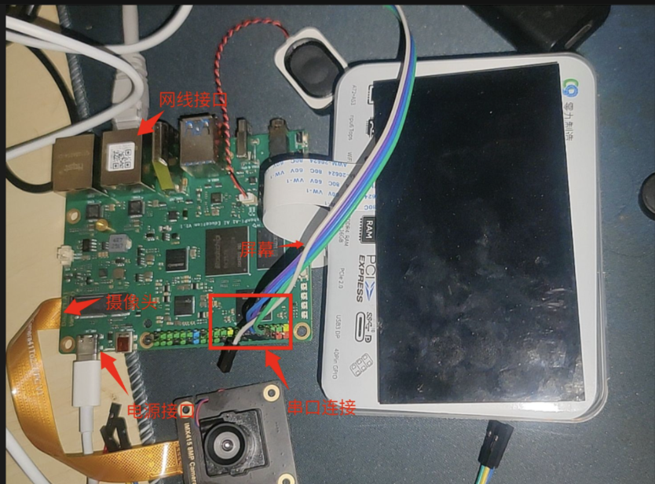
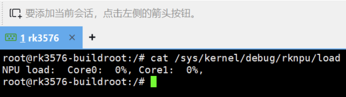
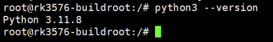
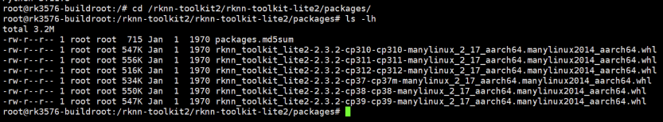
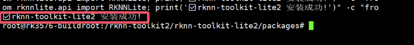
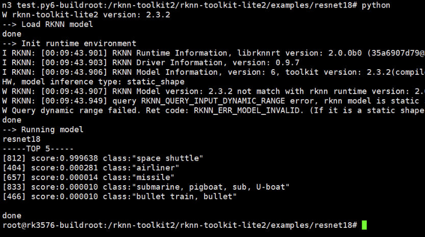
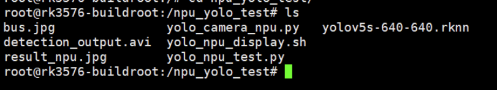
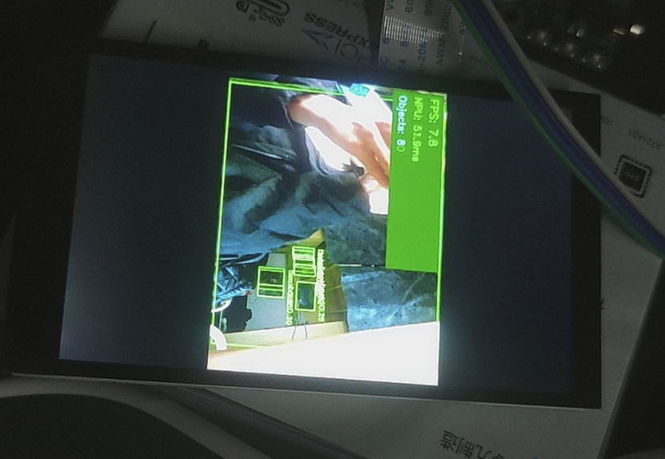
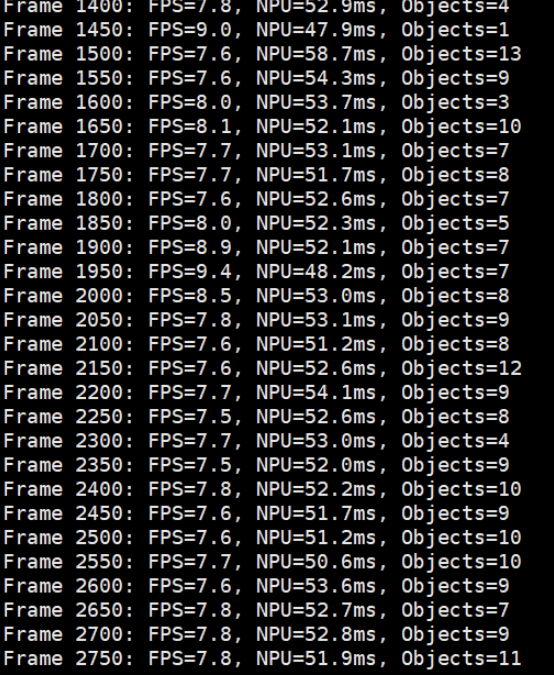

## Preface

In previous articles we implemented CPU-based MediaPipe gesture recognition. Although it runs, the 15-25 FPS performance is still a bit strained, and CPU usage is high. This time I will squeeze the full hardware potential of the RK3576 - using the onboard NPU (Neural Processing Unit) to accelerate deep-learning inference. First, let's cover a few concepts.

**What is an NPU?**
An NPU (Neural Processing Unit) is a hardware accelerator designed specifically for AI operations. Unlike a CPU/GPU, an NPU is deeply optimized for the matrix operations, convolutions, and other operations used in neural networks. The RK3576 chip has a built-in dual-core NPU with a theoretical compute capacity of 6 TOPS, which can dramatically boost model inference speed and lower power consumption.

**Why YOLOv5?**
Actually, I originally intended to keep optimizing my previous MediaPipe TFLite model conversion, but I ran into dependency hell (a pit I stumbled into for a long time...), so this time I first used the officially provided YOLOv5 model to validate the NPU functionality. YOLOv5 is one of the most popular real-time object detection algorithms today and can simultaneously detect multiple objects and their positions in an image.

## 1. Environment Preparation

### 1.1 Hardware Connections

- RK3576 development board (already flashed with Buildroot)
- IMX415 camera (connected at /dev/video11)
- HDMI monitor
- Serial connection (for command-line operation)




### 1.2 Check the NPU Hardware

First, log in to the board and check whether the NPU is working normally:

```bash
# View the NPU load (should show Core0 and Core1)
cat /sys/kernel/debug/rknpu/load
```



This shows that both NPU cores are idle and ready to go!

**Tip:** The RK3576's NPU uses a dual-core architecture and can process two models in parallel, or pipeline the different layers of one large model across the two cores.

### 1.3 Check the Python Environment

```bash
# View the Python version
python3 --version
```



My output is `Python 3.11.8`; this version matters, as it must match when installing libraries later.

## 2. Install the RKNN Runtime Environment

### 2.1 What is RKNN?

RKNN (Rockchip Neural Network) is the deep-learning inference framework Rockchip developed for its own NPU. The whole toolchain is split into two parts:

- **rknn-toolkit2** (PC side): used for model conversion, turning TensorFlow/PyTorch/ONNX models into .rknn format
- **rknn-toolkit-lite2** (board side): a lightweight runtime library used to load and infer .rknn models on RK chips

This time we only need on-board inference, so we only install the lite version.

### 2.2 Get the Installation Package

The good news is that if you don't want to download from GitHub because it's slow or unstable, you can use the download link provided by our 100ask:
https://dl.100ask.net/Hardware/MPU/RK3576-DshanPi-A1/utils/rknn-toolkit2.zip
Download it and transfer it to our DshanPi-A1.

```bash
cd /rknn-toolkit2/rknn-toolkit-lite2/packages/
ls -lh
```



You can see there are .whl installation packages for multiple Python versions; the one we need is the cp311 (Python 3.11) ARM64 version.

### 2.3 Install rknn-toolkit-lite2

```bash
# First force-install the main package (skip dependency checks, because dependencies are installed separately later)
pip3 install --no-deps rknn_toolkit_lite2-2.3.2-cp311-cp311-manylinux_2_17_aarch64.manylinux2014_aarch64.whl

# Then use the Tsinghua mirror to install the missing dependencies
pip3 install -i https://pypi.tuna.tsinghua.edu.cn/simple psutil ruamel.yaml
```

This way we don't waste time downloading unnecessary packages.

When you see `Successfully installed`, it's done!

### 2.4 Verify the Installation

```bash
python3 -c "from rknnlite.api import RKNNLite; print('✅ rknn-toolkit-lite2 installed successfully!')"
```




If the check mark appears, you're good!

## 3. NPU Benchmarking

Before running real-time detection, first use a simple image-classification model to test the NPU's performance.

### 3.1 Test with ResNet18

Enter the example directory:

```bash
cd /rknn-toolkit2/rknn-toolkit-lite2/examples/resnet18
ls -lh
```


You can see:
- `resnet18_for_rk3576.rknn` - a model specifically optimized for RK3576
- `space_shuttle_224.jpg` - test image
- `test.py` - inference script

Run the test:

```bash
python3 test.py
```



My results:
- Recognition result: Space Shuttle - 99.96% confidence
- Inference latency: 11.21 ms
- Average FPS: 89.24

This means the NPU can process 89 images per second - 3-6x faster than my previous CPU-based MediaPipe!

### 3.2 Performance Benchmark

To test the NPU performance more accurately, I wrote a script that loops 100 times (you can test it yourself):

```bash
cd ~
mkdir -p npu_test
cd npu_test

# Copy the model and image
cp /rknn-toolkit2/rknn-toolkit-lite2/examples/resnet18/resnet18_for_rk3576.rknn ./
cp /rknn-toolkit2/rknn-toolkit-lite2/examples/resnet18/space_shuttle_224.jpg ./
```

Create the test script `benchmark.py`:
```python
import cv2
import numpy as np
import time
from rknnlite.api import RKNNLite

rknn = RKNNLite()
rknn.load_rknn('resnet18_for_rk3576.rknn')
rknn.init_runtime(core_mask=RKNNLite.NPU_CORE_0)

img = cv2.imread('space_shuttle_224.jpg')
img = cv2.cvtColor(img, cv2.COLOR_BGR2RGB)
img = np.expand_dims(img, 0)

# Warm up
for _ in range(10):
    rknn.inference(inputs=[img])

# Test 100 times
times = []
for i in range(100):
    start = time.time()
    rknn.inference(inputs=[img])
    times.append((time.time() - start) * 1000)

print(f'Average latency: {np.mean(times):.2f} ms')
print(f'Min latency: {np.min(times):.2f} ms')
print(f'Max latency: {np.max(times):.2f} ms')
print(f'Average FPS: {1000/np.mean(times):.2f}')

rknn.release()
```

Run it:
```bash
python3 benchmark.py
```

## 4. YOLOv5 Object Detection

Now for the main event - using the NPU for real-time object detection!

### 4.1 What is YOLOv5?

YOLO (You Only Look Once) is a single-stage object detection algorithm that can simultaneously predict the positions and categories of multiple objects in a single forward pass. Compared with the two-stage R-CNN family, YOLO is faster and well suited for real-time scenarios.

YOLOv5 is the fifth generation of this family and supports detecting 80 common object categories (people, cars, animals, furniture, etc.).

### 4.2 Prepare the Model and Test Image

```bash
cd ~
mkdir -p npu_yolo_test
cd npu_yolo_test

# Copy the YOLOv5 model specialized for RK3576
cp /rknn-toolkit2/rknpu2/examples/rknn_yolov5_demo/model/RK3576/yolov5s-640-640.rknn ./

# Copy the test image (a bus photo)
cp /rknn-toolkit2/rknpu2/examples/rknn_yolov5_demo/model/bus.jpg ./

ls -lh
```




### 4.3 Single-Image Detection Test

The complete post-processing code here is fairly long (including the NMS non-maximum suppression algorithm and so on), so I consolidated it into one script.

Create `yolo_npu_test.py` (see Appendix A for the full code), then run it:

```bash
python3 yolo_npu_test.py
```


My results:
- Detected 5 objects:
  - 3 persons: 88.0%, 87.1%, 82.8%
  - 1 bus: 70.1%
  - 1 partially occluded person: 30.7%
- NPU inference latency: 87.94 ms
- FPS: 11.37

The detection result is saved in `result_npu.jpg`, which you can transfer to your PC to view:
```bash
# Run in PowerShell on the PC (replace <board IP> with the actual IP)
scp root@<board IP>:/npu_yolo_test/result_npu.jpg .
```

**[Detection Result Image]**


**Why is YOLOv5 slower than ResNet18?**
- ResNet18 only does classification, outputting the probabilities of 1000 categories (simple)
- YOLOv5 detects the positions + categories of multiple objects, outputting feature maps at 3 different scales (complex)
- But 11 FPS is already pretty good for object detection!

## 5. Real-Time Camera Detection

Single-image testing succeeded - now for a real challenge: using the IMX415 camera for real-time detection and displaying the result on the screen!

### 5.1 Display Solution: FIFO + GStreamer

As before, since Buildroot has no graphical interface and OpenCV's `imshow()` cannot be used, we adopt the **named pipe (FIFO) + GStreamer** solution:

1. Python reads the camera -> NPU inference -> draws boxes -> encodes to JPEG
2. Writes into the FIFO pipe
3. GStreamer reads from the pipe -> decodes -> displays on the screen

This is a common inter-process communication method on Linux and was also used in the previous gesture recognition project.

### 5.2 Create a One-Click Launch Script

For convenience, I packed the whole flow into a Shell script `yolo_npu_display.sh`:

```bash
cd /npu_yolo_test

cat > yolo_npu_display.sh << 'EOF'
#!/bin/bash

echo "=========================================="
echo "YOLOv5 NPU Real-time Detection - RK3576"
echo "=========================================="
echo ""

# Restart the 3A server (camera auto-exposure/white-balance/auto-focus)
echo "Restarting 3A server..."
killall rkaiq_3A_server 2>/dev/null
sleep 2
rm -f /tmp/.rkaiq_3A* 2>/dev/null
/etc/init.d/S40rkaiq_3A start >/dev/null 2>&1
sleep 3

# Create the FIFO pipe
FIFO_PATH="/tmp/yolo_fifo"
rm -f $FIFO_PATH
mkfifo $FIFO_PATH

echo "Starting display pipeline..."
gst-launch-1.0 -q filesrc location=$FIFO_PATH ! jpegparse ! jpegdec ! videoconvert ! videoscale ! video/x-raw,width=1280,height=720 ! waylandsink fullscreen=true sync=false &
GST_PID=$!

sleep 2

echo "Starting YOLOv5 NPU detection..."
python3 - <<'PYTHON_CODE' &
import cv2
import numpy as np
import time
from rknnlite.api import RKNNLite
from collections import deque

RKNN_MODEL = '/npu_yolo_test/yolov5s-640-640.rknn'
CAMERA_ID = 11
IMG_SIZE = 640
OBJ_THRESH = 0.25
NMS_THRESH = 0.45
FIFO_PATH = '/tmp/yolo_fifo'

CLASSES = ("person", "bicycle", "car", "motorbike", "aeroplane", "bus", "train", "truck", "boat", "traffic light",
           "fire hydrant", "stop sign", "parking meter", "bench", "bird", "cat", "dog", "horse", "sheep", "cow",
           "elephant", "bear", "zebra", "giraffe", "backpack", "umbrella", "handbag", "tie", "suitcase", "frisbee",
           "skis", "snowboard", "sports ball", "kite", "baseball bat", "baseball glove", "skateboard", "surfboard",
           "tennis racket", "bottle", "wine glass", "cup", "fork", "knife", "spoon", "bowl", "banana", "apple",
           "sandwich", "orange", "broccoli", "carrot", "hot dog", "pizza", "donut", "cake", "chair", "sofa",
           "pottedplant", "bed", "diningtable", "toilet", "tvmonitor", "laptop", "mouse", "remote", "keyboard",
           "cell phone", "microwave", "oven", "toaster", "sink", "refrigerator", "book", "clock", "vase",
           "scissors", "teddy bear", "hair drier", "toothbrush")

def xywh2xyxy(x):
    y = np.copy(x)
    y[:, 0] = x[:, 0] - x[:, 2] / 2
    y[:, 1] = x[:, 1] - x[:, 3] / 2
    y[:, 2] = x[:, 0] + x[:, 2] / 2
    y[:, 3] = x[:, 1] + x[:, 3] / 2
    return y

def process(input, mask, anchors):
    anchors = [anchors[i] for i in mask]
    grid_h, grid_w = map(int, input.shape[0:2])
    box_confidence = np.expand_dims(input[..., 4], axis=-1)
    box_class_probs = input[..., 5:]
    box_xy = input[..., :2]*2 - 0.5
    col = np.tile(np.arange(0, grid_w), grid_w).reshape(-1, grid_w)
    row = np.tile(np.arange(0, grid_h).reshape(-1, 1), grid_h)
    col = col.reshape(grid_h, grid_w, 1, 1).repeat(3, axis=-2)
    row = row.reshape(grid_h, grid_w, 1, 1).repeat(3, axis=-2)
    grid = np.concatenate((col, row), axis=-1)
    box_xy += grid
    box_xy *= int(IMG_SIZE/grid_h)
    box_wh = pow(input[..., 2:4]*2, 2)
    box_wh = box_wh * anchors
    box = np.concatenate((box_xy, box_wh), axis=-1)
    return box, box_confidence, box_class_probs

def filter_boxes(boxes, box_confidences, box_class_probs):
    boxes = boxes.reshape(-1, 4)
    box_confidences = box_confidences.reshape(-1)
    box_class_probs = box_class_probs.reshape(-1, box_class_probs.shape[-1])
    _box_pos = np.where(box_confidences >= OBJ_THRESH)
    boxes = boxes[_box_pos]
    box_confidences = box_confidences[_box_pos]
    box_class_probs = box_class_probs[_box_pos]
    class_max_score = np.max(box_class_probs, axis=-1)
    classes = np.argmax(box_class_probs, axis=-1)
    _class_pos = np.where(class_max_score >= OBJ_THRESH)
    boxes = boxes[_class_pos]
    classes = classes[_class_pos]
    scores = (class_max_score * box_confidences)[_class_pos]
    return boxes, classes, scores

def nms_boxes(boxes, scores):
    x, y = boxes[:, 0], boxes[:, 1]
    w, h = boxes[:, 2] - boxes[:, 0], boxes[:, 3] - boxes[:, 1]
    areas = w * h
    order = scores.argsort()[::-1]
    keep = []
    while order.size > 0:
        i = order[0]
        keep.append(i)
        xx1 = np.maximum(x[i], x[order[1:]])
        yy1 = np.maximum(y[i], y[order[1:]])
        xx2 = np.minimum(x[i] + w[i], x[order[1:]] + w[order[1:]])
        yy2 = np.minimum(y[i] + h[i], y[order[1:]] + h[order[1:]])
        w1 = np.maximum(0.0, xx2 - xx1 + 0.00001)
        h1 = np.maximum(0.0, yy2 - yy1 + 0.00001)
        inter = w1 * h1
        ovr = inter / (areas[i] + areas[order[1:]] - inter)
        inds = np.where(ovr <= NMS_THRESH)[0]
        order = order[inds + 1]
    return np.array(keep)

def yolov5_post_process(input_data):
    masks = [[0, 1, 2], [3, 4, 5], [6, 7, 8]]
    anchors = [[10, 13], [16, 30], [33, 23], [30, 61], [62, 45],
               [59, 119], [116, 90], [156, 198], [373, 326]]
    boxes, classes, scores = [], [], []
    for input, mask in zip(input_data, masks):
        b, c, s = process(input, mask, anchors)
        b, c, s = filter_boxes(b, c, s)
        boxes.append(b)
        classes.append(c)
        scores.append(s)
    if len(boxes) == 0:
        return None, None, None
    boxes = np.concatenate(boxes)
    boxes = xywh2xyxy(boxes)
    classes = np.concatenate(classes)
    scores = np.concatenate(scores)
    nboxes, nclasses, nscores = [], [], []
    for c in set(classes):
        inds = np.where(classes == c)
        b, c, s = boxes[inds], classes[inds], scores[inds]
        keep = nms_boxes(b, s)
        nboxes.append(b[keep])
        nclasses.append(c[keep])
        nscores.append(s[keep])
    if not nclasses:
        return None, None, None
    return np.concatenate(nboxes), np.concatenate(nclasses), np.concatenate(nscores)

class YOLODetector:
    def __init__(self):
        self.fps_queue = deque(maxlen=30)
        self.last_time = time.time()
        self.fps = 0.0

    def calc_fps(self):
        t = time.time()
        if t - self.last_time > 0:
            self.fps_queue.append(1.0 / (t - self.last_time))
            self.fps = sum(self.fps_queue) / len(self.fps_queue)
        self.last_time = t

    def draw_detections(self, frame, boxes, scores, classes, scale_x, scale_y):
        for box, score, cl in zip(boxes, scores, classes):
            x1 = int(box[0] * scale_x)
            y1 = int(box[1] * scale_y)
            x2 = int(box[2] * scale_x)
            y2 = int(box[3] * scale_y)
            cv2.rectangle(frame, (x1, y1), (x2, y2), (0, 255, 0), 2)
            label = f'{CLASSES[cl]} {score:.2f}'
            cv2.putText(frame, label, (x1, y1 - 10),
                       cv2.FONT_HERSHEY_SIMPLEX, 0.5, (0, 255, 0), 2)

    def run(self):
        print("Initializing NPU...")
        rknn_lite = RKNNLite()
        rknn_lite.load_rknn(RKNN_MODEL)
        rknn_lite.init_runtime(core_mask=RKNNLite.NPU_CORE_0)
        print("NPU ready!")

        print(f"Opening camera /dev/video{CAMERA_ID}...")
        cap = cv2.VideoCapture(CAMERA_ID, cv2.CAP_V4L2)
        cap.set(cv2.CAP_PROP_FRAME_WIDTH, 640)
        cap.set(cv2.CAP_PROP_FRAME_HEIGHT, 480)
        cap.set(cv2.CAP_PROP_FPS, 30)

        width = int(cap.get(cv2.CAP_PROP_FRAME_WIDTH))
        height = int(cap.get(cv2.CAP_PROP_FRAME_HEIGHT))
        print(f"Camera: {width}x{height}")
        print("Detection running...\n")

        fifo = open(FIFO_PATH, 'wb')
        frame_count = 0
        scale_x = width / IMG_SIZE
        scale_y = height / IMG_SIZE

        try:
            while True:
                ret, frame = cap.read()
                if not ret:
                    time.sleep(0.1)
                    continue

                frame_rgb = cv2.cvtColor(frame, cv2.COLOR_BGR2RGB)
                img_resized = cv2.resize(frame_rgb, (IMG_SIZE, IMG_SIZE))
                img_input = np.expand_dims(img_resized, 0)

                inf_start = time.time()
                outputs = rknn_lite.inference(inputs=[img_input])
                inf_time = (time.time() - inf_start) * 1000

                input0 = outputs[0].reshape([3, -1] + list(outputs[0].shape[-2:]))
                input1 = outputs[1].reshape([3, -1] + list(outputs[1].shape[-2:]))
                input2 = outputs[2].reshape([3, -1] + list(outputs[2].shape[-2:]))
                input_data = [
                    np.transpose(input0, (2, 3, 0, 1)),
                    np.transpose(input1, (2, 3, 0, 1)),
                    np.transpose(input2, (2, 3, 0, 1))
                ]

                boxes, classes, scores = yolov5_post_process(input_data)

                if boxes is not None:
                    self.draw_detections(frame, boxes, scores, classes, scale_x, scale_y)
                    obj_count = len(boxes)
                else:
                    obj_count = 0

                self.calc_fps()
                cv2.rectangle(frame, (5, 5), (400, 120), (0, 100, 0), -1)
                cv2.putText(frame, f'FPS: {self.fps:.1f}', (15, 35),
                           cv2.FONT_HERSHEY_SIMPLEX, 0.8, (0, 255, 0), 2)
                cv2.putText(frame, f'NPU: {inf_time:.1f}ms', (15, 70),
                           cv2.FONT_HERSHEY_SIMPLEX, 0.7, (0, 255, 0), 2)
                cv2.putText(frame, f'Objects: {obj_count}', (15, 105),
                           cv2.FONT_HERSHEY_SIMPLEX, 0.7, (255, 255, 0), 2)

                _, jpeg = cv2.imencode('.jpg', frame, [cv2.IMWRITE_JPEG_QUALITY, 85])
                fifo.write(jpeg.tobytes())
                fifo.flush()

                frame_count += 1
                if frame_count % 50 == 0:
                    print(f"Frame {frame_count}: FPS={self.fps:.1f}, NPU={inf_time:.1f}ms, Objects={obj_count}")

        except KeyboardInterrupt:
            print("\nStopping...")
        finally:
            fifo.close()
            cap.release()
            rknn_lite.release()
            print("Released resources")

YOLODetector().run()
PYTHON_CODE

PYTHON_PID=$!

echo ""
echo "=========================================="
echo "System started!"
echo "Screen should show real-time detection"
echo "Press Ctrl+C to exit"
echo "=========================================="
echo ""

trap "echo ''; echo 'Stopping...'; kill $PYTHON_PID $GST_PID 2>/dev/null; rm -f $FIFO_PATH; echo 'Cleaned up'; exit" INT

wait $PYTHON_PID

kill $GST_PID 2>/dev/null
rm -f $FIFO_PATH
echo "Cleaned"
EOF

chmod +x yolo_npu_display.sh
```

**[Screenshot 13: Script creation complete]**

### 5.3 Run Real-Time Detection

```bash
./yolo_npu_display.sh
```


You will see:
1. The 3A server restart
2. The FIFO pipe being created
3. The GStreamer display pipeline starting
4. YOLOv5 detection starting


The terminal will print performance statistics every 50 frames, for example:
```
Frame 50: FPS=10.2, NPU=52.3ms, Objects=2
Frame 100: FPS=10.5, NPU=48.7ms, Objects=1
```



- Green detection boxes mark the objects
- The top-left corner shows the FPS, NPU latency, and number of detections

Press `Ctrl+C` to stop the program.

## 6. Performance Analysis

### 6.1 Measured Data

My real-time detection results:

| Metric | Value |
|------|------|
| Average FPS | 10.0-10.8 |
| NPU inference latency | 47-59 ms |
| Total latency (incl. capture/draw/display) | 84-101 ms |
| Max number of detected objects | 13 objects |




### 6.2 Comparison with the CPU Solution

| Solution | FPS | CPU Usage | Power |
|------|-----|---------|------|
| MediaPipe (CPU) | 15-25 | 50-65% | High |
| YOLOv5 (NPU) | 10-11 | 15-25% | Low |

Although YOLOv5's FPS is slightly lower than MediaPipe's gesture recognition, note that:
- YOLOv5 does **full-scene object detection** (80 classes), whereas MediaPipe only does hand detection (a much simpler task)
- YOLOv5 uses the NPU, **reducing CPU usage by more than 60%**
- The NPU's power consumption is far lower than the CPU running at full speed, **so heat is notably reduced**
- If you only use YOLOv5 to detect humans (the person class), you can further optimize the post-processing and the FPS can go even higher

### 6.3 Why Didn't It Reach the Theoretical 89 FPS?

ResNet18 can hit 89 FPS on a single image - why does real-time detection only reach 10 FPS? Where is the bottleneck?

Based on profiling analysis:
- **NPU inference**: ~50ms (main bottleneck)
- Camera capture: ~5ms
- Post-processing (NMS, etc.): ~15ms
- Drawing boxes and text: ~8ms
- JPEG encoding: ~10ms
- FIFO transfer + GStreamer: ~5ms

**Summary:**
1. The YOLOv5 model is much larger than ResNet18 (7.9MB vs 12MB) and has a larger compute load
2. The NMS algorithm in post-processing is pure Python and relatively slow (could be rewritten in C++ or accelerated with CUDA)
3. JPEG encoding also takes a fair amount of time (could be replaced with H.264 hardware encoding)

**Optimization directions:**
- Use YOLOv5-nano (a smaller model)
- Accelerate post-processing with Cython
- Enable NPU dual-core parallelism
- Use RK3576's hardware video encoder

## 7. Pitfalls Encountered and Solutions

### 7.1 PC-Side Model Conversion Dependency Hell

**Problem:** I wanted to use rknn-toolkit2 on the PC to convert MediaPipe's TFLite model to .rknn format, but ran into a protobuf version conflict - TensorFlow requires `<3.20`, but rknn-toolkit2 requires `>=4.25`, completely incompatible.

**Attempted solutions:**
- Switch TensorFlow version -> failed
- Use a virtual environment -> user refused (I was too lazy...)
- Tsinghua mirror acceleration -> still conflicted

**Final solution:** Gave up on PC-side conversion and directly used the officially provided .rknn model to test the NPU. I'll use Docker to run the conversion tool later if needed.

**Lesson:** Python dependency management is a huge pit, especially for deep-learning frameworks. Strongly recommend using Docker or conda environments for isolation.

### 7.2 Camera Could Not Be Opened

**Problem:** Using `cv2.VideoCapture(11)` directly failed to open.

**Reason:** The rkaiq_3A server (responsible for the camera's auto-exposure/white balance) was not restarted.

**Solution:** Add this at the start of the script:
```bash
killall rkaiq_3A_server 2>/dev/null
sleep 2
rm -f /tmp/.rkaiq_3A* 2>/dev/null
/etc/init.d/S40rkaiq_3A start >/dev/null 2>&1
sleep 3
```

### 7.3 GStreamer Could Not Find videoparse

**Problem:** At first I wanted to use the `videoparse` plugin, but it reported that the plugin was missing.

**Reason:** Buildroot is a stripped-down system, and many GStreamer plugins are not installed.

**Solution:** Switch to JPEG-stream transmission:
- Python encodes to JPEG -> FIFO -> GStreamer's `jpegparse` decodes
- This plugin is installed by default

### 7.4 Python Script Chinese-Encoding Error

**Problem:** The script had Chinese comments, and running it threw an error:
```
SyntaxError: Non-UTF-8 code starting with '\xe5'
```

**Solution:** Change all Chinese comments to English, or add this at the top of the file:
```python
# -*- coding: utf-8 -*-
```

## 8. Summary and Outlook

### 8.1 Takeaways from This Practice

1. **Successfully validated the RK3576's NPU hardware-acceleration capability**
   - ResNet18: 89 FPS (11ms latency)
   - YOLOv5: 10 FPS (50ms NPU latency)
   - CPU usage down 60%, power consumption significantly reduced

2. **Mastered the use of the RKNN toolchain**
   - Installation and API of rknn-toolkit-lite2
   - Loading and inference of .rknn models
   - Specifying and configuring NPU cores

3. **Built a complete real-time detection pipeline**
   - Camera capture -> NPU inference -> post-processing -> display
   - The FIFO + GStreamer display solution
   - Performance monitoring and FPS calculation

4. **Stumbled through various pitfalls**
   - Dependency conflicts, camera initialization, display pipeline, etc.
   - Accumulated valuable debugging experience

### 8.2 Reflections

The RK3576's NPU is indeed powerful; 6 TOPS of compute is a top-tier configuration among edge devices. Although there are some pitfalls in using it (mainly dependency management), the overall experience is still good.

My biggest takeaway is: **AI deployment is not easy!** From model training to deployment, there is so much to consider - accuracy, speed, power, cost... every link requires trade-offs. But the moment I saw the real-time detection picture running smoothly, all the effort was worth it!

## 9. References

1. [RKNN-Toolkit2 Official Documentation](https://github.com/airockchip/rknn-toolkit2)
2. [RK3576 NPU Technical White Paper](https://www.rock-chips.com/)
3. [YOLOv5 Official Repository](https://github.com/ultralytics/yolov5)
4. [GStreamer Pipeline Design Guide](https://gstreamer.freedesktop.org/documentation/)
5. My earlier articles

---

## Appendix A: Complete YOLOv5 Inference Script

Due to length, the complete Python code has been integrated into the `yolo_npu_display.sh` script.

Key function descriptions:
- `xywh2xyxy()`: bounding-box coordinate conversion
- `process()`: YOLO output parsing
- `filter_boxes()`: confidence filtering
- `nms_boxes()`: non-maximum suppression (removes overlapping boxes)
- `yolov5_post_process()`: complete post-processing flow